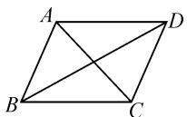
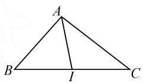
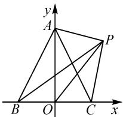
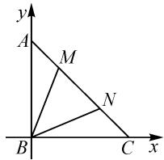
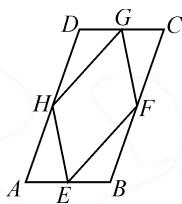
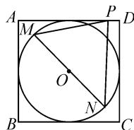
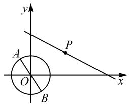
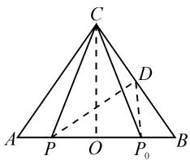

# 平面向量的极化恒等式解题研究

# ● 哈尔滨师范大学教师教育学院 刘胜男

摘要:极化恒等式是解决向量数量积问题的利器,可以简化运算.本文中介绍了极化恒等式的两个模型及几何意义,并结合极化恒等式的具体应用案例,通过比较解法,分析极化恒等式在解决问题时的优点.

关键词: 极化恒等式; 平面向量; 解题研究

高考对于向量部分知识点的考查中,数量积运算占比极大,解决平面向量数量积问题主要有公式法和坐标法这两种常规方法.本文中介绍一种新的解法,利用极化恒等式解决一般方法不容易计算的数量积问题,特别在“求取值范围”问题中有着广泛应用.“极化恒等式”这一内容源自大学数学“泛函分析”,它表明数量积可以由它诱导出的范数来表示,把极化恒等式降维至二维平面,则可以非常巧妙地建立起向量数量积与向量模长之间的联系,即仅用向量模长表示向量的数量积,从而实现向量和几何、向量和代数的精妙结合.

# 1 极化恒等式

极化恒等式标准形式:对于两个非零向量 a, b, 有

$$
\boldsymbol {a} \cdot \boldsymbol {b} = \frac {1}{4} \left[ (\boldsymbol {a} + \boldsymbol {b}) ^ {2} - (\boldsymbol {a} - \boldsymbol {b}) ^ {2} \right].
$$

其几何意义为非零向量 a, b 的数量积等于以这组向量对应的线段为邻边的平行四边形的“和对角线”与“差对角线”平方差的 $\frac{1}{4}$ . 由此可以得到极化恒等式在平行四边形中的推广.

推广 1 如图 1, 在 □ABCD 中, 有 $\overrightarrow{AB} \cdot \overrightarrow{AD} = \frac{1}{4} (\overrightarrow{AC^{2}} - \overrightarrow{BD^{2}})$ .

  
图1

在平行四边形中,可以用它来解决一些与数量积范围或最值相关的问题,同时保留了更直观的几何意义.当然,也可以在三角形中构造极化恒等式,这也是极化恒等式的第二个推广.

推广 2 如图 2, 在 $\triangle ABC$ 中, I 为 BC 的中点, 有 $\overrightarrow{AB} \cdot \overrightarrow{AC} = \overrightarrow{AI^{2}} - \frac{1}{4} \overrightarrow{BC^{2}} = \overrightarrow{AI^{2}} - \overrightarrow{BI^{2}}$ .

  
图2

# 2 极化恒等式的优越性

例 1 （2017 年新课标Ⅱ卷）已知 $\triangle ABC$ 是边长为 2 的等边三角形，P 为平面 ABC 内一点，则 $\overrightarrow{PA} \cdot$

$(\overrightarrow{PB} + \overrightarrow{PC})$ 的最小值是

解法1:(坐标法)如图3所示,以BC的中点O为坐标原点,直线BC为x轴,直线AO为y轴建立平面直角坐标系,则 $A(0,\sqrt{3})$ , $B(-1,0)$ , $C(1,0)$ .

text_image

y
A
P
B
O
C
x

图3

设 $P(x,y)$ ，则 $\overrightarrow{PA}=(-x,$ $\sqrt{3}-y),\overrightarrow{PB}=(-1-x,-y),\overrightarrow{PC}=(1-x,-y).$

所以 $\overrightarrow{PA} \cdot (\overrightarrow{PB} + \overrightarrow{PC}) = 2x^{2} - 2\sqrt{3}y + 2y^{2} = 2\left[x^{2} + \left(y - \frac{\sqrt{3}}{2}\right)^{2} - \frac{3}{4}\right]$ ，当 $x = 0, y = \frac{\sqrt{3}}{2}$ 时，取得最小值，且最小值为 $2 \times \left(-\frac{3}{4}\right) = -\frac{3}{2}$ .

解法 2: (极化恒等式法) 设 BC 的中点为 O, OA 中点为 D, 由向量加法法则和极化恒等式, 可得 $\overrightarrow{PA} \cdot (\overrightarrow{PB} + \overrightarrow{PC}) = 2 \overrightarrow{PA} \cdot \overrightarrow{PO} = 2 (\overrightarrow{PD^{2}} - \overrightarrow{OD^{2}}) = 2 \left( \overrightarrow{PD^{2}} - \frac{3}{4} \right) \geqslant -\frac{3}{2}$ . 故 $\overrightarrow{PA} \cdot (\overrightarrow{PB} + \overrightarrow{PC})$ 的最小值为 $-\frac{3}{2}$ .

变式 在等腰直角三角形 ABC 中， $\angle ABC = \frac{\pi}{2}$ ，AB = BC = 2, M, N（不与 A, C 重合）为 AC 边上的两个动点，且满足 $\left|\overrightarrow{MN}\right| = \sqrt{2}$ ，则 $\overrightarrow{BM} \cdot \overrightarrow{BN}$ 的取值范围为 \_\_\_\_.

解法 1: (坐标法) 如图 4, 以点 B 为坐标原点, BC 所在直线为 x 轴, AB 所在直线为 y 轴, 建立平面直角坐标系, 则直线 AC 的方程为 $x + y = 2$ . 设 $M(a, 2 - a), 0 < a < 1$ , 由 $|\overrightarrow{MN}| = \sqrt{2}$ , 得 $N(a + 1, 1 - a)$ .

text_image

y
A
M
N
B
C
x

图4

所以 $\overrightarrow{BM} = (a,2 - a),\overrightarrow{BN} = (a + 1,1 - a)$ ，可得 $\overrightarrow{BM}\cdot \overrightarrow{BN} = a(a + 1) + (2 - a)(1 - a) = 2a^2 -2a+$ $2 = 2\left(a - \frac{1}{2}\right)^2 +\frac{3}{2}.$ 又 $0 <   a <   1$ ，所以当 $a = \frac{1}{2}$ 时， $\overrightarrow{BM}\cdot \overrightarrow{BN}$ 取得最小值 $\frac{3}{2}$ ；当 $a = 0$ 或1时， $\overrightarrow{BM}\cdot \overrightarrow{BN} =$

2, 无最大值. 综上, $\overrightarrow{BM} \cdot \overrightarrow{BN}$ 的取值范围是 $\left[\frac{3}{2}, 2\right)$ .

解法2:(极化恒等式法)设MN的中点为D,点 $D(t,2-t),\frac{1}{2}<t<\frac{3}{2}$ .由极化恒等式,得 $\overrightarrow{BM}\cdot\overrightarrow{BN}=\overrightarrow{BD^{2}}-\frac{1}{4}\overrightarrow{MN^{2}}=t^{2}+(2-t)^{2}-\frac{1}{2}=2(t-1)^{2}+\frac{3}{2}$ ,又 $\frac{1}{2}<t<\frac{3}{2}$ ,所以 $\overrightarrow{BM}\cdot\overrightarrow{BN}$ 的取值范围是 $\left[\frac{3}{2},2\right)$ .

点评:从例1及其变式的解法可以发现,使用常规坐标法步骤繁琐,在计算上花费时间较长,还可能会由于疏忽导致做错,而采用极化恒等式法,只需找到三角形边的中点,可以代入公式,题目便迎刃而解.把平面向量数量积这种抽象的问题转变为代数问题进行求解,可以简化计算.解法2体现出极化恒等式在计算向量的数量积中的优越性.

# 3 极化恒等式的应用举例

题型 1: 定值问题.

例 2 如图 5, 在平行四边形 ABCD 中, AB = 1, AD = 2, E, F, G, H 分别是 AB, BC, CD, AD 边上的中点, 则 $\overrightarrow{EF} \cdot \overrightarrow{FG} + \overrightarrow{GH} \cdot \overrightarrow{HE}$ 等于 \_\_\_\_.

  
图5

解: 设 HF 的中点为 O, 则 $\overrightarrow{EF} \cdot$

$$
\overrightarrow {F G} = \overrightarrow {E F} \cdot \overrightarrow {E H} = \overrightarrow {E O ^ {2}} - \overrightarrow {O H ^ {2}} = 1 - \left(\frac {1}{2}\right) ^ {2} = \frac {3}{4}, \overrightarrow {G H} \cdot
$$

$$
\overrightarrow {H E} = \overrightarrow {G H} \cdot \overrightarrow {G F} = \overrightarrow {G O ^ {2}} - \overrightarrow {O H ^ {2}} = 1 - \left(\frac {1}{2}\right) ^ {2} = \frac {3}{4}.
$$

故 $\overrightarrow{EF}\cdot\overrightarrow{FG}+\overrightarrow{GH}\cdot\overrightarrow{HE}=\frac{3}{2}.$

题型 2: 范围问题.

例 3 边长为 1 的正方形内有一个内切圆, MN 是内切圆的一条弦, 点 P 为正方形四条边上的动点, 当弦 MN 的长度最大时, $\overrightarrow{PM} \cdot \overrightarrow{PN}$ 的取值范围是 \_\_\_\_.

解:如图6,设正方形ABCD的内切圆为圆O,当弦MN的长度最大时,MN为圆O的一条直径,则 $\overrightarrow{PM}\cdot\overrightarrow{PN}=|\overrightarrow{PO}|^{2}-|\overrightarrow{OM}|^{2}=|\overrightarrow{PO}|^{2}-\frac{1}{4}.$

  
图6

当 $P$ 为正方形ABCD的某边中点时， $\vert \overrightarrow{OP}\vert_{\min} = \frac{1}{2}$ ；当 $P$ 与正方形ABCD的顶点重合时， $\vert \overrightarrow{OP}\vert_{\max} = \frac{\sqrt{2}}{2}$ . 所以 $\frac{1}{2} \leqslant \vert \overrightarrow{OP}\vert \leqslant \frac{\sqrt{2}}{2}$ .

故 $\overrightarrow{PM} \cdot \overrightarrow{PN} = |\overrightarrow{PO}|^2 - \frac{1}{4} \in \left[0, \frac{1}{4}\right]$ .

题型 3: 求参问题.

例 4 如图 7, 已知 AB 是圆 O: $x^{2} + y^{2} = 1$ 的任意一条直径, 点 P 在直线 $x + 2y - a = 0 (a > 0)$ 上运动, 若 $\overrightarrow{PA} \cdot \overrightarrow{PB}$ 的最小值为 4, 则实数 a 的值为 \_\_\_\_.

text_image

y
A
O
B
P
x

图 7

解:由题意可知,O为AB的中点,AB=2.由极化恒等式,得 $\overrightarrow{PA}\cdot\overrightarrow{PB}=|\overrightarrow{PO}|^{2}-\frac{1}{4}|\overrightarrow{AB}|^{2}=|PO|^{2}-1$ .故当 $\overrightarrow{PA}\cdot\overrightarrow{PB}$ 取最小值4时, $|\overrightarrow{PO}|_{\min}=\sqrt{5}$ ,此时, $|\overrightarrow{PO}|$ 为点O到直线 $x+2y-a=0$ 的距离,因此 $\frac{|-a|}{\sqrt{1^{2}+2^{2}}}=\sqrt{5}$ ,解得a=5.

例 5 设 $P_{0}$ 是 $\triangle ABC$ 中 AB 边上的定点，满足 $P_{0}B = \frac{1}{4}AB$ ，且对于 AB 边上任意一点 P，恒有 $\overrightarrow{PB} \cdot \overrightarrow{PC} \geqslant \overrightarrow{P_{0}B} \cdot \overrightarrow{P_{0}C}$ ，则 $\triangle ABC$ 的形状为 \_\_\_\_.

解: 如图 8, 取 BC 的中点 D, 连接 PD, $P_{0}D$ , 则 $\overrightarrow{PB} \cdot \overrightarrow{PC} = |\overrightarrow{PD}|^{2} - \frac{1}{4} |\overrightarrow{BC}|^{2}$ , $\overrightarrow{P_{0}B} \cdot \overrightarrow{P_{0}C} = |\overrightarrow{P_{0}D}|^{2} - \frac{1}{4} |\overrightarrow{BC}|^{2}$ . 因为 $\overrightarrow{PB} \cdot$

text_image

C
D
A P O P₀ B

图8

$\overrightarrow{PC}\geqslant\overrightarrow{P_{0}B}\cdot\overrightarrow{P_{0}C}$ 恒成立，即 $\left|\overrightarrow{PD}\right|^{2}-\frac{1}{4}\left|\overrightarrow{BC}\right|^{2}\geqslant\left|\overrightarrow{P_{0}D}\right|^{2}-\frac{1}{4}\left|\overrightarrow{BC}\right|^{2}$ ，亦即 $\left|\overrightarrow{PD}\right|\geqslant\left|\overrightarrow{P_{0}D}\right|$ 恒成立，所以 $P_{0}D\perp AB$ 。设 O 为 AB 的中点，连接 OC，则 $P_{0}B=\frac{1}{2}OB$ ，可得 $P_{0}D\parallel OC$ ，所以 $OC\perp AB$ 且 AC=BC，即 $\triangle ABC$ 是以 C 为顶角的等腰三角形。

# 4 总结

数学解题不是简单的做题训练,它更像是知识的再创造.解题是学习数学的重要一环,学会了解题意味着学生不仅具备了解决新问题的能力,同时也培养了他们的逻辑思维、创造性思维和问题解决的技能.利用极化恒等式可以求数量积的值、界定数量积的取值范围、探求数量积的最值、处理长度问题,以及解决一些综合性问题.因此,教师站在更高层面,为学生讲解一类新的解题模型是有必要的 $^{[1]}$ .

# 参考文献：

[1]陈晓明.极化恒等式在平面向量中的应用举例[J].数理化学习(高中版),2021(12):3-5.Z