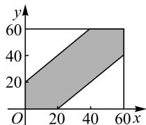
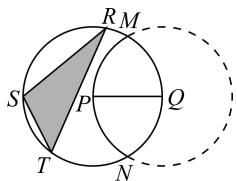
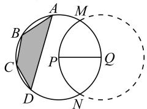

# 应用题教学中常见问题与应对措施的分析

# ◎ 广西柳州高级中学 曹灵华 黄瀚元

数学学科中,将含有一些数学关系的问题用文字表示出来,由此形成的题目称为应用题.应用题通常由已知条件和待求问题组成,其中,没有特定解题规律,且需要运算两步以上的应用题我们称它为一般应用题;题目中存在特殊的数量关系,能用特定方法或步骤来解决的应用题,我们称它为典型应用题.

纵观近些年的高考试题,这两种应用题均有出现,学生在解题中出现的失误也不少.因此,笔者调查分析了学生解题中存在的一些实际问题,并提出了相应的应对措施,共勉!

# 1 常见问题

# 1.1 抗压能力差,缺乏自信

有些学生对自己的期望很高,心理压力大,反而会显得信心不足.具体表现在解应用题时,出现紧张、畏难、耗时长等问题,尤其是近些年的高考试题非常灵活,总让人耳目一新,心理压力大的学生看到没见过的试题就会不由自主地产生畏难心理.这种状态导致了学生在解题时,对自己的能力缺乏信心,情绪低迷,因而难以激活思维,导致解题失败.

# 1.2 审题能力差,忽略重点

题干长、文字多是大部分应用题的特点,其中重要的关键字、词、句等比较分散,还有些隐含条件需要学生去挖掘.有些学生在读题、审题时,走马观花,丢三落四,无法厘清各个条件之间存在的重要关系,甚至对一些条件干脆视而不见,更别说挖掘重要的隐含条件了.不论有多强的逻辑思维能力,在没有弄清问题重点的情况下解题,必然注定了失败.

# 1.3 运算能力差,会而不对

调查发现,一些思维活跃、成绩较好的学生,在大型考试中总是拿不到高分的原因竟然是运算能力差.这部分学生总为自己什么都会而沾沾自喜,考试中却出现解题思路完全正确,但在运算中丢分的现象.这种情况,尤其表现在涉及与字母、因式分解、求导等相关的运算中.

# 2 应对措施

# 2.1 探寻生活问题,增强自信

高考于学生而言,不仅是对知识掌握程度的检测,还是对心理素质、思维品质与综合素养的考查,这是一个公平、公正的较量 $^{[1]}$ .作为学生,应保持一颗平常心,用最佳的状态应对每一场测试,以不断提高自己的综合素养.

应用题解题能力的提升,首先要学会建立数学模型.这就要求学生尽可能地多接触校外的社会生活,多了解生活中存在的一些数学知识,让抽象的知识与丰富的生活有机地结合在一起,增强自身的理解能力,从而建立解题的信心.

例 1 两位朋友约定在下午 14:00～15:00 之间于步行街的某店门口相见,他们商定好若其中一个人先到,必须等另一个人 20 分钟的时间,若另一个人在 20 分钟内不到,等待的人则自行离去.求这两人相遇的概率.

分析:这是一个典型的由生活问题衍生而来的应用题.假设这两人到达约定位置的时间是随机的,都处于14:00\~15:00之间.若两人到达的时间分别为x,y,两人相遇则满足 $|x-y|\leqslant20$ ,两个人到达约定地点的所有可能,可以用边长为60的正方形区域中的任意点 $(x,y)$ 来表示,由此正方形区域中所有点的集合形成了一个样本空间.

如图1,设满足不等式 $|x-y|\leqslant20$ 的点的集合为A,代表这两人能相遇,则其概率为阴影部分的面积与正方形面积的比值,即 $P(A)=\frac{S_{\text{阴影}}}{S_{\text{正方形}}}=\frac{2\ 000}{3\ 600}=\frac{5}{9}$ .

area

| x | y |
|---|---|
| 0 | 20 |
| 20 | 40 |
| 40 | 60 |
| 60 | 60 |

图1

本题的教学重点应是介绍知识的发生、发展过程。教师引导学生面对生活实际问题时，应想方设法将数学知识与生活实际相结合，找出其中的关联点，从而探寻出解决问题的方法。学生通过对生活类问题的研究，不仅能拓宽视野，还能开阔解题思路，在感知数学的实际应用价值中，对自己的解题能力建立充足的信心。

# 2.2 培养审题能力,找准重点

审题是获取、分析与处理信息的过程,此过程是建立在一定的认知基础上进行的 $^{[2]}$ .不少学生在应用题中失分,并不是不会做,而是缺乏良好的审题习惯.也有学生将自己的错误归咎于马虎、粗心等,其实这正是审题能力欠缺的表现.这些问题的形成原因是多元的,其中不乏教师和学生等多方面的因素.到底该如何审题?笔者认为,首先要理解题意,其次要弄清楚变元间的关系.

例 2 如图 2, 圆 Q 上的一段劣弧与圆 P 上的一段优弧围成了实线部分的公园, 圆 Q, P 的半径均为 2 km, 且点 P 位于圆 Q 上, 若想在公园内建设一个多边形的活动场地, 要求顶点都位于圆 P 上.

text_image

R M
S P Q
T N

图2

(1)若所建的场地为 $\triangle STR$ ，则该场地的最大面积是多大？  
(2)如图3,若所建场地为等腰梯形ABCD,则该场地的最大面积是多少?

为了提高学生的审题能力，教师可通过以下几个问题进行引导.

text_image

A
M
B
C
P
Q
D
N

图3

问题 1 阴影部分的面积受什么量的影响？谁是主动点？

问题 2 怎样用变量来体现这种影响?

问题 3 阴影部分的面积能否表达出来？怎样能让它最大？

问题 4 分析你所选择的变量是否准确.

学生在审题过程中,带着这几个问题进行思考,不仅快速抓住了解决问题的重点,思维还随着这几个问题的解决而逐渐深入.在教师的引导下,学生获取、分析并处理题设条件所提供的信息,再根据问题进行思考与探究,很快找到了解决问题的办法.由此可见,审题过程考验的是学生的细致程度,只有用心思考、分析,才能抓住问题的本质,找出突破问题的方法.

# 2.3 强化运算训练,会且全对

考试中,最遗憾的就是会而不对,明明有着完美的解题思路,却因为运算而失分,这是令人痛心而又遗憾的事情.因此,应用题教学中,教师应有意识地加强对学生运算能力的培养,以达到会且全对的目的.

学生在解应用题中出现计算错误的主要原因,集中在以下几个因素上:①概念模糊导致计算错误,主要表现在新知中;②灵活度差,公式记忆不准确,或无法等价变形或逆向回代等；③缺乏数据处理能力，主要表现在对数据的分类、筛选；④图表驾驭能力欠缺，无法识别到其中的关系或运算规律等.

例 3 已知点 F 为椭圆 $\frac{x^{2}}{n^{2}} + \frac{y^{2}}{m^{2}} = 1 (n > m > 0)$ 的左焦点，N, M 分别为左顶点与上顶点，该椭圆的离心率为 $\frac{1}{2}$ ，点 C 位于 x 轴上，且 $MC \perp MF$ ，直线 $l_{1}: x + \sqrt{3}y + 3 = 0$ 恰巧与 M, C, F 三点确定的 $\odot P$ 相切.

(1) 分别求椭圆与 $\odot P$ 的方程；  
(2) $\odot P$ 与过点 $N$ 的直线 $l_{2}$ 相交于点 $D, Q$ , 且 $\overrightarrow{PD} \cdot \overrightarrow{PQ} = -2$ , 求直线 $l_{2}$ 的方程.

分析: 设 $F(-r,0)$ , $M(0,\sqrt{3}r)$ ，由 $MC \perp MF$ ，可得 $C(3r,0)$ , $\odot P$ 的方程为 $(x-r)^{2}+y^{2}=4r^{2}$ ，再根据题中相切的条件，即可建立关于 r 的方程.

也可根据向量数量积条件 $\overrightarrow{PD}\cdot\overrightarrow{PQ}=-2$ ，联想到向量夹角公式的应用，从得到的几何意义转化为圆与直线之间的位置关系进行求解.

在解决本题时,一些基础较为薄弱的学生面对这么多的假设变量,已然处于迷糊的状态,不论是寻找条件,还是列方程,都存在一定的困难,因此选择了放弃;还有些学生缺乏联想与化简意识,出现运算错误,甚至出现了解题思路完全正确,只有运算出错的现象,这是最令人惋惜的.

从学生出现的错误类型来看,应用题的教学,不能将目光只锁定于建模方面,还要关注学生运算能力的培养.教学中,教师可留一定的时间给学生自主推演、运算,在建模的同时提高运算能力 $^{[3]}$ .尤其强调,遇到因式分解、合并同类项、去括号、通分等容易出错的运算时,需小心应对,解题结束后必须及时验算,以防错误的发生.

总之,解应用题的能力,不仅能反映出学生知识与技能的掌握程度,还能反映出学生对问题的分析能力与逻辑思维的发展情况.应用题虽然题干长、关系复杂,当前学生存在的问题也不少,但只要我们将应用题教学与新课标接轨,认真分析学生存在的问题,并采取相应的应对措施,定能有效地改变现状.

# 参考文献：

[1]朱智贤,林崇德.思维发展心理学[M].北京:北京师范大学,1986:214.  
[2] 李庾南. 数学自学·议论·引导教学法 [M]. 北京: 人民教育出版社, 2004: 25.  
[3] 王起南. 应用题解题中的问题表征策略研究 [D]. 上海: 华东师范大学, 2009. Z