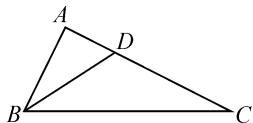
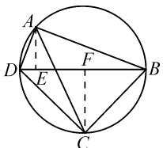
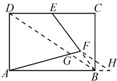

# 当向量遇上了平面几何

# ● 福建省莆田第八中学 陈梅英

摘要: 回归平面向量“形”的特征, 综合平面几何中的基本定理、性质、公式等的巧妙应用, 是直观形象地破解平面向量问题的一种比较常用技巧方法. 结合常用的平面几何中的几个基本定理与性质, 通过实例剖析, 数形结合, 巧妙解决平面向量问题.

关键词: 平面向量; 平面几何; 中线定理; 角平分线定理; 射影定理

平面向量是高中数学中一个“数”与“形”同时兼备的特殊数学元素，是数形结合的完整统一体，也是实现“数”与“形”巧妙化归与转化的结合体。特别地，当平面向量遇上了平面几何，借助平面几何中相关概念、定理、性质等的巧妙应用，与平面向量知识合理交汇与融合，充分落实数学基础知识、基本技能、基本思想、基本活动经验这“四基”，培养与提升发现问题、提出问题、分析问题以及解决问题的能力，重视素养发展。

# 1 中线定理

三角形的中线定理: 若 AD 是 $\triangle ABC$ 的中线, 则有 $AB^{2} + AC^{2} = 2(AD^{2} + BD^{2})$ . 涉及平面向量中的中点关系以及相关的模等问题时, 有时可借助三角形的中线定理来转化与应用.

例 1 已知 C 是平面 ABD 内的一点， $\angle BAD = \frac{\pi}{3}$ ，CB = 1，CD = 3，若 $\overrightarrow{AP} = \overrightarrow{AB} + \overrightarrow{AD}$ ，则 $|\overrightarrow{AP}|$ 的最大值为 \_\_\_\_.

分析:根据题目条件,通过余弦定理构建对应的关系式,进而确定对应的边长平方之间的关系,结合三角形的中线定理,利用平面向量的线性关系式与中点公式加以转化,通过平面几何的直观转化与处理,利用关系式的等量代换与变形,进而确定对应向量的模的最值问题.

解: 设 B, D 为两个定点, 根据题目条件可知 $CB + CD = 4 \geqslant BD$ , 当且仅当 B, C, D 三点共线时等号成立, 此时点 C 在线段 BD 上, 为线段 BD 的四等分点 (靠近点 B 处).

根据余弦定理,可得

$$
\cos A = \frac {A B ^ {2} + A D ^ {2} - B D ^ {2}}{2 A B \cdot A D} = \cos \frac {\pi}{3} = \frac {1}{2}.
$$

整理, 可得 $BD^{2}=AB^{2}+AD^{2}-AB\cdot AD=\frac{1}{2}(AB^{2}+AD^{2})+\frac{1}{2}(AB-AD)^{2}\geqslant\frac{1}{2}(AB^{2}+AD^{2})$ .

所以 $AB^{2}+AD^{2}\leqslant2BD^{2}$ .

由三角形的中线定理, 得 $AB^{2} + AD^{2} = \frac{1}{2} BD^{2} + 2AH^{2}$ (其中 H 为线段 BD 的中点), 则有

$$
2 A H ^ {2} = A B ^ {2} + A D ^ {2} - \frac {1}{2} B D ^ {2} \leqslant \frac {3}{2} B D ^ {2}.
$$

而 $\overrightarrow{AP} = \overrightarrow{AB} +\overrightarrow{AD} = 2\overrightarrow{AH}$ ，即 $\overrightarrow{AH} = \frac{1}{2}\overrightarrow{AP}$ ，所以 $2\times \frac{1}{4} AP^2\leqslant \frac{3}{2} BD^2$ ，即 $AP^{2}\leqslant 3BD^{2}$

又因为 $4 = CB + CD \geqslant BD$ ，所以 $AP^{2} \leqslant 3BD^{2} = 3 \times 4^{2} = 48$ ，则有 $|\overrightarrow{AP}| \leqslant 4\sqrt{3}$ .

所以 $\left|\overrightarrow{AP}\right|$ 的最大值为 $4\sqrt{3}$ . 故填答案: $4\sqrt{3}$ .

点评:根据平面几何背景,利用平面向量的概念、运算与关系式等,回归平面向量“形”的本质,从平面几何角度直观入手,通过线段中点的选取,结合平面向量的线性运算与概念以及三角形的中线定理等来建立关系式,并为进一步的变形转化与化简求值指明方向,数形结合,直观想象.

# 2 角平分线定理

三角形的角平分线定理: 若 AD 是 $\angle BAC$ 的角平分线, 则有 $\frac{AB}{AC} = \frac{BD}{CD}$ . 与平面几何中角平分线有关的平面向量问题, 经常利用三角形的角平分线定理来构建线段长度之间的比例关系, 进而加以化归与转化.

例 2 （2020－2021 学年浙江省宁波市九校联考数学试卷）如图 1 所示，已知 BD 为 $\triangle ABC$ 中 $\angle ABC$ 的角平分线，

  
图1

若 BC=2AB=2， $\angle ABC=\frac{\pi}{3}$ ，则 $\overrightarrow{BD}\cdot\overrightarrow{AC}=$ \_\_\_\_.

分析:根据题目条件,通过余弦定理确定三角形中第三边 AC 的长度,进而确定三角形的形状,结合三角形的角平分线定理构建线段长度的比例关系,进而确定点 D 的位置,进一步综合利用平面向量的数量积公式,借助向量投影来化归,实现数量积的转化与

求解.

解: 在 $\triangle ABC$ 中, BC = 2AB = 2, $\angle ABC = \frac{\pi}{3}$ , 则

$$
A C = \sqrt {A B ^ {2} + B C ^ {2} - 2 \cdot A B \cdot A C \cdot \cos \angle A B C} = \sqrt {3}.
$$

所以 $AB^{2}+AC^{2}=BC^{2}$ ，可知 $\angle BAC=\frac{\pi}{2}$ .

又由于 BD 为 $\triangle ABC$ 中 $\angle ABC$ 的角平分线，结合角平分线定理，可得 $\frac{AB}{BC} = \frac{AD}{CD} = \frac{1}{2}$ .

所以 $AD=\frac{1}{3}AC=\frac{\sqrt{3}}{3}.$

所以 $\overrightarrow{BD} \cdot \overrightarrow{AC} = |\overrightarrow{BD}| |\overrightarrow{AC}| \cos \angle ADB = |\overrightarrow{AD}| \cdot |\overrightarrow{AC}| = \frac{\sqrt{3}}{3} \times \sqrt{3} = 1.$ 故填答案：1.

点评:在平面向量问题中,通过平面几何图形的特征,借助三角形的角平分线定理,合理构建线段长度之间的比例关系,为平面向量中的坐标表示、线性关系与对应的运算奠定基础,借助平面向量的知识进一步分析与求解,达到综合与应用的目的.

# 3 射影定理

直角三角形的射影定理: 在 Rt△ABC 中, ∠C 为直角, 点 D 在斜边 AB 上, 满足 $AB \perp CD$ , 则有 $AC^{2} = AD \times AB$ , $BC^{2} = BD \times AB$ . 在直角三角形与圆等相关平面几何图形中, 涉及直角问题时经常通过射影定理来构建对应的关系式.

例 3 （2022 届湖北省恩施州高三年级第一次教学质量监测考试数学试卷·7）圆内接四边形 ABCD 中，AD=2, CD=4, BD 是圆的直径，则 $\overrightarrow{AC} \cdot \overrightarrow{BD}=$ （）.

A.12

B.-12

C.20

D.-20

分析:根据题目条件,通过圆的性质确定线段的垂直关系,利用射影定理构建相应的关系式,结合平面向量的投影转化对应的平面向量的数量积,通过关系式的等价转化加以分析与求解.

解析:如图 2, 过点 A, C 分别作 BD 的垂线, 垂足分别为 E, F.

由于 BD 是圆的直径, 则有 $AB \perp AD, CB \perp CD$ .

根据射影定理, 可得 $\left|AD\right|^{2}=\left|DE\right|\times\left|BD\right|,\left|CD\right|^{2}=\left|DF\right|\times\left|BD\right|$ .

text_image

A
D
E
F
B
C

图2

结合平面向量的投影,可得 $\overrightarrow{AC}\cdot\overrightarrow{BD}=-|EF|\times|BD|=-|BD|\times(|DF|-|DE|)=-|BD||DF|+|BD|\times|DE|=-|CD|^{2}+|AD|^{2}=-4^{2}+2^{2}=-12.$

故选择答案:B.

点评:巧妙利用圆的直径所对的圆周角为直角,合理构建直角三角形,进而利用直角三角形的射影定理来构建关系式,为平面向量的数量积、投影等的应用提供条件.利用平面向量的投影是破解平面向量的数量积问题比较常见的一类技巧方法,合理通过平面几何“形”的特征加以数形结合来直观解决.

# 4 三角形相似

利用三角形相似的判定与性质,可以合理构建平面几何中对应线段之间的比例关系,为进一步解决平面向量中的模、夹角、数量积等问题提供条件,有效联系平面几何与平面向量之间的关联与转化.

例 4 [“百师联盟”2022 届高三一轮复习联考 (一) 全国卷 [数学理科试卷·15]) 在矩形 ABCD 中, AB = 6, AD = 4, E 为 CD 的中点, 若 $\overrightarrow{EF} = 2 \overrightarrow{FB}$ , 且 $\overrightarrow{AF} = \lambda \overrightarrow{AB} + \mu \overrightarrow{AD}$ , 则 $\lambda + \mu =$ \_\_\_\_.

分析:根据题目条件,借助平面向量“形”的特征构建对应的平面几何图形,结合辅助线的构建,通过平面向量中三点共线的等和线性质、三角形相似的性质加以转化与应用,数形结合,直观分析与求解.

解: 如图 3 所示, 连接 BD, 交 AF 于点 G. 过点 F 作 FH // DB, 交 AB 的延长线于点 H.

由题意可知 $|DE|=|EC|=3.$

由 $\overrightarrow{AF} = \frac{|AF|}{|AG|}\overrightarrow{AG} = \frac{|AF|}{|AG|}$

text_image

D E C
A G F B H

图3

$(x\overrightarrow{AB} + y\overrightarrow{AD})$ （其中 $x + y = 1$ ），结合 $\overrightarrow{AF} = \lambda \overrightarrow{AB} + \mu \overrightarrow{AD}$ ，可得 $\lambda +\mu = \frac{|AF|}{|AG|}(x + y) = \frac{|AF|}{|AG|} = \frac{|AH|}{|AB|}$ .

由 $\triangle BFH\sim \triangle EBD$ ，得 $\frac{|BH|}{|ED|} = \frac{|BF|}{|EB|}$ 又 $\overrightarrow{EF} = 2\overrightarrow{FB}$ ，可得 $\frac{|BF|}{|EB|} = \frac{1}{3}$ ，则有 $\frac{|BH|}{3} = \frac{1}{3}$ 即 $|BH| = 1.$

所以 $\lambda + \mu = \frac{|AH|}{|AB|} = \frac{6 + 1}{6} = \frac{7}{6}$ . 故填答案: $\frac{7}{6}$ .

点评:利用平面向量问题中平面几何背景的直观想象,结合平面几何中向量的线性关系以及三角形相似的应用等,合理构建关系,实现问题的有效转化与巧妙解决.特别地,抓住平面向量问题中“形”的特征,通过平面几何相关知识的辅助应用,直观有效,更加直接.

平面向量往往和几何交汇与结合(高中阶段几何主要包括平面几何、平面解析几何、立体几何这几个方面)，合理链接初中平面几何与高中平面向量这两个知识之间的联系，拓展到平面解析几何与立体几何等层面，实现不同知识点之间的融合与贯通，形成知识与能力间的渗透与拓展，构建知识网络体系，激发创新思维，增强实践意识与创新应用，全面提升数学能力，培养数学核心素养. Z