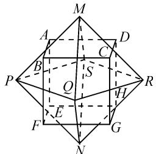
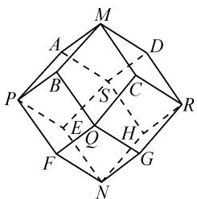
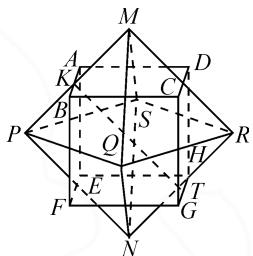

# 数学试题的创新情境类型与应用

# 浙江省衢州第二中学 廖如舟

摘要：“三新”背景下的高考数学创新情境类试题，是有效考查学生“四基”与创新精神的一个重要载体。结合常见的数学试题的创新情境类型，从新定义、新图形与新公式等几个视角切入，实例剖析，总结规律与应用，有效指导数学教学与复习备考。

关键词: 新教材; 新课程; 新高考; 创新; 情境; 应用

新教材(人民教育出版社 2019 年国家教材委员会专家委员会审核通过)、新课程[《普通高中数学课程标准(2017 年版 2020 年修订)》]、新高考的“三新”对数学课堂教学改革的四点启示是价值导向、综合化、情境化与开放化.

在高考数学试题的命制中,合适的问题情境是考查数学学科核心素养的重要载体之一.数学问题创新情境包括现实情境、数学情境、科学情境等,每种情境又可以分为数学的情境、关联的情境、综合的情境等.一个情境是否合适,并不仅仅取决于情境本身,而在于所提出的问题是否能够揭示数学的本质,以及是否能够有效考查学生的数学能力与数学核心素养等.

本文中结合高考数学试题命制中常见的情境类型及其应用加以实例剖析,展示情境问题的特色与应用.

# 1 “新定义”情境

“新定义”情境是基于现实问题背景或学术问题背景，给出一些新概念，提出一些新问题等，要求学生理解并主动思考，建立新知识与已掌握知识之间的联系，进而分析和解决问题。

例 1 （2023 届浙江省宁波市高考数学一模试卷）（多选题）如果定义在 R 上的函数 $f(x)$ 满足：对任意 x > y，有 $f^{2}(x) \leqslant f(y)$ ，则称其为“好函数”，所有“好函数” $f(x)$ 形成集合 $\Gamma$ 。下列结论正确的有（）.

A. 任意 $f(x) \in \Gamma$ ，均有 $f(x) \geqslant 0$   
B. 存在 $f(x) \in \Gamma$ 及 $x_{0} \in R$ ，使 $f(x_{0}) = 2022$   
C. 存在实数 M，对于任意 $f(x) \in \Gamma$ ，均有 $f(x) \leqslant M$   
D. 存在 $f(x) \in \Gamma$ ，对于任意 $x \in \mathbf{R}$ ，均有 $f(x) \geqslant x$

分析:从题设中的“新定义”情境入手,结合“好函数”的定义及各选项中的具体条件,通过归纳推理、反证法的应用等来分析与求解.

解析:对于选项 A, 任意 $f(x) \in \Gamma$ , 取 y > x, 则有 $f(x) \geqslant f^{2}(y) \geqslant 0$ , 即 $f(x) \geqslant 0$ . 故选项 A 正确.

对于选项 B, 假如存在 $f(x) \in \Gamma$ 及 $x_{0} \in R$ , 使 $f(x_{0}) = 2022$ .

$$
\begin{array}{r l} & {\text {任取} x _ {0} + \delta > x _ {0}, \delta > 0, \text {对} n \in \mathbf {N} ^ {*} \text {有} f (x _ {0}) \geqslant} \\ & {f ^ {2} \Big (x _ {0} + \frac {\delta}{n} \Big) \geqslant f ^ {4} \Big (x _ {0} + \frac {2 \delta}{n} \Big) \geqslant \dots \dots \geqslant f ^ {2 ^ {*}} (x _ {0} + \delta).} \end{array}
$$

因此 $f^{2^{\prime \prime}}(x_0 + \delta)\leqslant 2022$ ，从而 $f(x_0 + \delta)\leqslant$ $2022^{\frac{1}{2^{\prime\prime}}}$ .令 $n\to +\infty$ ，得 $f(x_0 + \delta)\leqslant 1.$

任取 $x_0 - \delta < x_0, \delta > 0$ ，对 $n \in \mathbb{N}^*$ 有 $f(x_0 - \delta) \geqslant f^2\left(x_0 - \frac{(n-1)\delta}{n}\right) \geqslant f^4\left(x_0 - \frac{(n-2)\delta}{n}\right) \geqslant \cdots \geqslant f^{2^n}(x_0) = 2022^{2^n}$ .

令 $n \to +\infty$ ，得 $f(x_{0} - \delta) = +\infty$ ，这表明 $\delta \to 0$ ， $f(x)$ 在 $x_{0}$ 处无定义，与 $f(x)$ 定义在 R 上矛盾。故选项 B 错误。

对于选项 C, 利用反证法, 反设结论对于任意 $M \in R$ , 存在 $f(x) \in \Gamma$ , 使得 $f(x) > M$ , 那么取 M = 2021, 存在 $x_{0} \in R$ , 使得 $f(x_{0}) = 2022 > 2021$ , 由选项 B 中的分析知有矛盾, 所以假设不成立, 因此原命题为真. 故选项 C 正确.

对于选项 D, 若此选项成立, 则 $f(x) \rightarrow +\infty (x \rightarrow +\infty)$ , 与选项 C 中的结论矛盾. 故选项 D 错误.

故选择答案: AC.

点评:本题以“新定义”情境来合理创设,结合函数的基本性质、抽象函数与函数不等式等知识,有效考查逻辑推理等能力及函数与方程思想、分类讨论思想等,特别是归纳推理、反证法等的应用,导向数学抽象、逻辑推理等数学核心素养的考查.

“新定义”情境试题要求考生能够借助数量关系与空间形式,直接抽象出相应的数学概念和规则等,进而归纳并形成简单的数学命题,合理利用学过的数学方法解决简单问题,有效考查数学抽象等核心素养.

# 2 “新图形”情境

“新图形”情境是基于真实的事物或事物的背景，提取其中主要的数学特征等，建立相应的几何模型，形成图形与数学知识之间的联系，要求学生在理解模型的基础上运用所学知识解决问题.

例 2 [福建省泉州市 2023 届高中毕业班质量监测(三)数学试卷(3 月)] 图 1 中, 正方体 ABCD-EFGH 的每条棱与正八面体 MPQRSN (八个面均为正三角形) 的一条棱垂直且互相平分. 将该正方体的顶点与正八面体的顶点连接, 得到图 2 的十二面体, 该十二面体能独立密铺三维空间.若 AB=1, 则点 M 到直线 RG 的距离等于().

text_image

Geometric diagram of a polyhedron with labeled vertices and internal points, used for spatial geometry problems.

图 1

text_image

Geometric diagram of a polyhedron with labeled vertices and internal points, used for spatial geometry problems.

图2

A. $\sqrt{2}$

B. $\sqrt{3}$

C. $\frac{\sqrt{6}}{2}$

D. $\frac{\sqrt{7}}{2}$

分析:从题设中的“新图形”情境入手,结合空间图形的结构特征,借助空间中点、线、面的关系与对应的性质、定理等加以合理推理与论证,通过相应的数学运算来确定点到直线的距离问题.

解析:如图 3 所示,设 AB 与 MP 交于点 K,RN 与 GH 交于点 T,连接 KT.

依题意,由图形特征,在正八面体 MPQRSN 中,MP = PN = NR = RM.

由对称性可知 MN=PR，所以四边形 MPNR 是正方形，则 $MR \perp RN$ .

text_image

Geometric diagram of a polyhedron with labeled vertices and internal points, used for spatial geometry problems.

图3

又 $MR \perp CD, CD \parallel GH$ ，所以 $MR \perp GH$ .

而 $RN \cap GH = T$ ，所以 $MR \perp$ 平面 $RGNH$ ，所以 $MR \perp RG$ .

又已知四边形 MKTR 是矩形, 所以 MR = KT = $\sqrt{2}$ , 即点 M 到直线 RG 的距离为 $\sqrt{2}$ .

故选择答案:A.

点评:本题以“新图形”情境来合理创设,主要考查基本立体图形,空间中点、线、面的位置关系与度量关系等基础知识,有效考查空间想象、抽象概括、推理论证、运算求解等能力及化归与转化等思想,体现基础性,应用性,导向对直观想象、数学抽象、逻辑推理、数学运算等核心素养的关注.

“新图形”情境试题,要求考生能够在熟悉的情境中,借助几何直观和空间想象感知事物的形态与变化,体会图形与图形、图形与数量的关系,或借助图形的性质和变换发现数学规律,或通过图形直观认识数学问题等,有效考查直观想象等数学核心素养.

# 3 “新公式”情境

“新公式”情境类似于数学的“新定义”情境，只是更加聚焦于数学学科中的公式、法则等，要求学生调动数学基础知识和数学基本活动经验等，在理解新公式的基础上解决相关数学问题.

例 3 （2023 届江苏省盐城市、南京市高三第一学期期末调研测试数学试卷)在概率论中常用散度描述两个概率分布的差异.若离散型随机变量 $X,Y$ 的取值集合均为 $\{0,1,2,3,\dots ,n\} (n\in \mathbf{N}^{*})$ ，则 $X,Y$ 的散度 $D(X\parallel Y) = \sum_{i = 0}^{n}P(X = i)\ln \frac{P(X = i)}{P(Y = i)}.$ 若 $X,Y$ 的概率分布如表1所示，其中 $0 < p < 1$ ，则 $D(X\parallel Y)$ 的取值范围是

表 1

<table><tr><td>X</td><td>0</td><td>1</td></tr><tr><td>P</td><td> $\frac{1}{2}$ </td><td> $\frac{1}{2}$ </td></tr></table>

<table><tr><td>Y</td><td>0</td><td>1</td></tr><tr><td>P</td><td>1-p</td><td>p</td></tr></table>

分析:从题设中的“新公式”情境入手,结合 X,Y 的散度 $D(X \parallel Y)$ 创新公式的给出及对应的数据信息,利用创新公式来合理构建相应的函数关系式,利用数学运算与函数性质的应用,实现创新公式所对应关系式的取值范围的求解.

解析:根据题设中的创新公式,可得 $D(X \parallel Y) = P(X = 0) \ln \frac{P(X = 0)}{P(Y = 0)} + P(X = 1) \ln \frac{P(X = 1)}{P(Y = 1)} =$

$$
\frac {1}{2} \ln \frac {\frac {1}{2}}{1 - p} + \frac {1}{2} \ln \frac {\frac {1}{2}}{p} = - \frac {1}{2} \ln [ 4 p (1 - p) ].
$$

由 $0 < p < 1$ ，得 $p(1 - p) = -(p - \frac{1}{2})^2 + \frac{1}{4} \in \left(0, \frac{1}{4}\right]$ ，则知 $\ln [4p(1 - p)] \leqslant 0$ .

所以 $D(X \parallel Y) = -\frac{1}{2} \ln [4p(1-p)] \geqslant 0$ ，即 $D(X \parallel Y)$ 的取值范围是 $[0, +\infty)$ .

故填答案: $[0,+\infty)$ .

点评:本题以“新公式”情境来合理创设,结合创新定义的内涵与实质,借助数据的分析与处理,考查概率与统计知识、函数的基本性质等基础知识,导向对数据分析、逻辑推理、数学运算等核心素养的关注.

“新公式”情境试题,要求考生能够在熟悉的情境中,借助一些事实和命题来合理推理分析,用归纳或类比的方法,发现数量或图形的性质、数量关系或图形关系,了解数学命题的条件与结论之间的逻辑关系,掌握一些基本命题与定理的证明,并有条理地表述论证过程等,能有效考查逻辑推理等数学核心素养.

在“三新”（新教材、新课程、新高考）背景下，进一步落实新改革理念，积极贯彻《总体方案》要求。数学创新情境类试题成为考查考生“四基”的一个新阵地，此类新情境试题的题量与分值大体占全卷题量与分值的20%左右，难度控制在0.3～0.7，可以有效区别各层次考生的数学能力与核心素养，进行合理化的高考选拔，实现新高考改革的导向与引领作用，推进高中教育的全面改革与创新。Z