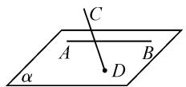
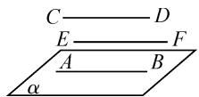
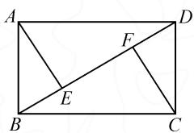
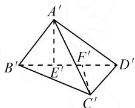
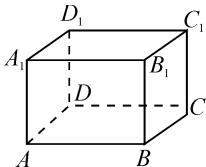
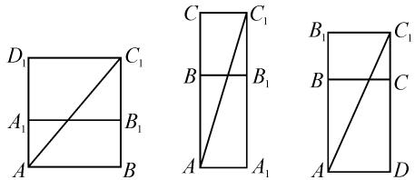

# 构建空间图形观念,激发数学想象力

# - 江苏省清江中学 赵丽云

立体几何的学习建立在引导学生认识图形的基础之上学习画图、识图、用图，可以激发学生的空间想象能力。然学生学习立体几何的难点在于无法想象图形的不同组合和运动轨迹，影响了学生空间观念的构建。因此，突破立体几何的教学难点，培养学生的空间想象能力长期以来都是中学教学中关注的重点问题。笔者根据教学实践，在研究立体几何教学特点的基础上，探讨如何激发学生的数学想象力，培养空间图形观念。

# 1 营造良好的学习氛围,激活学生思维

积极的课堂氛围有助于学生养成良好的学习习惯，助力正确的学习观念的构建。因此，在课堂教学中教师要积极营造轻松、和谐、平等的学习氛围，为学生积极主动的学习搭建良好的平台，为激活学生的思维创造条件。

# 案例 1 正四面体概念

师:现在老师给大家每人发六根火柴棒,请问搭一个边长为单根火柴棒的长度的正三角形,一共需要几根火柴棒?

生(齐):三根.

师:那么,如果搭两个这样的等边三角形,需要几根火柴棒呢?可以搭出三个这样的三角形吗?

（有的学生摇头表示不知道，有的学生则皱起了眉头……）

师:大家不妨动手操作看一看.(学生动手.)

生 1: 搭两个这样的等边三角形需要五根火柴棒.

生 2: 六根火柴棒没办法搭出三个这样的等边三角形.

师:很好！六根火柴棒不能搭出三个边长为单根火柴棒长度的正三角形.但是老师有一个新的发现，六根火柴棒可以搭出四个这样的正三角形.(学生纷纷露出惊讶的表情.)

师:大家不想尝试一下吗? (学生尝试无果.)

师:同学们在一个平面上进行尝试,是不是发现这是一个难以完成的任务?大家试试在空间中是否可以完成?(有的同学转换了思路,终于成功了,兴奋地叫起来。)

本案例中教师通过活动情境的创设,引导学生在动手实践中尝试突破问题难点,不仅激发了学生学习的热情,更调动了学生的高阶思维,使他们能够积极参与学习活动,通过主动学习探寻解决问题的路径,并获得知识和技能.学生的积极性在学习活动中得到了充分的发挥,同时感受到学习的获得感和成功感,并学会发现身边的数学.

# 2 认识图形,学好作图,奠定空间学习基础

图形是立体几何的基础,现实世界中的物体形状通过抽象概括构成空间图形关系.教师在课堂教学中以具体的实物导入,从具体到抽象进行转化,可以帮助学生从局部的分析形成整体的概括,从微观上升到宏观,构建空间图形观念.

# 2.1 认识图形

认识图形是明确图形关系的基础,通过研究基本图形中的相关元素以及相互之间的关系,能够从直观上认识图形,在此基础上激发空间想象力,奠定立体几何的学习基础.因此,在认识图形的教学中,教师要充分利用多媒体技术或者模型使学生能够更加直观地观察图形,增强直观感受,为抽象的立体图形学习奠定空间想象基础.通过教师的引领实践,建立直观图与立体模型之间的联系,进而寻求探索规律,为空间想象储存图形知识的相关依据,并且利用从复杂图形中分解出的简单图形启发学生的空间想象力.

# 案例 2 问题引领

问题 1 图 1 中的直线 AB 和 CD 是两条相交的直线吗?

  
图1

  
图 2

问题 2 图 2 中除 AB, CD 和 EF 表示三条相互平行的直线外, 还有其他线面间的位置关系呢?

运用简单的图形带领学生认识它们之间的关系，可以激发学生的想象力，发展学生的思维品质。学生对于这些简单图形的元素已经具备了一定的知识基础，教师通过更加具有思考性的问题引领学生进行深度思考和探究，引发学生的想象，为立体几何的学习奠定图形知识的基础.

# 2.2 学会作图

作图是学习立体几何的一项基本功.学生不仅要学会数学符号向图形符号的转化,还要学会正确把握空间图形与平面图形的相互转化,以及添加辅助线等.学生作图技能的培养有利于提升空间观念,深度了解空间图形之间以及空间点、线、面之间的位置关系.

# 案例 3 熟悉画法规则

如图 3-1, 在矩形 ABCD 中, AB = 3 cm, BC = 4 cm, 沿 BD 将 $\triangle ABD$ 折起, 且使平面 ABD 垂直于平面 BCD, 求此时 A, C 两点间的距离.

text_image

A
F
D
E
B
C

图3-1

text_image

A'
B'
E'
F'
C'
D'

图3-2

画图是解决该题的第一步,也是关键一步.为了更加直观、立体地呈现图形,教师应该重视画法指导.教师可以启发学生利用斜二测画法画出如图3-2所示图形,其步骤如下:

(1)画出 $\triangle BCD$ 的水平放置图形 $\triangle B^{\prime}C^{\prime}D^{\prime}$ ;  
(2)画 $\triangle A^{\prime}B^{\prime}D^{\prime}\cong\triangle ABD$ ，且使平面 $A^{\prime}B^{\prime}D^{\prime}$ 垂直于平面 $B^{\prime}C^{\prime}D^{\prime}$ ;  
(3)连结 $A^{\prime}C^{\prime}$ .

这样得到直观、形象的空间图形后,问题自然可以迎刃而解.

# 2.3 分解图形

立体图形与平面图形是由点、线、面这些基本元素构成的，但是从平面到立体，这些元素之间的位置关系发生了很大的变化。在平面图形中可以直观地看到一些元素之间的关系但到空间图形中就不一定能真实体现，平面几何中的有些结论在立体几何中也不一定成立。学生如果对这些变化不够了解，就难以从平面几何进入到立体几何的学习，在思维上会遇到想象的障碍。因此，教师不仅要教授学生如何识图和作图，还要能够按照题意将图形进行组合和拆解，将复杂的几何问题转化成简单的学生已经较为熟悉的平面几何问题。这样可以增强学生对图形空间关系的理解，提升识图和作图的能力。

# 3 开展拼图、变图训练,增强辨析能力

立体图形转化为平面图形具有变化性,不同的转化方式可以得到不同的平面展开图,既展示了几何图形的魅力,又可以在不断的变化中培养学生的辨析能力,拓展学生的解题思路.但空间想象能力的缺失、空间概念的模糊,常常使学生面对复杂的立体几何问题一筹莫展.基于此,教师要引导学生能够识别几何图形的变化以及学会应用基本图形化繁为简,从而能够更加轻松地应对复杂的几何问题.如在解决立体几何的问题时,常常需要将立体图形转变为平面图形,从平面图形中寻找立体几何中的已知信息,进而找到解决问题的关键.

案例4 空间图形与平面图形的转化

如图 4, 在长方体 ABCD- $A_{1}B_{1}C_{1}D_{1}$ 中, AB, BC, $CC_{1}$ 的长度分别为 5, 4 和 3, 现有一只小虫从点 A 出发沿长方体的表面爬行到 $C_{1}$ 点, 求小虫爬行的最短路程.

  
图 4

根据题意可以将长方体$ABCD-A_{1}B_{1}C_{1}D_{1}$ 按照如图 5 所示的三种方式展开，由此得到三条不同长度的 $AC_{1}$ . 在矩形 $ABC_{1}D_{1}$ 中，线段 $AC_{1}$ 的长度为 $\sqrt{74}$ ，在矩形 $AA_{1}C_{1}C$ 中，线段 $AC_{1}$ 的长度为 $3\sqrt{10}$ ; 在矩形 $AB_{1}C_{1}D$ 中，线段 $AC_{1}$ 的长度为 $4\sqrt{5}$ . 所以小虫爬行的最短路程为 $\sqrt{74}$ .

text_image

D₁
C₁
A₁
B₁
A
B
C
B
C₁
A
A₁
B₁
C₁
B₁
C
A
D

图 5

本案例中就是通过将立体图形展开,转化为平面图形的问题来求解,这样可以直观地解决立体图形中的最短路线问题.因此,在立体几何中解决最短路线的问题,常常采用以直线代替曲线和展开空间图形的方法获得解决问题的方案.在立体几何的一些特殊图形中,还可以采用拼接的方法,从中感悟图形的变化与不变,不断提高解决立体几何问题的能力.

综上所述,立体几何的学习要先了解图形,并合理进行图形识别和建构,在变化的几何图形中发现不变的基本图形,构建空间图形观念,感受图形的魅力,使学习更加轻松.立体几何对于构建空间图形的观念和空间想象能力的要求较高,需要教师不断探索,引领学生探寻图形的本质和规律,深刻思考,感受学习的乐趣.Z