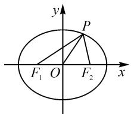
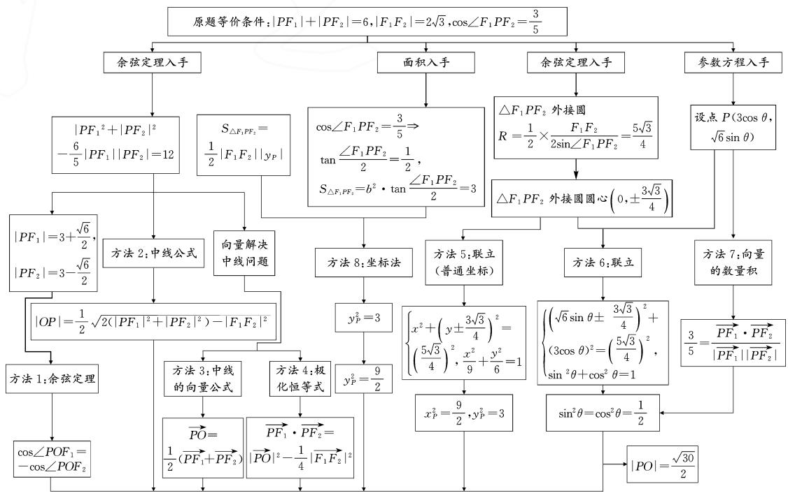
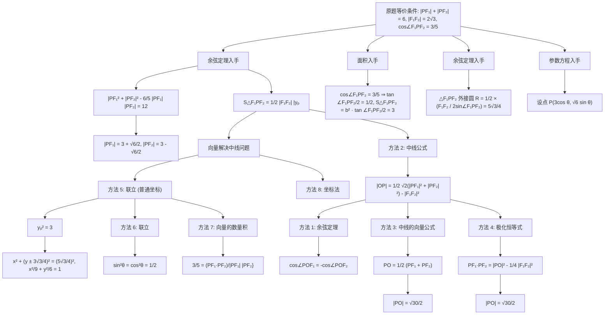
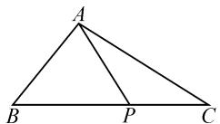
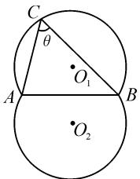

2023年讲题比赛获奖论文之二：

# 聚焦椭圆与三角 溯源算理与算法\*

——2023年全国高考理科数学甲卷第12题多视角解析及变式探究

# 四川省双流中学 余 泳 吴宣良 武星红

# 1 问题再现

(2023年全国高考数学甲卷理科第12题)已知椭圆 $\frac{x^{2}}{9}+\frac{y^{2}}{6}=1,F_{1},F_{2}$ 为两个焦点,O为原点,P为椭圆上一点, $\cos\angle F_{1}PF_{2}=\frac{3}{5}$ ,则 $|OP|=(\quad)$ .

A. $\frac{2}{5}$

B. $\frac{\sqrt{30}}{2}$

C. $\frac{3}{5}$

D. $\frac{\sqrt{35}}{2}$

# 2 问题分析

如图1，由“ $P$ 为椭圆上一点”可以得到“在 $\triangle F_{1}PF_{2}$ 中，有 $|PF_1| + |PF_2| = 6$ ”，而条件“ $\cos \angle F_1PF_2 = \frac{3}{5}$ ”相当于给出了 $\angle F_{1}PF_{2},“F_{1},F_{2}$ 为

两个焦点， $O$ 为原点”说明“ $O$ 为线段 $F_{1}F_{2}$ 中点”，求 $|OP|$ 之长等价于求三角形的中线长.所以，本题的实质是在某三角形中，已知两边之和、第三边及其对角，求解三角形的中线.

text_image

y
P
F₁ O F₂ x

图1

章建跃认为，“通性通法”是解题教学追求的最终目标，教学中要引导学生注重“若拙”的通法。上述问题转化为解三角形的问题后，首先从通性通法的角度，正弦定理和余弦定理是最一般的解题思路。其次，由于是中线问题，容易联想到与向量加法结合。再次，利用条件求出点 $P$ 的坐标也是一种自然的思路。根据以上解决本题的“通性通法”，笔者总结出了以下思维导图（如图2）。

flowchart

图2

# 3 问题解决

余弦定理思路: 利用椭圆的定义以及余弦定理直接求出 $\left|PF_{1}\right|$ , $\left|PF_{2}\right|$ , 再利用余弦定理列方程求出 $\left|PO\right|$ 的值, 得到方法 1.

方法 1: 在 $\triangle F_{1}PF_{2}$ 中, 由 $\cos\angle F_{1}PF_{2}=\frac{3}{5}$ , 得

$$
\mid P F _ {1} \mid^ {2} + \mid P F _ {2} \mid^ {2} - \frac {6}{5} \mid P F _ {1} \mid \mid P F _ {2} \mid = 1 2. \quad ①
$$

由题可得

$$
\mid P F _ {1} \mid + \mid P F _ {2} \mid = 2 a = 6. \tag {②}
$$

联立①②得 $\left|PF_{1}\right|=3+\frac{\sqrt{6}}{2},\left|PF_{2}\right|=3-\frac{\sqrt{6}}{2}.$

又 $\cos \angle POF_{1} = -\cos \angle POF_{2}, |OF_{1}| = |OF_{2}| = \sqrt{3}$ ，所以可得

$$
\begin{array}{l} \frac {\left| P O \right| ^ {2} + \left| F _ {1} O \right| ^ {2} - \left| P F _ {1} \right| ^ {2}}{2 \left| P O \right| \left| F _ {1} O \right|} \\ = - \frac {\mid P O \mid^ {2} + \mid F _ {2} O \mid^ {2} - \mid P F _ {2} \mid^ {2}}{2 \mid P O \mid \mid F _ {2} O \mid}. \\ \end{array}
$$

解得 $|PO|=\frac{\sqrt{30}}{2}$ .

人教 A 版新教材必修二课后习题中给出了中线公式, 学生可以直接利用椭圆的定义以及余弦定理求出 $\left|PF_{1}\right|^{2} + \left|PF_{2}\right|^{2}$ , 再由中线公式求解, 得到方法 2.

方法 2: 同方法 1 得到①②, 联立得

$$
\left| P F _ {1} \right| ^ {2} + \left| P F _ {2} \right| ^ {2} = 2 1, \left| P F _ {1} \right| \cdot \left| P F _ {2} \right| = \frac {1 5}{2}.
$$

由中线公式,知 $\left|F_{1}F_{2}\right|=2\sqrt{3}$ ,解得 $\left|PO\right|=\frac{\sqrt{30}}{2}$ .

事实上，中线公式可以由向量推导而来，因此求出 $\left|PF_{1}\right|\left|PF_{2}\right|,\left|PF_{1}\right|^{2}+\left|PF_{2}\right|^{2}$ 后，结合中线的向量公式以及数量积即可求出 $\left|OP\right|$ ，于是得到方法3.

方法3:由 $\overrightarrow{PO}=\frac{1}{2}\left(\overrightarrow{PF_{1}}+\overrightarrow{PF_{2}}\right)$ ，得 $|OP|=|\overrightarrow{PO}|=\frac{1}{2}\left|\overrightarrow{PF_{1}}+\overrightarrow{PF_{2}}\right|=\frac{1}{2}\sqrt{\left|\overrightarrow{PF_{1}}\right|^{2}+2\overrightarrow{PF_{1}}\cdot\overrightarrow{PF_{2}}+\left|\overrightarrow{PF_{2}}\right|^{2}}=\sqrt{21+2\times\frac{3}{5}\times\frac{15}{2}}=\frac{\sqrt{30}}{2}$ .所以 $|PO|=\frac{\sqrt{30}}{2}$ .

在利用向量考虑中线问题时,极化恒等式是常用思路之一,这里求出 $\left|PF_{1}\right|\left|PF_{2}\right|$ 后可以利用极化恒等式求解,于是得到方法4.

方法4:由极化恒等式 $\overrightarrow{PF_{1}}\cdot\overrightarrow{PF_{2}}=|\overrightarrow{PO}|^{2}-\frac{1}{4}|\overrightarrow{F_{1}F_{2}}|^{2}$ ，得 $|\overrightarrow{PO}|=\sqrt{\overrightarrow{PF_{1}}\cdot\overrightarrow{PF_{2}}+\frac{1}{4}|\overrightarrow{F_{1}F_{2}}|^{2}}$ 。又 $|F_{1}F_{2}|=2\sqrt{3}$ ，解得 $|PO|=\frac{\sqrt{30}}{2}$ 。

正弦定理思路:本题直接利用正弦定理会遇到困难,因为 $\left|PF_{1}\right|$ 与 $\left|PF_{2}\right|$ 的长度未知.但由 $\left|F_{1}F_{2}\right|=2\sqrt{3}$ , $\cos\angle F_{1}PF_{2}=\frac{3}{5}$ ,可知 $\left|F_{1}F_{2}\right|$ 与 $\angle F_{1}PF_{2}$ 是定值,因此由正弦定理可以求解三角形外接圆半径和确定外接圆圆心的位置.点P可以看作是圆弧与椭圆的交点,进而求出点P坐标.

假设点 P 的坐标为 $(x_{0}, y_{0})$ ，联立椭圆方程与圆弧方程求解 $(x_{0}, y_{0})$ ，于是得到方法 5.

方法 5: 由 $\left|F_{1}F_{2}\right|=2\sqrt{3}$ ， $\cos\angle F_{1}PF_{2}=\frac{4}{5}$ ，可知点 P 的轨迹是两段圆弧，其半径为 $\frac{\left|F_{1}F_{2}\right|}{2\sin\angle F_{1}PF_{2}}=\frac{5\sqrt{3}}{4}$ ，圆心 $O_{1}, O_{2}$ 在 y 轴上且与原点的距离为 $\frac{\left|F_{1}F_{2}\right|}{2}\cdot\left|\cot\angle F_{1}PF_{2}\right|=\frac{3\sqrt{3}}{4}$ 。所以，两段圆弧所在圆的方程为 $x^{2}+\left(y\pm\frac{3\sqrt{3}}{4}\right)^{2}=\frac{75}{16}$ ，结合椭圆方程得 $P(x_{0},y_{0})$ 满足 $x_{0}=\pm\frac{3\sqrt{2}}{2}, y_{0}=\pm\sqrt{3}$ 。故 $\left|OP\right|=\frac{\sqrt{30}}{2}$ 。

利用参数方程可以避免联立椭圆与圆弧所在圆的方程，设点 P 的坐标为 $(3\cos \theta, \sqrt{6}\sin \theta)$ ，联立圆弧所在圆的方程求解即可，得到方法 6（略）.

求解坐标思路:根据题目条件建立方程求解点 P 的坐标也是较为通用的思路,利用参数方程和向量可以求解,得到方法 7.

方法7: 设点 P 的坐标为 $(3\cos \theta, \sqrt{6} \sin \theta)$ ，则 $\overrightarrow{PF_{1}} = (-\sqrt{3} - 3\cos \theta, -\sqrt{6} \sin \theta)$ ， $\overrightarrow{PF_{2}} = (\sqrt{3} - 3\cos \theta, -\sqrt{6} \sin \theta)$ 。由 $\frac{3}{5} = \frac{\overrightarrow{PF_{1}} \cdot \overrightarrow{PF_{2}}}{|\overrightarrow{PF_{1}}| |\overrightarrow{PF_{2}}|}$ ，化简可得 $2 \cos^{4} \theta + 13 \cos^{2} \theta - 7 = 0$ 。解得 $\cos^{2} \theta = \frac{1}{2}$ ，故 $\sin^{2} \theta = \frac{1}{2}$ 。因此 $|OP| = \sqrt{9 \cos^{2} \theta + 6 \sin^{2} \theta} = \frac{\sqrt{30}}{2}$ 。

焦点三角形面积公式是常用的二级结论之一,根据焦点三角形面积公式求出 $\triangle F_{1}PF_{2}$ 的面积,即可得到点P的坐标,得到方法8.

方法8: 设 $\angle F_{1}PF_{2}=2\theta,0<\theta<\frac{\pi}{2}$ ，所以 $S_{\triangle F_{1}PF_{2}}=b^{2}\tan\frac{\angle F_{1}PF_{2}}{2}=b^{2}\tan\theta.$

由 $\frac{3}{5} = \cos \angle F_{1}PF_{2} = \cos 2\theta = \frac{\cos^{2}\theta - \sin^{2}\theta}{\cos^{2}\theta + \sin^{2}\theta} = \frac{1 - \tan^{2}\theta}{1 + \tan^{2}\theta}$ , 解得 $\tan \theta = \frac{1}{2}$ . 所以 $S_{\triangle F_1PF_2} = 6 \times \frac{1}{2} = 3$ .

又 $S_{\triangle F_1PF_2} = \frac{1}{2}|F_1F_2||y_P| = \frac{1}{2}\times 2\sqrt{3}\times |y_P| =$ $\sqrt{3}|y_P|$ ，所以 $\sqrt{3}|y_P| = 3$ ，解得 $y_{P}^{2} = 3.$

所以 $x_{P}^{2} = 9 \times \left(1 - \frac{3}{6}\right) = \frac{9}{2}$ .

因此 $|PO|=\sqrt{x_{P}^{2}+y_{P}^{2}}=\frac{\sqrt{30}}{2}.$

# 4 问题溯源

溯源 1 “爪型”三角形与斯特瓦尔特定理

当 c=3a 时， $\cos\angle ABC=\frac{7}{6}>1$ （舍）；

当 $c=\frac{2}{3}a$ 时， $\cos\angle ABC=\frac{7}{12}$ .

综上所述, $\cos\angle ABC=\frac{7}{12}.$

解法 2: 在 $\triangle ABC$ 中, $\overrightarrow{BD} = \frac{2}{3} \overrightarrow{BC} + \frac{1}{3} \overrightarrow{BA}$ , 平方得

$$
B D ^ {2} = \frac {4}{9} a ^ {2} + \frac {1}{9} c ^ {2} + \frac {4}{9} a c \cos B. \tag {①}
$$

在 $\triangle ABC$ 中,由余弦定理得

$$
b ^ {2} = a ^ {2} + c ^ {2} - 2 a c \cos B. \tag {②}
$$

联立①②，得 $11b^{2}=3c^{2}+6a^{2}$ .

以下部分同解法 1.

思路分析:本题涉及两个三角形,只有五个独立的条件,故无法确定三角形,那么如何求 $\cos\angle ABC$ 呢?找到边长 a,b,c 之间的关系,利用余弦定理求解.

设计意图:考虑到学生已经初步掌握了解三角形的方法、思想与本质,而从条件的个数分析,本题只有五个独立条件,缺少给定某一条的边长这一条件,故三角形不能确定.满足题意的三角形都相似,不能求出边长a,b,c,但根据边长a,b,c之间的关系可以求出 $\cos\angle ABC$ .因此进一步引导学生当条件个数不足时,如何求解三角形问题.这也为继续研究三角形中的边长、面积和周长的取值范围等问题做好铺垫.

# 2 教学反思

当前，在高中一轮复习中，大多数学校采取的复习方式是根据教辅资料的设计，每一小节通过基础知识梳理、典型例题剖析、课时作业等环节进行教学，然后辅以大量的专题训练和考试。这种做法的优点是能够帮助学生更好地巩固基础知识，提升解题技能；缺点是不能帮助学生深刻理解内容的本质，掌握核心思想与方法，提升理性思维，落实核心素养。“为国选才”是高考的基本功能，党中央、国务院印发的《深化新时代教育评价改革总体方案》明确提出：“改变相对固化的试题形式，增强试题的开放性，减少死记硬背和机械刷题现象”，高考命题探索“价值引领、素养导向、能力为重、知识为基”的综合考查模式，高考命题加大题目的创新力度、注重思维能力考查要求，课堂教学要回到注重数学内容的本质，加强关键能力的培养，促使学生学会思考，善于总结与反思。如果在重视基础的前提下适度开展深度学习，学生通过教师的引导和帮助，借助适宜的活动情境或手段，能主动地去观察、猜测、思考、探究，能提出问题并解决问题，真正成为教学的主体。教师在传授知识的同时，要注重知识的追根溯源、注重思维的深层训练、注重师生的深层对话、注重学习的深层评价，引导学生“知其然”到“知其所以然”，促进学生的学习从“学会”到“会学”。Z

# (上接第4页)

在三角形中,连接一个顶点与其对边上任意一点,因其形状类似爪子所以被称为“爪型”三角形,如图3所示.“爪型”三角形的问题可以利用 $\cos\angle APB + \cos\angle APC = 0$ 和余弦定理求解.

  
图3

1746 年, 苏格兰数学家斯特瓦尔特发现了这种关系, 并由此给出了“爪型”三角形中五边的关系: $AP^{2} = \frac{BP}{BC} \cdot AC^{2} + \frac{CP}{BC} \cdot AB^{2} - BP \cdot CP$ . 当然, 究其本质, 是余弦定理的运用.

当点 P 特殊时, 还可以得到如下推论:

若 $AP$ 为中线，则 $AP^2 = \frac{1}{2} AB^2 +\frac{1}{2} AC^2 -\frac{1}{4} BC^2.$

若 AP 为角平分线时, 则 $AP^{2}=AB \cdot AC - BP \cdot CP$ .

# 溯源 2 隐圆问题

如图 4, 设线段 AB 的长度为定值, $\angle ACB = \theta$ 为定值, 则点 C 的轨迹是以 $O_{1}, O_{2}$ 为圆心, 以 $\frac{AB}{2\sin\theta}$ 为半径的两段圆弧. 圆心 $O_{1}, O_{2}$ 在线段 AB 的中垂线上, 距离为 $\frac{AB}{2} |\cot\theta|$ .

text_image

C
θ
O₁
A
B
O₂

图 4

实际上,文中给出的8种解题思路是从不同角度对斯特瓦尔特定理和隐圆问题的证

明和应用.

# 5 问题拓展

在“爪型”三角形中，P 可以是 BC 上的任意一点.

(2022年全国高考数学甲卷理科第16题)已知 $\triangle ABC$ 中,点 $D$ 在边 $BC$ 上, $\angle ADB=120^{\circ},AD=2$ , $CD=2BD$ ,当 $\frac{AC}{AB}$ 取得最小值时, $BD=$ \_\_\_\_.

解：略.

“爪型”三角形是解三角形问题中最常见的一种类型,解决此类问题的常规思路就是利用余弦定理或向量求解.

# 6 反思建议

2023年全国高考数学甲卷理科第12题中涉及的方法很典型,解三角形问题常规入手方式就是正弦定理与余弦定理,因为题目是求三角形的中线,所以又可以联想中线公式、中线的向量表达式、极化恒等式等.同时,该题套有椭圆外衣,因此还可以从椭圆的参数方程、椭圆焦点三角形面积的二级结论入手.

备考时,提醒学生注意数形结合,注重三角形边角关系的转换,以及与其他知识的联系.鼓励学生一题多解、多题一解,并让学生自己归纳总结此类题型的解题技巧和思想方法,培养学生的数学运算、逻辑推理等数学核心素养.Z