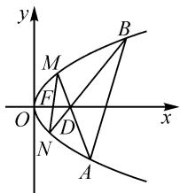
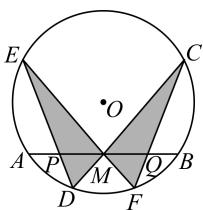
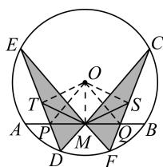
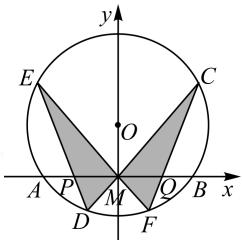
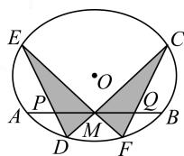
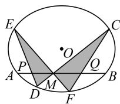
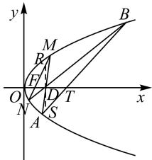

# 蝴蝶定理在高考试题中的应用

——2022 全国甲卷理科第 20 题背景探幽

江西省九江市教育科学研究所 林健航

# 1 试题呈现

例（2022全国甲卷·20）设抛物线 $C:y^{2} = 2px$ $(p > 0)$ 的焦点为 $F$ ，点 $D(p,0)$ ，过点 $F$ 的直线交 $C$ 于 $M,N$ 两点.当直线 $MD$ 垂直于 $x$ 轴时， $\vert MF\vert = 3.$

(1) 求 C 的方程；

(2)设直线 MD, ND 与 C 的另一个交点分别为 A, B, 记直线 MN, AB 的倾斜角分别为 $\alpha, \beta$ . 当 $\alpha - \beta$ 取得最大值时, 求直线 AB 的方程.

解法 1:(1) 抛物线 C 的方程为 $y^{2}=4x$ . (过程略.)

(2) 如图 1, 设 $M(x_{1}, y_{1})$ , $N(x_{2}, y_{2}), A(x_{3}, y_{3}), B(x_{4}, y_{4})$ .

由抛物线的对称性知，当 $\alpha = 90^{\circ}$ 时， $\beta = 90^{\circ}$ ，则 $\alpha - \beta = 0$ 。

当 $\alpha\neq90^{\circ}$ 时， $\beta\neq90^{\circ}$ ，设过点 $(x_{0},0)$ 的直线方程为 $x=my+x_{0}$ .

text_image

y
M
B
F
O
D
x
N
A

图 1

联立 $\left\{\begin{aligned}x&=my+x_{0},\\ y^{2}&=4x,\end{aligned}\right.$ 得 $y^{2}-4my-4x_{0}=0.$

当 $x_{0}=1$ 时，得 $y_{1}y_{2}=-4$ ;

当 $x_{0}=2$ 时，得 $y_{1}y_{3}=-8, y_{2}y_{4}=-8.$

由 $\left\{\begin{aligned}y_{2}^{2}&=4x_{2},\\ y_{1}^{2}&=4x_{1}\end{aligned}\right.$ 两式相减，得 $y_{2}^{2}-y_{1}^{2}=4(x_{2}-x_{1})$ ，
所以 $k_{MN}=\frac{y_{2}-y_{1}}{x_{2}-x_{1}}=\frac{4}{y_{1}+y_{2}}$ .

同理 $k_{AB} = \frac{4}{y_3 + y_4}$ 即 $k_{AB} = \frac{4}{-8\left(\frac{1}{y_1} + \frac{1}{y_2}\right)} = \frac{y_1y_2}{-2(y_1 + y_2)} = \frac{2}{y_1 + y_2} = \frac{k_{MN}}{2}.$

当 $\alpha\in(0^{\circ},90^{\circ})$ 时， $\beta\in(0^{\circ},90^{\circ})$ ，且 $\alpha>\beta$ .

当 $\alpha\in(90^{\circ},180^{\circ})$ 时， $\beta\in(90^{\circ},180^{\circ})$ ，且 $\alpha<\beta$ .

故要使 $\alpha-\beta$ 最大，则 $\alpha\in(0^{\circ},90^{\circ})$ .

设 $k_{AB} = k > 0$ ，则 $k_{MN} = 2k$

故 $\tan (\alpha -\beta) = \frac{\tan\alpha - \tan\beta}{1 + \tan\alpha\tan\beta} = \frac{k}{1 + 2k^2} = \frac{1}{\frac{1}{k} + 2k}\leqslant$

$\frac{1}{2\sqrt{\frac{1}{k}\cdot2k}}=\frac{\sqrt{2}}{4}$ ，当且仅当 $\frac{1}{k}=2k$ ，即 $k=\frac{\sqrt{2}}{2}$ 时，等号

成立.所以当 $\alpha-\beta$ 最大时, $k_{AB}=\frac{\sqrt{2}}{2}$ .

设直线 AB: $x = \sqrt{2}y + t$ ，代入抛物线方程，可得 $y^{2} - 4\sqrt{2}y - 4t = 0$ ，所以 $y_{3}y_{4} = -4t$ 。

又因为 $y_{3}y_{4} = \left(-\frac{8}{y_{1}}\right)\left(-\frac{8}{y_{2}}\right) = \frac{64}{y_{1}y_{2}} = -16$ ，所以 $-4t = -16$ ，解得 $t = 4$ .

故直线 AB 的方程为 $x - \sqrt{2}y - 4 = 0$ .

此解法为通性通法.本题主要考查抛物线的定义、直线与抛物线的位置关系、直线的倾斜角和斜率的概念、均值不等式等基础知识，考查数形结合、分类讨论和点差法等数学思想方法，考查逻辑推理、直观想象、数学运算等核心素养.

第(2)问解决的关键在于找出直线 MN 与 AB 斜率之间的关系 $k_{AB} = \frac{1}{2} k_{MN}$ . 此结论是否可以一般化? 其几何背景又是什么? 可否进行拓展? 围绕这些问题, 笔者做了一些思考, 分享如下.

# 2 背景探幽

本题的背景就是坎迪定理,下面我们先从蝴蝶定理入手进行探究.

如图 2, 设 M 是圆 O 中弦 AB 的中点, 过点 M 任作两条弦 CD, EF, 连接 DE, CF, 分别交 AB 于 P, Q 两点, 则 MP = MQ.

这个问题的图形,像一只在圆中翩翩起舞的蝴蝶,这正是该结论被冠以“蝴蝶定理”美名的缘故.

text_image

E
C
O
A P M Q B
D F

图2

此定理的证明方法很多,下面用中学的有关知识给出该定理的两种证法.

证法 1:(初中几何知识)如图 3, 过圆心 O 作 CF, ED 的垂线, 垂足分别为 S, T, 连接 OM, OP, OQ.

因为 $\angle OSQ = \angle OMQ = 90^{\circ}$ ,
所以 O, S, Q, M 四点共圆.

于是 $\angle QSM = \angle QOM$

同理可得 $\angle PTM = \angle POM$

易得 $\triangle FCM \sim \triangle DEM$ ，则 $\frac{MF}{MD}=\frac{FC}{DE}$ . 又 FC=2FS, DE=
2DT, 所以 $\frac{MF}{MD}=\frac{FS}{DT}$ .

text_image

Geometric diagram with labeled points and shaded regions, likely from a math problem or proof

图3

又 $\angle F = \angle D$ ，易得 $\triangle FSM\sim \triangle DTM$ ，于是有 $\angle QSM = \angle PTM$ ，所以 $\angle QOM = \angle POM$

又 $OM \perp PQ$ ，所以 MP = MQ。

证法 2: (高中几何知识) 如图 4, 以 M 为坐标原点, AB 所在的直线为 x 轴, 建立平面直角坐标系. 设 OM = b, 则圆 O 的方程可写为

$$
x ^ {2} + y ^ {2} - 2 b y + c = 0. \quad ①
$$

设直线 CD, EF 的方程分别为 $y = k_{1}x$ , $y = k_{2}x$ ，合并为

text_image

y
E
C
O
A P M Q B x
D F

图 4

$$
(y - k _ {1} x) (y - k _ {2} x) = 0. \tag {②}
$$

于是,过曲线①②的交点 C,D,E,F 的二次曲线系方程为

$$
x ^ {2} + y ^ {2} - 2 b y + c + \lambda (y - k _ {1} x) (y - k _ {2} x) = 0. \tag {③}
$$

③式中令 $y = 0$ ，可知曲线③与 $AB$ 的交点 $P, Q$ 的横坐标满足 $(1 + \lambda k_{1}k_{2})x^{2} + c = 0.$ 由韦达定理，可得 $x_{P} + x_{Q} = 0$ ，即 $|MP| = |MQ|$ .

由仿射几何知识可知,蝴蝶定理在圆锥曲线中也成立:

如图 5, 在圆锥曲线中, 过弦 AB 的中点 M 任作两条弦 CD 和 EF, 直线 DE, CF 交直线 AB 于 P, Q 两点, 则 MP = MQ. (证明略)

若将 M 改为弦 AB 上的任意一点, 则可得到坎迪定理:

如图 6, 圆锥曲线中, 过弦 AB 上的点 M 任作两条弦 CD 和 EF, 直线 DE, CF 分别交直线 AB 于 P, Q 两点, 则 $\frac{1}{MP} - \frac{1}{MQ} = \frac{1}{MA} - \frac{1}{MB}$ . (证明略.)

  
图 5

  
图6

由蝴蝶定理和坎迪定理,可得上述例题的简单解法.

解法 2:(1) 略.

(2)如图7,由无限思想,可设x轴与抛物线相交

于 O, P 两点, 其中点 P 位于无穷远处. 由坎迪定理, 得 $\frac{1}{|DF|} - \frac{1}{|DT|} = \frac{1}{|DO|} - \frac{1}{|DP|}$ , 即 $1 - \frac{1}{x_{T} - 2} = \frac{1}{2}$ .

text_image

y
B
M
R
F
O
D
T
x
N
A
S

图 7

解得 $x_{T}=4$ ，即直线 AB 经过点 $T(4,0)$ .

由解法 1 知, 要使得 $\alpha - \beta$ 取得最大值, 则 $k_{AB} = k > 0$ . 过点 D 作 x 轴的垂线分别交 MN, AB 于点 R, S.

由蝴蝶定理，得 $|DR| = |DS|$ ，则 $\frac{k_{MN}}{k} = \frac{|DR|}{|DF|} \cdot \frac{|DT|}{|DS|} = \frac{|DT|}{|DF|} = 2$ ，即 $k_{MN} = 2k$ .

故 $\tan (\alpha -\beta) = \frac{\tan\alpha - \tan\beta}{1 + \tan\alpha\tan\beta} = \frac{k}{1 + 2k^2} = \frac{1}{\frac{1}{k} + 2k}\leqslant$ $\frac{1}{2\sqrt{\frac{1}{k}\cdot 2k}} = \frac{\sqrt{2}}{4}$ 当且仅当 $\frac{1}{k} = 2k$ ，即 $k = \frac{\sqrt{2}}{2}$ 时，等号成立.

所以直线 AB 的方程为 $x - \sqrt{2}y - 4 = 0$ .

# 3 应用拓展

若将上述例题一般化可得下列两个结论.

结论 1 如图 7, 设抛物线 $C: y^{2} = 2px (p > 0)$ , $F(m, 0)$ , $D(n, 0) (n > m > 0)$ , 过点 F 的直线交 C 于 M, N 两点. 设直线 MD, ND 与 C 的另一个交点分别为 A, B, 记直线 MN, AB 的斜率分别为 $k_{1}, k_{2}$ , 则 $\frac{k_{1}}{k_{2}}$ 为定值 $\frac{n}{m}$ , 并且直线 AB 过定点 $\left(\frac{n^{2}}{m}, 0\right)$ .

结论 2 设椭圆 $C: \frac{x^{2}}{a^{2}} + \frac{y^{2}}{b^{2}} = 1 (a > b > 0)$ , $F(m, 0)$ , $D(n, 0) (-a < m < n < a)$ ，过点 F 的直线交 C 于 M, N 两点。设直线 MD, ND 与 C 的另一个交点分别为 A, B，记直线 MN, AB 的斜率分别为 $k_{1}, k_{2}$ ，则 $\frac{k_{1}}{k_{2}}$ 为定值 $\frac{1}{1 + \frac{n - m}{a - n} - \frac{n - m}{n + a}}$ ，并且直线 AB 过定点

$$
\left(\frac {1}{\frac {1}{n - m} + \frac {1}{a - n} - \frac {1}{n + a}} + n, 0\right).
$$

研究解析几何问题,不仅要研究其解法,还要研究其几何背景,扣住几何属性,在更广、更深的层面上认识试题,发挥其教学功能,于教学过程中落实学科素养.Z