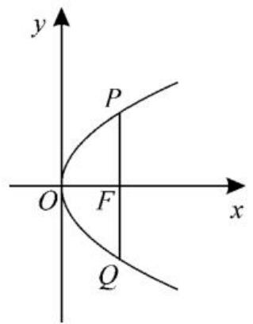
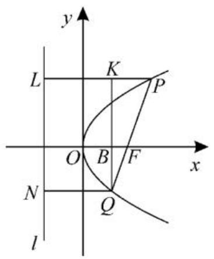
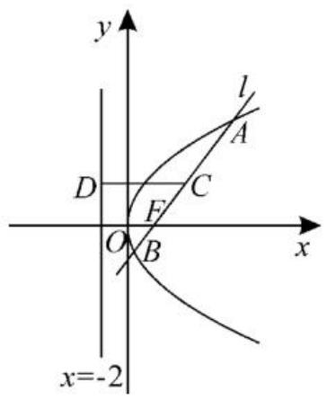

text_image

剖析抛物线中的焦参数

■江苏省盐城市时杨中学  
刘长柏

平面内与一个定点 F 和一条定直线 l 的距离相等的点的轨迹叫作抛物线。定点 F 为抛物线的焦点，定直线 l 为抛物线的准线，焦参数表示焦点到准线的距离。下面剖析抛物线 $y^{2}=\pm2px$ 或 $x^{2}=\pm2py(p>0)$ 中的焦参数 p。

# 一、 $p$ 的几何意义

$2p, p, \frac{p}{2}$ 等具有鲜明的几何意义。 $2p$ 表示通径（过焦点且垂直于对称轴的直线与抛物线交于两点，连接这两点的线段）长， $p$ 表示焦点到准线的距离， $\frac{p}{2}$ 表示焦点到顶点的距离。 $p$ 恒为正值； $p$ 的值越大，抛物线的张口越大。

例 1 设抛物线 $y = mx^{2} (m \neq 0)$ 的准线与直线 y = 1 的距离为 3，求抛物线的标准方程。

解:由 $y=mx^{2}(m\neq0)$ 可化为 $x^{2}=\frac{1}{m}y$ ,
其准线方程为 $y=-\frac{1}{4m}$ 。

由题意知 $-\frac{1}{4m}=-2$ 或 $-\frac{1}{4m}=4$ 。

解得 $m = \frac{1}{8}$ 或 $m = -\frac{1}{16}$ 。

故所求抛物线的标准方程为 $x^{2} = 8y$ 或 $x^{2} = -16y$ 。

点评:抛物线标准方程中的焦参数应位于一次项前,解题时应先化为 $x^{2}=\frac{1}{m}y$ 的形式,再求解。

练习1:已知抛物线的顶点在原点,焦点在y轴上,抛物线上一点 $M(m,-3)$ 到焦点的距离为5,求m的值。

解:由题意设抛物线的方程为 $x^{2} = -2py (p > 0)$ ，则准线方程为 $y = \frac{p}{2}$ 。

因为点 M 到焦点的距离与到准线的距离相等, 所以 $5 = |-3| + \frac{p}{2}$ , 解得 p = 4。

故抛物线的方程为 $x^{2} = -8y$ 。

把 $M(m,-3)$ 代入得 $m^{2}=-8\times(-3)=24$ ，解得 $m=\pm2\sqrt{6}$ 。

# 二、 $p$ 的桥梁作用

已知抛物线的方程求其性质时,可先化为标准方程,由 2p 得 $\frac{p}{2}$ , 进而得焦点坐标, 准线方程等性质; 已知性质求抛物线的方程时, 可由 $\frac{p}{2}$ 得 2p, 进而得抛物线的标准方程。

例 2 已知抛物线的准线方程是 x = - $\frac{3}{2}$ ，求抛物线的标准方程。

解:由题意设抛物线的标准方程为 $y^{2}=2px$ 。

由 $\frac{p}{2} = \frac{3}{2}$ 得 $2p = 6$ 。

故抛物线的标准方程是 $y^{2} = 6x$ 。

点评: 因为抛物线的标准方程中只有一个参数 p, 所以只需一个条件, 就可以求出抛物线的标准方程。求解步骤是: 定型、定焦点、定参数。

练习2:已知抛物线的焦点坐标是 $F(0,$

-2), 求抛物线的标准方程。

解:焦点 F 在 y 轴负半轴上, 故可设抛物线的标准方程为 $x^{2} = -2py$ 。

由 $\frac{p}{2}=2$ 得p=4。

所以抛物线的标准方程是 $x^{2} = -8y$ 。

# 三、 $p$ 的规律性结论

例 3 过抛物线 $y^{2}=2px(p>0)$ 的焦点 F 作直线交抛物线于 P, Q 两点，且 $|PF|=m, |FQ|=n$ 。试求 $\frac{1}{m}+\frac{1}{n}$ 的值。

解: 若直线 PQ 垂直于 x 轴, 如图 1。

text_image

y
P
O
F
x
Q

图1

由 $F\left(\frac{p}{2},0\right)$ 和 $y^{2} = 2px$ ，得 $y_{P} = p,y_{Q}$ $= -p$ ，则 $m = n = p$ 。

于是 $\frac{1}{m} +\frac{1}{n} = \frac{1}{p} +\frac{1}{p} = \frac{2}{p}$

若直线 PQ 不垂直于 x 轴, 如图 2, 作抛物线的准线 l, 过点 P 作 $PL \perp l$ , 垂足为 L, 过点 Q 作 $QN \perp l$ , 垂足为 N, 过点 Q 作 $QK \perp PL$ , 垂足为 K, QK 交 x 轴于点 B。

text_image

y
L
K
P
O
B
F
x
N
Q
l

图2

易知 $|QF|=|QN|$ ， $|PF|=|PL|$ ，四边形KLNQ为矩形， $\triangle QBF\sim\triangle QKP$ 。

则 $\frac{|BF|}{|KP|} = \frac{|FQ|}{|PQ|} \Rightarrow \frac{p - |FQ|}{|PF| - |FQ|} = \frac{|FQ|}{|PF| + |FQ|} \Rightarrow \frac{p - n}{m - n} = \frac{n}{m + n}$ 。

整理得 $p(m + n) = 2mn$ ，即 $\frac{m + n}{mn} = \frac{2}{p}$

故 $\frac{1}{m} +\frac{1}{n} = \frac{2}{p}$

综上， $\frac{1}{m} +\frac{1}{n} = \frac{2}{p}$

点评:抛物线中与 p 有关的规律性结论有很多。设 AB 为过抛物线 $y^{2}=2px(p>0)$ 焦点的弦， $A(x_{1},y_{1}),B(x_{2},y_{2})$ ，直线 AB 的倾斜角为 $\theta$ ，则① $x_{1}x_{2}=\frac{p^{2}}{4},y_{1}y_{2}=-p^{2}$ ;
② $|AB|=\frac{2p}{\sin^{2}\theta}=x_{1}+x_{2}+p;$ ③以 AB 为直径的圆与准线相切。

练习 3: 已知直线 l 与抛物线 $y^{2}=8x$ 交于 A, B 两点, 且直线 l 经过抛物线的焦点 F, 点 A(8,8), 则线段 AB 的中点到准线的距离为 \_\_\_\_。

解: 因为抛物线的焦点为 $F(2,0)$ , $A(8,8)$ , 所以直线 l 的方程为 $y=\frac{4}{3}(x-2)$ 。

联立 $\left\{\begin{aligned}y&=\frac{4}{3}(x-2),\\ y^{2}&=8x,\end{aligned}\right.$ 消去 y 得 $2x^{2}-17x+8=0$ ，解得 $x_{A}=8, x_{B}=\frac{1}{2}$ 。

所以 $|AB|=x_{A}+x_{B}+p=\frac{17}{2}+4=\frac{25}{2}$ 。

如图 3, 记线段 AB 的中点为 C, 过点 C 作准线的垂线, 垂足为 D, 则线段 AB 的中点到准线的距离 $\left|CD\right|=\frac{1}{2}\left|AB\right|=\frac{25}{4}$ 。

text_image

y
l
A
D
C
F
O
B
x
x=-2

图3

总之,在研究抛物线的相关问题时,我们应正确理解定义,将抛物线上的点到焦点的距离与到准线的距离进行合理转化,掌握焦参数的一些常见结论,从而熟练解决焦参数问题。

(责任编辑 赵倩)