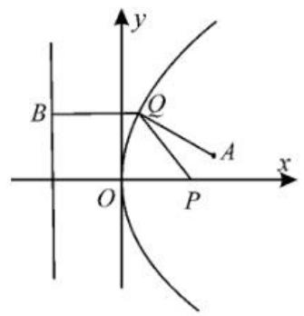

natural_image

Stylized grayscale illustration of two dandelion flowers with leaves and a Chinese character '古' (no text or symbols in the main image)

# 剖析抛物线的焦点弦问题

# ■山东省郓城第一中学 张守雨

抛物线的焦点弦问题历来是高考的重点和热点。同学们在遇到抛物线的焦点弦问题时，一般的求解思路是先设焦点弦所在的直线方程，再与抛物线方程联立，然后借助韦达定理求解，这种解法思路简单，但计算烦琐，费时费力。抛物线的焦点弦问题，其核心在于结合抛物线的定义、韦达定理及几何性质，解决弦长计算、位置关系及最值等问题。下面从抛物线焦点弦的端点坐标公式、弦长计算、几何性质应用、最值问题、与焦点弦有关的面积问题等五个方面展开剖析。

# 一、抛物线焦点弦的端点坐标公式

设 AB 是过抛物线 $y^{2}=2px(p>0)$ 焦点 F 的弦，若 $A(x_{1},y_{1}), B(x_{2},y_{2})$ ，则：

$$
x _ {1} x _ {2} = \frac {p ^ {2}}{4}, y _ {1} y _ {2} = - p ^ {2} 。
$$

例 1 已知抛物线 $y^{2}=4x$ 的焦点为 F，直线 l 过焦点 F 与该抛物线相交于 A, B 两点，O 为坐标原点，则 $\overrightarrow{OA} \cdot \overrightarrow{OB}$ 的值是（）。

A. 2

B. 3

C.-2

D.-3

解析:由题意得 $F(1,0)$ ，当直线 l 的斜率为 0 时，不满足要求。

设直线 l 的方程为 $x=1+my$ ，联立 $y^{2}=4x$ ，得 $y^{2}-4my-4=0$ 。

设 $A(x_{1},y_{1}),B(x_{2},y_{2})$ ，则 $y_{1} + y_{2} = 4m,y_{1}y_{2} = -4$

故 $x_{1}x_{2} = (1 + my_{1})(1 + my_{2}) = 1+$ $m(y_{1} + y_{2}) + m^{2}y_{1}y_{2} = 1 + 4m^{2} - 4m^{2} = 1$

则 $\overrightarrow{OA} \cdot \overrightarrow{OB} = x_{1}x_{2} + y_{1}y_{2} = -3$ 。

故选D。

点评:利用抛物线焦点弦的端点坐标公式,可以直接构建与过焦点弦的两端点坐标有关的关系式,在解决选择题或填空题时,优势更加明显,简单快捷。

# 二、抛物线焦点弦的长度公式

设 AB 是过抛物线 $y^{2}=2px(p>0)$ 焦点 F 的弦，若 $A(x_{1},y_{1}), B(x_{2},y_{2})$ ，则 $|AB|=x_{1}+x_{2}+p=\frac{2p}{\sin^{2}\alpha}, \alpha$ 为直线 AB 的倾斜角。

例 2 已知抛物线 C: $y^{2}=2px$ (p>0) 的焦点为 F，过点 F 且斜率为 2 的直线 l 交抛物线 C 于 A, B 两点，若 $|AB|=5$ ，则 p=()。

A. $\frac{1}{2}$

B. 1

C. $\frac{3}{2}$

D. 2

解析:由题意知, $F\left(\frac{p}{2},0\right)$ ,设直线l:y= $2\left(x-\frac{p}{2}\right),A\left(x_{1},y_{1}\right),B\left(x_{2},y_{2}\right)$ 。

联立 $\left\{ \begin{array}{l} y = 2\left(x - \frac{p}{2}\right), \\ y^2 = 2px, \end{array} \right.$ 消去 $y$ ，得 $4x^{2}-6px + p^{2} = 0$ 。

所以 $x_{1} + x_{2} = \frac{3}{2} p$ 。

由抛物线的定义知 $|AB| = |AF| + |BF| = \left(x_1 + \frac{p}{2}\right) + \left(x_2 + \frac{p}{2}\right) = x_1 + x_2 + p = \frac{3}{2} p + p = \frac{5}{2} p$ 。

而 $|AB|=5$ ，故 $\frac{5}{2}p=5$ ，解得p=2。

故选D。

点评:利用抛物线焦点弦的长度公式解题时,可以根据题设条件合理选择关系式,选择与过焦点弦的两端点横坐标有关的关系式,或选择与过焦点弦的倾斜角有关的关系式,也可以两者混合应用,实现问题的巧妙转化与解决。

# 三、几何性质应用

1. 切线交点与准线关系: 焦点弦两端点处的切线相交于准线上, 且交点与焦点的连

线垂直于焦点弦。

2. 圆与准线的位置关系: 以焦点弦为直径的圆与抛物线的准线相切。

例 3 倾斜角为 $\frac{\pi}{3}$ 的直线过抛物线 $y^{2}=2px(p>0)$ 的焦点 F，与该抛物线交于点 A, B，且以 AB 为直径的圆与直线 x=-1 相切，则 $|AB|=(\quad)$ 。

A. 4

B. $\frac{16}{3}$

C. $\frac{20}{3}$

D. $\frac{22}{3}$

解析: 易知抛物线 $y^{2}=2px(p>0)$ 的准线为 $l:x=-\frac{p}{2}$ 。

过点 A, B 分别作 l 的垂线, 垂足为 C, D。设 AB 的中点为 M, 作 $MN \perp l$ , 垂足为 N。

则 $|MN| = \frac{1}{2} (|AC| + |BD|) = \frac{1}{2} (|AF| + |BF|) = \frac{1}{2}|AB|$ .

故以 AB 为直径的圆与 $l: x = -\frac{p}{2}$ 相切。

由题意易知,以 AB 为直径的圆与直线 x = -1 相切,故直线 x = -1 为抛物线的准线,则 $p = 2, y^{2} = 4x$ 。

易知直线 $AB$ 的方程为 $y = \sqrt{3} (x - 1)$ ，代入 $y^{2} = 4x$ ，得 $3(x - 1)^{2} = 4x$ ，即 $3x^{2} - 10x + 3 = 0$ 。

设 $A(x_{1},y_{1}),B(x_{2},y_{2})$ ，则 $x_{1} + x_{2} = \frac{10}{3}$

故 $|AB|=|AF|+|BF|=x_{1}+x_{2}+p$ $=\frac{10}{3}+2=\frac{16}{3}$ ，选 B。

# 四、与焦点弦有关的最值问题

例 4 已知直线 l: x = -5，点 P(3,0)，点 A(4,1)，动点 Q 到点 P 的距离比到直线 l 的距离小 2，则 $\left|QA\right| + \left|QP\right|$ 的最小值为（）。

A. 4

B. 6

C. 7

D. 8

解析:设点 $Q(x,y)$ 。已知点 $P(3,0)$ ，直线 l:x=-5，动点 Q 到点 P 的距离比到直线 l 的距离小 2，故动点 Q 到点 P 的距离等于到直线 x=-3 的距离。

由抛物线的定义可得点 $Q$ 的轨迹是以 $P(3,0)$ 为焦点，以直线 $x = -3$ 为准线的抛

物线，即抛物线的方程为 $y^{2}=12x$ 。

如图 1, 过点 Q 作准线的垂线, 垂足为 B, 由抛物线的定义, 得 $\left|QP\right| = \left|QB\right|$ 。

text_image

y
B
O
A
x
O
P

图1

则 $|QA| + |QP| = |QA| + |QB|$ ，当A，Q，B三点共线时， $|QA| + |QP|$ 取得最小值，最小值为 $|AB| = 4 + 3 = 7$ 。

故选C。

点评:“看到准线想焦点,看到焦点想准线”,许多抛物线问题均可根据定义获得简捷、直观的求解。“由数想形,由形想数,数形结合”是灵活解题的一条捷径。

例 5 已知抛物线 C: $y^{2}=16x$ 的焦点为 F，直线 x-my-4=0 ( $m \in R$ ) 与抛物线 C 交于 A, B 两点，则 $|AF|+4|BF|$ 的最小值是（）。

A. 40

B. 36

C. 28

D. 24

解析: 方法一: 设 $A(x_{1}, y_{1})$ , $B(x_{2}, y_{2})$ 。

由抛物线的定义, 知 $\left|AF\right|=x_{1}+4$ , $\left|BF\right|=x_{2}+4$ 。

联立 $\left\{\begin{aligned}x-my-4=0,\\ y^{2}=16x,\end{aligned}\right.$ 化简得 $x^{2}-(16m^{2}+8)x+16=0$ 。

由韦达定理得 $x_{1}x_{2} = 16$ 。

$|AF|+4|BF|=x_{1}+4+4(x_{2}+4)=$ $x_{1}+4x_{2}+20\geqslant2\sqrt{x_{1}\cdot4x_{2}}+20=36$ ，当 $x_{1}=8, x_{2}=2$ 时等号成立。

所以 $|AF| + 4|BF|$ 的最小值为36。

故选B。

方法二:抛物线的焦点 $F(4,0)$ 在直线 x-my-4=0 上。

则 $\frac{1}{|AF|} +\frac{1}{|BF|} = \frac{2}{p} = \frac{1}{4}$ 。（结论：若 $AB$ 为抛物线的焦点弦，则 $\frac{1}{|AF|} +\frac{1}{|BF|}$ 为定值 $\frac{2}{p}$

故 $\frac{4}{|AF|} +\frac{4}{|BF|} = 1$

$$
\left| A F \right| + 4 \left| B F \right| = (\left| A F \right| + 4 \left| B F \right|) \cdot
$$

$$
\left(\frac {4}{| A F |} + \frac {4}{| B F |}\right) = 4 + \frac {4 | A F |}{| B F |} + \frac {1 6 | B F |}{| A F |} +
$$

$16 \geqslant 20 + 2\sqrt{64} = 36$ ，当且仅当 $|AF| = 12$ ， $|BF| = 6$ 时取等号。

故 $(|AF|+4|BF|)_{\min}=36$ ，选B。

点评:本题以抛物线的焦点弦为场景,通过抛物线焦半径长的线性关系式的合理构建,确定其相应的最值问题,以“动”态形式创设问题,以“静”态最值来确定答案。

# 五、与焦点弦有关的面积问题

例 6 在平面直角坐标系 xOy 中, 已知抛物线 C: $y^{2}=2px (p>0)$ 的焦点为 F, 准线为直线 x=-3, 过点 F 的直线 l 与抛物线 C 相交于 A, B 两点, 则 $\triangle AOB$ 面积的最小值为()。

A. 24

B. 18

C. 16

D. 12

解析:由题意知, $-\frac{p}{2}=-3$ ,解得p=6。

所以抛物线 $C: y^{2} = 12x, F(3,0)$ 。

设点 $A(x_{1},y_{1})$ ，点 $B(x_{2},y_{2})$ ，直线 $l$ 的方程为 $x = my + 3$ 。

代入 $y^{2}=12x$ ，消去 x 并整理得 $y^{2}-12my-36=0$ 。

所以 $y_{1} + y_{2} = 12m, y_{1}y_{2} = -36$ 。

所以 $S_{\triangle AOB} = \frac{1}{2}\cdot |OF|\cdot |y_1 - y_2|$

$$
= \frac {1}{2} \times 3 \times \sqrt {(y _ {1} + y _ {2}) ^ {2} - 4 y _ {1} y _ {2}}
$$

$$
= \frac {1}{2} \times 3 \times \sqrt {1 4 4 m ^ {2} + 1 4 4}
$$

$= 18\sqrt{m^2 + 1}\geqslant 18$ ，当且仅当 $m = 0$ 时取等号，即 $\triangle AOB$ 面积的最小值为18。

故选 B。

点评:由题中条件易得抛物线 $C: y^{2} = 12x$ ，设点 $A(x_{1}, y_{1}), B(x_{2}, y_{2})$ ，直线 l 的方程为 $x = my + 3$ ，联立抛物线方程并应用韦达定理、三角形面积公式求面积的最小值。

总之,求解抛物线焦点弦问题的关键点在于依据定义进行转化,解析几何问题的根本又在于图形,因此需要探寻图形特征,简化解题过程。如何寻找抛物线焦点弦问题中的图形特征呢?应把握两个“基于”实现问题的

转化:基于抛物线的定义,将焦半径转化为点到准线的距离,构造特征梯形;基于角度,用几何眼光观察,根据题目条件或者问题,寻找倾斜角或其等角所在的三角形,结合平面几何知识将问题转化。

# 变式训练：

1. 已知抛物线 C 的方程为 $y^{2}=8x$ ，F 为抛物线 C 的焦点，倾斜角为 $45^{\circ}$ 的直线 l 过点 F 交抛物线 C 于 A, B 两点，则线段 AB 的长为 \_\_\_\_。

解析: 因为抛物线 C 的方程为 $y^{2}=8x$ ，所以焦点 $F(2,0)$ 。

所以直线 l 的方程为 y = x - 2，设 $A(x_{1}, y_{1}), B(x_{2}, y_{2})$ 。

联立 $\left\{\begin{aligned}y&=x-2,\\ y^{2}&=8x,\end{aligned}\right.$ 消去 y 整理得 $x^{2}-12x+4=0$ ，所以 $x_{1}+x_{2}=12$ 。

因此 $|AB|=x_{1}+x_{2}+p=16$ 。

2. 已知抛物线 $C_{1}: y^{2} = 12x$ 的焦点为 F，圆 $C_{2}: x^{2} + y^{2} - 6x = 0$ ，过点 F 的直线 l 与抛物线 $C_{1}$ 交于 A, B 两点，与圆 $C_{2}$ 交于 M, N 两点，且点 A, M 在同一象限，则 $|AM| + 4|BN|$ 的最小值为（）。

A. 8

B. 12

C. 16

D. 20

解析:由已知 $y^{2}=12x$ 得 $F(3,0)$ 。

显然,直线 l 不与 y 轴垂直。

圆 $C_{2}: x^{2} + y^{2} - 6x = 0$ 的圆心为 $(3, 0)$ ，半径为 3。

设直线 $l: x = my + 3$ 。

联立 $\left\{\begin{aligned}y^{2}&=12x,\\ x&=my+3,\end{aligned}\right.$ 得：

$$
\begin{array}{l} y ^ {2} - 1 2 m y - 3 6 = 0 。 \\ \Delta = 1 4 4 (m ^ {2} + 1) > 0 _ {\circ} \\ \end{array}
$$

设 $A(x_{1},y_{1}),B(x_{2},y_{2}),x_{1} > 0,x_{2} > 0,$

则 $y_{1}y_{2} = -36$ ，得 $x_{1}x_{2} = \frac{y_{1}^{2}y_{2}^{2}}{144} = 9$ 。

所以 $|AM| + 4|BN| = (|AF| - 3) + 4(|BF| - 3) = x_1 + 4x_2 \geqslant 2\sqrt{4x_1x_2} = 12$ ，当且仅当 $x_1 = 6, x_2 = \frac{3}{2}$ 时等号成立。

故 $|AM|+4|BN|$ 的最小值为12，选B。

(责任编辑 徐利杰)