# 圆锥曲线的光学性质建模探索

# ■甘肃省白银市第九中学 移莉琼

圆锥曲线有许多“光学特性”，被广泛地应用于生产生活中。从物理角度看，其背后涉及光的反射定律，从数学角度看，其与圆锥曲线的定义、角平分线、切线等知识紧密联系。这类题是发展思维能力，提升素养的好素材。求解圆锥曲线时，经常遇到曲线方程、运动轨迹、切线相关问题，巧妙借助圆锥曲线的光学性质，不失为一种简便又精确的建模探索。

# 一、椭圆的光学性质

1. 如图 1 所示，从椭圆的一个焦点发出的光线，经椭圆反射后，必定经过另一个焦点。

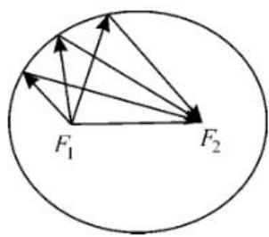  
图1

2. 如图 2 所示, 椭圆在点 P 处的切线为 l, 直线 $PQ \perp l$ 交直线 $F_{1}F_{2}$ 于点 Q, 则 PQ 平分 $\angle F_{1}PF_{2}$ , 由角平分线的性质定理得 $\frac{|PF_{1}|}{|PF_{2}|} = \frac{|QF_{1}|}{|QF_{2}|}$ 。

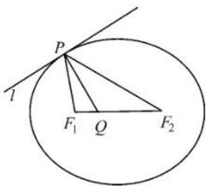

text_image

P
l
F₁ Q F₂

图2

3. 如图 3 所示, 过点 P

且垂直于切线 l 的直线 PM 交 x 轴于点 M，则 PM 平分 $\angle F_{1}PF_{2}$ 。

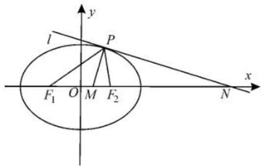

text_image

l
P
F₁ O M F₂
x
y
N

图3

例 1 椭圆
有这样的光学性
质:从椭圆的一个

焦点出发的光线,经椭圆反射后,反射光线经过椭圆的另一个焦点。根据椭圆的光学性质解决问题:现有一个水平放置的椭圆形台球盘,满足方程 $\frac{x^{2}}{8}+\frac{y^{2}}{6}=1$ ,点A,B是它的两个焦点。当静止的小球从点A出发,沿 $60^{\circ}$ 角直线运动,经椭圆内壁反射后再回到点A时,小球经过的路程为\_\_\_\_。

解:如图 4 所示,由题意可知,小球经过点 B 后,会到达点 N,然后回到点 A。

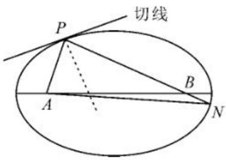

text_image

切线
P
A
B
N

图4

根据椭圆的定义得 $|PA| + |PB| = |NA| +$ $|NB|=2a$ 。

又椭圆的方程为 $\frac{x^2}{8} +\frac{y^2}{6} = 1$ ，故 $a = 2\sqrt{2}$ 。

小球经过的路程为 $|PA| + |PB| + |NA| + |NB| = 4a = 8\sqrt{2}$ 。

例 2 班级物理社团在做光学实验时, 发现了一个有趣的现象: 从椭圆的一个焦点发出的光线, 经椭圆形的反射面反射后将汇聚到另一个焦点。根据椭圆的光学性

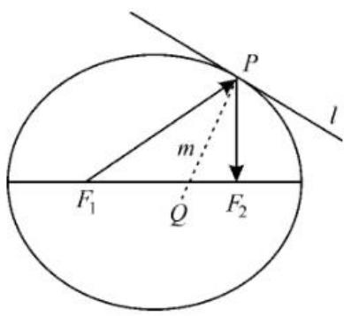

text_image

P
l
m
F₁ Q F₂

图5

质解决问题:如图5所示,已知椭圆C的方程为 $\frac{x^{2}}{16}+\frac{y^{2}}{12}=1$ ,其左、右焦点分别是 $F_{1}$ 、 $F_{2}$ ,直线l与椭圆C切于点P,且 $|PF_{1}|=5$ ,过点P且与直线l垂直的直线m与椭圆长轴交于点Q,则 $\frac{|F_{1}Q|}{|F_{2}Q|}=(\quad)$ 。

A. $\frac{\sqrt{5}}{2}$

B. $\frac{\sqrt{15}}{3}$

C. $\frac{5}{4}$

D. $\frac{5}{3}$

解:椭圆 $\frac{x^{2}}{16}+\frac{y^{2}}{12}=1$ 对应的a=4,2a=8,所以 $\left|PF_{2}\right|=2a-\left|PF_{1}\right|=8-5=3$ 。

依据光学性质可知 $PQ$ 是 $\angle F_{1}PF_{2}$ 的角平分线，根据角平分线定理得 $\frac{|F_1Q|}{|F_2Q|} = \frac{|PF_1|}{|PF_2|} = \frac{5}{3}$ 。故选D。

# 二、双曲线的光学性质

1. 如图 6 所示, 从双曲线一个焦点发出的光线, 经双曲线反射后, 反射光线的反向延长线交于另一个焦点。  
2. 如图 7 所示, 双曲线在点 P 处的切线 l 与直线

$F_{1}F_{2}$ 相交于点 Q，则 PQ 平分 $\angle F_{1}PF_{2}$ ，由角平分线的性质定理得 $\frac{|PF_{1}|}{|PF_{2}|} = \frac{|QF_{1}|}{|QF_{2}|}$ 。

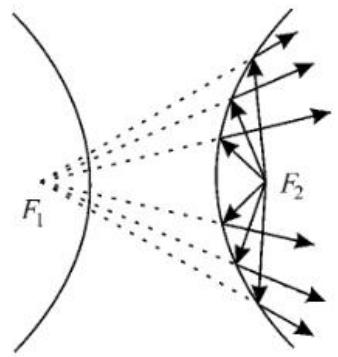

text_image

F₁
F₂

图6

例 3 双曲线的光学性质:从双曲线一个焦点发出的光,经过双曲线反射后,反射光线的反向延长线都汇聚到双曲线的另一个焦点上。如图 8 所示,已知双曲线 $E:\frac{x^{2}}{a^{2}}-\frac{y^{2}}{b^{2}}=1(a>0,b>0)$ 的左、右焦点分别为 $F_{1}$ 、 $F_{2}$ ,从 $F_{2}$ 沿倾斜角为 $120^{\circ}$

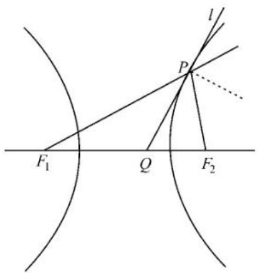

text_image

F₁
Q
P
l
F₂

图7

出发的光线,经双曲线右支反射,若反射光线的倾斜角为 $30^{\circ}$ , 则该双曲线的离心率为 \_\_\_\_。

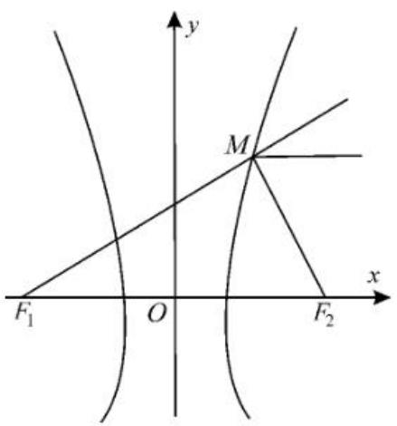

text_image

y
M
x
F₁ O F₂

图8

解:设反射点为 M, 则 $\angle MF_{1}F_{2}=30^{\circ}$ , $\angle MF_{2}F_{1}=60^{\circ}$ , 所以 $\angle F_{1}MF_{2}=90^{\circ}$ 。

设 $\left|MF_{2}\right|=m$ ，因为 $\left|F_{1}F_{2}\right|=2c$ ，所以 $m=2c\sin30^{\circ}=c$ ，故 $\left|MF_{1}\right|=2a+c$ 。

又 $\tan \angle F_{1}F_{2}M = \frac{|MF_{1}|}{|MF_{2}|} = \frac{2a + c}{c} =$ $\sqrt{3}$ ，故 $2a + c = \sqrt{3} c$ ，即 $2a = (\sqrt{3} -1)c$ 。

所以 $e=\frac{c}{a}=\frac{2}{\sqrt{3}-1}=\sqrt{3}+1$ 。

例 4 费马定理是几何光学中的一条重要原理, 在数学中可以推导出圆锥曲线的一些光学性质。例如, 点 P 为双曲线 ( $F_{1}, F_{2}$ 为焦点) 上一点, 点 P 处的切线平分 $\angle F_{1}PF_{2}$ 。已知双曲线 $C: \frac{x^{2}}{4}-\frac{y^{2}}{2}=1, O$ 为

坐标原点，l 是点 $P\left(3, \frac{\sqrt{10}}{2}\right)$ 处的切线，过左焦点 $F_{1}$ 作 l 的垂线，垂足为 M，则 $|OM| =$ \_\_\_\_ 。

解: 如图 9 所示, 延长 $PF_{2}$ 交 $F_{1}M$ 的延长线于点 $N$ 。

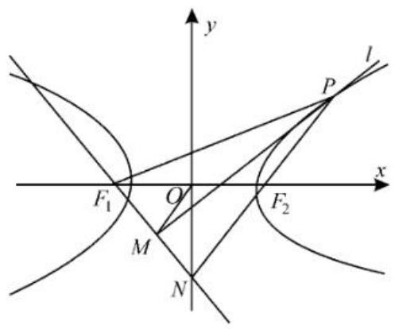

text_image

y
l
P
x
F₁ O F₂
M
N

图9

因为点 $M$ 是 $\angle F_{1}PF_{2}$ 的角平分线上的一点，且 $F_{1}M \perp MP$ ，所以点 $M$ 为$F_{1}N$ 的中点， $\vert PN\vert = \vert PF_1\vert$ 。

又点 $O$ 为 $F_{1}F_{2}$ 的中点，且 $\mid PF_1\mid -\mid PF_2\mid = 2a = 4$ ，所以 $\mid OM\mid = \frac{1}{2}\mid F_2N\mid =$ $\frac{1}{2} (|PN| - |PF_2|) = \frac{1}{2} (|PN| - |PF_1| + 4) = 2.$

# 三、抛物线的光学性质

1. 从抛物线的焦点 F 发出的光线, 经抛物线反射后, 得到的是一系列与抛物线对称轴平行(或重合)的光线。

2. 如图 10 所示, 设抛物线在点 P 处的切线 l 交对称轴于点 Q, $PM \perp$ 切线 l 交对称轴于点 M, 则焦点 F 是 QM 的中点。

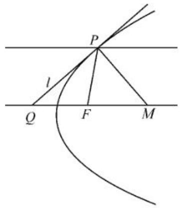

text_image

P
l
Q
F
M

图10

例 5 已知抛物线的光学性质:从抛物线的焦点发出的光,经抛物线反射后光线都与抛物线的对称轴平行(或重合)。已知抛物线 $y^{2}=2x$ ，若从点 Q(3,2) 发出平行于 x 轴的光，射向抛物线的点 A，经点 A 反射后交抛物线于点 B，则 $|AB|=$ \_\_\_\_。

解:由条件可知 AQ 与 x 轴平行,令 $y_{A}=2$ , 可得 $x_{A}=2$ , 故点 A 的坐标为 $(2,2)$ 。

易知 $l_{AB}$ 经过抛物线的焦点 $F\left(\frac{1}{2},0\right)$ ，所以 $l_{AB}$ 的方程为 $y-0=\frac{2-0}{2-\frac{1}{2}}\left(x-\frac{1}{2}\right)$ ，整理得 4x-3y-2=0。

联立 $\left\{\begin{aligned}y^{2}&=2x,\\ 4x&-3y-2=0,\end{aligned}\right.$ 得 $y^{2}-\frac{3}{2}y-1=$

$$
0, \Delta = \left(- \frac {3}{2}\right) ^ {2} - 4 \times 1 \times (- 1) = \frac {2 5}{4} > 0.
$$

所以 $y_{A} + y_{B} = \frac{3}{2}$ 。

又 $y_{A} = 2$ ，故 $y_{B} = -\frac{1}{2}, x_{B} = \frac{1}{2} \times (-\frac{1}{2})^{2} = \frac{1}{8}$ 。

故 $|AB|=\sqrt{\left(2-\frac{1}{8}\right)^{2}+\left(2+\frac{1}{2}\right)^{2}}=\frac{25}{8}$ 。

例 6 抛物线的光学性质:经焦点的光线,由抛物线反射后平行于抛物线的对称轴(即光线在曲线上某一点处反射等价于在这点处切线的反射)。如图11,过抛物线 $x^{2}=9y$ 上点P处的切线交准线l于点M,PN⊥l,垂足为N,抛物线的焦点为F,射线PF交l于点Q,若 $|MP|=|MQ|$ ,则 $\angle MPN=$ \_\_\_\_, $|MN|=$ \_\_\_\_。

解:由抛物线的光学性质知 PM 平分 $\angle QPN$ 。又 $\angle MPF = \angle MQF$ ，所以 $\angle MQF + \angle NPF = 3\angle MPN = 90^{\circ}$ ，则 $\angle MPN = 30^{\circ}$ 。

由 $|PF| = |PN| \Rightarrow \triangle PMN \cong \triangle PMF$ ，则 $\angle MFP = \angle MNP = \frac{\pi}{2}$ 。

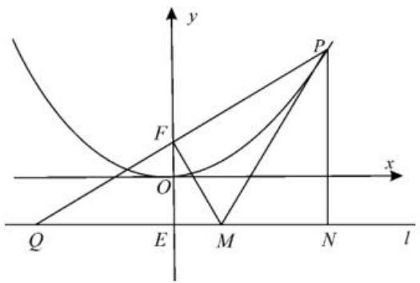

text_image

y
P
F
O
x
Q
E
M
N
l

图11

由 $|MP| =$ $|MQ|$ ，得 $|QF| = |PF|$ 。

设准线交 $y$ 轴于点 $E$ , 则 $\triangle FQE \sim \triangle PQN$ , 故 $\frac{|FE|}{|PN|} = \frac{|QF|}{|QP|} = \frac{1}{2}$ 。

又 $|EF|=\frac{9}{2}$ ，所以 $|PN|=9$ 。

所以 $|MN| = |PN| \cdot \tan 30^\circ = 3\sqrt{3}$ 。

(责任编辑 徐利杰)

(上接第34页)

错解:(1)由题意可知 $\left\{\begin{aligned}\frac{c}{a}&=\frac{\sqrt{3}}{2},\\ 2b&=2,\\ a^{2}&=b^{2}+c^{2},\end{aligned}\right.$ 解得

$\left\{\begin{aligned}a=2,\\ b=1\end{aligned}\right.$ 故椭圆 C 的方程为 $\frac{x^{2}}{4}+y^{2}=1$ 。

(2) 取 $P\left(1, \frac{\sqrt{3}}{2}\right), Q\left(\sqrt{2}, \frac{\sqrt{2}}{2}\right)$ ，则 $k_{OP} = \frac{\sqrt{3}}{2}, k_{OQ} = \frac{1}{2}$ 。可得 $k^2 = k_{OP} \cdot k_{OQ} = \frac{\sqrt{3}}{4}$ ，所以 $k = \frac{\sqrt[4]{3}}{2}$ ，故所求直线的斜率为定值 $\frac{\sqrt[4]{3}}{2}$ 。

错解剖析: 直线恒过定点是指无论直线如何变动, 必有一个定点的坐标适合这条直线。解决定点与定值问题时, 不能仅靠研究特殊情况来说明, 必须用一般情况来证明。

正解:(1)该问的解答正确。

(2)由题意可知直线 l 的斜率存在且不为 0，设直线 l 的方程为 $y=kx+m(m\neq0)$ 。

联立 $\left\{\begin{aligned}y&=kx+m,\\ \frac{x^{2}}{4}&+y^{2}=1,\end{aligned}\right.$ 消去 y 整理得：

$$
(1 + 4 k ^ {2}) x ^ {2} + 8 k m x + 4 (m ^ {2} - 1) = 0.
$$

因为直线 l 与椭圆 C 交于 P、Q 两点, 所以:

$$
\begin{array}{r} {\Delta = 6 4 k ^ {2} m ^ {2} - 1 6 (1 + 4 k ^ {2}) (m ^ {2} - 1) =} \\ {1 6 (4 k ^ {2} - m ^ {2} + 1) > 0 _ {\circ}} \end{array}
$$

设点 $P(x_{1},y_{1}),Q(x_{2},y_{2})$ ，则 $x_{1} + x_{2} = \frac{-8km}{1 + 4k^{2}},x_{1}x_{2} = \frac{4(m^{2} - 1)}{1 + 4k^{2}}$

因此 $y_{1}y_{2} = (kx_{1} + m)(kx_{2} + m) = k^{2}x_{1}x_{2} + km(x_{1} + x_{2}) + m^{2}$ 。

因为 $k^{2}=k_{OP}\cdot k_{OQ}$ ，所以 $k^{2}=\frac{y_{1}}{x_{1}}\cdot\frac{y_{2}}{x_{2}}=$ $\frac{k^{2}x_{1}x_{2}+km(x_{1}+x_{2})+m^{2}}{x_{1}x_{2}}$ 。

整理得 $km(x_{1}+x_{2})+m^{2}=0$ ，所以 $\frac{-8k^{2}m^{2}}{1+4k^{2}}+m^{2}=0$ 。

又因为 $m \neq 0$ ，所以 $k^{2} = \frac{1}{4}$ 。

因为点 P, Q 都在第一象限, 所以 k < 0,
即 $k = -\frac{1}{2}$ ，故直线 l 的斜率为定值 $-\frac{1}{2}$ 。

(责任编辑 徐利杰)