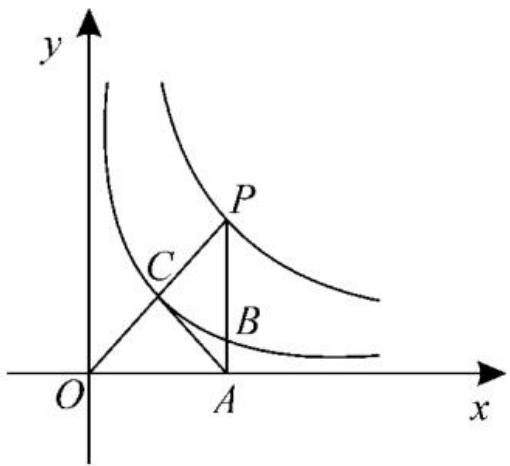

# 圆锥曲线的方程单元创新卷

# ■安徽省霍邱县第一中学 余其权(特级教师)

# 一、单选题(本题共8小题,每小题5分,共40分。在每小题给出的四个选项中,只有一项是符合题目要求的)

1. 椭圆 $C: \frac{x^2}{16} + \frac{y^2}{25} = 1$ 的两个焦点为 $F_1, F_2$ , 椭圆 $C$ 上有一点 $P$ , 则 $\triangle PF_1F_2$ 的周长为（ ）。

A. 8

B. 10

C. 14

D. 16

2. 已知 m 为实数, 椭圆 $\frac{x^{2}}{m+1} + \frac{y^{2}}{m-2} = 1$ 的离心率为 $\frac{\sqrt{3}}{2}$ ，则 $m=(\quad)$ 。

A. 6

B. 5

C. 4

D. 3

3. 设抛物线 $E: y^{2} = 2px (p > 0)$ 的焦点为 $F$ , 准线为 $l$ , 直线 $x - y - 1 = 0$ 经过焦点 $F$ , 且与抛物线 $E$ 相交于 $A, B$ 两点, 分别过 $A, B$ 作 $l$ 的垂线, 垂足分别为 $P, Q$ , 设 $PQ$ 的中点为 $R$ , 则 $|RF| = (\quad)$ 。

A. 2

B. 3

C. $2\sqrt{2}$

D. $2 \sqrt{3}$

4. 若双曲线 $C: x^{2} - \frac{y^{2}}{m^{2}} = 1 (m > 0)$ 的一条渐近线平行于直线 $y = -4x - 2$ ，则双曲线 $C$ 的虚轴长为（ ）。

A. 1

B. 2

C. 4

D. 8

5. 已知 $F_{1}, F_{2}$ 是双曲线 $C: \frac{x^{2}}{a^{2}} - \frac{y^{2}}{b^{2}} = 1 (a > 0, b > 0)$ 的两个焦点，过点 $F_{1}$ 与 $x$ 轴垂直的直线与双曲线 $C$ 交于 $A, B$ 两点，若 $\triangle ABF_{2}$ 是等边三角形，则双曲线 $C$ 的离心率为（ ）。

A. $\frac{\sqrt{2} + 1}{2}$

B. $\sqrt{2} + 1$

C. $\sqrt{2}$

D. $\sqrt{3}$

6. 已知点 $P$ 是抛物线 $C: y^2 = 12x$ 上的一点, 设点 $P$ 到直线 $x = -3$ 和 $x - y + 4 = 0$ 的距离分别为 $d_1, d_2$ , 则 $d_1 + d_2$ 的最小值为

( )。

A. $\frac{7\sqrt{2}}{2}$

B. $\frac{7}{2}$

C. $3 + 2\sqrt{2}$

D. $4\sqrt{2}$

7. 如图 1, 已知双曲线 $y_1 = \frac{1}{x} (x > 0), y_2 = \frac{4}{x} (x > 0)$ ，点 $P$ 为双曲线 $y_2 = \frac{4}{x}$ 上的一点，且 $PA \perp x$ 轴，垂足为点 $A, PA, PO$ 分别交双曲线 $y_1 = \frac{1}{x}$ 于 $B, C$ 两点，则 $\triangle PAC$ 的面积为（）。

text_image

y
P
C
B
O
A
x

图1

A. 1

B. 1.5

C. 2

D. 3

8. 已知曲线 $C: (x^{2} + y^{2})^{2} = 9(x^{2} - y^{2})$ 是双纽线, 则下列结论正确的是( )。

A. 曲线 C 的图像不关于原点对称  
B. 曲线 C 经过 4 个整点 (横、纵坐标均为整数的点)  
C. 若直线 y = kx 与曲线 C 只有一个交点，则实数 k 的取值范围为 $(-∞, -1]$   
D. 曲线 $C$ 上任意一点到坐标原点 $O$ 的距离都不超过 3

# 二、多选题(本题共3小题,每小题6分,共18分。在每小题给出的四个选项中,有多项符合题目要求。全部选对的得6分,部分选对的得部分分,有选错的得0分)

9. 已知双曲线 $C: \frac{x^2}{6} + \frac{y^2}{m} = 1$ ，则（ ）。

A. $m <   0$

B. 双曲线 C 的实轴长为 $2\sqrt{6}$

C. 双曲线 C 的渐近线方程为 $y = \pm \sqrt{-6m} x$

D. 当双曲线 C 的离心率等于其虚轴长时, $m = -\frac{6}{23}$

10. 设抛物线 $C: y^{2} = 2px (p > 0)$ 的焦点为 $F$ , 直线 $x = ky + \frac{p}{2}$ 与抛物线 $C$ 交于点 $M, N$ (M 在 $x$ 轴上方), $O$ 为坐标原点, $|OF| = \frac{3}{2}, |NF| = 2$ , 则（ ）。

A. p = 3

B. $k = \sqrt{3}$

C. $\triangle MOF$ 与 $\triangle NOF$ 的面积之比为 3

D. $\triangle MNO$ 的面积为 $3 \sqrt{3}$

11. 已知椭圆 $C: \frac{x^2}{a^2} + \frac{y^2}{b^2} = 1 (a > b > 0)$ , 我们把圆 $x^2 + y^2 = a^2 + b^2$ 称为椭圆 $C$ 的蒙日圆, $O$ 为坐标原点, 点 $P$ 在椭圆 $C$ 上, 延长 $OP$ 与椭圆 $C$ 的蒙日圆交于点 $Q$ , 则（ ）。

A. $|PQ|$ 的最大值为 $\sqrt{a^2 + b^2} - b$

B. 若 P 为 OQ 的中点, 则椭圆 C 的离心率的最小值为 $\frac{\sqrt{6}}{3}$

C. 过点 Q 不可能作两条互相垂直的直线都与椭圆 C 相切

D. 若点(2,1)在椭圆 C 上, 则椭圆 C 的蒙日圆的面积最小为 $9\pi$

# 三、填空题(本题共3小题,每小题5分,共15分)

12. 点 A, B 的坐标分别为 $(-2, 0)$ , $(2, 0)$ ，直线 AM, BM 相交于点 M，且它们的斜率之积是 $\frac{3}{4}$ ，则动点 M 的轨迹方程为 \_\_\_\_。

13. 双曲线 $\frac{x^{2}}{a^{2}} - \frac{y^{2}}{b^{2}} = 1 (a > 0, b > 0)$ 的左、右焦点分别为 $F_{1}, F_{2}$ ，以右焦点 $F_{2}$ 为焦点的抛物线 $y^{2} = 2px (p > 0)$ 与双曲线交于第一象限的点 P，若 $\left|PF_{1}\right| + \left|PF_{2}\right| = 3\left|F_{1}F_{2}\right|$ ，则双曲线的离心率 e = \_\_\_\_。

14. 已知椭圆 $C: \frac{x^2}{a^2} + \frac{y^2}{24} = 1 (a > 0)$ 的左、右焦点分别为 $F_1, F_2, M$ 是椭圆 $C$ 上位于第一象限的点，且 $\sin \angle F_1MF_2 = \frac{7}{a}$ ，过原点 $O$ 作平行于 $MF_2$ 的直线 $l, l$ 与 $MF_1$ 和 $\angle F_1MF_2$ 的角平分线分别交于 $A, B$ 两点，且 $|AB| = \frac{2}{3}|MF_2|$ ，则实数 $a$ 的值为 \_\_\_\_。

# 四、解答题（本题共5小题，共77分。解答应写出文字说明、证明过程或演算步骤）

15.(本小题13分)已知双曲线 $C:\frac{x^{2}}{a^{2}}-\frac{y^{2}}{b^{2}}=1(a>0,b>0)$ 的左、右焦点分别为 $F_{1}$ 、 $F_{2}$ 。

(1) 若双曲线 C 与椭圆 $\frac{x^{2}}{4} + y^{2} = 1$ 有共同的焦点, 且双曲线 C 过点 Q(2,1), 求该双曲线的标准方程;

(2) 若 $b = 1$ , 点 $P$ 在双曲线右支上, 且 $\angle F_{1}PF_{2} = \frac{\pi}{3}$ , 求 $\triangle F_{1}PF_{2}$ 的面积。

16.(本小题15分)已知椭圆 $C:\frac{x^{2}}{a^{2}}+\frac{y^{2}}{b^{2}}=1(a>b>0)$ 和抛物线 $E:y^{2}=2px(p>0)$ 。从两条曲线上各取两个点，将其坐标混合记录如下： $P_{1}(-2,\sqrt{2}),P_{2}(1,-1),P_{3}(\sqrt{6},-1),P_{4}(9,3)$ 。

(1)求椭圆 C 和抛物线 E 的方程。

(2) 设 m 为实数, 已知点 $T(-3,0)$ , 直线 $x=my+3$ 与抛物线 E 交于 A, B 两点,记直线 TA, TB 的斜率分别为 $k_{1}, k_{2}$ ，判断 $\frac{1}{k_{1}k_{2}} + m^{2}$ 是否为定值。若是，求出该定值；若不是，请说明理由。

$P\left(1,\frac{3}{2}\right)$ ，若直线 l 经过点 $F_{2}$ 且交椭圆 C 于 A, B 两点，交直线 x=4 于点 M，直线 PA, PB, PM 的斜率分别为 $k_{1}, k_{2}, k_{3}$ 。

(1)求椭圆 C 的标准方程;  
(2) 若直线 PA, PB 关于直线 $PF_{2}$ 对称, 求 $k_{3}$ ;  
(3) 探究 $k_{1}, k_{2}, k_{3}$ 的数量关系。

17.(本小题15分)已知双曲线 $E:\frac{x^{2}}{a^{2}}-\frac{y^{2}}{b^{2}}=1(a>0,b>0)$ 的左、右焦点分别为 $F_{1}$ 、 $F_{2}$ ，其上一点 A(3,2) 满足 $\left|F_{1}A\right|-\left|F_{2}A\right|=2$ 。

(1)求双曲线 E 的方程。  
(2)记双曲线 E 的右顶点为 B, 射线 BA 上两点 P, Q 满足 $\left|BP\right| + \left|BQ\right| = 4\sqrt{2}$ 。  
(i) 若点 $P$ 的横坐标为 $m$ , 求点 $Q$ 的坐标 (用 $m$ 表示);  
（ii）已知 $M(-2,0), N(7,0)$ ，若 $\triangle F_{1}PF_{2}$ 的面积为 $\frac{\sqrt{6}}{2}$ ，求 $\frac{\sin\angle MQB}{\sin\angle NQB}$ 。

19.(本小题17分)对于抛物线 $y^{2}=2px$ (p>0)，给定一点 $M(x_{0},0)$ ，若抛物线上存在两点 A, B，使得 $|MA|=|MB|$ ，且 AB 不与 x 轴垂直，则称弦 AB 是抛物线的一条 “ $x_{0}$ -伴随弦”。已知抛物线 $C: y^{2}=4x$ 存在 “ $x_{0}$ -伴随弦”。

(1) 求 $x_{0}$ 的取值范围。  
(2) 求“ $x_{0}$ -伴随弦”的中点 S 的轨迹方程。(用 $x_{0}$ 表示)  
(3)“ $x_{0}$ -伴随弦”的弦长是否有最大值?若有,求出最大值(用 $x_{0}$ 表示);若没有,请说明理由。

18.(本小题17分)若椭圆C的两个焦点分别为 $F_{1}(-1,0)$ , $F_{2}(1,0)$ ，且椭圆C过点

(责任编辑 赵倩)