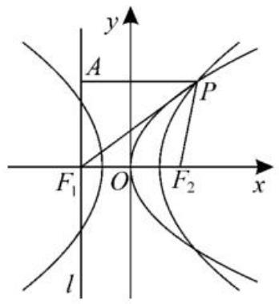

text_image

圆锥曲线的方程单元创新卷参考答案

# 一、单选题

1. D 
2. D 
3. C 
4. D 
5. D

6. A 提示: 抛物线 C: $y^{2}=12x$ 的焦点 F(3,0), 准线方程为 x=-3。

因为点 $P$ 在抛物线 $C:y^{2} = 12x$ 上，所以 $d_{1} = |PF|$ ，则 $d_{1} + d_{2} = |PF| + d_{2}$ 。

联立 $\left\{\begin{aligned}y^{2}&=12x,\\ x-y+4&=0,\end{aligned}\right.$ 消去 y 得 $x^{2}-4x+16=0$ ，则 $\Delta=(-4)^{2}-4\times16=-48<0$ ，所以直线 $x-y+4=0$ 与抛物线 C: $y^{2}=12x$ 无公共点。

故 $|PF|+d_{2}$ 的最小值为点 $F(3,0)$ 到直线 $x-y+4=0$ 的距离，即 $|PF|+d_{2}\geqslant\frac{|3-0+4|}{\sqrt{2}}=\frac{7\sqrt{2}}{2}$ 。

所以 $d_{1} + d_{2}$ 的最小值为 $\frac{7\sqrt{2}}{2}$ 。

7. A 提示: 设点 P 的坐标为 $\left(a, \frac{4}{a}\right) (a > 0)$ ，因为 $PA \perp x$ 轴，所以点 A 的坐标为 $(a, 0)$ 。

将 $x = a$ 代入 $y_{1} = \frac{1}{x}$ ，可得 $y_{1} = \frac{1}{a}$ ，所以点 $B$ 的坐标为 $\left(a, \frac{1}{a}\right)$ 。

设直线 $PO$ 的方程为 $y = kx (k \neq 0)$ , 将 $P\left(a, \frac{4}{a}\right)$ 代入 $y = kx$ , 可得 $\frac{4}{a} = ka$ , 解得 $k = \frac{4}{a^2}$ , 所以直线 $PO$ 的方程为 $y = \frac{4}{a^2} x$ 。

联立 $\left\{\begin{aligned}y&=\frac{4}{a^{2}}x,\\ y&=\frac{1}{x},\end{aligned}\right.$ 消去 y 得 $\frac{4}{a^{2}}x=\frac{1}{x}$ ，即 $x^{2}=\frac{a^{2}}{4}$ 。因为 x>0，所以 $x=\frac{a}{2}$ 。

将 $x = \frac{a}{2}$ 代入 $y_{1} = \frac{1}{x}$ ，可得 $y_{1} = \frac{2}{a}$ ，所以点 $C$ 的坐标为 $\left(\frac{a}{2}, \frac{2}{a}\right)$ 。

根据三角形面积公式可得 $S_{\triangle PAC} = \frac{1}{2}\times$ $|PA|\times \left(a - \frac{a}{2}\right) = \frac{1}{2}\times \frac{4}{a}\times \frac{a}{2} = 1.$

8. D 提示: 将 $(-x, -y)$ 代入曲线 C: $(x^{2} + y^{2})^{2} = 9(x^{2} - y^{2})$ ，方程不变，即曲线 C 的图像关于原点对称，选项 A 错误。

令 $y = 0$ ，则 $(x^{2})^{2} = 9x^{2}$ ，解得 $x = \pm 3$ 或 $x = 0$ 。令 $x = \pm 1$ ，则 $(1 + y^{2})^{2} = 9(1 - y^{2})$ 解得 $y^{2} = \frac{-11 + \sqrt{153}}{2} < 1$ 。令 $x = \pm 2$ ，则 $(4 + y^{2})^{2} = 9(4 - y^{2})$ ，解得 $y^{2} =$ $\frac{-17 + \sqrt{369}}{2} < 2$ 。故曲线C经过的整点只能是(0,0)，(3,0)，(-3,0)，选项B错误。

直线 $y = kx$ 与曲线 $C: (x^2 + y^2)^2 = 9(x^2 - y^2)$ 必有公共点 $(0,0)$ 。若直线 $y = kx$ 与曲线 $C$ 只有一个交点，则方程组 $\left\{ \begin{array}{l} (x^2 + y^2)^2 = 9(x^2 - y^2), \\ y = kx \end{array} \right.$ 只有一个解 $(0,0)$ ，即 $x^4(1 + k^2)^2 = 9x^2(1 - k^2)$ 只有一个解为 $x = 0$ 。故当 $x \neq 0$ 时， $x^4(1 + k^2)^2 = 9x^2(1 -$ $k^{2}$ ) 无解, 则 $1 - k^{2} \leqslant 0$ , 即实数 k 的取值范围为 $(-∞, -1] ∪ [1, +∞)$ , 选项 C 错误。

由 $(x^{2} + y^{2})^{2} = 9(x^{2} - y^{2})$ 可得 $x^{2} + y^{2} = \frac{9(x^{2} - y^{2})}{x^{2} + y^{2}}\leqslant 9$ ，当且仅当 $y = 0$ 时取等号。则曲线 $C$ 上任意一点 $(x,y)$ 到坐标原点 $O$ 的距离 $d = \sqrt{x^2 + y^2}\leqslant 3$ ，选项D正确。

# 二、多选题

9. ABD

10. ACD 提示: 抛物线 $C: y^{2} = 2px (p > 0)$ 的焦点为 F, $|OF| = \frac{3}{2}$ , 即 $\frac{p}{2} = \frac{3}{2}$ , 解得 p = 3, 选项 A 正确。

抛物线 $C: y^{2} = 6x$ ，由 $|NF| = 2$ ，可得 $x_{N} = 2 - \frac{p}{2} = \frac{1}{2}$ ，则 $y_{N} = -\sqrt{3}$ 。又点 $N$ 在直线 $x = ky + \frac{p}{2}$ 上，故 $\frac{1}{2} = -\sqrt{3}k + \frac{3}{2}$ ，解得 $k = \frac{\sqrt{3}}{3}$ ，选项 B 错误。

直线 $MN$ 的方程为 $x = \frac{\sqrt{3}}{3} y + \frac{3}{2}$ ，代入 $y^{2} = 6x$ 得 $y^{2} = 6\left(\frac{\sqrt{3}}{3} y + \frac{3}{2}\right) = 2\sqrt{3} y + 9$ ，即 $y^{2} - 2\sqrt{3} y - 9 = 0$ ，则 $y_{M} + y_{N} = 2\sqrt{3}$ ，得 $y_{M} = 3\sqrt{3}$ 。故 $\frac{S_{\triangle MOF}}{S_{\triangle NOF}} = \frac{\frac{1}{2}|OF| \cdot |y_M|}{\frac{1}{2}|OF| \cdot |y_N|} = \frac{3\sqrt{3}}{\sqrt{3}} = 3$ ，选项C正确。

$S_{\triangle MNO} = S_{\triangle MOF} + S_{\triangle NOF} = \frac{1}{2} |OF|(y_M - y_N) = \frac{1}{2}\times \frac{3}{2}\times 4\sqrt{3} = 3\sqrt{3}$ ，选项D正确。

11. ABD 提示: 圆 $x^{2} + y^{2} = a^{2} + b^{2}$ 的圆心为 $O(0,0)$ ，半径 $r = \sqrt{a^{2} + b^{2}}$ 。因为点 P 在椭圆 $C: \frac{x^{2}}{a^{2}} + \frac{y^{2}}{b^{2}} = 1 (a > b > 0)$ 上，所以 $|OP| \geqslant b$ 。故 $|PQ| = |OQ| - |OP| \leqslant r - b = \sqrt{a^{2} + b^{2}} - b$ ，选项 A 正确。

若 $P$ 为 $OQ$ 的中点，则 $\vert OP\vert = \frac{\sqrt{a^2 + b^2}}{2}$ $\geqslant b$ ，即 $a^2\geqslant 3b^2$ ，故 $e = \sqrt{1 - \frac{b^2}{a^2}}\geqslant \sqrt{1 - \frac{1}{3}} =$

$\frac{\sqrt{6}}{3}$ ，选项 B 正确。

因为点 Q 在圆上, 所以取 $Q(a, b)$ , 则直线 x = a, y = b 互相垂直, 且都与椭圆 C 相切, 选项 C 错误。

因为点(2,1)在椭圆 C 上，所以 $\frac{4}{a^{2}} + \frac{1}{b^{2}} = 1$ 。则 $r^{2} = a^{2} + b^{2} = (a^{2} + b^{2})\left(\frac{4}{a^{2}} + \frac{1}{b^{2}}\right) = 5 + \frac{4b^{2}}{a^{2}} + \frac{a^{2}}{b^{2}} \geqslant 5 + 2\sqrt{\frac{4b^{2}}{a^{2}} \cdot \frac{a^{2}}{b^{2}}} = 9$ ，当且仅当 $\frac{4b^{2}}{a^{2}} = \frac{a^{2}}{b^{2}}$ ，即 $a = \sqrt{6}, b = \sqrt{3}$ 时取等号。所以椭圆 C 的蒙日圆的面积最小为 $9\pi$ ，选项 D 正确。

# 三、填空题

12. $\frac{x^2}{4} - \frac{y^2}{3} = 1, x \neq \pm 2$ 提示: 设 $M(x, y)$ , 则直线 $AM, BM$ 的斜率分别为 $\frac{y}{x + 2}, \frac{y}{x - 2} (x \neq \pm 2)$ 。

因为它们的斜率之积是 $\frac{3}{4}$ , 所以 $\frac{y}{x + 2} \cdot \frac{y}{x - 2} = \frac{3}{4} (x \neq \pm 2)$ , 化简得 $\frac{x^2}{4} - \frac{y^2}{3} = 1$ 。

故动点 M 的轨迹方程为 $\frac{x^{2}}{4}-\frac{y^{2}}{3}=1$ ， $x\neq\pm2$ 。

13.2 提示:根据题意可设 $F_{2}\left(\frac{p}{2},0\right)$ ，双曲线的半焦距为 c， $P(x_{0},y_{0})$ ，则 p=2c。

如图1, 过点 $F_{1}$ 作 $x$ 轴的垂线 $l$ , 过点 $P$ 作 $l$ 的垂线, 垂足为 $A$ 。显然直线 $AF_{1}$ 为抛物线的准线, 则 $|PA| = |PF_{2}|$ 。

text_image

y
A
P
F₁ O F₂ x
l

图1

由双曲线的定义及已知条件可知 $\left\{\begin{aligned}|PF_{1}|-|PF_{2}|&=2a,\\ |PF_{1}|+|PF_{2}|&=6c.\end{aligned}\right.$

解得 $\left\{\begin{aligned}|PF_{1}|&=3c+a,\\ |PF_{2}|&=3c-a=|PA|\end{aligned}\right.$

由勾股定理可知 $|AF_1|^2 = |PF_1|^2 - |PA|^2$ ，即 $y_0^2 = (3c + a)^2 - (3c - a)^2$ ，化简得 $y_0^2 = 12ac$ 。

因为点 $P$ 在抛物线上，所以 $y_0^2 = 4cx_0$ 故 $x_0 = 3a$ 。

又因为点 $P$ 在双曲线上，所以 $\frac{x_0^2}{a^2} -\frac{y_0^2}{b^2} =$ $\frac{9a^2}{a^2} -\frac{12ac}{c^2 - a^2} = 1$ ，整理得 $2c^{2} - 3ac - 2a^{2} = 0,$ 即 $(2c + a)(c - 2a) = 0$ ，解得 $c = 2a$ 。

故双曲线的离心率 $e=\frac{c}{a}=2$ 。

14.7 提示: 因为 $AB \parallel MF_{2}$ , 且 $\angle F_{1}MF_{2}$ 的角平分线为 $MB$ , 所以 $\angle BMA = \angle ABM$ , 则 $|AM| = |AB|$ 。

易知 AO 为 $\triangle MF_{1}F_{2}$ 的中位线，所以 $\left|MF_{1}\right|=2\left|AM\right|=2\left|AB\right|$ 。

设 $|MF_{2}| = t$ ，则 $|AB| = \frac{2}{3} |MF_{2}| = \frac{2}{3} t, |MF_{1}| = 2 |AB| = \frac{4}{3} t$ 。

由椭圆的定义可知 $|MF_2| + |MF_1| = 2a$ ，即 $t + \frac{4}{3} t = 2a$ ，解得 $t = \frac{6}{7} a$ ，所以 $|MF_2| = \frac{6}{7} a, |MF_1| = \frac{8}{7} a$ 。

$$
\begin{array}{l} = \frac {\left| M F _ {1} \right| ^ {2} + \left| M F _ {2} \right| ^ {2} - \left| F _ {1} F _ {2} \right| ^ {2}}{2 \left| M F _ {1} \right| \cdot \left| M F _ {2} \right|} = \\ \frac {\frac {6 4}{4 9} a ^ {2} + \frac {3 6}{4 9} a ^ {2} - 4 (a ^ {2} - 2 4)}{2 \times \frac {8}{7} a \times \frac {6}{7} a} = \frac {4 9}{a ^ {2}} - 1 。 \\ \end{array}
$$

在 $\triangle MF_{1}F_{2}$ 中，由余弦定理得 $\cos \angle F_{1}MF_{2}$

由 $\sin^2\angle F_1MF_2 + \cos^2\angle F_1MF_2 = 1$ 得 $\left(\frac{7}{a}\right)^2 +\left(\frac{49}{a^2} -1\right)^2 = 1$ ，解得 $a^2 = 49$ ，故 $a = 7$ 。

# 四、解答题

15.(1)椭圆 $\frac{x^{2}}{4}+y^{2}=1$ 的焦点为 $(\sqrt{3},0)$ 和 $(- \sqrt{3},0)$ 。

由题意得 $\left\{\begin{aligned}\frac{4}{a^{2}}-\frac{1}{b^{2}}=1,\\ a^{2}+b^{2}=3,\end{aligned}\right.$ 解得 $\left\{\begin{aligned}a^{2}=2,\\ b^{2}=1.\end{aligned}\right.$

故双曲线 C 的标准方程为 $\frac{x^{2}}{2}-y^{2}=1$ 。

(2) 设 $\left|PF_{1}\right|=m,\left|PF_{2}\right|=n$ ，则由双曲线的定义得 m-n=2a 。

在 $\triangle PF_{1}F_{2}$ 中，由余弦定理得 $4c^{2} = m^{2} + n^{2} - 2mn\cos \angle F_{1}PF_{2} = m^{2} + n^{2} - mn$ $= (m - n)^{2} + mn = 4a^{2} + mn$ ，则 $mn = 4c^{2} - 4a^{2} = 4b^{2} = 4$ 。

所以 $\triangle F_{1}PF_{2}$ 的面积 $S = \frac{1}{2} mn\sin \frac{\pi}{3} =$ $\frac{1}{2}\times 4\times \frac{\sqrt{3}}{2} = \sqrt{3}$ 。

16.(1)将四个点分别代入抛物线 $y^{2}=2px$ ，解得 p 的值分别为 $p_{1}=-\frac{1}{2}, p_{2}=\frac{1}{2}$ ， $p_{3}=\frac{\sqrt{6}}{12}, p_{4}=\frac{1}{2}$ 。

注意到 $P_{2}(1, - 1),P_{4}(9,3)$ 对应的 $\pmb{p}$ 一样，所以 $P_{2}(1, - 1),P_{4}(9,3)$ 在抛物线上。

故抛物线 E 的方程为 $y^{2}=x$ 。

因为 $P_{1}(-2,\sqrt{2})$ , $P_{3}(\sqrt{6},-1)$ 为椭圆上的点, 所以 $\left\{\begin{aligned}\frac{4}{a^{2}}+\frac{2}{b^{2}}=1,\\ \frac{6}{a^{2}}+\frac{1}{b^{2}}=1,\end{aligned}\right.$ 解得 $\left\{\begin{aligned}a^{2}=8,\\ b^{2}=4.\end{aligned}\right.$

所以椭圆 C 的方程为 $\frac{x^{2}}{8} + \frac{y^{2}}{4} = 1$ 。

(2) $\frac{1}{k_{1}k_{2}}+m^{2}$ 是定值。理由如下：

设 $A(x_{1},y_{1}),B(x_{2},y_{2})$ ，联立 $\left\{ \begin{array}{l}x = my + 3,\\ y^{2} = x, \end{array} \right.$ 消去 $x$ 得 $y^{2} - my - 3 = 0$ ，则 $\Delta$ $= m^2 +12 > 0$ ，由根与系数的关系得 $\left\{ \begin{array}{l}y_1 + y_2 = m,\\ y_1y_2 = -3. \end{array} \right.$

因为 $x_{1} = my_{1} + 3$ ，所以 $k_{1} = \frac{y_{1} - 0}{x_{1} + 3} =$ $\frac{y_1}{my_1 + 3 + 3} = \frac{y_1}{my_1 + 6}$

同理 $k_{2}=\frac{y_{2}}{my_{2}+6}$ 。

$$
\frac {1}{k _ {1} k _ {2}} + m ^ {2} = \frac {(m y _ {1} + 6) (m y _ {2} + 6)}{y _ {1} y _ {2}} + m ^ {2}
$$

$$
= 2 m ^ {2} + \frac {3 6}{y _ {1} y _ {2}} + \frac {6 m (y _ {1} + y _ {2})}{y _ {1} y _ {2}}
$$

$$
= 2 m ^ {2} + \frac {3 6}{- 3} + \frac {6 m \cdot m}{- 3} = - 1 2 。
$$

所以 $\frac{1}{k_{1}k_{2}}+m^{2}$ 为定值-12。

17.(1)因为 $\left|F_{1}A\right|-\left|F_{2}A\right|=2a=2$ ，所以a=1。

将 $A(3,2)$ 代入 $\frac{x^2}{a^2} -\frac{y^2}{b^2} = 1$ ，可得 $9 - \frac{4}{b^2}$ $= 1$ ，解得 $b^{2} = \frac{1}{2}$ 。

故双曲线 E 的方程为 $x^{2}-2y^{2}=1$ 。

(2)(i)因为 $B(1,0)$ , $A(3,2)$ ，所以直线 AB 的斜率 $k=\frac{2-0}{3-1}=1$ ，于是直线 AB 的方程为 y=x-1。

又点 P 的横坐标为 m，故 $P(m, m-1)$ 。设点 Q 的横坐标为 n，则 $Q(n, n-1)$ ，其中 m>1, n>1。

$$
\begin{array}{l} \mid B P \mid + \mid B Q \mid = \sqrt {(m - 1) ^ {2} + (m - 1) ^ {2}} \\ + \sqrt {(n - 1) ^ {2} + (n - 1) ^ {2}} = \sqrt {2} (| m - 1 | + | n - \\ 1 \mid) = \sqrt {2} (m + n - 2) = 4 \sqrt {2}, \text {故} n = 6 - m _ {\circ} \\ \end{array}
$$

于是点 Q 的坐标为 $(6-m,5-m)$ 。

(ii)记双曲线 $E$ 的半焦距为 $c$ ，则 $c = \sqrt{a^2 + b^2} = \frac{\sqrt{6}}{2}$ ，故 $F_{1}\left(-\frac{\sqrt{6}}{2},0\right),F_{2}\left(\frac{\sqrt{6}}{2},0\right),$ $|F_1F_2| = \sqrt{6}$ 。

故 $\triangle F_{1}PF_{2}$ 的面积为 $\frac{1}{2} (m - 1)|F_1F_2|$ $= \frac{\sqrt{6}}{2} (m - 1) = \frac{\sqrt{6}}{2}$ ，解得 $m = 2$ ，故 $Q(4,3)$ 。

$$
\begin{array}{l} \sqrt {(- 2 - 4) ^ {2} + 3 ^ {2}} = 3 \sqrt {5}, | N Q | = \\ \sqrt {(7 - 4) ^ {2} + 3 ^ {2}} = 3 \sqrt {2} 。 \\ \end{array}
$$

于是 $|MB| = 3, |NB| = 6, |MQ| =$

在 $\triangle MBQ$ 中，由正弦定理可知 $\frac{|MQ|}{\sin\angle MBQ} = \frac{|MB|}{\sin\angle MQB}$ 。

在 $\triangle NBQ$ 中，由正弦定理可知 $\frac{|NQ|}{\sin\angle NBQ} = \frac{|NB|}{\sin\angle NQB}$ 。

又 $\sin \angle MBQ = \sin \angle NBQ$ ，两式作比可得 $\frac{|NB|\sin\angleMQB}{|MB|\sin\angle NQB} = \frac{|NQ|\sin\angle MBQ}{|MQ|\sin\angle NBQ}$ $= \frac{|NQ|}{|MQ|}$

于是 $\frac{\sin\angle MQB}{\sin\angle NQB}=\frac{|NQ|\cdot|MB|}{|MQ|\cdot|NB|}=$ $\frac{3\sqrt{2}\times3}{3\sqrt{5}\times6}=\frac{\sqrt{10}}{10}$

18.(1)由题意可知 $c = 1,2a = |PF_{1}|+$ $|PF_{2}| = \sqrt{(-1 - 1)^{2} + \left(0 - \frac{3}{2}\right)^{2}} +\frac{3}{2} = \frac{5}{2}$ $+\frac{3}{2} = 4$ ，即 $a = 2$ ，所以 $b^{2} = a^{2} - c^{2} = 3$ 。

故椭圆 C 的标准方程为 $\frac{x^{2}}{4} + \frac{y^{2}}{3} = 1$ 。

(2) 直线 $PF_{2}$ 的方程为 x=1。

因为直线 PA, PB 关于直线 $PF_{2}$ 对称，所以 $k_{1} + k_{2} = 0$ 。

由题意可知直线 l 的斜率存在, 设直线 l 的方程为 $y = k(x - 1)$ 。

联立 $\left\{\begin{aligned}y&=k(x-1),\\ \frac{x^{2}}{4}&+\frac{y^{2}}{3}=1,\end{aligned}\right.$ 消去 y 得 $(3+4k^{2})\cdot x^{2}-8k^{2}x+4k^{2}-12=0$ 。

设 $A(x_{1},y_{1}),B(x_{2},y_{2})$ ，则 $x_{1}x_{2} = \frac{4k^{2} - 12}{3 + 4k^{2}},x_{1} + x_{2} = \frac{8k^{2}}{3 + 4k^{2}}$

易知 $k_{1} + k_{2} = \frac{y_{1} - \frac{3}{2}}{x_{1} - 1} +\frac{y_{2} - \frac{3}{2}}{x_{2} - 1} =$ $\frac{kx_1 - (k + \frac{3}{2})}{x_1 - 1} +\frac{kx_2 - (k + \frac{3}{2})}{x_2 - 1} = 0.$

所以 $\left[kx_{1} - \left(k + \frac{3}{2}\right)\right](x_{2} - 1) +$ $\left[kx_{2} - \left(k + \frac{3}{2}\right)\right](x_{1} - 1) = 0$ ，整理得 $2kx_{1}x_{2} - \left(2k + \frac{3}{2}\right)(x_{1} + x_{2}) + (2k + 3) = 0.$

故 $2k \cdot \frac{4k^2 - 12}{3 + 4k^2} - \left(2k + \frac{3}{2}\right)\frac{8k^2}{3 + 4k^2} + (2k + 3) = 0$ ，即 $9 - 18k = 0$ ，解得 $k = \frac{1}{2}$ 。

所以直线 l 的方程为 $y=\frac{1}{2}(x-1)$ 。

当 x=4 时， $y=\frac{3}{2}$ ，则 $M\left(4,\frac{3}{2}\right)$ 。

又因为 $P\left(1, \frac{3}{2}\right)$ , 所以 $k_{3} = 0$ 。

(3)若直线 l 的斜率 k=0 时, 则直线 l

的方程为 y=0，所以 $A(-2,0)$ ， $B(2,0)$ ，

$M(4,0)$ ，此时 $k_{1}=\frac{1}{2}$ ， $k_{2}=-\frac{3}{2}$ ， $k_{3}=-\frac{1}{2}$ 。

猜想 $k_{1} + k_{2} = 2k_{3}$ 。证明如下：

因为直线 $l: y = k(x - 1)$ ，所以 M(4，

3k)，则 $k_{3}=\frac{3k-\frac{3}{2}}{4-1}=k-\frac{1}{2}$ ，即 $2k_{3}=2k-1$ 。

由(2)知 $k_{1} + k_{2} = \frac{y_{1} - \frac{3}{2}}{x_{1} - 1} +\frac{y_{2} - \frac{3}{2}}{x_{2} - 1}$

$$
\begin{array}{l} = \frac {k x _ {1} - \left(k + \frac {3}{2}\right)}{x _ {1} - 1} + \frac {k x _ {2} - \left(k + \frac {3}{2}\right)}{x _ {2} - 1} \\ = \frac {2 k x _ {1} x _ {2} - \left(2 k + \frac {3}{2}\right) (x _ {1} + x _ {2}) + (2 k + 3)}{x _ {1} x _ {2} - (x _ {1} + x _ {2}) + 1} \\ = \frac {2 k (4 k ^ {2} - 1 2) - 8 k ^ {2} \left(2 k + \frac {3}{2}\right) + (2 k + 3) (4 k ^ {2} + 3)}{4 k ^ {2} - 1 2 - 8 k ^ {2} + 4 k ^ {2} + 3} \\ = \frac {9 - 1 8 k}{- 9} = 2 k - 1 。 \\ \end{array}
$$

所以 $k_{1}+k_{2}=2k_{3}$ 成立。

19.(1)设 $|MA|=|MB|=r(r>0)$ ，则点A,B在圆 $(x-x_{0})^{2}+y^{2}=r^{2}$ 上。

联立 $\left\{ \begin{array}{l}(x - x_0)^2 +y^2 = r^2,\\ y^2 = 4x, \end{array} \right.$ 消去 $y$ 得 $x^{2} + (4 - 2x_{0})x + x_{0}^{2} = r^{2}$

由题意知,存在 r 使得这个关于 x 的方程有两个不相等的非负根,即直线 $y=r^{2}$ 与抛物线 $y=x^{2}+(4-2x_{0})x+x_{0}^{2}$ 在 y 轴及其右侧有两个交点。

故只需抛物线 $y=x^{2}+(4-2x_{0})x+x_{0}^{2}$ 的对称轴 $x=x_{0}-2$ 在 y 轴的右侧，即 $x_{0}-2>0$ ，解得 $x_{0}>2$ 。

因此 $x_{0}$ 的取值范围是 $(2, +\infty)$ 。

（2）设 $A\left(\frac{y_1^2}{4}, y_1\right), B\left(\frac{y_2^2}{4}, y_2\right)$ ，则 $S\left(\frac{y_1^2 + y_2^2}{8}, \frac{y_1 + y_2}{2}\right)$ 。

由 $|MA|=|MB|$ ，得 $MS\perp AB$ 。

因为直线 $AB$ 的斜率为 $\frac{y_2 - y_1}{\frac{y_2^2}{4} - \frac{y_1^2}{4}} = \frac{4}{y_1 + y_2}$ ，所以直线 $MS$ 的斜率为 $-\frac{y_1 + y_2}{4}$ ，

则直线 $MS$ 的方程为 $y = -\frac{y_1 + y_2}{4} (x - x_0)$ 。

将点 S 的坐标代入上面的方程, 整理得 $\frac{y_{1}^{2} + y_{2}^{2}}{8} = x_{0} - 2$ , 故点 S 在直线 $x = x_{0} - 2$ 上。

易知抛物线 $y^{2}=4x$ 与直线 $x=x_{0}-2$ 的交点为 $(x_{0}-2,\pm2\sqrt{x_{0}-2})$ ，则点 S 的纵坐标的绝对值小于 $2\sqrt{x_{0}-2}$ 。

又 AB 不与 x 轴垂直, 故点 S 的纵坐标 $y \neq 0$ 。

因此点 S 的轨迹方程为 $x = x_{0} - 2 (0 < |y| < 2 \sqrt{x_{0} - 2})$ 。

(3) $|AB| = \sqrt{(y_2 - y_1)^2 + \left(\frac{y_2^2}{4} - \frac{y_1^2}{4}\right)^2}$

$$
\begin{array}{l} = \sqrt {(y _ {2} - y _ {1}) ^ {2} + \frac {1}{1 6} (y _ {2} - y _ {1}) ^ {2} (y _ {1} + y _ {2}) ^ {2}} \\ = \sqrt {(y _ {2} - y _ {1}) ^ {2} \left[ 1 + \frac {1}{1 6} (y _ {1} + y _ {2}) ^ {2} \right]} \\ = \sqrt {(y _ {2} ^ {2} - 2 y _ {1} y _ {2} + y _ {1} ^ {2}) \left[ 1 + \frac {1}{1 6} (y _ {1} ^ {2} + 2 y _ {1} y _ {2} + y _ {2} ^ {2}) \right]} \\ = \sqrt {[ 8 (x _ {0} - 2) - 2 y _ {1} y _ {2} ] \left(\frac {x _ {0}}{2} + \frac {y _ {1} y _ {2}}{8}\right)} \\ = \sqrt {- \frac {1}{4} (y _ {1} y _ {2}) ^ {2} - 2 y _ {1} y _ {2} + 4 x _ {0} (x _ {0} - 2)} 。 \\ \end{array}
$$

由(2)得 $8(x_0 - 2) = y_1^2 + y_2^2 > 2|y_1y_2|$ ，故 $|y_1y_2| < 4(x_0 - 2)$ ，即 $8 - 4x_0 < y_1y_2 < 4x_0 - 8$ 。

易知 $y = -\frac{1}{4} (y_1y_2)^2 - 2y_1y_2 + 4x_0(x_0 - 2)$ 为关于 $y_1y_2$ 的二次函数，当且仅当 $y_1y_2 = -4$ 时，取得最大值 $4(x_0 - 1)^2$ 。

当 $8 - 4x_{0} < -4$ ，即 $x_0 > 3$ 时，弦长 $|AB|$ 有最大值 $2x_0 - 2$ ，当且仅当 $y_{1}y_{2} = -4$ 时取等号。

当 $8 - 4x_{0}\geqslant -4$ ，即 $2 <   x_0\leqslant 3$ 时，弦长 $|AB|$ 无最大值。

综上所述，当 $x_0 \in (2,3]$ 时，弦长无最大值；当 $x_0 \in (3, +\infty)$ 时，弦长有最大值，且最大值为 $2x_0 - 2$ 。

(责任编辑 赵倩)