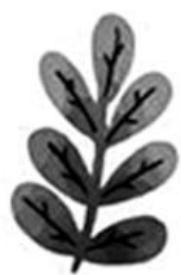

natural_image

Illustration of a cartoon tiger sitting upright, showing detailed stripes and facial features (no text or symbols)

  
■河北省南宫中学

教材是高中数学学习的重要依据,遗憾的是很多同学对教材的学习没有足够重视,比如高一、高二授新课时,同学们觉得教材上的例题和习题比较简单,往往以教辅资料代替教材;高三“回归教材”时,也只是简单地看看教材上的例题、公式、定理,这显然没有把“回归教材”落到实处。鉴于此,下面将人教A版《数学选择性必修第二册》(下称:教材)中的一些数列题目进行了拓展,试图让同学们感受教材题目的魅力,以此引起同学们对教材的重视。

教材第 14 页指出: 等差数列 $\{a_{n}\}$ 的通项公式为 $a_{n}=a_{1}+(n-1)d$ 。

拓展 1: 数列 $\{a_{n}\}$ 为等差数列的充要条件为 $a_{n}=pn+q$ 。

分析:由 $a_{n}=a_{1}+(n-1)d$ 得 $a_{n}=dn+a_{1}-d$ ，所以等差数列 $\{a_{n}\}$ 的通项公式符合 $a_{n}=pn+q$ 的形式。

反之，若数列 $\{a_{n}\}$ 的通项公式为 $a_{n} = pn + q$ ，则 $a_{n + 1} - a_n = [p(n + 1) + q] - (pn + q) = p$ ，所以数列 $\{a_{n}\}$ 是等差数列。

综上,数列 $\{a_{n}\}$ 为等差数列的充要条件为 $a_{n}=pn+q$ 。

教材第20页指出:等差数列 $\{a_{n}\}$ 的前n项和公式为 $S_{n}=na_{1}+\frac{n(n-1)}{2}d$ 。

拓展 2: 若 $S_{n}$ 是数列 $\{a_{n}\}$ 的前 n 项和，则 $S_{n}=An^{2}+Bn$ 是数列 $\{a_{n}\}$ 为等差数列的充要条件。

分析:由 $S_{n}=na_{1}+\frac{n(n-1)}{2}d$ 得 $S_{n}=\frac{d}{2}\cdot$

# 用好教材试题

# 深入拓展探究

——以教材中数列例(习)题的12个拓展为例

# 温世娴 霍忠林

$n^2 + \left(a_1 - \frac{d}{2}\right)n$ ，所以等差数列 $\{a_n\}$ 的前 $n$ 项和公式符合 $S_n = An^2 + Bn$ 的形式。

反之，若数列 $\{a_{n}\}$ 的前 $n$ 项和 $S_{n} = An^{2} + Bn$ ，则当 $n\geqslant 2$ 时， $a_{n} = S_{n} - S_{n - 1} = (An^{2} + Bn) - [A(n - 1)^{2} + B(n - 1)] = 2An + B - A$ ；当 $n = 1$ 时， $S_{1} = a_{1} = A + B$ ，满足上式。故 $a_{n} = 2An + B - A(n\in \mathbf{N}^{*})$ 。由拓展1知 $\{a_n\}$ 为等差数列。

综上，数列 $\{a_{n}\}$ 的前 $n$ 项和 $S_{n} = An^{2} + Bn$ 是数列 $\{a_{n}\}$ 为等差数列的充要条件。

教材第25页第7题:已知 $S_{n}$ 是等差数列 $\{a_{n}\}$ 的前n项和,证明： $\left\{\frac{S_{n}}{n}\right\}$ 为等差数列。

拓展 3: 若 $S_{n}$ 是数列 $\{a_{n}\}$ 的前 n 项和，则 $\{a_{n}\}$ 为等差数列是 $\left\{\frac{S_{n}}{n}\right\}$ 为等差数列的充要条件。

分析: 若 $\{a_{n}\}$ 为等差数列, 则由拓展 2 知 $S_{n}=An^{2}+Bn$ , 从而 $\frac{S_{n}}{n}=An+B$ , 由拓展 1 知 $\left\{\frac{S_{n}}{n}\right\}$ 为等差数列。

反之，若 $\left\{\frac{S_n}{n}\right\}$ 为等差数列，由拓展1知 $\frac{S_n}{n} = pn + q$ ，从而 $S_{n} = pn^{2} + qn$ ，由拓展2知 $\{a_{n}\}$ 为等差数列。

综上， $\{a_{n}\}$ 为等差数列是 $\left\{\frac{S_n}{n}\right\}$ 为等差数列的充要条件。

利用拓展 3 可以直接处理 2023 年新高考 I 卷第 7 题。

例 1 （2023 年新高考 I 卷第 7 题）记 $S_{n}$ 是等差数列 $\{a_{n}\}$ 的前 n 项和，设甲： $\{a_{n}\}$ 为等差数列；乙： $\left\{\frac{S_{n}}{n}\right\}$ 为等差数列，则甲是乙的（）。

A. 充要条件  
B. 既不充分又不必要条件  
C. 充分不必要条件  
D. 必要不充分条件

解析:由拓展 3 知,选 A。

教材第20页指出:若 $\{a_{n}\}$ 为等差数列,则其前n项和 $S_{n}=\frac{(a_{1}+a_{n})n}{2}$ 。

拓展 4: 若 $S_{n}$ 是数列 $\{a_{n}\}$ 的前 n 项和，则 $\{a_{n}\}$ 为等差数列的充要条件为 $S_{n} = \frac{(a_{1} + a_{n})n}{2}$ 。

分析: 必要性显然成立, 下面证充分性。

$$
\begin{array}{r l} & {\text {若} S _ {n} = \frac {(a _ {1} + a _ {n}) n}{2}, \text {则当} n \geqslant 2 \text {时}, a _ {n} =} \\ & {S _ {n} - S _ {n - 1} = \frac {(a _ {1} + a _ {n}) n}{2} - \frac {(a _ {1} + a _ {n - 1}) (n - 1)}{2},} \\ & {\text {即} 2 a _ {n} = n a _ {n} - (n - 1) a _ {n - 1} + a _ {1}, \text {故} (n - 2) a _ {n}} \\ & {- (n - 1) a _ {n - 1} + a _ {1} = 0. \quad ①} \end{array}
$$

所以 $(n-1)a_{n+1}-na_{n}+a_{1}=0$ 。②

②一①得 $(n - 1)a_{n + 1} - 2(n - 1)a_n + (n - 1)a_{n - 1} = 0$ 。因为 $n\geqslant 2$ ，所以 $a_{n + 1} + a_{n - 1} = 2a_{n}$ ，故 $\{a_{n}\}$ 为等差数列。

从而命题得证。

教材第 41 页第 5 题: 已知 $S_{n}$ 是等比数列 $\{a_{n}\}$ 的前 n 项和, $S_{3}, S_{9}, S_{6}$ 成等差数列, 求证: $a_{2}, a_{8}, a_{5}$ 成等差数列。

拓展 5: 已知 $S_{n}$ 是公比不为 1 的等比数列 $\{a_{n}\}$ 的前 n 项和，且 p, q, r, $t \in N^{*}$ ，则 “ $S_{p+t}, S_{q+t}, S_{r+t}$ 成等差数列” 是 “ $a_{p}, a_{q}, a_{r}$ 成等差数列”的充要条件。

$$
\begin{array}{r l} & {\text {分析:设等比数列} \{a _ {n} \} \text {的公比为} x (x \neq 0} \\ & {\text {且} x \neq 1), S _ {p + t}, S _ {q + t}, S _ {r + t} \text {成等差数列} \Leftrightarrow} \\ & {2 S _ {q + t} = S _ {p + t} + S _ {r + t} \Leftrightarrow \frac {2 a _ {1} (1 - x ^ {q + t})}{1 - x} =} \\ & {\frac {a _ {1} (1 - x ^ {p + t})}{1 - x} + \frac {a _ {1} (1 - x ^ {r + t})}{1 - x} \Leftrightarrow 2 a _ {1} x ^ {q + t} -} \end{array}
$$

$$
\begin{array}{l} a _ {1} x ^ {p + t} - a _ {1} x ^ {r + t} = 0 \Leftrightarrow (2 a _ {1} x ^ {q - 1} - a _ {1} x ^ {p - 1} - \\ \left. a _ {1} x ^ {r - 1}\right) x ^ {t + 1} = 0 \Leftrightarrow 2 a _ {1} x ^ {q - 1} - a _ {1} x ^ {p - 1} - a _ {1} x ^ {r - 1} \\ = 0 \Leftrightarrow 2 a _ {q} - a _ {p} - a _ {r} = 0 \Leftrightarrow a _ {p} + a _ {r} = 2 a _ {q} \Leftrightarrow a _ {p}, \\ \end{array}
$$

$a_{q}, a_{r}$ 成等差数列。

故命题得证。

教材第 23 页第 5 题: 已知一个等差数列的项数为奇数, 其中所有奇数项的和为 290, 所有偶数项的和为 261, 求此数列中间一项的值及项数。

拓展6:等差数列 $\{a_{n}\}$ 的前2n-1项中，有n个奇数项，其和为 $S_{奇}=na_{n}$ ；有n-1个偶数项，其和为 $S_{偶}=(n-1)a_{n}$ ，则 $\frac{S_{奇}}{S_{偶}}=\frac{n}{n-1}$ 。

分析： $S_{奇} = a_{1} + a_{3} + \cdots + a_{2n-1} = \frac{(a_{1} + a_{2n-1})n}{2} = \frac{2na_{n}}{2} = na_{n}$ 。

$$
\begin{array}{r l} {S _ {\text {偶}} = a _ {2} + a _ {4} + \dots + a _ {2 n - 2} =} \\ & {\frac {(a _ {2} + a _ {2 n - 2}) (n - 1)}{2} = \frac {2 (n - 1) a _ {n}}{2} = (n -} \\ & {1) a _ {n}.} \end{array}
$$

故 $\frac{S_{奇}}{S_{偶}}=\frac{n}{n-1}$ 。

拓展 7: 等差数列 $\{a_{n}\}$ 的前 2n 项中, 有 n 个奇数项, 其和为 $S_{奇} = na_{n}$ ; 有 n 个偶数项, 其和为 $S_{偶} = na_{n+1}$ , 则 $\frac{S_{奇}}{S_{偶}} = \frac{a_{n}}{a_{n+1}}$ 。(证明过程与拓展 6 类似, 不再赘述)

教材第37页例9:已知等比数列 $\{a_{n}\}$ 的公比 $q\neq-1$ ，前n项和为 $S_{n}$ ，则 $S_{n},S_{2n}-S_{n},S_{3n}-S_{2n}$ 成等比数列且公比为 $q^{n}$ 。

例2 等比数列 $\{a_{n}\}$ 的前 $n$ 项和为 $S_{n}$ , 若 $S_{20} = 21, S_{30} = 49$ , 求 $S_{10}$ 的值。

解法一: 显然公比 $q \neq -1$ ，则 $S_{10}, S_{20} - S_{10}, S_{30} - S_{20}$ 成等比数列，从而 $(S_{20} - S_{10})^{2} = S_{10}(S_{30} - S_{20})$ ，即 $(21 - S_{10})^{2} = S_{10}(49 - 21)$ ，解得 $S_{10} = 7$ 或 $S_{10} = 63$ 。

解法二: 显然公比 $q \neq 1$ ，所以 $S_{20} = \frac{a_{1}(1 - q^{20})}{1 - q}, S_{30} = \frac{a_{1}(1 - q^{30})}{1 - q}$ 。

从而 $\frac{S_{30}}{S_{20}} = \frac{1 - q^{30}}{1 - q^{20}} =$ $\frac{(1-q^{10})(1+q^{10}+q^{20})}{(1-q^{10})(1+q^{10})}=\frac{1+q^{10}+q^{20}}{1+q^{10}}=\frac{49}{21}$ ，解得 $q^{10}=2(q^{10}=-\frac{2}{3}舍去)$ 。

所以 $S_{20} = \frac{a_1(1 - q^{20})}{1 - q} = \frac{-3a_1}{1 - q} = 21$ ，故 $\frac{a_1}{1 - q} = -7$ ，从而 $S_{10} = \frac{a_1(1 - q^{10})}{1 - q} = 7$ 。

解法一直接利用教材上的性质来处理，结果得到两个解。解法二通过等比数列的前 $n$ 项和来处理却只有一个解。原因在哪呢？难道性质错了吗？

因为 $S_{20}-S_{10}=a_{11}+a_{12}+\cdots+a_{20}=(a_{1}+a_{2}+\cdots+a_{10})q^{10}=q^{10}S_{10}$ ，所以 $S_{10}$ 与 $S_{20}-S_{10}$ 同号。当 $S_{10}=63$ 时， $S_{20}-S_{10}=-39<0$ ，所以 $S_{10}=63$ 应该舍去。

拓展8:设公比为 q 的等比数列 $\{a_{n}\}$ 的前 n 项和为 $S_{n}$ ，则：

(1) 当 $n$ 为偶数且 $q \neq -1$ 时, $S_{n}, S_{2n} - S_{n}, S_{3n} - S_{2n}$ 成等比数列, 且 $S_{2n} - S_{n}$ 与 $S_{n}$ 符号相同;

(2) 当 $n$ 为奇数时, $S_{n}, S_{2n} - S_{n}, S_{3n} - S_{2n}$ 成等比数列, 且 $S_{2n} - S_{n} = \pm \sqrt{S_{n}(S_{3n} - S_{2n})}$ 。

将“等比数列”改为“等差数列”，不难得出等差数列也有类似结论。

拓展 9: 已知等差数列 $\{a_{n}\}$ 的公差为 d，前 n 项和为 $S_{n}$ ，则 $S_{n}, S_{2n} - S_{n}, S_{3n} - S_{2n}$ 成等差数列且公差为 $n^{2}d$ 。(证明不再赘述)

教材第 25 页第 8 题: 已知两个等差数列 2,6,10,…,190 及 2,8,14,…,200, 将这两个等差数列的公共项按从小到大的顺序组成一个新数列, 求这个新数列的各项之和。

拓展 10: 若两个等差数列 $\{a_{n}\}$ 和 $\{b_{n}\}$ 的公差分别是 $d_{1}$ 和 $d_{2}$ ，且两个数列有公共项，设公共项按从小到大的顺序组成一个新数列 $\{c_{n}\}$ ，则：

(1) $\{c_{n}\}$ 是等差数列；

(2) $\{c_{n}\}$ 的公差为 $d_{1}$ 和 $d_{2}$ 的最小公倍数,且首项可以通过枚举法得到。

教材第 41 页第 12 题节选: 已知等差数列 $\{a_{n}\}$ 的通项公式 $a_{n}=\sqrt{2}n+1-\sqrt{2}$ ，证明：数列 $\{a_{n}\}$ 中的任意三项均不能构成等比数列。

拓展 11: 已知等差数列 $\{a_{n}\}$ 的各项均不为 0 且公差为 $d(d \neq 0)$ ，若 $\frac{d}{a_{1}}$ 为无理数，则 $\{a_{n}\}$ 中任意三项（按原顺序）均不能构成等比数列。

分析:(反证法)假设 $\{a_{n}\}$ 中存在三项 $a_{r}$ ， $a_{s},a_{t}(r<s<t)$ 构成等比数列，则 $a_{s}^{2}=a_{r}a_{t}$ 。

故 $[a_{r} + (s - r)d]^{2} = a_{r}[a_{r} + (t - r)d]$ 化简得 $(s - r)^{2}d = (r + t - 2s)a_{r}$ 。

则 $\frac{d}{a_r} = \frac{r + t - 2s}{(s - r)^2}$ ，而 $\frac{r + t - 2s}{(s - r)^2}$ 为有理数，所以 $\frac{d}{a_1}$ 为有理数，故假设不成立。

所以原命题得证。

教材第 56 页第 12 题改编: 已知等比数列 $\{a_{n}\}$ 的通项公式 $a_{n}=2\times3^{n}$ ，证明: 数列 $\{a_{n}\}$ 中的任意三项均不能构成等差数列。

拓展 12: 已知等比数列 $\{a_{n}\}$ 的各项均不为 0 且公比为 $q(q \neq 1)$ ，若 q 为有理数，则 $\{a_{n}\}$ 中任意三项（按原顺序）均不能构成等差数列。

分析:(反证法)假设 $\{a_{n}\}$ 中存在三项 $a_{r}$ ， $a_{s},a_{t}(r<s<t)$ 构成等差数列，则 $2a_{s}=a_{r}+a_{t}$ 。

故 $2a_{1}q^{s - 1} = a_{1}q^{r - 1} + a_{1}q^{t - 1}$ ，化简得 $2q^{s - r} = 1 + q^{t - r}$ 。

令 $q = \frac{u}{v} (u, v$ 互质), 将其代入 $2q^{s - r} = 1 + q^{t - r}$ 得 $2\left(\frac{u}{v}\right)^{s - r} = 1 + \left(\frac{u}{v}\right)^{t - r}$ , 即 $u^{t - r} + v^{t - r} = 2u^{s - r} \cdot v^{t - s}$ , 从而 $2u^{s - r} \cdot v^{t - s} - u^{t - r} = v^{t - r}$ 。

该式子的左侧能被 u 整除, 而 u, v 互质, 所以该式子右侧不能被 u 整除, 故假设不成立。

所以原命题得证。

综上,通过对教材题目进行拓展,我们充分感受到教材的魅力。因此同学们对教材上题目的研究不能“流于形式”,而要静下心来深入研究,这样才能使教材的作用最大化,从而提高学习效率。

(责任编辑 赵倩)