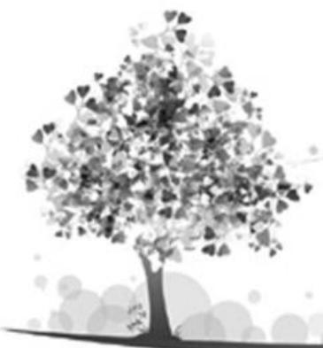
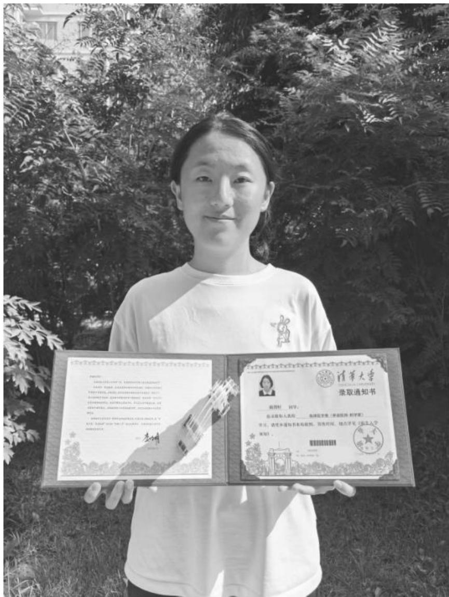

natural_image

Stylized grayscale illustration of a tree with leafy branches and floating bubbles at the base (no text or symbols)

# 规划夯基迎挑战，复盘细做赴清华

■ 清华大学 南雨轩(毕业于西北师范大学附属中学)

(物理方向:语文125分,数学139分,英语133分,物理88分,化学93分,生物96分)

高中阶段学习的知识具有一定难度和广度,同学们不仅要有勤于努力的认真态度,更要有科学的备考方法和积极的心态。以下是笔者根据个人高中学习经历总结的一些学习方法和稳住心态的建议,希望能帮助各位同学找到适合自己的学习方法,调整心态,圆梦理想的大学。

# 一、合理规划明方向

在开始学习之前,我一般都会规划好这一阶段需要完成的学习任务。这样可以很好地避免浪费时间,帮助自己明确目标,并进一步将目标细化到每一天。需要注意的是,规划并不是要求自己严格按照几点几分做某件事,而是应该明确学习任务和所需的时间,按照紧迫程度等因素灵活安排。完成过的就用笔划掉,提高效率,也更容易获得成就感。同时,合理科学的规划也需要我们对自己的完成能力,任务的体量、难度有清晰的认识。刻意设置高目标反而会增加压力,降低学习质量;而设置对自己没有要求的目标又会浪费时间,也不易获得成就感。

# 二、夯实基础筑高楼

高中的知识始于课本上的基础内容, 又可向上延伸, 链接高校所学知识。“九层之台, 起于累土”, 这要求我们不能忽视基础知识的重要性。对于基础知识的学习, 不仅要知道, 更要理解, 并且需要熟练运用, 这样才能筑起完整的知识大厦。如我在学习中发现数学中的数列求和公式不难掌握, 但是面对不同的条件该用哪个公式求和, 通过求和公式如何反推数列, 以及其中易错的特殊情况都是在学习这个基础知识时需要掌握的。只有筑牢基础, 才能减少失分, 同时为解决较难

问题争取时间。对于其他的科目,我在考前也从没有放下课本,书本里的角角落落和课后习题都能引发我的思考,它们也成为我在考场上解决一道道题目的启发点。

# 三、回顾反思获新知

不管是课上老师教授的,还是自己练习获得的知识,都不可能仅仅通过“一面之缘”内化为自己可以熟练运用的方法论,还需要长期的回顾与反思。

在这个过程中,我在练习量还较少的时候会裁剪试卷或复印习题整理到错题本上,在周末的固定时间复习重做。对于不同难度,所需回顾频次不同的题目,我会用不同颜色简单标注,每次做如果有新的理解就会注释在旁边,直到自己能熟练掌握。之后在习题较多的时候,我会直接将试卷归纳,标注时间和需要回顾的题目,及时复习。有时我还会给自己讲解,以便加深印象。需要注意的是,重要的并不是整理,不用拘泥于形式,而是要通过重新理解,重建思路,独立思考来真正内化知识。

同时,对于在考试中或练习时犯的低级错误,如审题不清、符号抄错等,并不能因为当时情绪的低落或是认为自己没有知识漏洞而一笑而过。这些错误往往代表着知识掌握不熟练,做题时注意力不集中等问题。为了解决它们,我在笔记本的第一页开辟了一个区域,专门用于记录这些错误,每个错误只是用一句话来概括,如“复数共轭要注意”。我在每次考试前或是空闲时都会回顾这些内容,这样就可以让我在那些易错的地方提高警惕,避免失误。

面对一些细碎的知识,我又准备了一个便携的小本进行记录,这样就可以利用碎片的时间,记下这些知识,也便于在考试前集中回顾,唤醒记忆。

# 四、遇到问题不逃避

日常的学习生活中我们肯定会遇到诸多问题,每一个问题其实都是一次宝贵的学习机会。有的问题可以立刻解决,有的问题可能没法马上得到答案。所以我在平时学习的时候都会用一个本子及时记录下问题,即使只是一个脑子里突然蹦出的不成熟的想法,我都会记录,避免遗忘。这样的记录包含时间、题目的位置、有问题的选项或步骤,以便解决问题的时候能精准定位,明确要学习的内容。在解决问题的时候,我会通过查找资料或是寻找网课来探究,也会求助老师、同学,直到完全解决问题。在这一过程中,老师的讲解,同学们的讨论,以及我延伸出的思考都会加深我对这些知识的理解。

# 五、细化步骤稳答题

在解答数学或是其他学科的烦琐题目时,我总想着节省时间赶紧解决问题,但有可能一开始的分析就因审题不清而偏离方向,也有可能因为一个失误而造成一步错步步错的结果。为了避免这样的错误,我在平常的练习中就开始注意,提醒自己慢审题快答题。尤其是数学中有背景知识的概念题,我遇到不理解或者描述复杂的地方就反复读题,圈出关键词,仔细揣摩,确定题目的意思后再开始答题。在答题的过程中,我也提醒自己尽可能细化步骤,动笔用草稿纸计算,写上的部分当场检查。这样做之后,我发现这并不会耽误时间,反而节省了因为算出不合理的答案而浪费的检查时间。同时更清晰的步骤也帮助我捋清思路,找到解题的方法。

# 六、不同学科，独特方法

# 1. 数学

在数学学习的旅程中,我们时常会邂逅形形色色的结论。但对我而言,这些结论本身并非记忆的重点——比结论更珍贵的是支撑它的推导过程。这种沉浸式的“输入”体验,恰是培养数学逻辑思维的最佳途径:每一步推导都像在搭建逻辑的阶梯,每一次论证都是对思维严谨性的打磨。

在面对小题时,偶尔直接借用结论能提高解题效率,但在解答题中,生搬硬套结论往往行不通。不过,那些推导过程中蕴含的切入视角、论证方法与计算技巧,却能成为解题时的宝贵借鉴。它们像一把把钥匙,帮助我们穿透结论的表象,触摸知识的数学本质,理解公式定理为何成立、如何演化,最终实现从“知其然”到“知其所以然”的跨越。

# 2. 物理

我们做物理题时常常需要建立并套用学过的模型进行分析,许多受力、运动的问题又十分复杂,在做大部分题目的时候仅靠空想容易遗漏细节,分析混乱。我就会时时提醒自己不可以手懒,一定要画出图示分析,用笔标注细节,这样并不会浪费时间,反而会使后面的计算更清晰顺畅。这一点对于数学的学习也同样重要。

# 3. 生物、化学

生物、化学的细碎知识常常令人感觉缺乏逻辑关系难以记忆，但许多理论的产生，物质的发现其实都经历了漫长的实验探究过程，从实验入手，了解选择不同材料、器材的原因，每一步操作的出发点，以及为得出有说服力的结论需要考虑的复杂因素，这样便可以通过实验串联知识，答题时也有了入手角度。而对于一些无从探索的，我会先回顾课本和笔记，再脱离资料简单梳理，明白在这个部分我都学习了哪些内容，它们之间又有怎样的关联，最后闭上眼睛自己回忆，看是否有模糊不清的内容，这样难以记忆的知识点也变得有迹可循。

# 七、调整心态迎挑战

# 1. 认知清晰不畏惧,把握当下不内耗

高考有着丰富的意义,可它远不能定义任何人的人生。在高中三年乃至以前的学习生活里,那些学过的知识、错过的题目都可能消失在记忆里,可是我们战胜难题、解决问题时学到的东西会伴随我们一生。每当我因成绩不理想、做题没思路而崩溃的时候,都会告诉自己“这些都是我成长的一部分”。高考不是一场证明,不是一场比赛,而是我努力成长为一个更自信坚韧的人的旅程。而我要做的就是珍惜每一天的时光,把握好每一个当下,做好我应该做的事。不因没做到的事而焦虑内耗，尽力而为，这样我也可以坦然地接受一切结果。

# 2. 稳步学习迎考试,持之以恒不言弃

高中的学习过程中一定会有频繁的考试,如果过分在意考试的结果,那么等待成绩的时间就有可能在焦虑担忧中被浪费,出结果后好的成绩可能会导致后续学习的自满懈怠,不尽如人意的成绩又可能会使人怀疑努力的意义,丧失前行的动力。“最擅泳者忘水”,要明确考试只是检测一阶段学习成果的一种手段,要把它当成一种工具来查缺补漏,尽力用平常心来面对。对于考试结果,重要的是暴露出的问题而不是分数。道理都懂,但是对于考试结果的担心和焦虑在所难免,我一般会在重大的考试后选择读一些富有哲思又不会使我深陷其中的书籍,重获内心的平静,不影响原有的学习节奏。

学习的方法其实因人而异,我也只能从自己的经历中不断反思总结。无论是运用怎样的学习方法,最重要的都是在日复一日的学习中不断实践优化,“路漫漫其修远兮”,祝愿各位同学终能历经万重山,迎来属于自己的绚烂风景。

名师点评:(西北师范大学附属中学卢会玉)

作为南雨轩的班主任兼数学老师，回望她这三年的成长足迹，心中满是欣慰与感动。

其一,她是个极度自律的孩子。校园的晨光暮色中,假期的独处时光里,她总能锚定内心的方向,在知识的沃土上默默深耕。这份刻在骨子里的自律,让她在数学学习的征途上从不停歇。就像面对那些数学结论,她从不会浅尝辄止于死记硬背,而是执拗地追溯每一步推导的来龙去脉,用持久的专注力去拆解知识背后的逻辑链条,这正是数学学习中最可贵的钻劲儿。

其二,她有着异常坚定的目标感。一旦确定了方向,便会一往无前,哪怕遇到再多阻碍也绝不退缩。这种不服输的韧劲,在她与数学难题较劲时展现得尤为突出。碰上那些错综复杂的推导过程,她从没有过丝毫畏难,凭着这份执着一点点拨开遮挡数学知识的迷雾，在学业上不断突破，也成了同学们身边鲜活的榜样。

同时,她还有着高效的学习方法。她对数学学习的深刻理解——注重推导过程、借鉴思维方法,正是其高效学习方法在数学领域的生动体现。她做题时的深入,恰是对推导过程的细致探究。

当然,作为数学课代表,她及时反馈同学心声,做好老师助手,积极沟通,帮助同学共同进步。在与同学探讨数学问题时,她常常会分享自己对推导过程的理解,引导大家跳出死记结论的误区,一起触摸数学的本质。

正是这些优秀品质,铸就了南雨轩同学今日的成功。我为西北师范大学附属中学有这样一位优秀的学生而感到骄傲和自豪! 同时,作为《中学生数理化》的核心作者之一,我从同行的文章中也汲取了很多营养,最后反哺到我的学生身上。南雨轩对数学学习的态度和方法,也与刊物所倡导的深度探究、注重本质的理念相契合。在这里,祝愿《中学生数理化》越办越好,为更多学子搭建起探索数理世界的桥梁。

text_image

李明
2019年1月1日，中国科学院研究生院
硕士，并获得本科学历。曾任北京航空航天大学研究所助理、北京航空航天大学技术研究所、北京航空航天大学技术研究所、北京航空航天大学技术研究所、北京航空航天大学技术研究所、北京航空航天大学技术研究所、北京航空航天大学技术研究所、北京航空航天大学技术研究所、北京航空航天大学技术研究所、北京航空航天大学技术研究所、北京航空航天大学技术研究所、北京航空航天大学技术研究所、北京航空航天大学技术研究所、北京航空航天大学技术研究所、北京航空航天大学技术研究所、北京航空航天大学技术研究所、北京航空航天大学技术研究所、北京航空航天大学技术研究所、北京航空航天大學
2019年1月1日，中国科学院研究生院
硕士，并获得本科学历。曾任北京航空航天大学研究所助理、北京航空航天大学技术研究所助理、北京航空航天大学技术研究所助理、北京航空航天大学技术研究所助理、北京航空航天大学技术研究所助理、北京航空航天大学技术研究所助理、北京航空航天大学技术研究所助理、北京航空航天大学技术研究所助理、北京航空航天大学技术研究所助理、北京航空航天大学技术研究所助理、北京航空航天大学技术研究所助理、北京航空航天大学技术研究所助理、北京航空航天大学技术研究所助理、北京航空航天大学技术研究所助理、北京航空航天大学技术研究所助理、北京航空航天大学技术研究所高级工程师。
2019年1月1日，中国科学院研究生院
硕士，并获得本科学历。曾任北京航空航天大学研究所助理、北京航空航天大学技术研究所助理、北京航空航天大学技术研究所助理、北京航空航天大学技术研究所助理、北京航空航天大学技术研究所助理、北京航空航天大学技术研究所助理、北京航空航天大学技术研究所助理、北京航空航天大学技术研究所助理、北京航空航天大学技术研究所助理、北京航空航天大学技术研究所助理、北京航空航天大学技术研究所助理、上海交通大学
2019年1月1日，中国科学院研究生院
硕士，并获得本科学历。曾任北京航空航天大学研究所助理、北京航空航天大学技术研究所助理、北京航空航天大学技术研究所助理、北京航空航天大学技术研究所助理、北京航空航天大学技术研究所助理、北京航空航天大学技术研究所助理、北京航空航天大学技术研究所助理、北京航空航天大学技术研究所助理、北京航空航天大学技术研究所助理、北京航空航天大学技术研究所助理、北京航空航天大学技术研究所助理
2019年1月1日，中国科学院研究生院
硕士，并获得本科学历。曾任北京航空航天大学研究所助理、北京航空航天大学技术研究所助理、北京航空航天大学技术研究所助理、北京航空航天大学技术研究所助理、北京航空航天大学技术研究所助理、北京航空航天大学技术研究所助理、北京航空航天大学技术研究所助理、北京航空航天大学技术研究所助理、北京航空航天大学技术研究所助理、北京航空航天大学技术研究所助理、北京航空航天大学技术研究所助理

南雨轩同学  
(责任编辑 徐利杰)