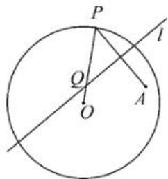
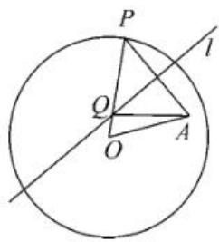
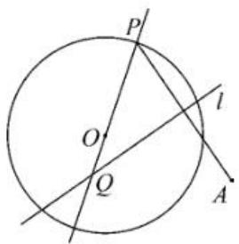
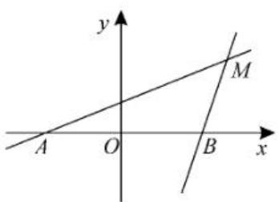
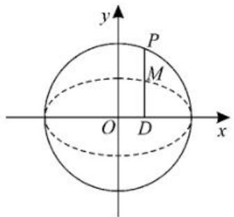
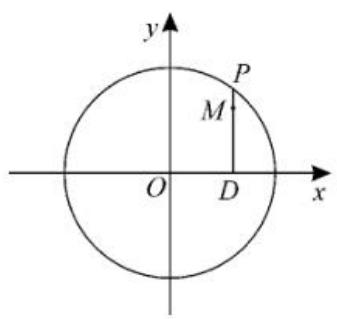
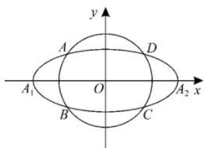

# 课本习题与高考真题中的“轨迹方程”求解全攻略

# ■河南省南阳市第二完全学校高级中学 黄伟亮 张瑞玲

2025年新高考全国Ⅰ卷第18题以常见的“椭圆＋动点”的套路，隐含轨迹问题，把看似温和的“轨迹”瞬间升级为“最值＋参数约束”的复合问题。关于轨迹问题，在高考试卷中并不少见。对于解析几何的解答题，求解出第一问轨迹方程是解答第二问的前提，而破解此类问题的“金钥匙”早已藏在人教A版《数学选择性必修第一册》的例题、习题之中，高考真题是课本知识的融合、提炼与升华。下面将以人教A版教材的例题、习题为例，帮助同学们总结求轨迹方程的常用方法。

# 一、“定义法”求轨迹方程

例 1 （人教 A 版《数学选择性必修第一册》习题 3.1 第 6 题）如图 1, 圆 O 的半径为定长 r, A 是圆 O 内一个定点, P 是圆 O 上任意一点。线段 AP 的垂直平分线 l 和半径 OP 相交于点 Q，当点 P 在圆上运动时，点 Q 的轨迹是什么？为什么？

  
图1

解析: 连接 OA、AQ, 如图 2 所示。因为线段 AP 的垂直平分线 l 和半径 OP 相交于点 Q, 所以 $\left|QA\right|=\left|QP\right|$ 。

  
图2

因为点 A 在半径为 r 的圆 O 内, 所以 $\left|OA\right|<r$ 。

所以 $|QO| + |QA| = |QO| + |QP| = |PO| = r > |OA|$ 。

由椭圆的定义可知, 点 Q 的轨迹是以点 O、A 为焦点, 且长轴长为 r 的椭圆。

解题攻略:若动点的运动规律符合已知圆锥曲线的定义,则可以利用圆、椭圆、双曲线、抛物线的定义直接写出方程。

# 小试牛刀

1.（人教 A 版《数学选择性必修第一册》）

习题 3.2 第 5 题) 如图 3, 圆 O 的半径为定长 r, A 是圆 O 外一个定点, P 是圆 O 上任意一点。线段 AP 的垂直平分线 l 与直线 OP 相交于点 Q, 当点 P 在圆 O 上运动时, 点 Q 的轨迹是什么? 为什么?

  
图3

2. 一动圆与圆 $x^{2} + y^{2} + 6x + 5 = 0$ 外切, 同时与圆 $x^{2} + y^{2} - 6x - 91 = 0$ 内切, 求动圆圆心的轨迹方程, 并说明它是什么曲线。

参考答案:1. 点 Q 的轨迹是以 O、A 为焦点, r 为实轴长的双曲线。

2. 动圆圆心的轨迹方程为 $\frac{x^2}{36} + \frac{y^2}{27} = 1$ ，轨迹为椭圆。

# 高考真题再现

1. (2013年新课标[卷理科第20题节选)已知圆 $M:(x+1)^{2}+y^{2}=1$ ，圆 $N:(x-1)^{2}+y^{2}=9$ ，动圆P与圆M外切并与圆N内切，圆心P的轨迹为曲线C。求C的方程。

2.(2021年新高考全国I卷第21题节选)在平面直角坐标系xOy中,已知点 $F_{1}(-\sqrt{17},0)$ 、 $F_{2}(\sqrt{17},0)$ , $|MF_{1}|-|MF_{2}|=2$ ,点M的轨迹为C。求C的方程。

参考答案:1. $\frac{x^{2}}{4}+\frac{y^{2}}{3}=1(x\neq-2)$ 。

2. $x^{2} - \frac{y^{2}}{16} = 1(x\geqslant 1)$

# 二、“直接法”求轨迹方程

例 2 （人教 A 版《数学选择性必修第一册》第 113 页例 6）动点 $M(x, y)$ 与定点 $F(4,0)$ 的距离和 M 到定直线 $l: x = \frac{25}{4}$ 的距离的比是常数 $\frac{4}{5}$ ，求动点 M 的轨迹。

解析:设 d 是点 M 到直线 $l: x = \frac{25}{4}$ 的距离。

根据题意,动点 M 的轨迹就是集合 $P=\left\{M\left|\frac{|MF|}{d}=\frac{4}{5}\right.\right\}$ ，则 $\frac{\sqrt{(x-4)^{2}+y^{2}}}{\left|\frac{25}{4}-x\right|}=\frac{4}{5}$ 。

将上式两边平方，并化简，得 $9x^{2} + 25y^{2} = 225$ ，即 $\frac{x^2}{25} +\frac{y^2}{9} = 1$ 。

所以点 M 的轨迹是长轴长、短轴长分别为 10、6 的椭圆，其方程为 $\frac{x^{2}}{25} + \frac{y^{2}}{9} = 1$ 。

解题攻略:根据题目给出的条件直接列出等量关系式,整理化简,从而得到轨迹方程。

# 小试牛刀

1.(人教 A 版《数学选择性必修第一册》第 121 页探究)如图 4, 点 A, B 的坐标分别是 $(-5,0)$ , $(5,0)$ , 直线 AM, BM 相交于点 M, 且它们的斜率之积是 $\frac{4}{9}$ ，试求点M的轨迹方程。

  
图4

2.（人教 A 版《数学选择性必修第一册》习题 3.3 第 11 题）已知 A, B 两点的坐标分别是 $(-1,0)$ , $(1,0)$ ，直线 AM, BM 相交于点 M，且直线 AM 的斜率与直线 BM 的斜率的差是 2，求点 M 的轨迹方程。

参考答案:1. $4x^{2}-9y^{2}=100(x\neq\pm5)$ 。

2. $y=1-x^{2}(x\neq\pm1)$ 。

# 高考真题再现

1. (2019年全国Ⅱ卷理科第21题节选)已知点 $A(-2,0), B(2,0)$ , 动点 $M(x,y)$ 满足直线 $AM$ 与 $BM$ 的斜率之积为 $-\frac{1}{2}$ 。记 $M$ 的轨迹为曲线 $C$ 。求 $C$ 的方程, 并说明 $C$ 是什么曲线。

2.(2023年新高考Ⅰ卷第22题节选)在直角坐标系xOy中,点P到x轴的距离等于点P到点 $\left(0,\frac{1}{2}\right)$ 的距离,记动点P的轨迹为W。求W的方程。

参考答案:1. C 的方程为 $\frac{x^{2}}{4} + \frac{y^{2}}{2} = 1 (x \neq \pm 2)$ , C 是椭圆(去掉左、右顶点)。

2. $y = x^{2} + \frac{1}{4}$ 。

# 三、“相关点代入法”求轨迹方程

例 3 （人教 A 版《数学选择性必修第一册》第 108 页例 2）如图 5，在圆 $x^{2} + y^{2} = 4$ 上任取一点 P，过点 P 作 x 轴的垂线段 PD，D 为垂足。当点 P 在圆上运动时,线段 PD 的中点 M 的轨迹是什么?为什么?(当点 P 经过圆与 x 轴的交点时,规定点 M 与点 P 重合)

text_image

y
P
M
O D x

图 5

解析:设点 M 的坐标为 $(x, y)$ ，点 P 的坐标为 $(x_{0}, y_{0})$ ，则点 D 的坐标为 $(x_{0}, 0)$ 。由点 M 是线段 PD 的中点，得 $x = x_{0}, y = \frac{y_{0}}{2}$ 。

因为点 $P(x_{0}, y_{0})$ 在圆 $x^{2} + y^{2} = 4$ 上，所以 $x_{0}^{2} + y_{0}^{2} = 4$ 。把 $x_{0} = x, y_{0} = 2y$ 代入方程，得 $x^{2} + 4y^{2} = 4$ ，即 $\frac{x^{2}}{4} + y^{2} = 1$ 。

所以点 M 的轨迹是椭圆。

解题攻略:一般情况下,所求点的运动,依赖于另外一个或者多个点的运动,可以通过对这些点设坐标来寻求代换关系。先设所求点坐标为 $(x,y)$ ,所依赖的点(称之为“参数点”)的坐标为 $(a,b),(x_{0},y_{0})$ 等,再寻找所求点与“参数点”之间的坐标关系,反解“参数点”的坐标,然后代入“参数点”满足的方程,最后求解所求点的轨迹方程。

# 小试牛刀

1.(人教 A 版《数学选择性必修第一册》习题 3.2 第 14 题)已知双曲线 $\frac{x^2}{4} - \frac{y^2}{16} = 1$ 与直线 $l: y = kx + m (k \neq \pm 2)$ 有唯一的公共点 $M$ , 过点 $M$ 且与 $l$ 垂直的直线分别交 $x$ 轴、 $y$ 轴与 $A(x, 0), B(0, y)$ 两点。当点 $M$ 运动时, 求点 $P(x, y)$ 的轨迹方程, 并说明轨迹是什么曲线。

参考答案: 点 P 的轨迹方程为 $\frac{x^{2}}{100}-\frac{y^{2}}{25}=1(y\neq0)$ ，轨迹是焦点在 x 轴上，实轴长为 20，虚轴长为 10 的双曲线（去掉两个顶点）。

# 高考真题再现

1.(2011年陕西卷理科第17题节选)如图 6, 设 P 是圆 $x^{2} + y^{2} = 25$ 上的动点, 点 D 是 P 在 x 轴上的投影, M 为 PD 上一点, 且 $\left|MD\right| = \frac{4}{5}\left|PD\right|$ 。当 P 在圆上运动时, 求点 M 的轨迹 C 的方程。

text_image

y
P
M
O D x

图6

参考答案: $\frac{x^{2}}{25}+\frac{y^{2}}{16}=1$ 。

# 四、“交轨法”求轨迹方程

例 4 已知抛物线 $y^{2}=4px(p>0)$ ，O 为顶点，A、B 为抛物线上的两动点，且满足 $OA \perp OB$ ，如果 $OM \perp AB$ 于点 M，求点 M 的轨迹方程。

解析:设点 M 的坐标为 $(x, y)$ ，直线 OA 的方程为 y = kx，显然 $k \neq 0$ 。

则直线 OB 的方程为 $y = -\frac{1}{k}x$ 。

由 $\left\{\begin{aligned}y=kx,\\ y^{2}=4px,\end{aligned}\right.$ 解得 $A\left(\frac{4p}{k^{2}},\frac{4p}{k}\right)$ 。

同理可得 $B(4pk^2, - 4pk)$ 。

则当 $k \neq \pm 1$ 时， $k_{AB} = \frac{4p\left(\frac{1}{k} + k\right)}{4p\left(\frac{1}{k^2} - k^2\right)} =$

$\frac{1}{\frac{1}{k}-k}$ 。故直线 AB 的方程为 $y+4pk=\frac{1}{\frac{1}{k}-k}\cdot(x-4pk^{2})$ ，即 $\left(\frac{1}{k}-k\right)y+4p=x$ 。①

因为 $OM \perp AB$ ，所以直线 $OM$ 的方程为 $y = -\left(\frac{1}{k} - k\right)x$ 。②

联立①②，消去 $k$ 得 $4px = x^{2} + y^{2}$ ，即 $(x - 2p)^{2} + y^{2} = 4p^{2}(x \neq 0)$ 。

当 $k = 1$ 时， $A(4p, 4p), B(4p, -4p)$ ，则 $M(4p, 0)$ ，显然 $M(4p, 0)$ 满足上述方程。

同理, 当 k = -1 时, $M(4p, 0)$ 也满足上述方程。

故点 $M$ 的轨迹方程为 $(x - 2p)^2 + y^2 = 4p^2$ （去掉坐标原点）。

解题攻略:“交轨法”适用于两条动直线的交点轨迹问题。通过联立两条直线的方程,消去参数得到交点的轨迹方程。

# 小试牛刀

1. 如图 7, 椭圆 $C_{0}$ :

$$
\frac {x ^ {2}}{a ^ {2}} + \frac {y ^ {2}}{b ^ {2}} = 1 (a > b > 0, a,
$$

$b$ 为常数), 动圆 $C_{1}: x^{2} + y^{2}$

$$
= t _ {1} ^ {2}, b <   t _ {1} <   a, \text {点} A _ {1}, A _ {2}
$$

分别为椭圆 $C_0$ 的左、右顶

text_image

y
A
D
A₁
O
A₂ x
B
C

图7

点,椭圆 $C_{0}$ 与动圆 $C_{1}$ 相交于 A, B, C, D 四点, 求直线 $AA_{1}$ 与直线 $A_{2}B$ 的交点 M 的轨迹方程。

参考答案: $\frac{x^{2}}{a^{2}}-\frac{y^{2}}{b^{2}}=1(x<-a,y<0)$ 。

# 五、“参数法”求轨迹方程

例 5 【同例 3】(人教 A 版《数学选择性必修第一册》第 108 页例 2) 在圆 $x^{2} + y^{2} = 4$ 上任取一点 P，过点 P 作 x 轴的垂线段 PD，D 为垂足。当点 P 在圆上运动时，线段 PD 的中点 M 的轨迹是什么？为什么？

解析:设点 M 的坐标为 $(x, y)$ 。

因为点 P 为圆 $x^{2} + y^{2} = 4$ 上任一点，所以可设 $P(2\cos\theta, 2\sin\theta)$ ，则 $D(2\cos\theta, 0)$ 。

由点 M 是线段 PD 的中点，得 $\left\{\begin{aligned}x=2\cos\theta,\\ y=\sin\theta,\end{aligned}\right.$ 消去 $\theta$ 可得 $\frac{x^{2}}{4}+y^{2}=1$ 。

所以点 M 的轨迹是椭圆。

解题攻略:先引入参数,用参数分别表示动点的坐标,再根据条件消去参数,得到所求的轨迹方程。

# 小试牛刀

1. 已知 $MN$ 是椭圆 $\frac{x^2}{a^2} + \frac{y^2}{b^2} = 1 (a > b > 0)$ 中垂直于长轴的动弦, $A, B$ 是椭圆长轴的两个端点, 求直线 $AM$ 和 $NB$ 的交点 $P$ 的轨迹方程。

参考答案: $\frac{x^{2}}{a^{2}}-\frac{y^{2}}{b^{2}}=1(x\neq\pm a)$ 。

“轨迹方程”问题是动态几何与静态代数的完美结合。每一种解题思路都有其优势及应用题型，同学们在解题时，可根据题目特征选择合适的方法，牢牢抓住教材本源，熟练掌握通法，深刻理解数学思想，无论高考题目如何变化，都能从容应对，实现思维的跃迁。

(责任编辑 赵倩)