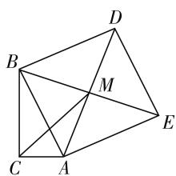
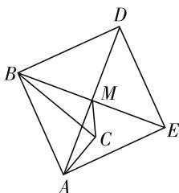
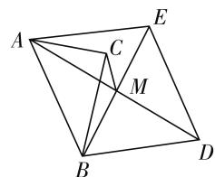
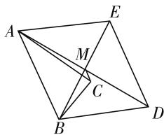
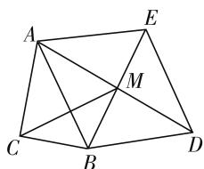
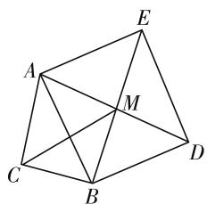
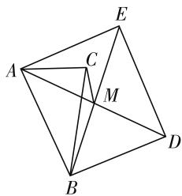
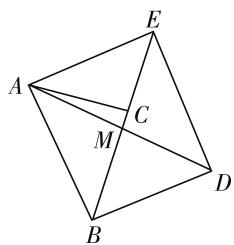
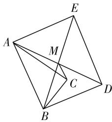

# 一道俄罗斯奥数试题的类比及推广

● 广东省深圳中学 邱际春  
广东省深圳中学 朱华伟

文[1]对俄罗斯圣彼得堡为纪念瑞士数学家、圣彼得堡科学院院士欧拉(Euler)诞辰300周年而举办的欧拉数学奥林匹克中的第10题进行推广和探究，得到了12种对应的解法.笔者在此基础上作进一步类比与推广，得到了一些新的结论.

先给出欧拉数学奥林匹克的第10题：在Rt△ABC中，∠C=90°，斜边AB=c，BC=a，CA=b。以斜边c为边，作不包含△ABC的正方形ABDE。求顶点C与正方形对角线交点的距离。

王玉怀先生对这个试题作出如下推广：在Rt△ABC中，∠C=90°，斜边AB=c，BC=a，CA=b。以斜边AB为边，作正方形ABDE。求顶点C与正方形对角线交点的距离。

此时,需要研究两种情形:

(1) 正方形 ABDE 不包含 $\triangle ABC$ (如图 1);

text_image

Geometric diagram with labeled points A, B, C, D, E, and M forming interconnected triangles and quadrilaterals

图 1

text_image

Geometric diagram of a tetrahedron with labeled vertices A, B, C, D, E and internal points M, showing edges and diagonals.

图 2

(2) 正方形 ABDE 包含 $\triangle ABC$ (如图 2).

接下来,笔者尝试从以下视角进行类比和推广:

视角 1: 将正方形类比至菱形, 得到推广 1

推广1: 在 Rt△ABC 中, $\angle C = 90^{\circ}$ , 斜边 AB = c, BC = a, CA = b. 以斜边 AB 为边, 作菱形 ABDE, 且约定 $\angle BAD = \theta$ . 求顶点 C 与菱形对角线交点的距离.

解析:设 AD 与 BE 交于点 M, 连接 CM.

因为 $\angle ACB$ 和 $\angle AMB$ 是直角, 所以点 M 和点 C 在以弦 AB 为直径的圆上.

注意到 $AM = AB \cos \theta, BM = AB \sin \theta.$

(1) 若点 C, M 在直线 AB 两侧时 (如图 3), 由托勒密定理可得 $AM \cdot BC + BM \cdot AC = AB \cdot CM$ , 故 $CM = a \cos \theta + b \sin \theta$ .  
(2) 若点 C, M 在直线 AB 同侧时, 存在如下三种情形:

① 当 a > b 时(如图 4)，点 C 落在直线 AD 上方.
由托勒密定理可得 $AC \cdot BM + CM \cdot AB = AM \cdot BC$ ，故 $CM = a \cos \theta - b \sin \theta$ .  
② 当 $\angle BAC = \theta$ 时，点 C 与 M 重合，显然 CM = 0.

text_image

A
C
E
M
B
D

图 4

text_image

Geometric diagram of a quadrilateral with labeled vertices and internal points, including diagonals and segments.

图 5

③ 当 $a < b$ 时(如图5)，点 $C$ 落在直线 $AD$ 下方.由托勒密定理可得 $AM \cdot BC + CM \cdot AB = AC \cdot BM$ ，故 $CM = b\sin \theta - a\cos \theta .$

综上所述,若点 C,M 在直线 AB 两侧,则 $CM = a \cos \theta + b \sin \theta$ ; 若点 C,M 在直线 AB 同侧,则 $CM = |a \cos \theta - b \sin \theta|$ .

# 视角 2: 将正方形类比至矩形, 得到推广 2

推广2: 在 Rt△ABC 中, $\angle C = 90^{\circ}$ , 斜边 AB = c, BC = a, CA = b. 以斜边 AB 为边, 作矩形 ABDE, 且约定 $\angle BAD = \theta$ . 求顶点 C 与矩形对角线交点的距离.

解析:设 AD 与 BE 交于点 M, 连接 CM.

注意到,在矩形 ABDE 中, $AD=BE=\frac{AB}{\cos\theta}$ .

于是， $BM=\frac{AB}{2\cos\theta}=\frac{c}{2\cos\theta}.$

text_image

A
E
M
C
B
D

图 3

(1) 若点 C, M 在直线 AB 两侧(如图 6),

因为 $\cos\angle CBM=\cos(\angle ABM+\angle ABC)$

$$
= \cos \angle A B M \cos \angle A B C - \sin \angle A B M \sin \angle A B C
$$

$$
= \frac {B C}{A B} \cdot \cos \theta - \frac {A C}{A B} \cdot \sin \theta
$$

$$
= \frac {a \cos \theta - b \sin \theta}{c},
$$

所以 $CM^2 = BC^2 +BM^2 -2BC\cdot BM\cos \angle CBM$

$$
= a ^ {2} + \frac {c ^ {2}}{4 \cos^ {2} \theta} - 2 \cdot \frac {a c}{2 \cos \theta} \cdot \frac {a \cos \theta - b \sin \theta}{c}
$$

$$
= \frac {c ^ {2}}{4 \cos^ {2} \theta} + \frac {a b \sin \theta}{\cos \theta}
$$

$$
= \frac {c ^ {2} + 4 a b \sin \theta \cos \theta}{4 \cos^ {2} \theta},
$$

所以 $CM=\frac{\sqrt{c^{2}+4ab\sin\theta\cos\theta}}{2\cos\theta}$ .

text_image

Geometric diagram with labeled points A, B, C, D, E, and M forming interconnected triangles and quadrilaterals

图6

text_image

Geometric diagram of a quadrilateral with labeled vertices A, B, C, D, E and intersection point M

图 7

(2) 若点 C, M 在直线 AB 同侧, 存在如下三种情形:

① 当 $\angle ABC < \angle ABE = \theta$ 时(如图7)，点 C 落在直线 BE 左侧.

因为 $\cos\angle CBM=\cos(\angle ABM-\angle ABC)$

$$
\begin{array}{l} = \cos \angle A B M \cos \angle A B C + \sin \angle A B M \sin \angle A B C \\ = \frac {B C}{A B} \cdot \cos \theta + \frac {A C}{A B} \cdot \sin \theta \\ = \frac {a \cos \theta + b \sin \theta}{c}, \\ \end{array}
$$

所以 $CM^{2}=BC^{2}+BM^{2}-2BC\cdot BM\cos\angle CBM$

$$
= a ^ {2} + \frac {c ^ {2}}{4 \cos^ {2} \theta} - 2 \cdot \frac {a c}{2 \cos \theta} \cdot \frac {a \cos \theta + b \sin \theta}{c}
$$

$$
= \frac {c ^ {2}}{4 \cos^ {2} \theta} - \frac {a b \sin \theta}{\cos \theta}
$$

$$
= \frac {c ^ {2} - 4 a b \sin \theta \cos \theta}{4 \cos^ {2} \theta},
$$

所以 $CM=\frac{\sqrt{c^{2}-4ab\sin\theta\cos\theta}}{2\cos\theta}$ .

② 当 $\angle ABC = \angle ABE = \theta$ 时(如图8)，点 $C$ 落在直线 $BE$ 上，则 $CM = |CB - BM| = \left|a - \frac{c}{2\cos\theta}\right|$ .

此时，在 $\triangle ABC$ 中，有 $c = a\cos \theta + b\sin \theta$ ，于是：

$$
\begin{array}{l} C M = \frac {\left| 2 a \cos \theta - c \right|}{2 \cos \theta} = \frac {\sqrt {c ^ {2} - 4 a c \cos \theta - 4 a ^ {2} \cos^ {2} \theta}}{2 \cos \theta} \\ = \frac {\sqrt {c ^ {2} - 4 a \cos \theta (c - a \cos \theta)}}{2 \cos \theta} \\ = \frac {\sqrt {c ^ {2} - 4 a b \sin \theta \cos \theta}}{2 \cos \theta}. \\ \end{array}
$$

text_image

Geometric diagram of a quadrilateral with labeled vertices A, B, C, D, E and intersection point M

图8

text_image

Geometric diagram with labeled points A, B, C, D, E, and M forming intersecting triangles and quadrilaterals

图9

③ 当 $\angle ABC > \angle ABE = \theta$ 时(如图9)，点 C 落在直线 BE 右侧.

由于 $\cos\angle CBM = \cos(\angle ABC - \angle ABM) = \cos(\angle ABM - \angle ABC)$ ，下同情形①.

综上所述,若点 C,M 在直线 AB 两侧时,则 $CM=\frac{\sqrt{c^{2}+4ab\sin\theta\cos\theta}}{2\cos\theta}$ ; 若点 C,M 在直线 AB 同侧时,则

$$
C M = \frac {\sqrt {c ^ {2} - 4 a b \sin \theta \cos \theta}}{2 \cos \theta}.
$$

# 参考文献：

[1] 王玉怀. 一道俄罗斯奥数试题推广的解法探究 [J]. 数学教学, 2013(3). F