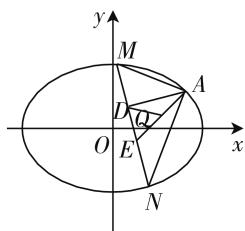
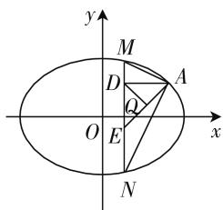

# 一道高考压轴题引发的圆锥曲线定点问题探究

# 甘肃省白银市第一中学 胡贵平

解析几何中证明直线过定点,一般是选择参数表示直线方程、数量积、比例关系等,根据等式的恒成立、数式变换,通过推理、计算,找出参数之间的关系,并消去部分参数,将直线方程化为点斜式方程,从而得到直线所过的定点.当定点具备一定的限制条件时,可先探索出定点,再证明该定点与变量无关.

# 一、试题呈现

(2020年新高考数学山东卷第22题)已知椭圆 $C:\frac{x^{2}}{a^{2}}+\frac{y^{2}}{b^{2}}=1(a>b>0)$ 的离心率为 $\frac{\sqrt{2}}{2}$ ，且过点 $A(2,1)$ .

(1) 求 C 的方程.  
(2) 点 M, N 在 C 上, 且 $AM \perp AN, AD \perp MN$ , D 为垂足. 证明: 存在定点 Q, 使得 $|DQ|$ 为定值.

本题综合考查直观想象、逻辑推理、数学运算等数学核心素养,考查了椭圆的标准方程和性质,圆锥曲线中的定点定值问题.

# 二、试题解析

解析:(1)由题意,可得 $\left\{\begin{aligned}\frac{c}{a}&=\frac{\sqrt{2}}{2},\\\frac{4}{a^{2}}+\frac{1}{b^{2}}&=1,\\a^{2}&=b^{2}+c^{2},\end{aligned}\right.$ 解得 $a^{2}=6$ ,$b^{2}=c^{2}=3$ , 故椭圆方程为 $\frac{x^{2}}{6}+\frac{y^{2}}{3}=1$ .

(2) 设点 $M(x_{1}, y_{1}), N(x_{2}, y_{2})$ .

因为 $AM \perp AN$ ，所以 $\overrightarrow{AM} \cdot \overrightarrow{AN} = 0$ ，

即 $(x_{1}-2)(x_{2}-2)+(y_{1}-1)(y_{2}-1)=0.$ ①

当直线 MN 的斜率存在时, 设方程为 $y = kx + m$ , 如图 1.

代入椭圆方程消去 y 并整理, 得 $(1 + 2k^{2})x^{2} + 4kmx + 2m^{2} - 6 = 0$ ,

$$
x _ {1} + x _ {2} = - \frac {4 k m}{1 + 2 k ^ {2}}, x _ {1} x _ {2} = \frac {2 m ^ {2} - 6}{1 + 2 k ^ {2}}. \tag {②}
$$

根据 $y_{1}=kx_{1}+m,y_{2}=kx_{2}+m$ ，代入①整理，

text_image

y
M
A
D
Q
O
E
x
N

图1

text_image

y
M
D
A
Q
O
E
x
N

图 2

可得 $(k^{2}+1)x_{1}x_{2}+(km-k-2)(x_{1}+x_{2})+(m-1)^{2}+4=0.$

将 ② 代入， $(k^2 + 1)\frac{2m^2 - 6}{1 + 2k^2} + (km - k - 2) \cdot \left(-\frac{4km}{1 + 2k^2}\right) + (m - 1)^2 + 4 = 0$ ，整理化简得 $(2k + 3m + 1)(2k + m - 1) = 0$ .

因为 $A(2,1)$ 不在直线 $MN$ 上，所以 $2k + m - 1 \neq 0 (k \neq 1)$ ，所以 $2k + 3m + 1 = 0 (k \neq 1)$ ，于是 $MN$ 的方程为 $y = k\left(x - \frac{2}{3}\right) - \frac{1}{3} (k \neq 1)$ ，所以直线过定点直线过定点 $E\left(\frac{2}{3}, -\frac{1}{3}\right)$ .

当直线 MN 的斜率不存在时, 可得 $N(x_{1}, -y_{1})$ , 如图 2.

由 $\overrightarrow{AM} \cdot \overrightarrow{AN} = 0$ ，得 $(x_{1} - 2)(x_{1} - 2) + (y_{1} - 1)(-y_{1} - 1) = 0$ ，得 $(x_{1} - 2)^{2} + 1 - y_{1}^{2} = 0$ .

结合 $\frac{x_{1}^{2}}{6}+\frac{y_{1}^{2}}{3}=1$ ，解得 $x_{1}=2(\text{舍}),x_{1}=\frac{2}{3}$ ，此时直线MN过点 $E\left(\frac{2}{3},-\frac{1}{3}\right)$ .

由于AE为定值,且 $\triangle ADE$ 为直角三角形,AE为斜边,所以AE中点Q满足 $|DQ|$ 为定值(AE长度的一半 $\frac{1}{2}\sqrt{\left(2-\frac{2}{3}\right)^{2}+\left(1+\frac{1}{3}\right)^{2}}=\frac{4\sqrt{2}}{3}$ ).

由于 $A(2,1), E\left(\frac{2}{3}, -\frac{1}{3}\right)$ ，故由中点坐标公式可得 $Q\left(\frac{4}{3}, \frac{1}{3}\right)$ .

故存在点 $Q\left(\frac{4}{3},\frac{1}{3}\right)$ ，使得 $|DQ|$ 为定值.

反思:韦达定理来处理,计算量大,容易出错.其实计算还可以用点乘双根法优化,由 $AM \perp AN$ ,得 $(x_{1}-2)(x_{2}-2)+(y_{1}-1)(y_{2}-1)=0$ . 即 $(x_{1}-2)(x_{2}-2)+(kx_{1}+m-1)(kx_{2}+m-1)=0$ ,亦即 $(x_{1}-2)(x_{2}-2)+k^{2}\left(x_{1}-\frac{1-m}{k}\right)\left(x_{2}-\frac{1-m}{k}\right)=0$ . 通过联立直线 MN 方程与椭圆方程得 $(1+2k^{2})x^{2}+4kmx+2m^{2}-6=0$ . 因为点 $x_{1}, x_{2}$ 是方程 $(1+2k^{2})x^{2}+4kmx+2m^{2}-6=0$ 的两个根,所以 $(1+2k^{2})x^{2}+4kmx+2m^{2}-6=(1+2k^{2})(x_{1}-x)(x_{2}-x)$ .

令 $x = 2$ ，得 $(1 + 2k^{2})4 + 8km + 2m^{2} - 6 = (1+$ $2k^{2})(x_{1} - 2)(x_{2} - 2)$ .令 $x = \frac{1 - m}{k}$ 得 $\frac{(1 + 2k^2)(1 - m)^2}{k^2} +$ $4m(1 - m) + 2m^2 -6 = (1 + 2k^2)\left(x_1 - \frac{1 - m}{k}\right)\cdot$ $\left(x_{2} - \frac{1 - m}{k}\right)$ .所以 $(x_{1} - 2)(x_{2} - 2) + (y_{1} - 1)(y_{2}-$ $1) = 4 + \frac{8km + 2m^2 - 6}{1 + 2k^2} +k^2\Big[\frac{(1 - m)^2}{k^2}+$ $\frac{4m(1 - m) + 2m^2 - 6}{1 + 2k^2}\Big] = 0,$ 即 $3m^{2} + (8k - 2)m + (4k^{2}$ $-1) = 0$ ，因式分解得 $(2k + 3m + 1)(2k + m - 1) = 0.$

# 三、引申探究

对于椭圆上一点作张角为直角所对的弦是否都过定点呢？能否推广到双曲线、抛物线？不难得出，过圆锥曲线上一点作张角为直角所对的弦必过定点.

性质 1: 过椭圆 $\frac{x^{2}}{a^{2}} + \frac{y^{2}}{b^{2}} = 1 (a > b > 0)$ 上一点 $P(x_{0}, y_{0})$ 作两条互相垂直的弦 PM, PN, 则直线 MN 恒过定点 $\left(\frac{a^{2} - b^{2}}{a^{2} + b^{2}} x_{0}, -\frac{a^{2} - b^{2}}{a^{2} + b^{2}} y_{0}\right)$ .

证明: 设点 $M(x_{1}, y_{1})$ , $N(x_{2}, y_{2})$ . 因为 $PM \perp PN$ , 所以 $\overrightarrow{PM} \cdot \overrightarrow{PN} = 0$ , 即 $(x_{1} - x_{0})(x_{2} - x_{0}) + (y_{1} - y_{0})(y_{2} - y_{0}) = 0$ . ①

当直线MN的斜率存在时，设方程为 $y=kx+m$ ，
由 $\left\{\begin{aligned}y&=kx+m,\\ \frac{x^{2}}{a^{2}}+\frac{y^{2}}{b^{2}}&=1,\end{aligned}\right.$ 消去y并整理，得 $(a^{2}k^{2}+b^{2})x^{2}+$

$$
\begin{array}{l} {2 a ^ {2} m k x + a ^ {2} m ^ {2} - a ^ {2} b ^ {2} = 0, x _ {1} + x _ {2} = - \frac {2 a ^ {2} m k}{a ^ {2} k ^ {2} + b ^ {2}},} \\ {x _ {1} x _ {2} = \frac {a ^ {2} m ^ {2} - a ^ {2} b ^ {2}}{a ^ {2} k ^ {2} + b ^ {2}}. \quad ②} \end{array}
$$

根据 $y_{1}=kx_{1}+m,y_{2}=kx_{2}+m$ ，代入①整理，

可得 $(k^2 + 1)x_1x_2 + (km - x_0 - ky_0)(x_1 + x_2) + x_0^2 + y_0^2 - 2my_0 + m^2 = 0.$

将 ② 代入， $(k^{2} + 1)\frac{a^{2}m^{2} - a^{2}b^{2}}{a^{2}k^{2} + b^{2}} - (km - x_{0} - ky_{0})\left(\frac{2a^{2}mk}{a^{2}k^{2} + b^{2}}\right) + x_{0}^{2} + y_{0}^{2} - 2my_{0} + m^{2} = 0$

结合 $b^{2}x_{0}^{2}+a^{2}y_{0}^{2}=a^{2}b^{2}$ 化简整理，

得 $(a^2 + b^2)m^2 - 2(a^2 kx_0 - b^2y_0)m + (a^2 - b^2)(k^2 x_0^2 - y_0^2) = 0$ ，解这个关于 $m$ 的方程，得 $m = -\frac{(a^2 - b^2)(kx_0 + y_0)}{a^2 + b^2}$ 或 $m = y_0 - kx_0$ .

当 $m = y_0 - kx_0$ 时， $y = kx + y_0 - kx_0$ 过点 $P(x_0, y_0)$ ，不符合题意，所以直线 $MN$ 的方程为 $y = kx - \frac{(a^2 - b^2)(kx_0 + y_0)}{a^2 + b^2}$ ，即 $y + \frac{(a^2 - b^2)y_0}{a^2 + b^2} = k\left(x - \frac{(a^2 - b^2)x_0}{a^2 + b^2}\right)$ ，故直线 $MN$ 恒过定点 $\left(\frac{a^2 - b^2}{a^2 + b^2} x_0, -\frac{a^2 - b^2}{a^2 + b^2} y_0\right)$ .

当直线 MN 的斜率不存在时, 可得 $N(x_{1}, -y_{1})$ , 代入 $(x_{1} - x_{0})(x_{2} - x_{0}) + (y_{1} - y_{0})(y_{2} - y_{0}) = 0$ , 得 $(x_{1} - x_{0})^{2} - y_{1}^{2} + y_{0}^{2} = 0$ .

结合 $\frac{x_1^2}{a^2} +\frac{y_1^2}{b^2} = 1,\frac{x_0^2}{a^2} +\frac{y_0^2}{b^2} = 1$ 消去 $y_{1}$ ，得 $(a^{2}+$ $b^{2})x_{1}^{2} - 2a^{2}x_{0}x_{1} + (a^{2} - b^{2})x_{0}^{2} = 0.$

解得 $x_{1} = x_{0}$ （舍）， $x_{1} = \frac{a^{2} - b^{2}}{a^{2} + b^{2}} x_{0}$ ，此时直线 $MN$ 恒过定点 $\left(\frac{a^2 - b^2}{a^2 + b^2} x_0, -\frac{a^2 - b^2}{a^2 + b^2} y_0\right)$ .

性质 2: 过双曲线 $\frac{x^{2}}{a^{2}} - \frac{y^{2}}{b^{2}} = 1 (a > b > 0, a \neq b)$ 上一点 $P(x_{0}, y_{0})$ 作两条互相垂直的弦 PM, PN, 则直线 MN 恒过定点 $\left(\frac{a^{2} + b^{2}}{a^{2} - b^{2}} x_{0}, \frac{a^{2} + b^{2}}{a^{2} - b^{2}} y_{0}\right)$ .

性质3: 过抛物线 $y^{2}=2px(p>0)$ 上一点 $P(x_{0},y_{0})$ 作两条互相垂直的弦 PM, PN, 则直线 MN 恒过定点 $(2p+x_{0},-y_{0})$ .

圆锥曲线上一定点 P 与另外两点 M, N 的斜率之和或斜率之积为定值时，在斜率存在时，可设 MN 的方程 $y = kx + m$ 与圆锥曲线方程联立，根据斜率之和或斜率之积建立起参数 k, m 之间的关系（若是关于 k, m 之间是一元二次方程，要特别注意因式分解），就可以得出直线过的定点，再在直线斜率不存在时单独验证.

# 参考文献：

[1] 李金宽. 圆锥曲线的定点弦性质 [J]. 数学通报, 2020(12). F