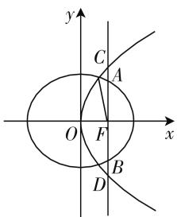

# 与抛物线共焦点的焦半径的定值与应用

# ● 江苏省海安高级中学 王太和

抛物线与椭圆、双曲线共焦点问题是圆锥曲线中多个曲线之间位置关系中的常见类型，也是历年高考数学中比较常见的一类题型。此类问题，结合圆锥曲线的定义、方程与几何性质等，合理交汇与融合不同圆锥曲线之间的位置关系，碰撞出闪亮的火花。特别地，结合圆锥曲线的对称性与焦半径公式，可以得以确定与焦半径有关的一些相关结论。下面通过证明给出与抛物线共焦点的焦半径长度的定值结论，并结合实例剖析其应用。

# 一、结论展示

结论 1: 已知椭圆 $C_{1}:\frac{x^{2}}{a^{2}}+\frac{y^{2}}{b^{2}}=1(a>b>0)$ 的右焦点 F 与抛物线 $C_{2}$ 的焦点重合, $C_{1}$ 的中心与 $C_{2}$ 的顶点重合. 设 M 是 $C_{1}$ 与 $C_{2}$ 的公共点, 则 $|MF|$ 的值为一个定值 $\frac{c^{2}+a^{2}}{c+a}$ , 其中 $c=\sqrt{a^{2}-b^{2}}$ .

证明:由已知可设 $C_{2}$ 的方程为 $y^{2}=4cx$ ，其中 $c=\sqrt{a^{2}-b^{2}}$ .

设公共点 $M(x_0, y_0)$ ，由于 $C_2$ 的准线为 $x = -c$ ，焦点 $F(c, 0)$ ，所以由椭圆与抛物线的焦半径公式得 $\left\{ \begin{array}{l} |MF| = a - ex_0 = a - \frac{c}{a} x_0, \\ |MF| = x_0 + c, \end{array} \right.$ 整理可得 $x_0 = \frac{a(a - c)}{a + c}$ ，代入 $y^2 = 4cx$ ，可得 $y_0^2 = \frac{4ac(a - c)}{a + c}$ ，而 $|MF|^2 = (x_0 - c)^2 + (y_0 - 0)^2 = \left[\frac{a(a - c)}{a + c} - c\right]^2 + \frac{4ac(a - c)}{a + c} = \frac{(c^2 + a^2)^2}{(c + a)^2}$ ，所以 $|MF| = \frac{c^2 + a^2}{c + a}$ ，其是一个定值，从而结论得证.

结论2:已知双曲线 $C_{1}:\frac{x^{2}}{a^{2}}-\frac{y^{2}}{b^{2}}=1(a>0,b>0)$ 的右焦点F与抛物线 $C_{2}$ 的焦点重合, $C_{1}$ 的中心与 $C_{2}$ 的顶点重合.设M是 $C_{1}$ 与 $C_{2}$ 的公共点,则 $|MF|$ 的值为一个定值 $\frac{c^{2}+a^{2}}{c-a}$ ,其中 $c=\sqrt{a^{2}+b^{2}}$ .

证明:由已知可设 $C_{2}$ 的方程为 $y^{2}=4cx$ ，其中 $c=\sqrt{a^{2}+b^{2}}$ .

设公共点 $M(x_0, y_0)$ ，由于 $C_2$ 的准线为 $x = -c$ ，焦点 $F(c, 0)$ ，所以由双曲线与抛物线的焦半径公式得 $\left\{ \begin{array}{l} |MF| = ex_0 - a = \frac{c}{a} x_0 - a, \\ |MF| = x_0 + c, \end{array} \right.$ 整理可得 $x_0 = \frac{a(c + a)}{c - a}$ ，代入 $y^2 = 4cx$ ，可得 $y_0^2 = \frac{4ac(c + a)}{c - a}$ ，而 $|MF|^2 = (x_0 - c)^2 + (y_0 - 0)^2 = \left(\frac{a(c + a)}{c - a} - c\right)^2 + \frac{4ac(c + a)}{c - a} = \frac{(c^2 + a^2)^2}{(c - a)^2}$ ，所以 $|MF| = \frac{c^2 + a^2}{c - a}$ ，其是一个定值，从而结论得证。

以上两个有关椭圆、双曲线与抛物线共焦点的焦半径长度的定值性结论，具有一定的对称性与完美性，两者之间又可以进行类比与转化，可用来简单快捷地处理一些椭圆、双曲线中与抛物线共焦点的焦半径长度有关的数学问题，从而更加有效地提高解题速度，提升解题效益.

# 二、结论应用

# 1. 参数求值

例 1 抛物线 $y^{2}=8x$ 的焦点 F 与双曲线 $\frac{x^{2}}{a^{2}}-\frac{y^{2}}{b^{2}}=1(a>0,b>0)$ 右焦点重合，又 P 为两曲线的一个公共交点，且 $\left|PF\right|=5$ ，则双曲线的实轴长为（）.

A. 1 B. 2 C. $\sqrt{17} - 3$ D. 6

分析:结合抛物线与双曲线的共焦点的特征来确定抛物线的方程,并结合条件来确定相应的关系式,从而得以确定参数c的值,结合结论2的应用并利用参数c的值,可以求解参数a的值,最后得以确定双曲线的实轴长.

解析:由已知可得抛物线的方程为 $y^{2}=4cx=8x$ ，
可得 c=2，结合结论 2 可得 $\left|PF\right|=\frac{c^{2}+a^{2}}{c-a}=5$ ，结合 c

=2, 可得 a=1, 所以双曲线的实轴长 2a=2.

故选 B.

点评: 直接利用结论来确定参数的求值, 破解的关键是抓住与抛物线共焦点的焦半径的定值来建立相应的关系式, 避免更多的转化与运算, 从而得以快捷求解相应的参数值. 参数值的求解为进一步确定相关的概念奠定基础.

# 2. 方程求解

例 2 （2020 年全国卷Ⅱ 理科第 19 题）已知椭圆 $C_{1}:\frac{x^{2}}{a^{2}}+\frac{y^{2}}{b^{2}}=1(a>b>0)$ 的右焦点 F 与抛物线 $C_{2}$ 的焦点重合， $C_{1}$ 的中心与 $C_{2}$ 的顶点重合。过点 F 且与 x 轴垂直的直线交 $C_{1}$ 于 A, B 两点，交 $C_{2}$ 于 C, D 两点，且 $|CD|=\frac{4}{3}|AB|$ 。

(1) 求 $C_{1}$ 的离心率;  
(2) 设 M 是 $C_{1}$ 与 $C_{2}$ 的公共点, 若 $|MF|=5$ , 求 $C_{1}$ 与 $C_{2}$ 的标准方程.

分析:(1)根据条件求出椭圆与抛物线的通径端点的纵坐标(用参数a,b,c表示),根据条件中的关系式建立方程,并结合参数之间的关系的转化即可求解离心率;(2)结合抛物线与椭圆的共焦点的特征来确定抛物线的方程,结合结论1的应用来确定参数c的值,从而得以确定对应的曲线方程.

解析:(1)由已知可设 $C_{2}$ 的方程为 $y^{2}=4cx$ ，其中 $c=\sqrt{a^{2}-b^{2}}$ .

不妨设 A, C 在第一象限, 如图 1, 由题设得 A, B 的纵坐标分别为 $\frac{b^{2}}{a}, -\frac{b^{2}}{a}$ ; C, D 的纵坐标分别为 2c, -2c;

text_image

y
C
A
O
F
x
B
D

图1

故 $|AB|=\frac{2b^{2}}{a}$ ， $|CD|=4c$ ，由 $|CD|=\frac{4}{3}|AB|$ ，得 $4c=\frac{8b^{2}}{3a}$ ，即 $3\times\frac{c}{a}=2-2\left(\frac{c}{a}\right)^{2}$ ，解得 $\frac{c}{a}=-2$ （舍去）， $\frac{c}{a}=\frac{1}{2}$ ，所以 $C_{1}$ 的离心率为 $\frac{1}{2}$ .

(2) 由(1)知, $a = 2c, b = \sqrt{3}c$ , 故 $C_{1}: \frac{x^{2}}{4c^{2}} + \frac{y^{2}}{3c^{2}} = 1, C_{2}: y^{2} = 4cx$ , 结合结论1可得 $|MF| = \frac{c^{2} + a^{2}}{c + a} = \frac{5}{3}c$

=5, 解得 c=3, 所以 $C_{1}$ 的标准方程为 $\frac{x^{2}}{36}+\frac{y^{2}}{27}=1$ , $C_{2}$ 的标准方程为 $y^{2}=12x$ .

点评: 直接利用结论可快捷确定参数值, 从而为求解曲线的方程提供条件, 破解的关键是抓住与抛物线共焦点的焦半径的定值来建立相应的关系式, 巧妙转化, 直接应用, 为解题指明方向, 节约时间, 提升效益.

# 3. 离心率确定

例 3 已知双曲线 $C_{1}:\frac{x^{2}}{a^{2}}-\frac{y^{2}}{b^{2}}=1(a>0,b>0)$ 的左右焦点分别为 $F_{1},F_{2}$ ，抛物线 $C_{2}:y^{2}=2px(p>0)$ 的焦点与双曲线 $C_{1}$ 的一个焦点重合， $C_{1}$ 与 $C_{2}$ 在第一象限相交于点 P，且 $\left|F_{1}F_{2}\right|=\left|PF_{1}\right|$ ，则双曲线 $C_{1}$ 的离心率为 \_\_\_\_.

分析:结合抛物线与双曲线的共焦点的特征来确定抛物线的方程,利用双曲线的定义的巧妙转化,并利用结论2的应用来建立相应的方程,通过转化并结合关于离心率e的二次方程的求解来确定相应的离心率.

解析:由已知可设 $C_{2}$ 的方程为 $y^{2}=4cx$ ，其中 $c=\sqrt{a^{2}+b^{2}}$ .

根据双曲线的定义和 $\left|F_{1}F_{2}\right|=\left|PF_{1}\right|=2c$ ，可知 $\left|PF_{2}\right|=2c-2a.$

结合结论 2 可得 $\left|PF_{2}\right|=\frac{c^{2}+a^{2}}{c-a}=2c-2a$ ，整理可得 $c^{2}-4ac+a^{2}=0$ ，则有 $e^{2}-4e+1=0(e>1)$ ，解得 $e=2+\sqrt{3}$ .

故填答案: $2+\sqrt{3}$ .

点评: 直接利用结论来建立相应的方程, 通过巧妙转化并借助关于离心率 e 的二次方程的求解来确定目的, 破解的关键是抓住与抛物线共焦点的焦半径的定值来建立相应的方程, 经常还综合圆锥曲线的定义以及几何性质等, 巧妙综合, 合理应用.

有关椭圆、双曲线与抛物线共焦点的焦半径长度的定值性结论，结论简单易记忆，同时两者之间又有一定的联系与区别。借助共焦点的焦半径长度的定值性结论来破解相关的椭圆、双曲线与抛物线共焦点问题时，可以更加快捷简单地处理相关问题，方向直接，目的明确，操作性强，效益性高，值得推广与应用。F