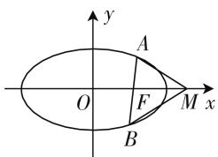
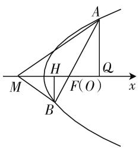
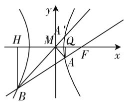

# 从不同坐标系探索圆锥曲线的解题途径

—— 一道高考数学题结论的推广

湖北省襄阳市襄州一中 李继武

我们知道,圆锥曲线的解题教学可为培养学生的理性思维和数学素养提供很好的素材.将某个问题一般化或类比拓展到与它相似的另一个对象中去,都是产生数学猜想的重要手段,而二者有意识的结合,则可以把数学猜想引向深入,进而揭示出某类数学问题更一般的规律.本文从一道高考椭圆解答题出发,将命题进行变式引申并拓展到其他的圆锥曲线,然后在两种平面坐标系下对得出的两个结论给出证明.

# 一、题目再现

2018年高考数学全国卷1(理科)第19题:

设椭圆 $C: \frac{x^{2}}{2} + y^{2} = 1$ 的右焦点为 F，过 F 的直线 l 与 C 交于 A, B 两点，点 M 的坐标为 $(2,0)$ .

(1) 当 l 与 x 轴垂直时, 求直线 AM 的方程;  
(2) 设 O 为坐标原点, 证明: $\angle OMA = \angle OMB$ .

常规解法简解：

解:(1) 如图 1, 易得点 A 的坐标为 $\left(1, \frac{\sqrt{2}}{2}\right)$ 或 $\left(1, -\frac{\sqrt{2}}{2}\right)$ .

text_image

y
A
O
F
M x
B

图 1

又点 M 的坐标为 $(2,0)$ ，所以 AM 的方程为 $y = -\frac{\sqrt{2}}{2}x + \sqrt{2}$ 或 $y = \frac{\sqrt{2}}{2}x - \sqrt{2}$ .

(2) 当 l 与 x 轴重合时, $\angle OMA = \angle OMB = 0^{\circ}$ .

当 l 与 x 轴垂直时, OM 为 AB 的垂直平分线, 所以 $\angle OMA = \angle OMB$ .

当 $l$ 与 $x$ 轴不重合也不垂直时，设 $l$ 的方程为 $y = k(x - 1)(k \neq 0), A(x_1, y_1), B(x_2, y_2)$ ，将 $y = k(x - 1)$

1) 代入 $\frac{x^2}{2} + y^2 = 1$ ，得 $(2k^2 + 1)x^2 - 4k^2x + 2k^2 - 2 =$

0, 所以 $x_{1} + x_{2} = \frac{4k^{2}}{2k^{2} + 1}, x_{1}x_{2} = \frac{2k^{2} - 2}{2k^{2} + 1}$ .

而直线 $MA, MB$ 的斜率之和为 $k_{MA} + k_{MB} = \frac{y_1}{x_1 - 2} + \frac{y_2}{x_2 - 2}$ .

由 $y_{1} = kx_{1} - k, y_{2} = kx_{2} - k$ ，得 $k_{MA} + k_{MB} = \frac{2kx_{1}x_{2} - 3k(x_{1} + x_{2}) + 4k}{(x_{1} - 2)(x_{2} - 2)}$ ，则 $2kx_{1}x_{2} - 3k(x_{1} +$

$x_{2}) + 4k = \frac{4k^{3} - 4k - 12k^{3} + 8k^{3} + 4k}{2k^{2} + 1} = 0$ ，从而 $k_{MA}$

$+k_{MB}=0$ , 故 MA, MB 的倾斜角互补, 且 A, B 在 x 轴上下两侧, 所以 $\angle OMA = \angle OMB$ .

综上， $\angle OMA = \angle OMB.$

思考 1: 分析这道题两问的实质, 都与直线 MA 的斜率有关, 并且 $\angle OMA = \angle OMB$ 等价于直线 MA 与 MB 的斜率之和等于零, 我们运用直线 MA 与直线 l 的交点在椭圆 C 上这一条件, 构造关于其斜率满足的二次方程, 结合韦达定理就可获证. 于是就产生了以下新的解法:

设经过焦点 $F(1,0)$ 的直线 l 的方程为 x-1=ty.
设直线 MA 的方程为 $y = k(x - 2)$ ,

由 $\left\{\begin{aligned}x-1&=ty,\\ y=k(x-2)\end{aligned}\right.$ 得交点 $A\left(\frac{2kt-1}{kt-1},\frac{k}{kt-1}\right)$ ，代入椭圆方程 $\frac{x^{2}}{2}+y^{2}=1$ ，得到一个关于k的二次方程： $2k^{2}(t^{2}+1)-1=0$ ，由韦达定理得 $k_{1}+k_{2}=0$ 。

因为 A, B 分别在 x 轴上下两侧, 所以 $\angle OMA = \angle OMB$ ; 当 t = 0 时, 得 $k^{2} = \frac{1}{2}, k = \pm \frac{\sqrt{2}}{2}$ .

所以 $MA$ 的方程为 $y = \pm \frac{\sqrt{2}}{2} (x - 2)$ .

这个解法抓住此题两问之间的内在联系,把角度转化为直线的斜率,运用方程思想使之得到整体性地解决,可谓“一箭双雕”;并且相对于常规解法,运算量明显少一些.

思考 2: 基于圆锥曲线定义的统一性, 我们有理由推测椭圆中这个关于角度相等的定值问题, 在其他圆锥曲线中是否也存在? 2018 年高考数学全国卷 1(文科)20 题给出了肯定的回答:

设抛物线 $C: y^{2} = 2x$ ，点 $A(2,0)$ ， $B(-2,0)$ ，过点 A 的直线 l 与 C 交于 M, N 两点.

(1) 当 l 与 x 轴垂直时, 求直线 BM 的方程;  
(2) 证明: $\angle ABM = \angle ABN.$

# 二、拓展研究

我们来推广圆锥曲线的一个性质：

推广结论 1: 设焦点在 x 轴的圆锥曲线, F 是指定的一个焦点, 那么对于圆锥曲线任意一条经过该焦点 F 的弦 AB, 在 x 轴上存在唯一的点 M, 总有 $\angle OMA = \angle OMB$ .

分析:为了方便应用圆锥曲线的极坐标方程,我们把此题的焦点F和M对称到左边去.并且 $\angle OMA=\angle OMB$ 等价于 $\angle FMA=\angle FMB$ .(注意到等角的补角相等)

证明:(极坐标法)如图2,以F为极点,x轴的正方向为极轴建立极坐标系,圆锥曲线的极坐标方程是: $\rho=\frac{ep}{1-e\cos\theta}$ ,设 $A(\rho,\theta)$ ,点 $M(m,0)$ ,分别过A,B向x轴作垂线,垂足依次为H,Q,当m<0时,过焦点F的弦 AB 两端分别作 AQ, BH 垂直于 x 轴, Q, H 是垂足.

text_image

A
H
Q
M
F(O)
B
x

图2

由 $\angle FMA = \angle FMB$ ，运用三角形内角平分线性质有 $\frac{\rho_{A}}{\rho_{B}} = \frac{MA}{MB} = \frac{MQ}{MH}$ ，所以要证 $\angle FMA = \angle FMB$ ，只需证 $\frac{\frac{ep}{1 - e\cos\theta}}{\frac{ep}{1 + e\cos\theta}} = \frac{\frac{ep}{1 - e\cos\theta}\cos\theta - m}{- \frac{ep}{1 + \cos\theta}\cos\theta - m}$ , 即 $\frac{1 + e\cos\theta}{1 - e\cos\theta} =$

$$
\frac {(1 + e \cos \theta) (e p \cos \theta - m + m e \cos \theta)}{(1 - \cos \theta) (- e p \cos \theta - m - m e \cos \theta)}, \quad (*)
$$

化简得 $ep\cos\theta=em\cos\theta,\cos\theta(m+p)=0$ ，所以无论 $\theta$ 为何值，都有 m=-p，使得 $\angle OMA=\angle OMB$ .

当 m > 0 时, 若 $\angle OMA = \angle OMB$ , 也得 $\frac{\rho_{A}}{\rho_{B}} =$

$\frac{MQ}{MH}, \frac{\frac{ep}{1 - e\cos\theta}}{\frac{ep}{1 - e\cos(\theta + \pi)}} = \frac{m - \frac{ep}{1 - e\cos\theta}\cos\theta}{m + \frac{ep}{1 - \cos(\theta + \pi)}\cos\theta}$ , 与

式子 $(\ast)$ 相同.

得 m = -p < 0，这与 m > 0 矛盾，所以存在唯一的点 $M(-p, 0)$ 满足条件 $\angle OMA = \angle OMB$ 。定义中，和焦点 F 相应的准线和 x 轴的交点即为所求的点 M。

考虑到双曲线有左右两支,上述结论类比到双曲线上时就要按照弦两个端点 A,B 是在同一支还是在不同支来分类讨论.

推广结论 2: 设有焦点 F 在 x 轴上的双曲线, O 为双曲线的中心. 过焦点 F 的直线 l, 与双曲线相交于 A, B 两点, 那么存在唯一的点 $M(m,0)$ , 满足:

(1) 如果 A, B 两点在双曲线的同一支上, 使得 $\angle OMA = \angle OMB$ ;  
(2) 如果 A, B 两点分别在双曲线的两支上, 那么 $\angle OMA + \angle OMB = 180^{\circ}$ .

证明: 设 $\rho = \frac{ep}{1 - e\cos\theta} (\rho$ 也可以取负值) 当焦点 F 在弦 AB 上时, 结论 1 中已经证过; 下面证明当弦的端点 B, A 分别在双曲线左右两支上时, 存在点 $M(m,0)$ , 使得 $\angle OMA +$

text_image

H
M
A'
Q
F
x
y
B

图3

$\angle OMB = 180^{\circ}$ 总成立.（注意到 $k_{1} + k_{2} = 0$ 时可能 $\angle OMA + \angle OMB = 180^{\circ}$ 或者是 $\angle OMA = \angle OMB$ 按AB在焦点的同侧或者是异侧而区分）

如图 3, 延长 BM 交双曲线于 $A'$ , 则 x 轴为 $\angle A'MA$ 的平分线, $\angle AMB$ 的外角平分线.

分别作 AQ, BH ⊥ x 轴, 则 $\frac{\rho_{A}}{\rho_{B}} = \frac{MA}{MB} = \frac{MQ}{MH}$ ,

所以 $\frac{\rho_{A}}{\rho_{B}}=\frac{MQ}{MH}$ ,

$$
\text {即} \frac {\frac {e p}{1 - e \cos \theta}}{- \frac {e p}{1 + e \cos \theta}} = \frac {- m - \frac {e p}{1 - e \cos \theta} \cos (\theta - \pi)}{m - \frac {e p}{1 + e \cos \theta} \cos (\theta - \pi)},
$$

化简得 $\cos\theta(m+p)=0,m=-p.$

所以存在唯一的点 $M(-p,0)$ ，使得 $\angle OMA + \angle OMB = 180^{\circ}$ 成立.

即证得结论 2 成立. W