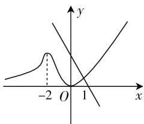
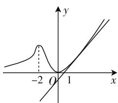

# 例谈解题后的反思

—— 以一道导数综合题为例

● 安徽省临泉第一中学 代忠兴

解题后的反思是提升学生解题能力的重要方式.但反思的内容是什么呢,众说纷纭.笔者认为:从解题的通法、思维的误区、命题的根源、解题的巧法及前后问的关联等方面进行反思,可收到事半功倍之效.

下面以一道导数综合题为例进行说明应如何进行解题后的反思.

题目 已知函数 $f(x)=x^{2}\mathrm{e}^{x}$ .

(1) 过点 $P(1,0)$ 存在几条直线与曲线 $y=f(x)$ 相切？并说明理由.  
(2) 若 $f(x) \geqslant k (x - 1)$ 对任意 $x \in \mathbf{R}$ 恒成立, 求实数 $k$ 的取值范围.

第(1)问考查了导数几何意义的应用, 即求曲线过某点的切线问题. 设切点坐标为 $(x_{0}, x_{0}^{2}\mathrm{e}^{x_{0}})$ ，求导得 $f'(x) = \mathrm{e}^{x}(x^{2} + 2x)$ ，则切线斜率 $k = \mathrm{e}^{x_{0}}(x_{0}^{2} + 2x_{0})$ . 因为点 $P(1,0)$ 也在切线上，因此 $k = \frac{x_{0}^{2}\mathrm{e}^{x_{0}}}{x_{0} - 1}$ ，所以 $\frac{x_{0}^{2}\mathrm{e}^{x_{0}}}{x_{0} - 1} = \mathrm{e}^{x_{0}}(x_{0}^{2} + 2x_{0})$ ，整理得 $x_{0}(x_{0} + \sqrt{2})(x_{0} - \sqrt{2})\mathrm{e}^{x_{0}} = 0$ ，解得 $x_{0} = 0, x_{0} = -\sqrt{2}, x_{0} = \sqrt{2}$ ，故过 $P(1,0)$ 的切线有三条.

第(2)问属于不等式恒成立问题,是高考考查导数应用问题的常考题型.下面从几个不同的视角进行反思,供同学们参考.

# 一、反思问题的通法

由不等式恒成立,确定参数范围问题处理的通法是什么?

构造函数,利用导数求函数的最值.对于在某区间内,不等式 $f(x) \geqslant g(x)$ 恒成立问题,可通过构造函数 $h(x) = f(x) - g(x)$ ,求函数 $h(x)$ 在该区间内的最小值,使 $h_{\min}(x) \geqslant 0$ ;对于在某区间内,不等式 $f(x) \leqslant g(x)$ 恒成立问题,可通过求函数 $h(x)$ 在该区间内的最大值,使 $h_{\max}(x) \leqslant 0$ .

若函数 $g(x) > 0$ ，也可以通过作商法构造函数.

本题的求解思路是什么？

本题可通过作差直接构造函数，由 $f(x) \geqslant k(x - 1)$ ，即 $x^{2}e^{x} \geqslant k(x - 1)$ ， $x^{2}e^{x} - k(x - 1) \geqslant 0$ ，因此可令 $g(x) = x^{2}e^{x} - k(x - 1)$ ，进而通过求函数的最值来求解。因参数 k 的存在，故需要对参数的可能取值进行讨论。

明确了问题的通法,也就掌握了解题的工具.

# 二、反思思维的误区

本题求解中部分学生采用直接求导的方法, 即对函数 $g(x)=x^{2}\mathrm{e}^{x}-k(x-1)$ 求导得 $g'(x)=\mathrm{e}^{x}(x^{2}+2x)-k$ , 但导函数的零点无法求解, 正负无法判断, 以及如何对参数进行讨论, 分类的标准是什么, 都不明确.

另外也有同学采用了二次求导, 得 $g''(x) = \mathrm{e}^{x}(x^{2} + 4x + 2)$ , 但解题仍然无法继续.

我们可从问题探源的基础上进行分析, $x^{2}e^{x}\geqslant k(x-1)$ ，从图像的角度来看，即使得 $f(x)$ 的图像恒在直线 $y=k(x-1)$ 的上方，包括二者相切的情况.

从这一角度来看, 当 k=0 时, 直线与 x 轴重合, 不等式恒成立; 当 k<0 时, 由图 1 可知不等式不恒成立, 因此只需选取一个特殊值 $x_{0}$ , 使不等式不成立即可.

text_image

-2
O
1
x
y

图1

这样,在求导之前,我们就明确了需要讨论的类型.

接下来的问题就是如何将这一分析过程落实为数学文字或符号语言.

方法 1: 当 k=0 时, 不等式 $x^{2}e^{x}-k(x-1)\geqslant0$ 显然成立;

当 k<0 时， $g(0)=k<0$ ，不等式 $x^{2}e^{x}-k(x-1)\geqslant0$ 不成立；

当 $k > 0$ 时，若 $x \leqslant 1$ ，则 $-k(x - 1) \geqslant 0$ ，则 $x^2\mathrm{e}^x$

$-k(x-1)\geqslant0$ 成立.故只需要讨论x>1的情况.

对 $g(x)=x^{2}\mathrm{e}^{x}-k(x-1)$ 求导得 $g'(x)=\mathrm{e}^{x}(x^{2}+2x)-k, g''(x)=\mathrm{e}^{x}(x^{2}+4x+2)$ ，当 x>1 时， $g''(x)>0, g'(x)$ 单调递增， $g'(x)>g'(1)=3\mathrm{e}-k.$

如果 $3e-k \geqslant 0$ ，当 x > 1 时， $g'(x) > g'(1) \geqslant 0$ ， $g(x)$ 单调递增， $g(x) > g(1) = e > 0$ ，所以 $0 < k \leqslant 3e$ 时， $x^{2}e^{x} - k(x - 1) \geqslant 0$ 成立.

如果 $k > 3\mathrm{e}, g'(1) < 0, g'(\ln k) = [(\ln k)^2 + 2\ln k]k - k > 0$ ，存在 $x_0 \in (1, \ln k)$ ，使得 $g'(x_0) = (x_0^2 + 2x_0)\mathrm{e}^{x_0} - k = 0$ ，即 $k = (x_0^2 + 2x_0)\mathrm{e}^{x_0}$ . ①

所以 $g_{\min}(x)=g(x_{0})$ ，所以 $f(x)\geqslant k(x-1)$ 恒成立，只需 $g(x_{0})\geqslant0$ ，又 $g(x)=x_{0}^{2}\mathrm{e}^{x_{0}}-k(x_{0}-1)$ ，将式①代入得 $x_{0}^{2}\mathrm{e}^{x_{0}}-(x_{0}^{2}+2x_{0})\mathrm{e}^{x_{0}}(x_{0}-1)\geqslant0$ ，化简得 $x_{0}(x_{0}+\sqrt{2})(x_{0}-\sqrt{2})\mathrm{e}^{x_{0}}\leqslant0$ .

因为 $x_{0}>1$ ，所以 $1<x_{0}\leqslant\sqrt{2}$ .

在式 ① 中令 $k = h(x) = (x^2 + 2x)\mathrm{e}^x (x \in (1, \sqrt{2}])$ ，求导得 $h'(x) = (x^2 + 4x + 2)\mathrm{e}^x > 0$ ，所以 $h_{\max}(x) = h(\sqrt{2}) = (2 + 2\sqrt{2})\mathrm{e}^{\sqrt{2}}$ ，即 $3\mathrm{e} < k \leqslant (2 + 2\sqrt{2})\mathrm{e}^{\sqrt{2}}$ 时， $f(x) \geqslant k(x - 1)$ 恒成立.

综上， $k$ 的取值范围是 $[0, (2 + 2\sqrt{2})\mathrm{e}^{\sqrt{2}}]$ .

本题能够顺利求解的关键是对问题根源的探究及通法的梳理. 这也提醒我们在解题时, 不要盲目求导, 应先想后算, 包括当 $k > 0$ 时, $x \leqslant 1$ , 则不等式 $f(x) \geqslant k(x - 1)$ 显然成立, 因此只需讨论 $x > 1$ 的情况.

另外，也可采用必要性探路的方法求解，因为对任意 $x \in \mathbf{R}$ ，不等式 $x^2\mathrm{e}^x \geqslant k(x - 1)$ 恒成立，故 $x = 0$ 时，不等式也成立，将 $x = 0$ 代入可得 $k \geqslant 0$ ，接下来只要在 $[0, +\infty)$ 内进一步探究满足条件的范围即可.

# 三、反思简洁的方法

本题是否有相对简洁的方法?

方法 2: 当 k=0 时, $x^{2}e^{x} \geqslant k(x-1)$ 成立.

当 $k < 0$ 时， $f(0) = 0 < k(0 - 1)$ ，故不等式 $f(x) \geqslant k(x - 1)$ 不成立.

当 $k > 0$ 时，若 $x \leqslant 1$ ，则不等式 $f(x) \geqslant k(x - 1)$ 显然成立.

下面讨论 $x > 1$ 的情况：

由 $x^{2}\mathrm{e}^{x}\geqslant k(x-1)$ ，得 $\frac{x^{2}\mathrm{e}^{x}}{x-1}\geqslant k$ ，则问题转化为此不等式在 $x\in(1,+\infty)$ 内恒成立.

设 $t(x)=\frac{x^{2}\mathrm{e}^{x}}{x-1}(x>1)$ ，求导得 $t'(x)=$

$$
\frac {\mathrm{e} ^ {x} (x ^ {2} + 2 x) (x - 1) - x ^ {2} \mathrm{e} ^ {x}}{(x - 1) ^ {2}} = \frac {\mathrm{e} ^ {x} x (x + \sqrt {2}) (x - \sqrt {2})}{(x - 1) ^ {2}}.
$$

当 $1 < x < \sqrt{2}$ 时， $t'(x) < 0, t(x)$ 单调递减；

当 $x > \sqrt{2}$ 时， $t'(x) > 0, t(x)$ 单调递增.

所以 $t_{\min}(x) = t(\sqrt{2}) = \frac{2e^{\sqrt{2}}}{\sqrt{2} - 1} = (2 + 2\sqrt{2})e^{\sqrt{2}}$ ，即 $k\leqslant (2 + 2\sqrt{2})e^{\sqrt{2}}.$

综上， $k$ 的取值范围是 $[0, (2 + 2\sqrt{2})\mathrm{e}^{\sqrt{2}}]$ .

参数分离法是处理不等式恒成立问题的重要方法,将参数分离后,就转化为求确定函数的最值,回避了对参数的讨论.但在分离参数的转化过程中,要注意变形的等价性.在本方法中,因为当 $x-1\leqslant0$ 时,不等式显然成立.故只需要判断x-1>0的情况,因此可直接进行分离,否则需要进行讨论.

# 四、反思前后问的关联

对于一道题目中的多问,常常存在某种联系,即前一问的结论往往是后一问的条件.那么本题的第(1)问与第(2)问是否有关联?

对函数 $f(x)=x^{2}\mathrm{e}^{x}$ 求导得 $f'(x)=x(x+2)\mathrm{e}^{x}$ ，所以在区间 $(-∞,-2),(0,+∞)$ ， $f'(x)>0,f(x)$ 单调递增；在区间 $(-2,0),f'(x)<0,f(x)$ 单调递减，所以 $f_{\max}(x)=f(-2)=\frac{4}{\mathrm{e}^{2}},f_{\min}(x)=f(0)$

text_image

Graph showing a function with a local peak at x=-2 and a line intersecting the x-axis at x=1, y=0.

图 2

=0, 且在定义域内 $f(x) \geqslant 0$ , $f(x)$ 的草图如图 2 所示.

当 k=0 时, 不等式 $x^{2}e^{x} \geqslant k(x-1)$ 恒成立.

当 k<0 时， $f(0)=0<-k$ ，所以 $x^{2}e^{x}\geqslant k(x-1)$ 不是恒成立.

当 $k > 0$ 时，由第(1)问的解答可知，直线 $y = k(x - 1)$ 与曲线 $f(x) = x^{2}\mathrm{e}^{x}$ 相切于点 $(\sqrt{2},2\mathrm{e}^{\sqrt{2}})$ ，此时直线的斜率 $k = \frac{2\mathrm{e}^{\sqrt{2}}}{\sqrt{2} - 1} = (2\sqrt{2} +2)\mathrm{e}^{\sqrt{2}}$ ，所以 $0 < k \leqslant (2 + 2\sqrt{2})\mathrm{e}^{\sqrt{2}}$ 。

综上， $k$ 的取值范围是 $[0, (2 + 2\sqrt{2})\mathrm{e}^{\sqrt{2}}]$ .

此方法源自对图像位置关系的准确把握,也体现了命题前后问之间的关联.

另外,也可反思问题的变式形式,如将不等式恒成立问题,变换为不等式能成立,不等式恰成立等,也可以通过变换函数类型来进行讲评,在此不再举例. F