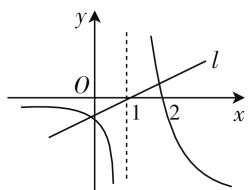
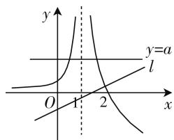

# 剖析一道考题 提炼三种策略

—— 以一道高考题为例

# 湖南师范大学附属中学 洪利民

在高三数学复习备考过程中,教师常以历届高考试题为例进行解题教学,但往往就题论题,忽视了高考试题的潜在价值.高考题是高考命题专家潜心研究出来的原创试题,每个试题都代表一种类型.在教学中,教师若引导学生充分认识高考试题的结构,明确其典型性和代表性,并从解题中提炼出解决这类问题的基本策略和思想方法,无疑能帮助学生跳出题海,减负启智,从而提高复习效率,优化理性思维.本文以一道导数的应用为背景的高考试题为例,谈谈这方面的教学体会.

# 一、试题内容与结构

题目 （2016年全国卷Ⅰ理科第21题(1))已知函数 $f(x)=(x-2)\mathrm{e}^{x}+a(x-1)^{2}$ 有两个零点，求实数 a 的取值范围.

本题虽题简意明,但在试题结构和解题策略上都极具典型性和代表性.审题时要让学生明确两方面的问题:第一,在宏观上本题代表一种题型,即“求带参函数有几个零点的条件”.第二,在微观上函数 $f(x)$ 有三个特点,即① $f(x)$ 是一个含参数的超越函数;② $f(x)$ 的定义域为 R;③ $f(x)$ 的零点个数与参数 a 的取值有关.

同时还要让学生认识到,由于 $f(x)$ 是超越函数,在求当 a 在哪个范围内取值时 $f(x)$ 有两个零点,需要利用导数分析函数的性质和图像,通过数形结合来解决问题.

# 二、解题策略与方法

函数的零点与方程的实根和图像的交点,三位一体,相辅相成,相互转化.如何处理参数 a 与自变量 x 的相互关系,是解题的突破口,为此可引导学生提出三种解题策略.

# 策略一: 参数不分离

因为函数 $f(x)$ 有两个零点, 则函数 $f(x)$ 的图像与 x 轴有两个不同的公共点. 从分析函数的单调性入手,通过分类讨论,考察函数 $f(x)$ 的图像与 x 轴的公共点个数,从中找出所需条件.

解法一: $f'(x)=(x-1)(e^{x}+2a)$ .

(1) 当 a > 0 时，由 $f'(x) < 0$ ，得 x < 1，则 $f(x)$ 在 $(-∞, 1)$ 上单调递减，在 $(1, +∞)$ 上单调递增.

因为 $f(1) = -\mathrm{e} < 0, f(2) = a > 0$ ，则 $f(x)$ 在 $(1, +\infty)$ 上仅有 1 个零点.

因为 $f(0)=a-2$ ，若 $a \geqslant 2$ ，则 $f(0) \geqslant 0$ ;

若 0 < a < 2，取 $x_{0} = \ln \frac{a}{2} < 0$ ，则 $f(x_{0}) = (x_{0} - 2) \cdot \frac{a}{2} + a(x_{0} - 1)^{2} = ax_{0} \left( x_{0} - \frac{3}{2} \right) > 0$ ，所以 $f(x)$ 在 $(-∞, 1)$ 上仅有 1 个零点，从而 $f(x)$ 有 2 个零点，符合题意.

(2) 当 a=0 时, $f(x)=(x-2)\mathrm{e}^{x}$ , 则 $f(x)$ 只有 1 个零点 x=2, 不合题意.  
(3) 当 $-\frac{e}{2}<a<0$ 时， $\ln(-2a)<1$ ，由 $f'(x)<0$ ，得 $\ln(-2a)<x<1$ ，则 $f(x)$ 在 $(\ln(-2a),1)$ 上单调递减，在 $(-∞, \ln(-2a))$ 和 $(1,+∞)$ 上单调递增，所以 $x=\ln(-2a)$ 是 $f(x)$ 的极大值点，x=1 是 $f(x)$ 的极小值点.

因为当 $x \leqslant 1$ 时， $f(x) < 0$ ，所以 $f(x)$ 至多1个零点，不合题意.

(4) 当 $a = -\frac{e}{2}$ 时, $f'(x) = (x - 1)(e^x - e) \geqslant 0$ , 则 $f(x)$ 单调递增, 所以 $f(x)$ 至多 1 个零点, 不合题意.  
(5) 当 $a < -\frac{e}{2}$ 时, $\ln(-2a) > 1$ , 由 $f'(x) < 0$ , 得 $1 < x < \ln(-2a)$ , 则 $f(x)$ 在 $(1, \ln(-2a))$ 上单调递减, 在 $(-∞, 1)$ 和 $(\ln(-2a), +∞)$ 上单调递增, 所以 $x = \ln(-2a)$ 是 $f(x)$ 的极小值点, x = 1 是 $f(x)$ 的极大值点.

因为当 $x \leqslant 1$ 时， $f(x) < 0$ ，所以 $f(x)$ 至多1个

零点,不合题意.

综上分析, $a$ 的取值范围是 $(0, +\infty)$ .

# 策略二: 参数半分离

因为函数 $f(x)$ 有两个零点，则方程 $f(x)=0$ 有两个不等实根。将方程 $(x-2)\mathrm{e}^{x}+a(x-1)^{2}=0$ 变形为 $a(x-1)=-\frac{(x-2)\mathrm{e}^{x}}{x-1}$ ，使得参数 a 与变量 x 处于半分离状态，则问题转化为求直线 $y=a(x-1)$ 与曲线 $y=-\frac{(x-2)\mathrm{e}^{x}}{x-1}$ 有两个公共点的条件。

解法二: 令 $f(x)=0$ ，则 $(x-2)\mathrm{e}^{x}+a(x-1)^{2}=0$ ，即 $a(x-1)=-\frac{(x-2)\mathrm{e}^{x}}{x-1}$ .设 $g(x)=-\frac{(x-2)\mathrm{e}^{x}}{x-1}$ ,
则 $g'(x)=-\frac{(x^{2}-3x+3)\mathrm{e}^{x}}{(x-1)^{2}}$ <0,所以 $g(x)$ 在 $(-∞,1)$ 和 $(1,+∞)$ 上都单调递减.

text_image

y
O
1
2
x
l

图 1

因为 $g(x)=\left(\frac{1}{x-1}-1\right)\mathrm{e}^{x}$ ，则当 $x\to1^{+}$ 时， $g(x)\to+\infty$ ; 当 $x\to1^{-}$ 时， $g(x)\to-\infty$ ; 当 $x\to-\infty$ 时， $g(x)\to0$ ; 当 $x\to+\infty$ 时， $g(x)\to-\infty$ ，所以 $g(x)$ 的大致图像如图 1 所示.

因为直线 $l: y = a(x - 1)$ 过点 $(1, 0)$ ，a 为直线 l 的斜率，由图 1 可知，当 a > 0 时，直线 l 与函数 $y = g(x)$ 的图像有 2 个交点；当 a = 0 时，直线 l 与函数 $y = g(x)$ 的图像只有 1 个交点.

下面判断当 a<0 时, 直线 l 与曲线 $y=g(x)$ (x>1) 能否有两个交点.

假设直线 l 与曲线 $y=g(x)(x>1)$ 相切于点 $P(x_{0},y_{0})$ ，则 $g'(x_{0})=\frac{y_{0}}{x_{0}-1}$ ，即 $-\frac{(x_{0}^{2}-3x_{0}+3)\mathrm{e}^{x_{0}}}{(x_{0}-1)^{2}}=-\frac{(x_{0}-2)\mathrm{e}^{x_{0}}}{(x_{0}-1)^{2}}$ ，化简得 $x_{0}^{2}-4x_{0}+5=0$ 。因为该方程无实根，则直线 l 与曲线 $y=g(x)(x>1)$ 不可能相切，从而直线 l 与曲线 $y=g(x)(x>1)$ 不会有两个交点。

综上分析, $a$ 的取值范围是 $(0, +\infty)$ .

# 策略三: 参数全分离

如果将方程 $f(x)=(x-2)\mathrm{e}^{x}+a(x-1)^{2}=0$ 变形为 $a=-\frac{(x-2)\mathrm{e}^{x}}{(x-1)^{2}}$ ，使得参数 a 与变量 x 处于全分离状态，那么问题转化为求直线 y=a 与曲线 $y=-\frac{(x-2)\mathrm{e}^{x}}{x-1}$ 有两个公共点的条件.

解法三: 令 $f(x)=0$ ，则 $(x-2)\mathrm{e}^{x}+a(x-1)^{2}=0$ ，得 $a=-\frac{(x-2)\mathrm{e}^{x}}{(x-1)^{2}}.$

设 $g(x)=-\frac{(x-2)\mathrm{e}^{x}}{(x-1)^{2}}$ ,
则 $g'(x) = -\frac{[(x-2)^{2} + 1]\mathrm{e}^{x}}{(x-1)^{3}}.$ 所以当 x > 1 时， $g'(x) < 0$ ， $g(x)$ 单调递减；当 x < 1 时， $g'(x) > 0$ ， $g(x)$ 单调递增.

text_image

y
y=a
l
O
1
2
x

图 2

因为 $g(x) = -\frac{(x - 2)\mathrm{e}^x}{(x - 1)^2} = \left[\frac{1}{(x - 1)^2} -\frac{1}{x - 1}\right]\mathrm{e}^x$ 则 $g(2) = 0$ ；当 $x > 2$ 时， $g(x) < 0$ ；当 $x < 2$ 且 $x \neq 1$ 时， $g(x) > 0$ 。

又当 $x \to 1$ 时, $g(x) \to +\infty$ ; 当 $x \to -\infty$ 时, $g(x) \to 0$ , 所以 $g(x)$ 的大致图像如图2所示.

因为 $f(x)$ 有 2 个零点，则直线 y=a 与函数 $y=g(x)$ 的图像有 2 个交点。由图 2 可知，a 的取值范围是 $(0,+\infty)$ 。

# 三、题后反思与启示

本试题的三种解法, 就解题过程的繁简而言, 解法三最优, 并且由图2还可以得到, 当 $a \leqslant 0$ 时, 直线y=a与函数 $y=g(x)$ 的图像只有1个交点, 从而函数 $f(x)$ 只有1个零点.

上述三种解题策略的共同点是将函数有两个零点的问题转化为直线与曲线有两个交点来解决,体现了数形结合的数学思想.其不同点表现在:“参数不分离”是直线不动(x轴)曲线动,“参数半分离”是直线转动曲线不动,“参数全分离”是直线移动曲线不动.

在实际应用中,还要让学生明白四个注意点:第一,不是所有这类问题都可以用三种方法求解,有些题只适合其中某一种或某两种方法求解;第二,由于三种解法的解题过程繁简不一,解题时要注意选择最优解法;第三,采用“参数半分离”策略时,一般将函数的零点个数问题转化为研究旋转直线与定曲线的公共点个数问题,所以含参部分应是一个关于x的一次型函数;第四,采用“参数全分离”策略时,含参部分不一定是单个参数,可以是一个关于参数a的代数式.

通过对本试题的剖析探究,可使学生触类旁通,领悟到“求带参函数有几个零点的条件”的三种解题策略,开启解决此类问题的思维之门.但要真正内化为自己的解题能力,还需要通过适量练习才能知行合一,融会贯通.W