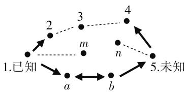
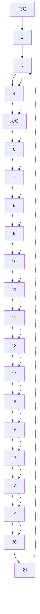

# 协同激活的解题方法\*

● 四川省成都七中高峥  
● 电子科技大学数学科学学院 黄 晋  
● 内江师范学院数学与信息科学学院 赵思林

# 一、引言

中学数学知识点所能组成题目的数量,即便在不包括任何变式的理想状态下,也能构成令人难以置信的题海.在实际的中学数学教学中,多数教师仍采用题海战术训练学生,导致师生负担沉重,这与国家人才培养的要求和“一核四层四翼”的高考评价体系背道而驰.数学教师如何在日常的数学解题教学中落实数学教育目标,提高学生学习能力和学业成绩,是现行中学数学教学的难题.

目前关于中学数学教学解题的文章很多,但都是针对某一类题的解题技巧、解题方法,没有说明题目与知识的联系,更没有给出统一的解题方法.本文给出了破解中学数学统一的解题方法——协同激活.该方法是利用知识网络中知识点及其之间联系的不断激活,寻求解题思路,具有普适性.

# 二、协同激活的解题原理

学习心理学和脑科学研究表明:人类所拥有的知识在头脑中存在的客观形态是一个由概念结点和连枝构成的网络体系,称为“概念网络”.依据以上对概念网络的理解,我们可以把解题过程比喻为蜘蛛猎食的过程,其中涉及的概念网络和问题可作如下比喻:概念网络——蜘蛛网;问题——落在蜘蛛网上的猎物.蜘蛛首先要判断这个猎物在网上的什么位置(在概念网络中进行知识点定位),然后沿着最短的路径捕捉猎物(由知识点激活与之相关的各个连支,沿着概念网络的连支进行搜索).

这实际上是给出了一种正确高效的解题方法,也就是说,只要概念网络中知识点和知识点之间的联系是准确和完备的,就能准确高效地解题.

为了更简明地阐述概念网络和协同激活的数学解题原理,我们借助于简化的知识网络的一部分进行说明,如图1所示.

flowchart

图 1 协同激活式解题方法示意图

假如解一道题需要用到五个知识点(图1中用1—5标识)和它们之间的联系(箭头所示).已知条件1或待解问题5会指引激活相关的知识节点.例如,已知1中的条件、语词、结构能够使我们联想、引发激活与之相关的知识节点2,思路就前进一步.又如果从未知要求的结论(知识点5)出发,也能联想激活一个知识点4,已知与未知之间的距离就又接近了一步.现在我们只要找到知识点2和知识点4之间的关联——知识点3,就能解决这个问题.

如果从已知或未知出发,不能激活任何知识点 m 或 n,我们就会感到毫无头绪,出现完全没有思路的情况.这种情况也会出现在解题开始后的几个步骤,例如,知识点 2 不能激活 3,表现为解题思路中断,仍然不能解出这道题.

没有思路和思路中断实际上是由两种情况导致的.一是知识点在概念网络中是缺失的,例如,我们的头脑中不存在知识点3或者无法自动搜索到知识点3，自然无法解出这道题；二是知识点之间是孤立的，它们之间的联系是残缺的或是模糊的，例如，知识点2和3之间的联系中断，我们无法通过知识点2来激活知识点3，或者通过3激活2，仍然不能解决这个问题.

在解题过程中,如果由一个知识点激活了多个知识点,例如,由知识点1不仅激活了2,也激活了知识点a,沿着不同的激活路径,最终都能和所要求的结论5会合,这就产生了不同的解题思路.

如果解决问题需要更多的知识点,基本原理也是基本相同的. 只不过所涉及的知识点更多,激活方式也更加复杂,但只要这种激活接力一直持续下去,最后当结论所要求的知识点与已经凸现在我们脑海中的这些知识点之间的联系存在并明晰的时候,我们感觉接上头了——找到了解题思路.

根据以上分析,要能迅速正确地解出题,依赖于两点,第一:知识点,第二:知识点之间的联系.解题不仅需要这两者的协同激活,还需要具备一定的激活速度和强度,才能满足测试对解题的速度和准确要求.而要做到这一点,我们的注意力就不能仅仅放在每个知识点的理解和掌握上,而是要着眼于各知识点之间的联系,挖掘其本质和规律,使之形成体系,同时注意数学思想方法在解题中的重要应用.

综上所述,基础知识落实为以知识点及其之间的关联构成的知识网络;基本技能落实为知识和基本方法的协同激活.这种基于“知识网络”的“协同激活”的解题方法不仅科学、高效,而且有助于学生从系统高度把握一门学科的主要脉络,形成良好的思维方式.

# 三、协同激活解题的具体方法

高中数学几乎所有的题目都可以统一使用协同激活的方法解决. 用统一的、师生都容易掌握的方法解决题海问题, 正是体现了用数学的思维解决问题. 用思维方式的转变, 避开僵化思维的、眼花缭乱的题型记忆, 抓住网络化的基础知识作为解决问题的利器, 以简驭繁, 直击本质. 下面以学生普遍感到寻找解题思路困难的抽象函数单调性的证明问题为例进行说明.

例 1 已知函数 $f(x)$ 对于任意 $x, y \in R$ ，总有 $f(x) + f(y) = f(x + y)$ ，且当 x > 0 时， $f(x) < 0$ ，求证: $f(x)$ 在 R 上是减函数.

协同激活分析:证明 $f(x)$ 在 R 上是减函数,需激活函数单调性的概念:在 R 上任取 $x_{1}, x_{2}$ , 暂不规定它们的大小关系,考察 $f(x_{1}) - f(x_{2})$ 的正负.但题设条件中没有 $f(x_{1}) - f(x_{2})$ 的结构,选择与之相关的条件 $f(x) + f(y) = f(x + y)$ , 根据需要变形,构造类似结构 $f(x + y) - f(y) = f(x)$ , 可使思路向前推进一步: $f(x_{1}) - f(x_{2}) = f(x_{1} - x_{2})$ , 将判断 $f(x_{1}) - f(x_{2})$ 的正负转化为判定 $f(x_{1} - x_{2})$ 的正负, 即 $f(x)$ 的正负.再次搜索题设条件,发现与之匹配的条件有“ $f(x) < 0$ ”,但其前提条件是“当 x > 0 时”,因此,只需规定 $x_{1} - x_{2} > 0$ 即可.至此,思路已完整达成所求.可书写如下:

证明:设任意 $x_{1}, x_{2} \in R$ ，且 $x_{1} > x_{2}$ ，即 $x_{1} - x_{2} > 0$ .

因为函数 $f(x)$ 对于任意 $x, y \in R$ 总有 $f(x) + f(y) = f(x + y)$ ，即 $f(x + y) - f(y) = f(x)$ ，所以 $f(x_{1}) - f(x_{2}) = f(x_{1} - x_{2})$ .

又因为 x > 0 时， $f(x) < 0$ ，而 $x_{1} - x_{2} > 0$ ，所以 $f(x_{1} - x_{2}) < 0$ ，即 $f(x_{1}) < f(x_{2})$ .

因此 $f(x)$ 在 R 上是减函数.

这个问题即是从审题开始,待解问题会指引激活相关的知识节点——单调性.已知条件中的 $f(x)+f(y)=f(x+y)$ 与单调性之间的 $f(x_{1})-f(x_{2})$ 形态相似可以进行等价变形,是产生联想、引发激活知识点的重要启动机制.顺着已激活的单调性概念,思维会到达判断 $f(x_{1}-x_{2})$ 的符号.而与之对应的题设条件“当 x>0 时, $f(x)<0$ ”表明,正数所对应的函数值均为负,从而只需规定 $x_{1}-x_{2}$ 为正数即可.此时已知条件与待解问题之间形成一条完整的证明链,于是问题得解.

上述协同激活式的解题方法几乎能够应用于高中阶段所有题目,这种正确高效的解题方法具有令人惊喜的普适性.它展现了如何由题目中的条件和结论激活相应知识点,用如何使用激活的知识点延续思路,使之步步有据.

# 四、基于协同激活的差错定位

通过建立知识网络和协同激活的解题方法,我们能够将作业、试卷的差错,定位到知识网络上去,针对基本知识点而不仅仅是针对错题进行训练.

高中数学约有 250 个知识点, 就好像学生有 250 个士兵. 一道题如果考察 5 个知识点, 学生只能调出 3个,这道题肯定做不出来;如果他准确地调出5个士兵,但队形不对,还是做不出.因此,准确解出一道题,不仅需要知识点(士兵)而且也需要知识点之间的结构联系(队形).

学生听评讲、改错，只是按照老师的调兵和布阵的方法重新演练一遍。自己若没有掌握练兵的方法，还是不会做题。这就是“教师讲过，但学生还是不会做或做错”的现象。我们做差错分析，就是要准确地把当时缺了几个士兵（知识点），当时为什么联系中断（布阵）找到，对这几个士兵要针对章节进行集训，集训结束后还需测试进行检验，完成二次反馈。依此循环下去，使得学习过程是一个充满活力的、能动的、变化的、具有挑战性的随动控制系统。

学生通过对知识网络的建设,将拥有一个250个士兵的精锐部队,当他们遇到敌人(问题)时,需要通过问题特征和士兵擅长的作战特性匹配(协同激活),认定需要哪几个士兵,并根据士兵的位置和他们之间的关系迅速调取出来,圆满完成任务.

以上解题过程说明,协同激活不仅能够统一数学解题的探求路径,更重要的是它给出了知识点的准确定位方法.当学生解题过程出现差错时,使用协同激活的方法可以准确判定学生产生差错的知识点及其联系的位置,为准确定位差错提供简便易行的办法,进而对知识网络进行精准修复.

# 五、结语

协同激活能使数学教师和学生从题海中解放出来,从越学越僵化思维的“套题型”的不科学的训练方式中解脱出来,学会高效地、科学地思考和处理问题.

协同激活的解题方法,将具体的题目和知识网络联系起来,让学生学到书本上的知识是如何应用以解决实际问题的.在此过程中,不仅巩固了知识,知晓了知识的来龙去脉和广泛联系,从系统的高度理解数学思想,形成终身受益的学习方法.协同激活的解题方法及其所构建的知识网络差错定位方法对其他学科也有启示作用.

# 参考文献：

[1] 中华人民共和国教育部. 中国高考评价体系 [M]. 北京: 人民教育出版社, 2020.  
[2] 高峥. 协同激活模式下的概念教学设计 [J]. 天府数学, 2010(15).  
[3] 黄曾阳. HNC(概念层次网络) 理论 [M]. 北京: 清华大学出版社, 1998.  
[4] 李士琦. PME: 数学教育心理 [M]. 上海: 华东师范大学出版社, 2001. F

(上接第 47 页) 的“套路”，通过观察和分析问题，找到已知与未知之间的内在联系，再经过大量的解题训练，摸索出一些行之有效的答题模式，这就是解答应用题的“套路”（基本步骤与环节）。掌握和熟练运用这个“套路”就能提高解题的速度和准确性。

# 1. 认真、仔细审题

就是多问几个“为什么”. 问题的已知条件有哪些? 其中隐含的已知条件有哪些? 要求解答什么问题? 解答该题要用到哪些数学知识(公式、概念、定理).

# 2. 找出其内在的联系

比如数据、算式的结构特点、图形特征、位置状态、题型特征、已知条件、要解决的问题等,找到其内在的联系,运用已有的数学知识和解题经验,列成关系式.

# 3. 书写出推导过程

总结自己是如何由已知条件寻找到解题思路与方法的,是怎样分析的,依据是什么,理由是什么,该题可能有几种解法,几种“解”是否概括完了所有的可能性,有没有疏漏的情况等,叙述推导的过程要力求语言简洁明了、层次清晰、推理严谨、符合数学格式规范.

在解答应用题时,虽然大多数学生都熟知这个“套路”,但在具体操作中,有很多同学未能严格地按照这个“套路”去做,特别是当遇到试题难度较大、时间又很紧迫时,就会因赶时间、惊慌失措而忘记了平时的解题“套路”,也失去了冷静思考的习惯,更是丧失了解题的信心,有的就干脆放弃了.所以,我们教师不仅要在平时的教学、训练中向学生传授解题“套路”,而且要潜移默化地去诱导学生按照这个“套路”去做,养成一种按固定程序去思考问题的良好习惯,将来解题时才会“遇新、遇难而不乱”,这样长期坚持下去,才能不断提高解题能力.