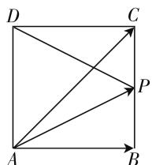
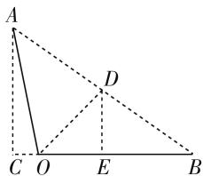
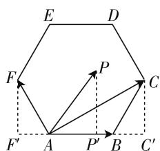
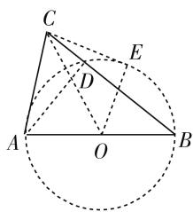

# 巧借投影法,妙破高考题

# ● 甘肃省高台县第一中学 邢军

平面向量的投影是平面向量的数量积的概念说明与知识链接,具有非常明显的几何意义,是数量积概念的进一步补充、拓展与延伸.借助平面向量的投影,可以用来巧妙破解平面向量中的一些相关问题,直观有效,灵活多变.在2020年高考数学试卷中,平面向量的投影法也是破解高考真题的一种基本技巧方法,下面结合真题实例加以剖析.

# 一、数量积的求解

借助投影法来破解向量的数量积问题,其关键是利用投影的几何意义,将平面向量的投影作为一个整体或转化为线段的长度问题,避免求解向量之间的夹角问题,从而得以直观操作,合理转化,巧妙求解.

例 1 （2020 年北京卷第 13 题）已知正方形 ABCD 的边长为 2，点 P 满足 $\overrightarrow{AP} = \frac{1}{2} (\overrightarrow{AB} + \overrightarrow{AC})$ ，则 $|\overrightarrow{PD}| =$ \_\_\_\_； $\overrightarrow{PB} \cdot \overrightarrow{PD} =$ \_\_\_\_.

分析:利用平面向量的中线定理确定点P的位置,通过平面几何中的勾股定理来求解线段的长度;而结合正方形相邻边互相垂直的性质,借助平面向量的投影来直观求解对应的数理积问题.

text_image

D
C
P
A
B

图 1

解析:如图 1 所示,由于点 P 满足 $\overrightarrow{AP} = \frac{1}{2} (\overrightarrow{AB} + \overrightarrow{AC})$ , 则点 P 是线段 BC 的中点, 且 $|PC| = 1$ , 则有 $|\overrightarrow{PD}| = \sqrt{2^{2} + 1^{2}} = \sqrt{5}$ .

由于 $DC \perp BC$ ，结合平面向量的投影，可得 $\overrightarrow{PB} \cdot \overrightarrow{PD} = -|PB| \cdot |PC| = -1.$

故填答案: $\sqrt{5}$ , -1.

点评:合理借助投影法,可以更加直观地利用平面几何图形的特征,或将数量积问题整体化,或将数量积问题线段长度化,进而数形结合,结合平面几何图形中的相关知识加以综合与应用.

# 二、夹角的确定

借助投影法来破解向量夹角的确定问题,关键是利用投影的几何意义,利用线段的长度求值、比值关系、面积转化以及三角函数的公式应用等,有效借助数形直观加以合理有效转化与应用,合理求解.

例 2 （2020 年全国卷Ⅲ 理科第 6 题）已知向量 a, b 满足 $\left|a\right|=5,\left|b\right|=6,a\cdot b=-6$ ，则 $\cos\langle a,a+b\rangle=(\quad)$ .

A. $-\frac{31}{35}$

B. $-\frac{19}{35}$

C. $\frac{17}{35}$

D. $\frac{19}{35}$

分析:结合平面几何作图分析,利用平面向量的投影来确定线段 OC 的长度,进而通过勾股定理以及中线性质来求解相应的线段的长度,并结合三角形的等面积法加以应用,从而得以确定向量的夹角的余弦值.

解析:如图2所示,设 $\overrightarrow{OA}=a,\overrightarrow{OB}=b$ ,过点A作BO的延长线的垂线,垂足为C,连接AB,取线段AB的中点D,连接OD,过点D作OB的垂线,垂足为E,则点E为线段BC的中点.由于 $a+b=\overrightarrow{OA}+\overrightarrow{OB}=2\overrightarrow{OD}$ ,则$\langle a, a + b \rangle = \angle AOD$ ，由于 $|OA| = 5, |OB| = 6, a \cdot b = -6$ ，结合平面向量的投影，可知 $|OC| = 1$ ，所以 $|AC| = \sqrt{5^2 - 1^2} = 2\sqrt{6}$ ， $|DE| = \frac{1}{2} |AC| = \sqrt{6}$ ， $|OE| = \frac{1 + 6}{2} - 1 = \frac{5}{2}$ ，可得 $|OD| = \sqrt{(\sqrt{6})^2 + \left(\frac{5}{2}\right)^2} = \frac{7}{2}$ ，而 $S_{\triangle OAD} = \frac{1}{2} \times 5 \times \frac{7}{2}\sin \angle AOD = \frac{35}{4}\sqrt{1 - \cos^2 \angle AOD}$ ， $S_{\triangle OAD} = \frac{1}{2} S_{\triangle OAB} = \frac{1}{2} \times \frac{1}{2} \times 6 \times 2\sqrt{6} = 3\sqrt{6}$ ，可得 $\frac{35}{4}\sqrt{1 - \cos^2 \angle AOD} = 3\sqrt{6}$ ，解得 $\cos \angle AOD = \frac{19}{35}$ ，即 $\cos \langle a, a + b \rangle = \frac{19}{35}$ .

text_image

A
D
C O E B

图2

故选 D.

点评:合理借助投影法,可以把对应的平面向量的数量积问题转化为线段的长度问题,为进一步利用平面几何知识解决相关向量的夹角问题提供条件.该方法主要是结合平面几何图形特征,借助投影法加以转化,利用平面几何性质来破解.

# 三、取值范围的转化

借助投影法来破解数量积取值范围的转化问题，关键是利用投影的几何意义，有效转化相应的向量数量积关系式，通过平面几何图形的直观来确定相应的极端位置，进而用来解决一些向量数量积的取值范围问题，处理起来更直观，更具可操作性.

例 3 （2020 年新高考山东卷第 7 题）已知 P 是边长为 2 的正六边形 ABCDEF 内的一点，则 $\overrightarrow{AP} \cdot \overrightarrow{AB}$ 的取值范围是（）.

A. $(-2,6)$

B. $(-6,2)$

C. $(-2,4)$

D. $(-4,6)$

分析:结合平面几何作图分析,利用点 P 在直线 AB 上的垂足 $P'$ 所处的位置加以分类讨论,结合平面向量的投影,分别确定数量积的取值范围,进而加以综合分析即可.

解析: 如图 3 所示, 过点 F 作 BA 的延长线的垂线, 垂足为 $F'$ , 过点 C 作 AB 的延长线的垂线, 垂足为 $C'$ , 过点 P 作 AB 的垂线, 垂足为 $P'$ , 结合正六边形 ABCDEF 的性质可得 $\left|AF'\right| = \left|BC'\right| = 2\cos60^\circ = 1$ .

text_image

E
D
F
P
C
F'
A
P'
B
C'

图 3

当 $P'$ 为A时, $\overrightarrow{AP} \cdot \overrightarrow{AB} = 0$ ;

当 $P'$ 位于点 A 的右侧时，结合平面向量的投影，可知 $\overrightarrow{AP} \cdot \overrightarrow{AB} = |AP'| \cdot |AB| = 2 |AP'| \in (0, 6)$ ;

当 $P'$ 位于点 A 的左侧时，结合平面向量的投影，可知 $\overrightarrow{AP} \cdot \overrightarrow{AB} = -\left|AP'\right| \cdot \left|AB\right| = -2\left|AP'\right| \in (-2,0)$ .

综上分析, 可知 $\overrightarrow{AP} \cdot \overrightarrow{AB} \in (-2, 6)$ .

故选 A.

点评:合理借助投影法,可以把复杂的平面向量的数量积问题“形”化,借助平面几何图形加以直观分析,通过动点的位置变化情况有效确定数量积的取值范围问题.“数”与“形”的合理转化,借助投影法巧妙融合.

# 四、综合知识的应用

借助投影法来破解综合知识的应用问题,关键是利用投影的几何意义,有效建立起一些与相关综合应用问题相吻合的数学模型,合理借助投影的几何意义加以合理应用.此类综合知识的应用问题,经常与平面几何、三角函数等加以综合与交汇.

例 4 （2020 年全国卷Ⅲ文科第 6 题）在平面内，A, B 是两个定点，C 是动点，若 $\overrightarrow{AC} \cdot \overrightarrow{BC} = 1$ ，则点 C 的轨迹为（）.

A. 圆

B. 椭圆

C. 抛物线

D. 直线

分析:结合动点 C 在与不在直线 AB 上加以分类讨论,数形结合,借助平面向量的投影加以转化,结合平面几何中的相关定理加以应用,从而得以确定动点的轨迹问题.

解析: 设线段 AB 的中点为 O, $\left|AB\right|=2a(a>0)$ , 当动点 C 不在直线 AB 上时, 以线段 AB 为直径作圆 O, 交线段 BC 于点 D, 连结 AD, OC, 则有 $AD \perp BC$ , 过点 C 作圆 O 的切线 CE, 切点为 E, 连结 OE, 则有 $OE \perp CE$ , 根据

text_image

C
E
D
A
O
B

图 4

平面向量的投影以及切割线定理可知， $1=\overrightarrow{AC}\cdot\overrightarrow{BC}=\overrightarrow{CA}\cdot\overrightarrow{CB}=|CD|\cdot|CB|=|CE|^{2}=|\overrightarrow{CO}|^{2}-|\overrightarrow{OE}|^{2}=|\overrightarrow{CO}|^{2}-a^{2}$ ;

当动点 C 在直线 AB 上时，可得 $1 = \overrightarrow{AC} \cdot \overrightarrow{BC} = \overrightarrow{CA} \cdot \overrightarrow{CB} = (|\overrightarrow{CO}| + a)(|\overrightarrow{CO}| - a) = |\overrightarrow{CO}|^{2} - a^{2}$ .

综上分析，可得 $|\overrightarrow{CO}|^2 = a^2 + 1$ ，即 $|\overrightarrow{CO}| = \sqrt{a^2 + 1}$ ，所以点 $C$ 的轨迹是以 $AB$ 中点 $O$ 为圆心， $\sqrt{a^2 + 1}$ 为半径的圆.

故选 A.

点评:通过平面向量数量积关系式的转化,利用动点是否在定直线上加以分类讨论,结合平面向量的投影的几何意义,以及平面几何中的圆的性质,切割线定理,勾股定理等相关知识,并结合圆的定义来确定动点的轨迹.合理借助投影法,通过平面向量“形”的特征,数形结合,直观处理.

巧妙利用平面向量的投影的几何意义,借助投影来破解平面向量问题,提供了一种全新的重要手段,以及一个方便、实用、直观的数学工具.巧妙借助平面向量的投影法来处理问题,也是对平面向量的数量积相关知识的进一步法定程序、拓展与提升,有效加强相关基本概念和基本运算的灵活应用,交汇与融合相关的数学知识,提升应用意识,提高解题能力,培养数学核心素养.F