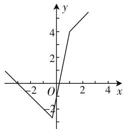
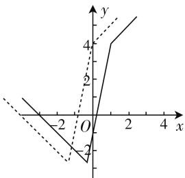
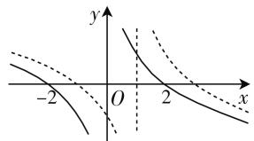
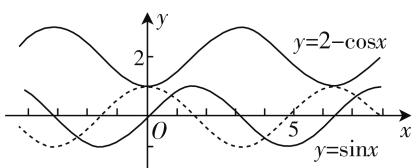
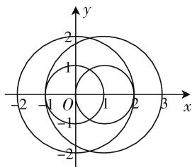

# 平移图像巧直观 高考问题妙破解\*

# ● 福建省漳平第一中学 陈建州

平移图像是历年高考中比较常见的一类破解函数、不等式、三角函数、平面解析几何等相关问题的技巧与方法，通过函数的图像，直线、圆与圆锥曲线等曲线的基本图像的平移来达到运用数形结合思想直观破解的目的。结合2020年高考中几类常见的平移图像破解问题的实例，剖析应用背景，阐述破解策略，指导数学教学与学习。

我们知道,在平面内,图形的变换是指图形在平面内的相关运动,它包括平移、旋转、伸缩等.而图形的变换为几何问题的转化与应用提供了工具,对于研究相关图形及其对应性质有着重要的意义.特别,平移图像是图形变换中最常见的一种变换,也是最简单的一种图形变换,是在平面直角坐标系背景下,利用函数的图像,直线、圆与圆锥曲线等曲线的基本图像的平移,用来解决函数、不等式、三角函数、平面解析几何等相关知识的一类应用问题,也是历年高考中比较常见的一类破解相关问题的技巧与方法.

# 一、绝对值不等式的求解

例1（2020年全国卷I第23题）已知函数 $f(x) = |3x + 1| - 2|x - 1|$ .

(1) 在图 1 中画出 $y=f(x)$ 的图像；  
(2) 求不等式 $f(x) > f(x+1)$ 的解集.

分析:根据绝对值所对应的“零点” $-\frac{1}{3}$ 与1进行分类讨论,

结合分段函数的形式来表示绝

对值函数,进而作出相应 $y=f(x)$ 的图像;在此图像的基础上,利用平移变换处理得到函数 $y=f(x+1)$ 的图像,通过图形直观来确定相应不等式的解集.

解析：（1）由题可知函数 $f(x)=|3x+1|-$

$2|x-1|=\begin{cases}-x-3&\left(x<-\frac{1}{3}\right),\\5x-1&\left(-\frac{1}{3}\leqslant x\leqslant1\right),\\x+3&(x>1),\end{cases}$ 作出函数y=

$f(x)$ 的图像,如图 2 所示.

line

| x | y |
|---|---|
| -3 | 0 |
| -2 | 1 |
| -1 | 2 |
| 0 | 3 |
| 1 | 4 |
| 2 | 5 |
| 3 | 6 |

图 2

text_image

Graph showing two functions with shaded regions and labeled axes, including a vertical line at x=0 and a horizontal line at y=2.

图3

(2) 将函数 $y = f(x)$ 的图像向左平移 1 个单位，可得函数 $y = f(x + 1)$ 的图像，如图 3 所示，由 -x - 3 = 5 (x + 1) - 1，解得 $x = -\frac{7}{6}$ ，可得函数 $y = f(x)$ 的图像与函数 $y = f(x + 1)$ 的图像的交点坐标为 $M\left(-\frac{7}{6}, -\frac{11}{6}\right)$ ，由图像可知当且仅当 $x < -\frac{7}{6}$ 时，函数 $y = f(x)$ 的图像在函数 $y = f(x + 1)$ 的图像的上方，所以不等式 $f(x) > f(x + 1)$ 的解集为 $\left(-\infty, -\frac{7}{6}\right)$ .

点评:利用分段函数的表示与图像的直观形式来处理相应的绝对值函数问题,通过对应图像的平移变换,数形结合来确定绝对值不等式的求解问题.形象直观,快捷简单,避免分类讨论而造成的过程烦琐与运算繁杂.

# 二、抽象函数的应用

例 2 （2020 年新高考山东卷第 8 题）若定义在 R 上的奇函数 $f(x)$ 在 $(-∞,0)$ 单调递减，且 $f(2)=0$ ，

则满足 $xf(x-1) \geqslant 0$ 的 x 的取值范围是().

A. $\left[-1,1\right]\cup\left[3,+\infty\right)$

B. $\left[-3,-1\right]\cup\left[0,1\right]$

C. $\left[-1,0\right]\cup\left[1,+\infty\right)$

D. $\left[-1,0\right]\cup\left[1,3\right]$

分析:通过题目条件构造特殊的函数图像,结合函数图像的平移变换来直观处理,利用函数图像的直观形象,方便快捷地直接判断满足不等式的自变量的取值范围.直观处理,简单方便.

解析: 根据题意条件, 作出函数 $y=f(x)$ 的草图, 如图 4 所示中的实线部分, 那么函数 $y=f(x-1)$ 的图像是由函数 $y=f(x)$ 的图像向右平移 1 个单位长度得到的(如图4所示中的虚线部分), 数形结合, 可知满足 $xf(x-1) \geqslant 0$ 的 x 的取值范围 $[-1,0] \cup [1,3]$ .

text_image

Mathematical graph showing three curves with labeled x and y axes, including dashed and solid lines intersecting at origin O.

图4

故选 D.

点评:借助函数图像的特殊构建,并通过函数图像的平移变换,在解决函数的最值,奇偶性,正负取值情况以及不等式的求解等问题时有奇效.通过直观形象来替代数运算与逻辑推理,更加简捷易操作.

# 三、开放性问题的应用

例 3 （2020 年北京卷第 14 题）若函数 $f(x)=\sin(x+\varphi)+\cos x$ 的最大值为 2，则常数 $\varphi$ 的一个取值为 \_\_\_\_.

分析: 结合题目条件建立三角方程, 转化为两个三角函数问题, 在同一平面直角坐标系中作出两个三角函数的图像, 通过其中一个三角函数图像的平移变换加以数形结合, 确定平移后两个三角函数的图像有交点时所对应的常数 $\varphi$ 的一个取值, 从而得以破解.

text_image

y=2-cosx
y=sinx

图5

解析:由题可知,存在常数 $\varphi$ 使得 $\sin(x+\varphi)+\cos x=2$ 成立,则有 $\sin(x+\varphi)=2-\cos x$ ,在同一平面直角坐标系中,画出三角函数 $y=\sin x$ 和 $y=2-\cos x$ 的图像,如图5所示中的实线部分,则知当正弦函数 $y=\sin x$ 的图像向左平移 $\frac{\pi}{2}$ 个单位后,此时函数 $y=\sin\left(x+\frac{\pi}{2}\right)$ 的图像(图5中的虚线部分)和 $y=2-\cos x$ 的图像有交点,满足条件,所以常数 $\varphi$ 的一个取值为 $\frac{\pi}{2}$ .

故填答案: $\frac{\pi}{2}$ .

点评:通过最值问题转化为三角方程问题,再进一步转化为两个三角函数的图像问题,借助其中一个熟知的三角函数图像的平移变换,确定两者的交点情况即可确定相应的常数 $\varphi$ 的一个取值.数形结合处理,开放问题直观破解.此时由于图像的限制,只能确定若干个常数 $\varphi$ 的取值,无法完整解答所有满足条件的常数的取值情况.

# 四、创新问题的探究

例 4 （2020 年上海卷第 12 题）已知 $a_{1}, a_{2}, b_{1}, b_{2}, \cdots, b_{k} (k \in N^{*})$ 是平面内两两互不平等的向量，满足 $\left|a_{1}-a_{2}\right|=1$ ，且 $\left|a_{i}-b_{j}\right|\in\{1,2\}$ （其中 $i=1,2,j=1,2,\cdots,k$ ），则 k 的最大值为 \_\_\_\_.

分析: 在平面直角坐标系中, 假定 $a_{1}=0=(0,0)$ , 结合 $\left|a_{i}-b_{j}\right|\in\{1,2\}$ 确定向量 $b_{j}$ 的对应点的位置, 再利用条件 $\left|a_{1}-a_{2}\right|=1$ 进行平移变换, 确定此时向量 $b_{j}$ 的对应点的位置, 数形结合确定不同圆的图形之间的交点情况, 进而来确定平面向量的最多个数, 即为对应参数 k 的最大值.

解析: 建立如图 6 所示的平面直角坐标系, 不妨设 $a_{1}=0=(0,0)$ , 设 $b_{j}=(x,y)$ , 对于 $a_{1}=0=(0,0)$ , 由 $\left|a_{i}-b_{j}\right|\in\{1,2\}$ 可得 $\left|b_{j}\right|=1$ 或 2, 此时向量 $b_{j}$ 的对应点在以原点为圆心,半径为1或2的圆上,相应的方程为 $x^{2}+y^{2}=1$ 或 $x^{2}+y^{2}=4$ .

text_image

y
2
1
O
-1
-1
1
2
3
x
-2
-2

图6

而结合条件 $|\pmb{a}_1 - \pmb{a}_2| = 1$ ，只要将上面的圆向外平移1个单位即可，为说明方便，取一特殊值，如图6中取 $\pmb{a}_2 = (1,0)$ ，即向右平移1个单位，相应的方程为 $(x - 1)^2 +y^2 = 1$ 或 $(x - 1)^2 +y^2 = 4.$

数形结合可知两者共有 6 个不同的交点, 则 k 的最大值为 6.

故填答案:6.

点评: 解决此类创新应用问题, 关键是借助平面直角坐标系加以直观分析, 先确定其中的一个要素进行分析与处理, 再结合条件对相应的图像进行平移变换, 从而数形直观来解决. 从解析几何图形直观入手, 借助圆的图形的平移变换, 从而有效、直观、快捷地处理问题. F