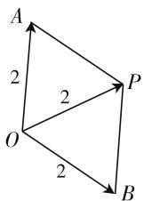
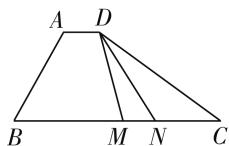
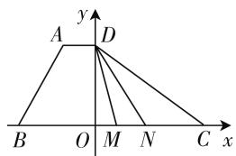

# 数学建模破解问题,引领高考培养素养

# ● 江苏省张家港高级中学 黄波

数学建模作为新课标中创新性提出的六大核心素养之一，是教师教学与学生学习过程中了解与认识问题、处理与解决问题中经常用到的一种基本技巧与方法。数学建模合理搭建了数学与外部世界之间的桥梁，是数学应用的一种重要形式，通过对具体的现实问题的数学抽象与概括，并结合数学知识、数学语言等进一步来表达与应用，借助相应的数学知识与方法构建起与之对应的数学模型，结合数学模型的分析与应用，从而达到解决问题的目的。数学建模也是每年高考数学中破解问题的基本思维方法之一，备受关注。本文结合2020年高考数学真题，通过高考的“指挥棒”，结合实例来剖析数学建模的培养与渗透方法，引领与指导数学教学与学习，以期抛砖引玉。

# 一、合理数学建模,完善已有模型

充分完善题目已有的数学模型,在条件背景的基础上进一步完善与深入,寻找与题目条件相吻合的数学模型,进而形成具体、直观的数学表达式、关系式等,进而确定相应的破解思路,得以分析与求解.

例 1 （2020 年全国卷Ⅱ理科第 15 题）设复数 $z_{1}$ ， $z_{2}$ 满足 $\left|z_{1}\right|=\left|z_{2}\right|=2, z_{1}+z_{2}=\sqrt{3}+\mathrm{i}$ ，则 $\left|z_{1}-z_{2}\right|=$ \_\_\_\_.

分析:充分完善已有模型——复数的几何意义,结合特殊的平面几何图形——平行四边形(菱形)的构造来分析与处理复数的相关问题,抓住复数的几何意义,结合菱形的直观性质,直观想象,破解起来简单巧妙.

解析:由于 $z_{1} + z_{2} = z_{3} = \sqrt{3} + i$ ，则有 $\left|z_{1}\right| = \left|z_{2}\right| = \left|z_{3}\right| = 2$ ，在复平面内，构造特殊的平面几何图形——平行四边形，设复数 $z_{1}, z_{2}, z_{3}$ 所对应的点分别为 A, B, P（起点均为坐标原点 O），根据复数的几何意义可知， $\left|z_{1} + z_{2}\right|$ 和 $\left|z_{1} - z_{2}\right|$ 是以平面向量 $\overrightarrow{OA}$ 和 $\overrightarrow{OB}$ 为两邻边的平行四边形的两条对角线的长,由于该平行四边形 OAPB 是边长为 2,一条对角线

  
图 1

为 2 的菱形，所以该菱形的另一条对角线长为 $\left|z_{1}-z_{2}\right|=2\sqrt{3}$ .

故填 $2\sqrt{3}$ .

点评:几何意义法是破解平面向量、复数等问题中的常见思维方式之一.通过几何意义法的应用,结合平面几何图形的几何特征,可以用来解决平面向量或复数中的相关问题,抓住平面向量或复数中的相关知识的几何意义,从几何意义的角度出发,回归本质,数形结合,直观想象,可以直观形象地处理相关问题.

# 二、精准数学建模，综合知识体系

充分综合数学相应的知识体系, 回归知识本源, 精准数学建模, 结合对应的本源知识来分析与处理相关的数学问题. 特别, 比较常见的有: 利用坐标系的数学建模来处理平面向量中的相关问题, 回归坐标本质, 利用坐标法来处理; 利用定义的数学建模来处理三角函数中的相关问题, 回归定义本质, 利用定义法来处理等.

例 2 （2020 年天津卷第 15 题）如图 2，在四边形 ABCD 中， $\angle B = 60^{\circ}, AB = 3, BC = 6$ ，且 $\overrightarrow{AD} = \lambda \overrightarrow{BC}, \overrightarrow{AD} \cdot \overrightarrow{AB} = -\frac{3}{2}$ ,

  
图2

则实数 $\lambda$ 的值为 \_\_\_\_. 若 M, N 是线段 BC 上的动点，且 $\left|\overrightarrow{MN}\right|=1$ ，则 $\overrightarrow{DM} \cdot \overrightarrow{DN}$ 的最小值为 \_\_\_\_.

分析:充分综合知识体系——平面直角坐标系,结合平面直角坐标系的建立,把平面向量的数量积利用坐标来进行转化与表示,结合数量积的坐标公式转化为对应的二次函数形式,利用配方法,结合二次函数的图像与性质来确定相应的最值问题.

解析: 由 $\overrightarrow{AD} = \lambda \overrightarrow{BC}$ ，可得 $AD \parallel BC$ ，又 $\angle B = 60^{\circ}$ ，所以 $\angle A = 120^{\circ}$ ，结合 AB = 3，BC = 6，可得 $\overrightarrow{AD}$

$$
\cdot \overrightarrow {A B} = \lambda \overrightarrow {B C} \cdot \overrightarrow {A B} = \lambda \times 6 \times 3 \times \cos 1 2 0 ^ {\circ} = - 9 \lambda = - \frac {3}{2},
$$

解得 $\lambda=\frac{1}{6}$ .

由于 BC=6，则知 AD= $\lambda BC=\frac{1}{6}BC=1$ ，过 D 作 DO $\perp BC$ 交 BC 于点 O，以 O 为坐标原点，BC 所在直线为 x 轴建立平面直角坐标系 xOy，如图3,则知 $D\left(0,\frac{3\sqrt{3}}{2}\right)$ ，设 $M(x,0),x\in \left[-\frac{5}{2},\frac{5}{2}\right]$ 此时 $N(x + 1,0)$ ，那么 $\overrightarrow{DM}\cdot \overrightarrow{DN} = \left(x, - \frac{3\sqrt{3}}{2}\right)\cdot$ $(x + 1, - \frac{3\sqrt{3}}{2}) = x^2 +x + \frac{27}{4} = \left(x + \frac{1}{2}\right)^2 +\frac{13}{2}$ ，则当 $x = -\frac{1}{2}$ 时， $\overrightarrow{DM}\cdot \overrightarrow{DN}$ 的最小值为 $\frac{13}{2}$

text_image

y
A D
B O M N C x

图 3

故填 $\frac{1}{6},\frac{13}{2}.$

点评:坐标法是破解平面向量问题中的常见思维方式之一.通过平面直角坐标系的建立,借助数学建模,把平面向量等相关问题转化为对应的坐标问题,结合坐标的代数运算等方式来解决与之相关的数学问题.当然,具体破解问题时,坐标系的建立方式多样,基本思路一致,差异不大.

# 三、匹配数学建模，综合条件信息

充分综合题目条件信息,剖析题目的背景,分析关系式的特征等,从而找出内在规律,抓住问题实质,形成与之对应的数学模型,匹配数学建模,有效建立起与题目条件信息、关系式等相吻合的数学模型,达到有效数学建模,结合对应的数学模型来转化与解决相应的数学问题.

例 3 （2020 年全国卷 I 理科第 12 题）若 $2^{a} + \log_{2}a = 4^{b} + 2\log_{4}b$ ，则（）.

$$
\mathrm{A.} a > 2 b \quad \mathrm{B.} a <   2 b \quad \mathrm{C.} a > b ^ {2} \quad \mathrm{D.} a <   b ^ {2}
$$

分析:充分综合条件信息——构造特殊函数,通过条件信息的综合与转化,借助数学建模,构造特殊函数并借助函数的单调性,从而可以更加简单、快捷地判断参数式之间的大小关系.

解析:由于 $2^{a} + \log_{2}a = 4^{b} + 2\log_{4}b = 2^{2b} + \log_{2}b$ ，构造特殊函数 $f(x) = 2^{x} + \log_{2}x$ ，由于指数函数 $y = 2^{x}$ 与对数函数 $y = \log_{2}x$ 在区间 $(0, +\infty)$ 上单调递增，结合复合函数的性质可知，函数 $f(x)$ 在区间 $(0, +\infty)$ 上单调递增，又因为 $f(2b) = 2^{2b} + \log_{2}2b = 2^{2b} + \log_{2}b + 1 > 2^{2b} + \log_{2}b = 2^{a} + \log_{2}a = f(a)$ ，可得 a < 2b.

故选 B.

点评:构造特殊函数法是破解函数、方程、不等式等问题中的常见思维方式之一.构造函数法,结合特殊函数的图像、基本性质等来解决参数的大小关系、函数值的大小关系、图像的变化规律等问题,进而结合合理验证,化抽象为具体,化特殊为一般,从而发现规律,寻找方法.

# 四、创新数学建模，挖掘题目内涵

充分挖掘题目内涵,剖析题目条件中所隐含的信息,从而抓住问题实质,创新构建起与之相应的数学模型,合理化归,巧妙转化,借助数学建模来分析与解决相应的数学问题.挖掘题目内涵是创新建模的关键所在.

例 4 （2020 年全国卷Ⅲ 理科第 11 题）设双曲线 $C: \frac{x^{2}}{a^{2}} - \frac{y^{2}}{b^{2}} = 1 (a > 0, b > 0)$ 的左、右焦点分别为 $F_{1}$ ， $F_{2}$ ，离心率为 $\sqrt{5}$ . P 是 C 上一点，且 $F_{1}P \perp F_{2}P$ . 若 $\triangle PF_{1}F_{2}$ 的面积为 4，则 $a = (\quad)$ .

A. 1 B. 2 C. 4 D. 8

分析:充分挖掘题目内涵——双曲线的定义,结合点P到两焦点的距离之差的绝对值为2a建立相应的参数模型,通过整体思想的应用,结合三角形的面积公式以及平面几何知识来建立关系式,进而结合方程的求解来确定参数的取值即可.

解析:由于双曲线 C 的离心率为 $\sqrt{5}$ ，可得 $e=\frac{c}{a}=\sqrt{5}$ ，即 $c=\sqrt{5}a$ ，根据双曲线的定义可得 $\left|\left|PF_{1}\right|-\left|PF_{2}\right|\right|=2a$ ，结合 $F_{1}P\perp F_{2}P$ ，可得 $S_{\triangle PF_{1}F_{2}}=\frac{1}{2}\left|PF_{1}\right|\left|PF_{2}\right|=4$ ，即 $\left|PF_{1}\right|\left|PF_{2}\right|=8$ ，由 $F_{1}P\perp F_{2}P$ ，利用勾股定理有 $\left|PF_{1}\right|^{2}+\left|PF_{2}\right|^{2}=(2c)^{2}=4c^{2}=20a^{2}$ ，则有 $\left(\left|PF_{1}\right|-\left|PF_{2}\right|\right)^{2}+2\left|PF_{1}\right|\left|PF_{2}\right|=20a^{2}$ ，即 $4a^{2}+16=20a^{2}$ ，整理有 $a^{2}=1$ 。解得 a=1。

故选 A.

点评: 定义法是破解圆锥曲线问题中的常见思维方式之一. 圆锥曲线的定义及其所对应的关系往往是圆锥曲线中的隐含条件, 合理构造相应的参数模型, 借助数学建模来转化与处理, 为问题的破解提供便利, 往往可以优化解题思路, 简化解题过程, 提升解题效益.

# 参考文献：

[1] 李家鑫. 妙解例题看数学建模的应用 [J]. 中学数学 (上), 2018(11). F