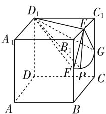
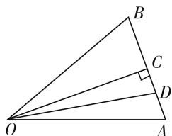
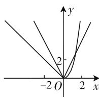
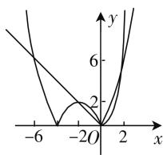
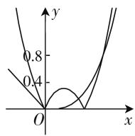

# 直观想象,高考引领

# ● 江苏省启东市汇龙中学 蔡金兵

直观想象作为新课标中创新要求的六大核心素养之一,是我们接触问题、认识问题、处理与解决问题中经常用到的一种基本技巧与方法.直观想象凭借几何直观体验、空间想象等直观感知和判断事物的形态与变化,通过图形直观来理解和解决相关的数学问题,有机结合与链接了数学的知识性、规律性与灵活性,是每年高考数学中破解问题的基本思维方法之一,备受关注.本文结合2020年高考数学真题,指向高考的命题“指挥棒”,通过解题实例来解析直观想象的实践与培养方法,引领与指导数学教学与学习,抛砖引玉.

# 一、借助空间认识事物

借助直观想象,利用空间图形的直观分析与想象,借助空间图形直观认识事物的位置关系、形态变化与运动规律等,确定对应的空间元素(点、线、面)的位置关系、角度、距离、轨迹等问题,直观切入,方便推理.

例 1 （2020 年新高考卷 I（山东卷）第 16 题）已知直四棱柱 $ABCD-A_{1}B_{1}C_{1}D_{1}$ 的棱长均为 $2, \angle BAD = 60^{\circ}$ . 以 $D_{1}$ 为球心， $\sqrt{5}$ 为半径的球面与侧面 $BCC_{1}B_{1}$ 的交线长为 \_\_\_\_.

分析:通过立体几何的辅助线的构造,结合立体几何的直观分析与逻辑推理,利用几何元素之间的位置关系直接判断出所求的侧面 $BCC_{1}B_{1}$ 与球面的交线就是扇形 EFG 的弧 $\widehat{FG}$ , 进一步利用平面几何的相关知识来确定弧长所对应的圆心角大小, 再结合弧长公式来求解交线长即可.

解析: 如图 1 所示, 取 $B_{1}C_{1}$ 的中点为 E, $BB_{1}$ 的中点为 F, $CC_{1}$ 的中点为 G. 因为 $\angle BAD = 60^{\circ}$ , 直四棱柱 ABCD— $A_{1}B_{1}C_{1}D_{1}$ 的棱长均为 2, 所以 $\triangle B_{1}C_{1}D_{1}$ 为等边三角形, 所以 $D_{1}E = \sqrt{3}$ , $D_{1}E \perp B_{1}C_{1}$ . 又四棱柱ABCD— $A_{1}B_{1}C_{1}D_{1}$ 为直四棱柱，所以 $BB_{1} \perp$ 平面 $A_{1}B_{1}C_{1}D_{1}$ ，所以 $BB_{1} \perp D_{1}E_{1}$ 。因为 $BB_{1} \cap B_{1}C_{1} =$

text_image

D₁
A₁
B₁
C₁
E
G
D
F
P
C
A
B

图 1

$B_{1}$ , 所以 $D_{1}E \perp$ 侧面 $BCC_{1}B_{1}$ . 设 $P$ 为侧面 $BCC_{1}B_{1}$ 与球面的交线上的点, 则 $D_{1}E \perp EP$ , 因为球的半径为 $D_{1}P = \sqrt{5}, D_{1}E = \sqrt{3}$ , 所以 $|EP| = \sqrt{D_{1}P^{2} - D_{1}E^{2}} = \sqrt{5 - 3} = \sqrt{2}$ , 所以侧面 $BCC_{1}B_{1}$ 与球面的交线上的点 $P$ 到点 $E$ 的距离为 $\sqrt{2}$ . 因为 $|EF| = |EG| = \sqrt{2}$ , 所以侧面 $BCC_{1}B_{1}$ 与球面的交线是扇形 $EFG$ 的弧 $\widehat{FG}$ , 因为 $\angle B_{1}EF = \angle C_{1}EG = 45^{\circ}$ , 所以 $\angle FEG = 90^{\circ} = \frac{\pi}{2}$ , 所以根据弧长公式可得 $\widehat{FG} = \frac{\pi}{2} \times \sqrt{2} = \frac{\sqrt{2}\pi}{2}$ .

故填答案: $\frac{\sqrt{2}\pi}{2}$ .

# 二、利用图形描述问题

借助直观想象,挖掘相关问题的定义、几何意义与几何性质等内涵,合理利用图形描述、分析数学问题,构建相应解题结构模型,通过图文并茂,直观解析.

例 2 （2020 年浙江卷第 17 题）已知平面单位向量 $e_{1}, e_{2}$ 满足 $\left|2e_{1}-e_{2}\right|\leqslant\sqrt{2}$ . 设 $a=e_{1}+e_{2}, b=3e_{1}+e_{2}$ ，向量 a, b 的夹角为 $\theta$ ，则 $\cos^{2}\theta$ 的最小值是 \_\_\_\_.

分析:根据条件通过几何作图,并利用平面向量的中点公式来转化,进而确定在平面几何图形中向量a,b的夹角 $\theta$ ,设 $e_{1}$ 和 $e_{2}$ 的夹角为 $\varphi$ ,结合条件中的模的不等式两边平方处理,进而得以确定 $\cos\varphi$ 的取值范围,利用余弦定理确定 $|AB|$ 的长度范围,结合平面几何图形并利用三角函数的定义来转化,利用勾股定理的应用,以及代数关系式的变形,最后利用反比例函数的图像与性质来确定相应的最值问题即可.

解析: 如图 2 所示, 设 $e_{1} = \overrightarrow{OA}, e_{2} = \overrightarrow{OB}$ , 点 C 为线段 AB 的中点, 点 D 为线段 AC 的中点, 平面单位向量 $e_{1}, e_{2}$ 的夹角为 $\angle AOB = \varphi$ ，由于 $|2e_1 - e_2| \leqslant \sqrt{2}$ ，两边平方并整理可得 $5 - 4\cos \varphi \leqslant 2$ ，解得 $\cos \varphi \geqslant \frac{3}{4}$ ，结合余弦定理可得 $|AB| = \sqrt{1 + 1 - 2\cos \varphi} \leqslant \frac{\sqrt{2}}{2}$ ，由于 $\overrightarrow{OC} = \frac{1}{2} (e_1 + e_2), \overrightarrow{OD} = \frac{1}{2} (\overrightarrow{OC} + e_1) = \frac{1}{4} (3e_1 + e_2)$ ，即 $a = 2\overrightarrow{OC}, b = 4\overrightarrow{OD}$ ，所以向量 $a, b$ 的夹角 $\theta$ 就是 $\angle COD$ ，由于 $\angle ACO = 90^\circ$ ，利用三角函数的定义有 $\cos^2\theta = \cos^2\angle COD = \frac{|OC|^2}{|OD|^2} = \frac{1 - \left(\frac{|AB|}{2}\right)^2}{1 - \left(\frac{|AB|}{2}\right)^2 + \left(\frac{|AB|}{4}\right)^2}$ $= \frac{16 - 4|AB|^2}{16 - 3|AB|^2} = \frac{4}{3}\left(1 - \frac{4}{16 - 3|AB|^2}\right)$ $\geqslant \frac{4}{3} \cdot \left[1 - \frac{4}{16 - 3 \times \frac{1}{2}}\right] = \frac{28}{29}$

text_image

Geometric diagram of triangle OAB with points C and D on sides OB and AC, showing right angle at C.

图 2

所以 $\cos^{2}\theta$ 的最小值是 $\frac{28}{29}$ .

# 三、建立数与形的联系

借助直观想象,建立数与形的联系与等价转化,结合数形结合,构建数学问题的直观模型,巧妙构建起数与形两者之间的有机统一体,进而探索解决问题的思路,合理破解相应的数学问题,实现等价转化,方便直观操作.

例 3 （2020 年天津卷第 9 题）已知函数 $f(x)=\left\{\begin{aligned}x^{3}&(x\geqslant0),\\ -x&(x<0)\end{aligned}\right.$ 若函数 $g(x)=f(x)-|kx^{2}-2x|$ $(k\in\mathbf{R})$ 恰有 4 个零点，则 k 的取值范围是（）.

A. $\left(-\infty,-\frac{1}{2}\right)\cup(2\sqrt{2},+\infty)$   
B. $\left(-\infty,-\frac{1}{2}\right)\cup(0,2\sqrt{2})$   
C. $(-∞,0)∪(0,2\sqrt{2})$   
D. $(-∞,0)∪(2\sqrt{2},+∞)$

分析:根据题目条件,将问题转化为方程 $f(x)=|kx^{2}-2x|$ 有四个根,即函数 $y=f(x)$ 与 $y=h(x)=|kx^{2}-2x|$ 的图像有四个不同的交点,再分三种情况当 k=0 时,当 k<0 时,当 k>0 时,讨论两个函数是否能有 4 个交点,进而得出 k 的取值范围.不同情况下对应不同的函数图像,数形结合,合情推理.

解析:若函数 $g(x)=f(x)-\left|kx^{2}-2x\right|(k\in$ R) 恰有 4 个零点，则方程 $f(x)=\left|kx^{2}-2x\right|$ 有四个根，即函数 $y=f(x)$ 与 $y=h(x)=\left|kx^{2}-2x\right|$ 的图像有四个不同的交点.

当 k=0 时， $y=f(x)$ 与 $y=|-2x|=2|x|$ 图像如下，两个图像只有两个交点，如图 3，不符合题意.

当 k<0 时， $y=|kx^{2}-2x|$ 与 x 轴交于两点 $x_{1}=0, x_{2}=\frac{2}{k}(x_{2}<x_{1})$ ，图像如图 4 所示，两个图像有 4 个交点，符合题意.

当 k > 0 时， $y = \left| kx^{2} - 2x \right|$ 与 x 轴交于两点 $x_{1} = 0, x_{2} = \frac{2}{k} (x_{2} > x_{1})$ ，在 $\left[0, \frac{2}{k}\right)$ 内两个函数图像有两个交点，如图5，所以若有四个交点，只需 $y = x^{3}$ 与 $y = kx^{2} - 2x$ 在 $\left(\frac{2}{k}, +\infty\right)$ 还有两个交点即可，即 $x^{3} = kx^{2} - 2x$ 在 $\left(\frac{2}{k}, +\infty\right)$ 还有两个根，亦即 $k = x + \frac{2}{x}$ 在 $\left(\frac{2}{k}, +\infty\right)$ 还有两个根，而函数 $y = x + \frac{2}{x} \geqslant 2\sqrt{2}$ ，当且仅当 $x = \sqrt{2}$ 时等号成立，所以 $0 < \frac{2}{k} < \sqrt{2}$ ，且 $k > 2\sqrt{2}$ ，所以 $k > 2\sqrt{2}$ 。

综上所述， $k$ 的取值范围为 $(- \infty, 0) \cup (2\sqrt{2}, +\infty)$ .

故选 D.

  
图 3

  
图 4

  
图 5

巧妙借助直观想象,利用数量与图形之间的对应关系,以及数与形的相互转化与等价关系来解决数学问题,通过“无中生形”“以形助数”“以形解数”等方式,有效串联起立体几何、平面解析几何、函数、平面向量等相关知识与图形之间的有机联系,结合图形直观来解决一些数学问题,起到事半功倍的效果,从而大大提高解题效率与效益,优化解题过程,提高数学能力,培养数学核心素养.

# 参考文献：

[1] 中华人民共和国教育部. 普通高中数学课程标准 (2017年版)[S]. 北京: 人民教育出版社, 2018. W