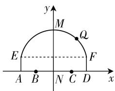
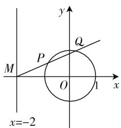
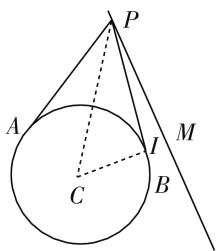

# 立足“圆”的研究 提高“思”的素养

# ● 江苏省金湖中学 陈万斌

解析几何中的“圆”这部分内容是高中数学的重要组成部分,曾有人说过圆是最美的图形,圆的知识有着丰富的内涵,关于圆的问题蕴含了很多的数学方法,各种数学思想在圆这一内容里都有突出的体现.通过圆的知识和方法的教学,我们可以极大地培养学生的理性思维和理性精神,借助“思考”手段极大地提高学生的数学核心素养.

# 一、抓住特征,巧设方程,培养数学直观素养

例 1 求经过原点,且过圆 $x^{2}+y^{2}+8x-6y+21=0$ 和直线 $x-y+5=0$ 的两个交点的圆的方程.

解析:设圆 C 方程为: $(x^{2}+y^{2}+8x-6y+21)+\lambda(x-y+5)=0.$ ①

因为其过原点,代入知, $21+5\lambda=0$ ,所以 $\lambda=-\frac{21}{5}$ ,
把 $\lambda=-\frac{21}{5}$ 代入①式整理得 $x^{2}+y^{2}+\frac{19}{5}x-\frac{9}{5}y=0.$

所以圆 C 方程为: $x^{2} + y^{2} + \frac{19}{5}x - \frac{9}{5}y = 0.$

评议:抓住过交点的特征设立曲线系,简化运算.

# 二、认真审题，简化运算，培养数学运算素养

例 2 若直线 $l: y = kx + 1$ 被圆 $C: x^{2} + y^{2} - 2x - 3 = 0$ 截得的弦最短，求直线 l 的方程.

解析: 直线 l 恒过定点 $A(0,1)$ ，则点 A 为弦中点即可，圆心 $C(1,0)$ ， $k_{AC} = -1$ 所以直线 l 的方程为 $y - 1 = (x - 0)$ ，即 $x - y + 1 = 0$ 。

评议:读透题意,减少计算量.

# 三、回归实际, 解几应用, 培养数学建模素养

例 3 如图 1, 一隧道内设双行线公路, 其截面由一段圆弧和一个长方形 EADF 构成, 已知隧道总宽度AD 为 $6\sqrt{3}$ m, 行车道总宽度 BC 为 $2\sqrt{11}$ m, 侧墙 EA、FD 为 2m, 弧顶高 MN 为 5m.

(1) 建立直坐标系, 求圆弧所在的圆的方程;  
(2) 安全起见,要求行驶车

辆顶部(设为平顶)与隧道顶部在竖直方向上的高度之差至少要有0.5m,请计算车辆通过隧道的限制高度是多少.

text_image

y
M
Q
E
F
A B N C D x

图 1

解析:以 N 为坐标原点,建立如图 1 所示的直角坐标系, $M(0,5)$ , $F(3\sqrt{3},2)$ ,则设圆心 $H(0,m)$ .

因为 $HD = HM$ ，所以 $\sqrt{(0 - 3\sqrt{3})^2 + (m - 2)^2} = \sqrt{(0 - 0)^2 + (m - 5)^2}$ ，得到 $m = -1$ ，所以圆 $H$ 方程为： $x^{2} + (y - 1)^{2} = 36.$

设 $Q(\sqrt{11}, n), (n > 0)$ 在圆上，所以 $(\sqrt{11})^2 + (n - 1)^2 = 36$ ，所以 $n = 4$ ，即 $y_Q = 4$

设车辆高为 h，由题意知， $4 - h \geqslant 0.5$ ，所以 $h \leqslant 3.5$ ，则车辆通过隧道限高为 3.5m.

评议:解析法是以数解形的典型方法.

# 四、变形数式, 定性定量, 培养数学推理素养

例 4 已知椭圆 $E: \frac{x^{2}}{8} + \frac{y^{2}}{4} = 1$ 的左焦点为 F，若圆心 C 的圆心是直线 x = -4 与 x 轴的交点，原点 O 在圆 C 上，如 G 是圆 C 上的任意一点.

(1) 求圆 C 的方程.  
(2) 若直线 l 与直线 FG 交于点 T, 设 G 为线段 FT 的中点, 求直线 FG 被圆 C 截得的弦长.  
(3) 问在平面上的是否存在一点 P，使得 $\frac{GF}{GP} = \lambda$ .
若存在,求点 P 坐标;若不存在,请说明理由.

简解:(1) 易知: $(x+4)^{2}+y^{2}=16.$

(2) 易知: 弦长为 7.  
(3) 设 $G(x_{0}, y_{0})$ ，则 $x_{0}^{2} + 8x_{0} + y_{0}^{2} = 0$ ，即 $x_{0}^{2} + y_{0}^{2}$

$$
= - 8 x _ {0}, \quad ①
$$

设 $P(m,n)$ ，则有 $\lambda^2 = \frac{GF^2}{GP^2} = \frac{(x_0 + 2)^2 + y_0^2}{(x_0 - m)^2 + (y_0 - n)^2}.$

由 ① 知, $\lambda^2 = \frac{-4x_0 + 4}{(-2m - 8)x_0 - 2ny_0 + m^2 + n^2}$ .

因为由题意知， $G$ 是圆上任意一点，而 $\lambda^2$ 为定值，则有 $\left\{ \begin{array}{l} \frac{-4}{-2m - 8} = \frac{4}{m^2 + n^2} = \lambda^2, \\ n = 0, \end{array} \right.$ 得到 $\left\{ \begin{array}{l} m = 4, \\ n = 0, \\ \lambda = \frac{1}{2}, \end{array} \right.$ 所以定点 $P$ 为(4,0).

评议:紧扣结果对数式进行推理和合理变形是求解的关键.

# 五、研究圆意, 性质运用, 培养数学抽象素养

例 5 已知直线 l 的方程为 x = -2，且直线 l 与 x 轴交于点 M，圆 $O: x^{2} + y^{2} = 1$ ，过 M 点的直线 $l_{1}$ 交圆 O 于 P, Q 两点，且圆弧 PQ 恰为圆周的 $\frac{1}{4}$ ，求直线 $l_{1}$ 的方程.

解析: 如图 2, 由题意知, $\angle POQ = 90^{\circ}$ , 所以圆心 O 到直线 PQ 的距离 $d = 1 \times \sin 45^{\circ} = \frac{\sqrt{2}}{2}$ .

text_image

y
Q
P
M
O
1 x
x=-2

图2

设直线 l 斜率为 k，则 l 的方程为: $y = k(x + 2)$ ，即 kx - y

+2k=0, 所以 $d=\frac{|2k|}{\sqrt{k^{2}+1}}=\frac{\sqrt{2}}{2}$ ，得 $k=\pm\frac{\sqrt{7}}{7}$ . 所以直线 l 方程为: $x\pm\sqrt{7}y+2=0$ .

评议:借助几何图形的特点是减少计算量的有效方式.

# 六、挖掘内涵,得到本质,培养数据分析素养

例 6 已知 $m \in R$ ，直线 $l: mx - (m^{2} + 1)y = 4m$ 和圆 $C: x^{2} + y^{2} - 8x + 4y + 16 = 0$ .

(1) 求直线 l 斜率的取值范围.

(2) 直线 $l$ 能否将圆 $C$ 分割成弧长的比值为 $\frac{1}{2}$ 的两段圆弧？为什么？

解析:(1) 直线 l 的斜率 $k=\frac{m}{m^{2}+1}$ ，易知 $k\in\left[-\frac{1}{2},\frac{1}{2}\right]$ .

(2) 圆 $C: (x - 4)^{2} + (y + 2)^{2} = 4.$

由(1)知, 直线 l 是斜率 $k \in \left[-\frac{1}{2}, \frac{1}{2}\right]$ 恒过定点 A(4,0) 的直线, 当 $k = \frac{1}{2}$ 时, 直线 $l_{AM}: y = \frac{1}{2}(x - 4)$ , 圆心 C 到直线 $l_{AM}$ 的距离 $d = \frac{4}{\sqrt{5}}$ , 则当 $-\frac{1}{2} \leqslant k \leqslant \frac{1}{2}$ 时, 圆心 C 到直线 l 的距离 $d \geqslant \frac{4}{\sqrt{5}}$ . 由题意知, 如直线 l 将圆 C 分割成弧比值为 $\frac{1}{2}$ , 则 $\angle ACM = 120^{\circ}$ , 所以 $d = r \times \sin 30^{\circ} = 1$ , 不满足 $1 \geqslant \frac{4}{\sqrt{5}}$ , 所以这样的直线 l 不存在.

评议:抓住小题数据之间的联系.

# 七、立足题干,等价转化,培养数学综合素养

例 7 直线 $l: y = k(x + 1)$ 上存在点 P，过点 P 作圆 $C: x^{2} + y^{2} - 4x = 0$ 的两切线垂直，求实数 k 的范围.

解析: 如图 3, 设切点为 A, B, 设 CM 与直线 l 垂直, 垂足为点 M, 设 $\angle APB = 2\alpha$ , 则知 $2\alpha \geqslant 90^{\circ}$ , 所以 $CM = d = \frac{2}{\sin\alpha} \leqslant 2\sqrt{2}$ , 所以 $\frac{|3k|}{\sqrt{k^{2} + 1}} \leqslant 2\sqrt{2}$ , 得到 $-2\sqrt{2} \leqslant k \leqslant 2\sqrt{2}$ .

text_image

P
A
C
I
B
M

图 3

评议:审视条件,转化题意.

正因为圆的内容丰富,蕴含着诸多的几何性质和内在含义,通过圆的教学,不仅让学生学会了圆“内”本身的知识和方法,更是加以迁移、普遍联系,让学生联想到圆“外”的相关知识,引导学生经过感悟,学会挖掘圆潜在的数学本质.这一过程中,数学教师的进行设计尤为重要,教师要有大单元的教学概念,整体考虑圆的内容教学,不断组合、变化圆的习题,不断优化学生的思维,使学生在感悟和反思中提升数学的核心素养.F