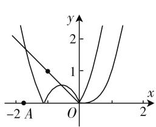
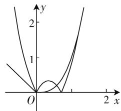
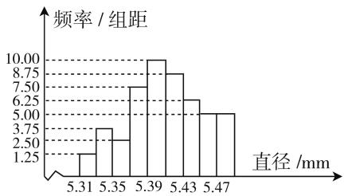

# 重视能力 追求创新 注重综合

——2020年高考数学天津卷评析

# ● 江苏省宿迁中学 彭清峰

2020 年是天津高考改革后文理卷合一的第一年，此套试题从高考数学评价体系出发，秉承重基础，重本质，贴近中学数学教学实际的一贯命题思路，在全面考查基础知识和基本技能的同时，强调数学学科素养与关键能力，以基础性、综合性、应用性、创新性为导向，突出理性思维的考查。整张试卷情景熟悉，朴实灵活，全面考查学生的数学知识、方法、能力与素养，整体符合高考改革的理念，同时，还充分汲取了全国卷和其他省份试卷在数学试卷命题上的新思维，实现了稳中有变，变中有新，体现出较强的区分度和选拔功能。

# 一、重视关键能力，体现学科素养

2020 年高考数学天津卷以数学基础知识为载体，以数学学科核心素养为导向，突出考查考生的数学抽象、逻辑推理、数学建模、直观想象、数学运算、数学分析、空间想象等学科关键能力，充分体现了对数学抽象、逻辑推理、数学运算、直观想象、数学建模、数学分析等中学数学核心素养，以及创新意识与应用能力，贯穿整张试卷的始终.

比如试卷中的第9题,以分段函数与函数的零点为问题背景,考查学生分析函数的方法,强调从代数化简推导到几何作图,还需要考生具有动态分析函数的能力,对考生逻辑推理与直观想象能力有较高的要求.

比如试卷中的第 20 题,作为试卷的最后一题,借助函数与导数知识的综合,既有对函数、导数基本知识方法的考查,又有对导数与不等式综合能力的考查.特别其中第(3)问以函数凸性为数学背景,综合了数学换元法、放缩法等,在一定程度上考查了考生的心理素质、灵活应变能力和调整适应能力.

例 1 （2020 年天津卷第 9 题）已知函数 $f(x)=\left\{\begin{aligned}x^{3}&(x\geqslant0),\\ -x&(x<0)\end{aligned}\right.$ 若函数 $g(x)=f(x)-|kx^{2}-2x|$ $(k\in\mathbf{R})$ 恰有 4 个零点，则 k 的取值范围是（）.

A. $\left(-\infty, -\frac{1}{2}\right) \cup (2\sqrt{2}, +\infty)$   
B. $\left(-\infty,-\frac{1}{2}\right)\cup(0,2\sqrt{2})$   
C. $(-∞,0)∪(0,2\sqrt{2})$   
D. $(- \infty, 0) \cup (2\sqrt{2}, + \infty)$

分析:根据题目条件,直接把函数 $g(x)=f(x)-|kx^{2}-2x|$ 恰有4个零点,转化为函数 $y=f(x)$ 与 $y=|kx^{2}-2x|$ 的图像恰有4个交点,从而利用参数 k 分类讨论,通过 k<0,k>0 以及 k=0 三种不同情况下的函数图像加以数形直观,结合方程的转化与判别式的应用来确定参数的取值范围问题.

解析:由于函数 $g(x)=f(x)-\left|kx^{2}-2x\right|$ 恰有 4 个零点,则函数 $y=f(x)$ 与 $y=\left|kx^{2}-2x\right|$ 的图像恰有 4 个交点,作出函数 $y=f(x)$ 的草图.

line

| x | y |
|---|---|
| -2 | 0 |
| 0 | 0 |
| 2 | 1 |

图 1

line

| x | y |
|---|---|
| 0 | 0 |
| 1 | 1 |
| 2 | 2 |

图2

当 k<0 时, 如图 1, 此时两函数的图像有 4 个交点(在右边足够远时有 1 个交点);

当 k > 0 时，如图 2，此时两函数的图像有 4 个交点，由 $kx^{2} - 2x = x^{3}$ ，即 $x^{2} - kx + 2 = 0$ ，由判别式 $\Delta = k^{2} - 8 = 0$ ，解得 $k = 2\sqrt{2}$ ；

当 k=0 时, 显然不成立.

综上分析, 可知 k<0 或 $k>2\sqrt{2}$ , 即 k 的取值范围是 $(-∞,0)∪(2\sqrt{2},+∞)$ .

故选 D.

点评:此题以分段函数为问题背景,合理交汇与融合了分段函数,绝对值函数,函数的零点个数,一元二次方程根的分布以及参数的取值范围等相关问题,破解的基本思想方法是等价转化、数形结合与分类讨论等,利用导数、一元二次方程、不等式与基本不等式、函数的图像与性质以及特殊值等进行分析与确定参数的取值范围.

# 二、不断追求创新，倡导独立思考

2020 年天津卷不断追求创新,以创新性为导向,试题的设问方式和呈现方式较往年有了一些新的形式,倡导考查学生独立思考的能力.

比如试卷中的第3题,首次考查函数的图像问题,需要学生综合运用函数的解析式,确定函数的基本性质,从而发现函数图像的变化趋势.这与往年对于函数的基本性质的考查不同,呈现的考查形式更加灵活多变.

比如试卷中的第14题,考查的还是往年的双变元代数式的最值问题,一改以往条件中双变元和式为常数的情景,转变为双变元积式为常数,加以创新应用,难度有所下降,破解方法更加多样.

比如试卷中的第 19 题,以特殊类型的数列为背景,设计了一道较为综合的应用问题.该试题首先要求学生能够根据特殊类型数列的基本方法求解,并能够针对比较复杂数列进行适当拆分,分类解决,很好地考查了考生的综合应用能力.其次,以数列基本量为基础巧妙设置了一道证明题,是近年天津卷数列中比较新颖的考查形式.

例2（2020年天津卷第14题）已知 $a > 0, b > 0$ ，且 $ab = 1$ ，则 $\frac{1}{2a} + \frac{1}{2b} + \frac{8}{a + b}$ 的最小值为 \_\_\_\_.

分析:本题通过两个正实数所满足的代数关系式——乘积为1,进而巧妙把代数式、分式等有机地融入到对应的代数式中,可以从基本不等式思维、方程思维、导数思维入手,借助各种不同的方法来破解.

解法 1: (代换法 1) 由于 a > 0, b > 0, ab = 1，结合基本不等式，可得 $\frac{1}{2a} + \frac{1}{2b} + \frac{8}{a + b} = \frac{ab}{2a} + \frac{ab}{2b} +$

$$
\frac {8}{a + b} = \frac {b}{2} + \frac {a}{2} + \frac {8}{a + b} = \frac {a + b}{2} + \frac {8}{a + b} \geqslant
$$

$2\sqrt{\frac{a+b}{2}\times\frac{8}{a+b}}=4$ ，当且仅当 $\frac{a+b}{2}=\frac{8}{a+b}$ ，即 $a+b=4$ ，亦即a、b分别取 $2+\sqrt{3}$ ， $2-\sqrt{3}$ 中的一个时等号成立，所以 $\frac{1}{2a}+\frac{1}{2b}+\frac{8}{a+b}$ 的最小值为4.

故填 4.

解法2:(代换法2)由于a>0,b>0,ab=1,结合基本不等式,可得 $\frac{1}{2a}+\frac{1}{2b}+\frac{8}{a+b}=\frac{a+b}{2ab}+\frac{8}{a+b}=$

$\frac{a + b}{2ab} + \frac{8ab}{a + b} \geqslant 2\sqrt{\frac{a + b}{2ab} \times \frac{8ab}{a + b}} = 4$ ，当且仅当 $\frac{a + b}{2ab} = \frac{8ab}{a + b}$ ，即 $a + b = 4$ ，亦即 $a, b$ 分别取 $2 + \sqrt{3}, 2 - \sqrt{3}$ 中的一个时等号成立，所以 $\frac{1}{2a} + \frac{1}{2b} + \frac{8}{a + b}$ 的最小值为4.

故填 4.

解法3:(消参法)由于a>0,b>0,ab=1,可得 $b=\frac{1}{a}$ ,结合基本不等式,可得 $\frac{1}{2a}+\frac{1}{2b}+\frac{8}{a+b}=\frac{1}{2a}+\frac{a}{2}+\frac{8a}{a^{2}+1}=\frac{a^{2}+1}{2a}+\frac{8a}{a^{2}+1}\geqslant2\sqrt{\frac{a^{2}+1}{2a}\times\frac{8a}{a^{2}+1}}=4$ ,当且仅当 $\frac{a^{2}+1}{2a}=\frac{8a}{a^{2}+1}$ ,即 $a^{2}=7\pm4\sqrt{3}$ ,亦即a、b分别取 $2+\sqrt{3},2-\sqrt{3}$ 中的一个时等号成立,所以 $\frac{1}{2a}+\frac{1}{2b}+\frac{8}{a+b}$ 的最小值为4.

故填 4.

# 三、试题情境真实,体现数学应用

每年天津高考命题都很重视数学在实际生活中的应用,考查学生利用所学数学知识解决实际问题的能力,体现了“学以致用”.2020年天津卷也非常注重与生活实际的紧密联系,通过建立实际生活中的场景为问题背景,着重考查学生灵活运用数学知识分析和解决问题的能力,强化数学在实际生活中的应用,培养学生的应用意识与应用能力.

比如试卷中的第4题,以零件检测为背景,需要学生从具体生活实际中抽象出对应的数学模型,从频率分布直方图这一统计图表中发现关键信息与对应数据,进而通过数据分析来处理生活中的概率与统计问题,培养学生发现问题、分析问题与解决问题的能力.

例 3 （2020 年天津卷第 4 题）从一批零件中抽取 80 个，测量其直径（单位：mm），将所得数据分为 9 组： $[5.31, 5.33)$ ， $[5.33, 5.35)$ ，…， $[5.45, 5.47)$ ， $[5.47, 5.49]$ 。并整理得到如下频率分布直方图，则在被抽取的零件中，直径落在区间 $[5.43, 5.47)$ 内的个数为（）。

A. 10

B. 18

C. 20

D. 36

分析:根据频率分布直方图先确定对应区间上的频率,然后结合样本总数计算对应区间上的个数即可.关键是数据分析与数据处理.

解析：根据频率分布直方图，直径落在区间[5.43,5.47)内的频率为 $(6.25 + 5.00)\times 0.02 =$ 0.225，则直径落在区间[5.43,5.47）内的个数为 $0.225\times 80 = 18$ 个.

histogram

| 直径 (mm) | 频率 / 组距 |
| :--- | :--- |
| 5.31 | 1.25 |
| 5.35 | 3.75 |
| 5.39 | 7.50 |
| 5.43 | 10.00 |
| 5.47 | 8.75 |
| 5.47 | 6.25 |
| 5.47 | 5.00 |

图3

故选 B.

点评:结合实际应用问题,以频率分布直方图为背景,结合统计数表的识别、应用来发现问题、分析问题与解决问题,综合考查统计与概率中的相关问题.

# 四、强调基础综合，引导中学教学

2020 年天津卷在强调基础的同时, 突出了数学知识体系的完整性和知识间的联系性, 试卷涉及多个知识点, 具有一定的综合性, 试题表述简练精准. 选择题和填空题强调概念的理解, 知识点清晰不堆砌, 解答题设问清楚有梯度. 对不同基础、不同能力水平的学生都提供了适当的思考空间.

比如试卷中的第 2、7、9、16、18 题等,每道试题都设置了多个知识与方法,又都是新课标中基础的数学知识.这些都是考生在平时数学学习过程中需要重点掌握的数学知识与方法,充分体现了高考试题既重视基础又突出综合的特点,要求考生能够在不同数学知识间融会贯通,完美转化.

例 4 （2020 年天津卷第 18 题）已知椭圆 $\frac{x^{2}}{a^{2}} + \frac{y^{2}}{b^{2}} = 1 (a > b > 0)$ 的一个顶点为 A(0, -3)，右焦点为 F，且 $|OA| = |OF|$ ，其中 O 为原点.

(Ⅰ) 求椭圆的方程.

（Ⅱ）已知点 C 满足 $3\overrightarrow{OC}=\overrightarrow{OF}$ ，点 B 在椭圆上（B 异于椭圆的顶点），直线 AB 与以 C 为圆心的圆相切于点 P，且 P 为线段 AB 的中点。求直线 AB 的方程。

分析:(Ⅰ)中,根据条件,可以快速确定椭圆的方程;(Ⅱ)中,设出直线AB的方程,结合直线与椭圆方程的联立,通过函数与方程的转化,求解确定点B的坐标表达式,结合中点坐标公式来确定点P的坐标,利用平面向量的线性关系得到点C的坐标,进而得以确定直线CP的斜率,通过圆的切线的性质建立斜率之间的关系式,得以求解参数k的值,从而得以求解直线AB的方程.

解析:(Ⅰ)由已知可得 b=3, 记半焦距为 c, 由$|OA|=|OF|$ 可得 c=b=3，又由 $a^{2}=b^{2}+c^{2}$ ，可得 $a^{2}=18$ ，所以椭圆的方程为 $\frac{x^{2}}{18}+\frac{y^{2}}{9}=1$ .

（Ⅱ）因为直线 AB 与以 C 为圆心的圆相切于点 P，所以 $AB \perp CP$ ，依题意，直线 AB 和直线 CP 的斜率均存在，设直线 AB 的方程为 y = kx - 3，由方程组 $\left\{\begin{aligned}y &= kx - 3,\\ \frac{x^{2}}{18} + \frac{y^{2}}{9} &= 1,\end{aligned}\right.$ 消去 y，可得 $(2k^{2} + 1)x^{2} - 12kx = 0$ ，解得 x = 0 或 $x = \frac{12k}{2k^{2} + 1}$ .

依题意,可得点 B 的坐标为 $\left(\frac{12k}{2k^{2}+1},\frac{6k^{2}-3}{2k^{2}+1}\right)$ .

因为 P 为线段 AB 的中点, 点 A 的坐标为 $(0, -3)$ , 所以点 P 的坐标为 $\left(\frac{6k}{2k^{2}+1}, \frac{-3}{2k^{2}+1}\right)$ .

由 $3\overrightarrow{OC}=\overrightarrow{OF}$ ，得点 C 的坐标为 $(1,0)$ ，故直线 CP 的斜率为 $\frac{\frac{-3}{2k^{2}+1}-0}{\frac{6k}{2k^{2}+1}-1}$ ，即 $\frac{3}{2k^{2}-6k+1}$ .

又因为 $AB \perp CP$ ，所以 $k \cdot \frac{3}{2k^{2} - 6k + 1} = -1$ ，整理得 $2k^{2} - 3k + 1 = 0$ ，解得 $k = \frac{1}{2}$ 或k = 1，所以，直线AB的方程为 $y = \frac{1}{2} x - 3$ 或y = x - 3.

点评:此类问题以圆与椭圆的位置关系的交汇与融合为问题背景,结合椭圆的方程与几何性质,通过平面向量的综合应用,合理把直线、圆、椭圆等相关元素融合在一起,形成有机组合体,从而确定椭圆的标准方程以及直线的方程等问题.借助圆的特征与题目条件,为问题破解提供更多的切入点,思维各异,方法多样.

2020年天津卷题目难度梯度设置合理，考查内容覆盖面广，紧扣教材选题的同时也有着相当的创新要素，更加强调“通性通法”在解题中的运用。试题情境真实公平，试卷整体结构合理，在重点考查学生对基本知识、方法、原理掌握和运用的同时，注重对学生创新性、综合性的考查，强调了数学应用能力，有利于考生发挥正常水平。这些举措有利于高校选拔优秀人才，对中学数学教学具有非常积极的导向作用。同时，试卷中很多题目可以在教材中找到原型，或者是教材例题与课后练习题之间的融合。这就要求同学们在学习或备战高考时一定要重视教材，针对教材知识进行综合思考。F