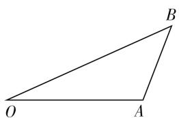

# 高中数学应用题解题教学六法

# 山东省泰安市第二中学 王红梅

如何提高学生解答数学应用题的能力,历来是高中数学教学的重点和难点之一.很多学生一提起数学应用题就头疼,原因是多方面的,除了学习基础差、害怕动脑筋、有畏难情绪外,平时也缺乏针对性的、系统的解题训练,没有学会和掌握正确的解题思路和方法,还有一个重要的原因是学生对数学缺乏浓厚的学习兴趣.所以,在实际的解题教学中,我认为,除了要教给学生一些常用的解题思路和方法技巧外,还要想方设法,采用一些生动有趣的教学方法,来增强他们学习数学的信心,尤其要消除他们对解应用题的这种心理障碍(畏惧感和恐慌感),在他们喜欢数学、喜欢研究和解答应用题的基础上,再通过持久、有效、实用的解题训练和方法指导,才有可能逐步提高解题能力.

# 一、故事情境导入法

每个学生都喜欢听故事,因为那比进行枯燥的数学计算有趣多了.所以,教师一进教室,千万不要忙着讲新课,设计好导入语,把学生的注意力吸引到课堂上,让他们集中精力听课才是最重要的.

在学习“等差数列”一节内容时,我首先给学生讲了个古老的数学故事:

享有“数学王子”美誉的德国数学家高斯，在他上小学时，老师给大家出了这样一道计算题：

$$
1 + 2 + 3 + 4 + \dots + 1 0 0 = ?
$$

要求同学们以最快的速度计算出来. 为了赶时间, 同学们都爬在桌上抓紧计算, 只有高斯呆坐着不动. 当老师问他时, 他竟然一口就说出了答案: 5050

老师问他是怎么算出来的,让他给大家讲一讲,高斯走上讲台,在黑白上写下了如下算式:

$$
\begin{array}{l} 1 + 2 + 3 + \dots + 9 9 + 1 0 0 = (1 + 1 0 0) + (2 + 9 9) \\ + (3 + 9 8) + \dots + (5 0 + 5 1) \\ \end{array}
$$

他解释说,一共有50个101,所以, $101\times50=5050$

课堂气氛顿时活跃起来,在大家的赞叹声中,我就给同学们讲,1,2,3,…,100,其实就是一个等差数列,高斯就是利用首尾配对的方法,把它们配成了50个相等的和,轻而易举地算出了答案.这也就是我们今天要学习的新内容:等差数列的前n项和.

# 二、非常规问题法

为了提高学生解答数学应用题的能力,教师可以适当精选或设计一些非常规的数学问题,这有利于激活学生的思维、调动学生的学习积极性、激发学生学习数学的热情.

例 1 为了预防新型冠状病毒, 某县高中定期对教室、学生宿舍用乙醇和 84 消毒液进行消毒. 已知药物在释放过程中, 室内每立方米空气中的含药量 y (毫克) 与时间 t (小时) 成正比; 药物释放完毕后, y 与 t 的函数关系式为 $y = \left(\frac{1}{16}\right)^{t-a}$ (a 为常数).

(1) 写出从药物释放开始, 每立方米空气中的含药量 y (毫克) 与时间 t (小时) 之间的函数关系式.  
(2) 据测定, 当空气中每立方米的含药量降低到不高于 0.25 毫克时, 学生方可进入教室. 请计算从药物释放开始, 至少需要经过多少小时后, 学生才能回到教室.

思考: 这是一道与当前我们身边的“疫情防控”有关的非常规数学问题, 可以引导学生借助函数图像研究多种解法.

解:(1)由题意可知,当 $0\leqslant t\leqslant0.1$ 时,可设y=kt(k为待定系数),由于点(0.1,1)在直线上,因为k=10;同理,当t>0.1时,可得 $1=\left(\frac{1}{16}\right)^{0.1-a}\Rightarrow0.1-a=0\Rightarrow a=\frac{1}{10}$ ,故所求的函数关系式为y=

$$
\left\{ \begin{array}{l l} 1 0 t & (0 \leqslant t \leqslant 0. 1), \\ \left(\frac {1}{1 6}\right) ^ {t - \frac {1}{1 0}} & (t > 0. 1). \end{array} \right.
$$

(2) 由题意可得 $y \leqslant 0.25 = \frac{1}{4}$ ，即当 $t > 0.1$ 时，

$\left(\frac{1}{16}\right)^{t-\frac{1}{10}}\leqslant\frac{1}{4}\Rightarrow t\geqslant0.6$ ，也就是说，至少要经过0.6小时后，学生才能回到教室.

# 三、借助图表法

在解答数学应用题时,教师可以引导学生根据已知、未知条件之间的关系画出一些关系图表,根据这些图表可以帮助学生快速地打开解题思路,找到、写出内在的关系式;更重要的是,在画图的过程中还可以激发学生的灵感,提高学生的联想和一题多解能力.

例 2 在天鹅湖岸边停放着一只竹筏,由于缆绳突然脱开,竹筏被风刮跑,恰在这时岸边的景区管理员小赵发现了,他急忙从同一地点开始追赶竹筏.已知风向与直线湖岸成 $15^{\circ}$ 的角,竹筏速度为 2.5km/h,小赵在岸上奔跑的速度为 4km/h,在水中游的速度为 2km/h,问小赵能否追上竹筏.若竹筏速度未知,要想小赵能追上竹筏,则竹筏的最大速度应该不能超过多少?

思考:由于人在水中游的速度小于竹筏的速度,人只有先沿湖岸跑一段路程后再游水追赶竹筏,这样才有可能追上,所以本题讨论的问题不是同一直线上的追及问题.只有当人沿湖岸奔跑的轨迹和人游水追赶的轨迹以及竹筏在水中行驶的轨迹它们三者组成一个封闭的三角形时,人才有可能追上竹筏.

根据题意, 我们把文字语言转换为图形语言, 画出如图 1 所示的斜三角形(将其转化为解斜三角的问题), 借助图形可以很快地列出关系式求解.

natural_image

Simple geometric diagram of a triangle labeled with vertices O, A, and B (no additional text or symbols)

图 1

设竹筏的速度为 v，小赵追上竹筏所用时间为 t，小赵在岸上奔跑的时间为 $kt(0 < k < 1)$ ，他在水中游的时间为 $(1 - k)t$ 。在斜三角形 OAB 中， $|OB| = vt, |OA| = 4kt, |AB| = 2(1 - k)t, \angle O = 15^{\circ}$ .

由余弦定理得： $|AB|^{2}=|OA|^{2}+|OB|^{2}-2|OA|\times|OB|\times\cos15^{\circ}$ ，化简为： $12k^{2}+\left[8-2(\sqrt{6}+\sqrt{2})v\right]k+v^{2}-4=0$ ，根据该方程在0<k<1内有解，求出v值的范围即可.

由此可见,图文结合的方法,能快速抓住题目的实质要素,突出重点、难点,化繁为简,明确概念、原理间的关系,具有较强的易理解性和实用性.

# 四、设疑激趣法

古人云“学贵有疑”. 在教学中通过设疑, 可以激发学生思维的火花和学习的兴趣. 设疑要充分体现以学生为主体的原则, 要让学生以“探索者”的身份积极参加到学习中来, 教师要根据教学的重点和难点, 设计学生的思维活动, 要做到“言简意赅、形象直观、趣味幽默”, 善于把抽象的概念具体化, 把深奥的道理形象化, 把枯燥的知识趣味化. 还要根据学生的实际情况, 注意设疑的难度, 逐渐增加梯度. 例如, 我在讲授《解析几何》“椭圆”一节的例题中出现了“近地点”“远地点”的概念, 同时, 在习题中也有“近地点”“远地点”的概念. 我们都知道, 概念是解题的依据和准则, 解题方法往往就是由概念而得. 这里我们不可回避地首先要准确地理解“近地点”这个概念. 所谓“近地点”, 当然是卫星轨道(椭圆)上的点离地球(椭圆的一个焦点)距离最近的点. 为什么一定是这一点最近呢? 教材上没有直接说明, 学生也有困惑, 我就以此创设疑点, 与学生一起从探讨“近地点”这个概念入手. 同时进一步设疑: 假如卫星轨道不变, 将地球沿长轴移动, 试问椭圆在什么范围内移动, “近地点”“远地点”变不变? 让学生展开讨论探究, 以达到激发学生思维和兴趣的目的.

# 五、露错纠错法

在解题过程中,学生难免会出错,这就要求教师在教学中要找出学生出错的原因,一方面成为让学生避免错误的决策者,更重要的是要和学生一道成为排除错误、纠正错误的探求者.

# 1. 暴露错误之处,制定相应的补救教学

教师在平时的教学中要有意识地搜集来自学生作业、练习、考试中的各种错例，及时、准确地找到或证实学生解题过程中存在的“缺陷”，集中错误点，设“陷”诱答，分析导致知识缺漏、思维障碍和方法技巧匮乏的原因，实施矫正训练。

# 2. 以错例为素材, 构设错例剖析课

在教学中,教师可把平时搜集的各种错例,集中时间剖析讲评,教师有目的地给出错题,让学生“找错误”;或由教师有意出错,让学生发现错误;或学生进行独立练习,教师纠正错误.

# 3. 分析错误类型, 提供防错策略

教师应把平时搜集的易错题,分类整理,并进行学生错误原因的分析、研究,有针对性地加强易错知识点的教学,做到防患于未然.

# 六、“套路”训练法

解答数学应用题,一般有规范 (下转第 50 页)

个,这道题肯定做不出来;如果他准确地调出5个士兵,但队形不对,还是做不出.因此,准确解出一道题,不仅需要知识点(士兵)而且也需要知识点之间的结构联系(队形).

学生听评讲、改错，只是按照老师的调兵和布阵的方法重新演练一遍。自己若没有掌握练兵的方法，还是不会做题。这就是“教师讲过，但学生还是不会做或做错”的现象。我们做差错分析，就是要准确地把当时缺了几个士兵（知识点），当时为什么联系中断（布阵）找到，对这几个士兵要针对章节进行集训，集训结束后还需测试进行检验，完成二次反馈。依此循环下去，使得学习过程是一个充满活力的、能动的、变化的、具有挑战性的随动控制系统。

学生通过对知识网络的建设,将拥有一个250个士兵的精锐部队,当他们遇到敌人(问题)时,需要通过问题特征和士兵擅长的作战特性匹配(协同激活),认定需要哪几个士兵,并根据士兵的位置和他们之间的关系迅速调取出来,圆满完成任务.

以上解题过程说明,协同激活不仅能够统一数学解题的探求路径,更重要的是它给出了知识点的准确定位方法.当学生解题过程出现差错时,使用协同激活的方法可以准确判定学生产生差错的知识点及其联系的位置,为准确定位差错提供简便易行的办法,进而对知识网络进行精准修复.

# 五、结语

协同激活能使数学教师和学生从题海中解放出来,从越学越僵化思维的“套题型”的不科学的训练方式中解脱出来,学会高效地、科学地思考和处理问题.

协同激活的解题方法,将具体的题目和知识网络联系起来,让学生学到书本上的知识是如何应用以解决实际问题的.在此过程中,不仅巩固了知识,知晓了知识的来龙去脉和广泛联系,从系统的高度理解数学思想,形成终身受益的学习方法.协同激活的解题方法及其所构建的知识网络差错定位方法对其他学科也有启示作用.

# 参考文献：

[1] 中华人民共和国教育部. 中国高考评价体系 [M]. 北京: 人民教育出版社, 2020.  
[2] 高峥. 协同激活模式下的概念教学设计 [J]. 天府数学, 2010(15).  
[3] 黄曾阳. HNC(概念层次网络) 理论 [M]. 北京: 清华大学出版社, 1998.  
[4] 李士琦. PME: 数学教育心理 [M]. 上海: 华东师范大学出版社, 2001. F

(上接第 47 页) 的“套路”，通过观察和分析问题，找到已知与未知之间的内在联系，再经过大量的解题训练，摸索出一些行之有效的答题模式，这就是解答应用题的“套路”（基本步骤与环节）。掌握和熟练运用这个“套路”就能提高解题的速度和准确性。

# 1. 认真、仔细审题

就是多问几个“为什么”. 问题的已知条件有哪些? 其中隐含的已知条件有哪些? 要求解答什么问题? 解答该题要用到哪些数学知识(公式、概念、定理).

# 2. 找出其内在的联系

比如数据、算式的结构特点、图形特征、位置状态、题型特征、已知条件、要解决的问题等,找到其内在的联系,运用已有的数学知识和解题经验,列成关系式.

# 3. 书写出推导过程

总结自己是如何由已知条件寻找到解题思路与方法的,是怎样分析的,依据是什么,理由是什么,该题可能有几种解法,几种“解”是否概括完了所有的可能性,有没有疏漏的情况等,叙述推导的过程要力求语言简洁明了、层次清晰、推理严谨、符合数学格式规范.

在解答应用题时,虽然大多数学生都熟知这个“套路”,但在具体操作中,有很多同学未能严格地按照这个“套路”去做,特别是当遇到试题难度较大、时间又很紧迫时,就会因赶时间、惊慌失措而忘记了平时的解题“套路”,也失去了冷静思考的习惯,更是丧失了解题的信心,有的就干脆放弃了.所以,我们教师不仅要在平时的教学、训练中向学生传授解题“套路”,而且要潜移默化地去诱导学生按照这个“套路”去做,养成一种按固定程序去思考问题的良好习惯,将来解题时才会“遇新、遇难而不乱”,这样长期坚持下去,才能不断提高解题能力.