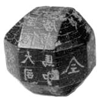
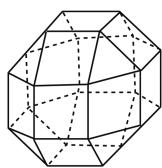

# 高考中“不良”试题的类型与应对策略

# 山东省博兴第一中学 韩继芳

随着新高考的不断推进,针对高考数学评价体系总结归纳成六个字“一核四层四翼”,其中“四翼”是指:基础性、综合性、应用性、创新性.为了充分体现高考数学评价体系中的“四翼”要求,近年高考在命题时会有针对性地出现一些题意难解、运算困难、考点不明、推理不周等“为难”考生的综合“四翼”考查要求的“不良”试题,对考生的综合能力、创新意识等要求非常高,适当拉开差距,具有很好的选拔性与区分度.下面我们通过实例分析这些“不良”试题的类型以及破解这类问题的应对策略.

# 一、题意难解

题意难解类型较多,数学不同知识点之间、学科之间、数学与生活之间等都可以涉及.一些是题中相关量众多且容易混淆,如2019年全国卷Ⅰ的“断臂维纳斯”,题中出现的长度众多,前后表述不一致;还有的题目背景生疏,表达含糊,不易理解,如2019年全国卷Ⅱ的“嫦娥四号中继星”,题目把物理学科与数学加以交汇,知识点多,背景新颖陌生.

例 1 （2019 年全国卷Ⅱ第 16 题）中国有悠久的金石文化，印信是金石文化的代表之一。印信的形状多为长方体、正方体或圆柱体，但南北朝时期的官员独孤信的印信形状是“半正多面体”（图 1）。半正多面体是由两种或两种以上的正多边形围成的多面体。半正多面体体现了数学的对称美。图 2 是一个棱数为 48 的半正多面体，它的所有顶点都在同一个正方体的表面上，且此正方体的棱长为 1。则该半正多面体共有 \_\_\_\_ 个面，其棱长为 \_\_\_\_。

  
图 1

  
图 2

分析:题目长度长,信息量大,图形不完整不直观,都给我们分析与理解题意造成困难.充分结合题目信息以及图形直观,并结合图形的对称性加以分析与应用.

解析:由图并根据图形的对称性, 可知第一层与第三层各有9个面(包括上下底面), 共18个面; 第二层是一个正八棱柱, 有8个面, 所以该半正多面体共有 $18+8=26$ (个) 面.

设该半正多面体的棱长为 x，根据其所有顶点都在同一个正方体的表面上，可得 $x + \frac{\sqrt{2}}{2}x + \frac{\sqrt{2}}{2}x = 1$ ，解得 $x = \sqrt{2} - 1$ ，即该半正多面体的棱长为 $\sqrt{2} - 1$ 。

故填答案: $26;\sqrt{2}-1$ .

应对策略: 在考试时遇到此类题意难解的试题, 一定不要慌张, 要冷静, 充分将已知条件一一列举出来, 仔细分析, 找出各个相关量之间的联系, 图形之间的关联, 建立起与我们所学知识之间的有效联系, 从而得以顺利解决. 往往可以借助列举法、列表法、图形法等形式帮助我们厘清题目条件, 弄清题意, 为问题的解决提供条件.

# 二、运算困难

运算困难种类繁多,在一些压轴题中经常碰到,涉及代数运算、三角运算、推理运算等各方面.特别在一些三角函数、数列、圆锥曲线、导数及其应用等问题中经常出现.

例 2 （2019 年全国卷 I 第 22 题）在直角坐标系

xOy 中, 曲线 C 的参数方程为 $\left\{\begin{aligned} x &= \frac{1 - t^{2}}{1 + t^{2}}, \\ y &= \frac{4t}{1 + t^{2}} \end{aligned}\right.$ (t 为参

数). 以坐标原点 O 为极点, x 轴的正半轴为极轴建立极坐标系, 直线 l 的极坐标方程为 $2\rho\cos\theta + \sqrt{3}\rho\sin\theta + 11 = 0$ .

(1) 求 C 和 l 的直角坐标方程;

(2) 求 C 上的点到 l 距离的最小值.

分析:题中对应的参数方程较复杂,直接消参转化存在一定的难度,同时还有隐含条件的限制,都给运算造成困难,平均得分在3分左右,非常低.大部分考生不会进行消参运算,从而导致无法下手.

解析:(1) 因为 $-1 < \frac{1 - t^{2}}{1 + t^{2}} \leqslant 1$ ，且 $x^{2} + \left(\frac{y}{2}\right)^{2} = \left(\frac{1 - t^{2}}{1 + t^{2}}\right)^{2} + \left(\frac{2t}{1 + t^{2}}\right)^{2} = 1$ ，所以 C 的直角坐标方程为 $x^{2} + \frac{y^{2}}{4} = 1 (x \neq -1)$ .

l 的直角坐标方程为 $2x + \sqrt{3}y + 11 = 0$ .

(2) 由(1)可设 C 的参数方程为 $\left\{\begin{aligned} x &= \cos\alpha, \\ y &= 2\sin\alpha \end{aligned}\right.$ ( $\alpha$ 为参数， $-\pi < \alpha < \pi$ )，C 上的点到 l 的距离为 $d = \frac{|2\cos\alpha + 2\sqrt{3}\sin\alpha + 11|}{\sqrt{7}} = \frac{|4\cos\left(\alpha - \frac{\pi}{3}\right) + 11|}{\sqrt{7}}$ ，当 $\alpha = -\frac{2\pi}{3}$ 时， $4\cos\left(\alpha - \frac{\pi}{3}\right) + 11$ 取得最小值 7，故 C 上的点到 l 距离的最小值为 $\sqrt{7}$ .

应对策略: 在考试时遇到此类运算困难的试题, 关键是要充分掌握基本的算法和算理, 理解题目条件中对应的运算, 采取切实可行的方法来处理. 其实, 对于参数方程转化为直角坐标方程时, 经常用到平方运算、相除运算、代入消参、换元消参等方法. 这也充分体现思维的灵活性、发散性, 很能考查学生的基本功底以及解决问题的能力和核心素养.

# 三、推理不周

推理不周主要表现在问题较为复杂,无法明确推理的切入点与突破口,从而导致破解一些选择题或填空题中得到错误答案,破解解答题时无法进行下去.关键要善于运用数学思想方法去突破,有效确定推理的切入点与突破口.

例 3 （2019 年浙江卷第 17 题）已知正方形 ABCD 的边长为 1，当每个 $\lambda_{i}(i=1,2,3,4,5,6)$ 取遍 $\pm1$ 时， $|\lambda_{1}\overrightarrow{AB}+\lambda_{2}\overrightarrow{BC}+\lambda_{3}\overrightarrow{CD}+\lambda_{4}\overrightarrow{DA}+\lambda_{5}\overrightarrow{AC}+\lambda_{6}\overrightarrow{BD}|$ 的最小值是 \_\_\_\_，最大值是 \_\_\_\_。

分析:抓住“当每个 $\lambda_{i}(i=1,2,3,4,5,6)$ 取遍 $\pm1$ 时”来破解相应的平面向量关系式，将 $\lambda_{1}\overrightarrow{AB}+\lambda_{2}\overrightarrow{BC}+\lambda_{3}\overrightarrow{CD}+\lambda_{4}\overrightarrow{DA}+\lambda_{5}\overrightarrow{AC}+\lambda_{6}\overrightarrow{BD}$ 表示成关于 $\lambda_{i}(i=1,2,3,4,5,6)$ 的式子，进而加以合理的分类讨论，借助分类讨论思想来处理是推理的切入点与突破口.

解析: 因为 $\lambda_{1}\overrightarrow{AB}+\lambda_{2}\overrightarrow{BC}+\lambda_{3}\overrightarrow{CD}+\lambda_{4}\overrightarrow{DA}+\lambda_{5}\overrightarrow{AC}$

$+\lambda_{6}\overrightarrow{BD}=(\lambda_{1}-\lambda_{3}+\lambda_{5}-\lambda_{6})\overrightarrow{AB}+(\lambda_{2}-\lambda_{4}+\lambda_{5}+\lambda_{6})\overrightarrow{AD}$ ，要使得 $|\lambda_{1}\overrightarrow{AB}+\lambda_{2}\overrightarrow{BC}+\lambda_{3}\overrightarrow{CD}+\lambda_{4}\overrightarrow{DA}+\lambda_{5}\overrightarrow{AC}+\lambda_{6}\overrightarrow{BD}|$ 取得最小值，则只要 $|\lambda_{1}-\lambda_{3}+\lambda_{5}-\lambda_{6}|=|\lambda_{2}-\lambda_{4}+\lambda_{5}+\lambda_{6}|=0$ 即可，此时有 $\lambda_{1}=1,\lambda_{2}=-1,\lambda_{3}=1,\lambda_{4}=1,\lambda_{5}=1,\lambda_{6}=1$ ，则有 $|\lambda_{1}\overrightarrow{AB}+\lambda_{2}\overrightarrow{BC}+\lambda_{3}\overrightarrow{CD}+\lambda_{4}\overrightarrow{DA}+\lambda_{5}\overrightarrow{AC}+\lambda_{6}\overrightarrow{BD}|$ 的最小值为0.

由于 $\lambda_5\overrightarrow{AC} +\lambda_6\overrightarrow{BD} = \pm 2\overrightarrow{AB}$ 或 $\pm 2\overrightarrow{AD}$ ，下面取其中一种，以 $\lambda_5\overrightarrow{AC} +\lambda_6\overrightarrow{BD} = 2\overrightarrow{AB}$ 为例加以说明，其他情况类似，当 $\lambda_5\overrightarrow{AC} +\lambda_6\overrightarrow{BD} = 2\overrightarrow{AB}$ 时，此时 $\lambda_1\overrightarrow{AB}+$ $\lambda_{2}\overrightarrow{BC} +\lambda_{3}\overrightarrow{CD} +\lambda_{4}\overrightarrow{DA} +\lambda_{5}\overrightarrow{AC} +\lambda_{6}\overrightarrow{BD} = (\lambda_{1} - \lambda_{3}+$ $2)\overrightarrow{AB} + (\lambda_2 - \lambda_4)\overrightarrow{AD}$ ，要使得 $|\lambda_1\overrightarrow{AB} +\lambda_2\overrightarrow{BC} +\lambda_3\overrightarrow{CD}$ $+\lambda_4\overrightarrow{DA} +\lambda_5\overrightarrow{AC} +\lambda_6\overrightarrow{BD} |$ 取得最大值，只要 $|\lambda_1 - \lambda_3+$ $2|$ 与 $|\lambda_{2} - \lambda_{4}|$ 取得最大值，此时 $|\lambda_1 - \lambda_3 + 2| = 4,$ $|\lambda_{2} - \lambda_{4}| = 2$ ，则有 $|\lambda_1\overrightarrow{AB} +\lambda_2\overrightarrow{BC} +\lambda_3\overrightarrow{CD} +\lambda_4\overrightarrow{DA}+$ $\lambda_5\overrightarrow{AC} +\lambda_6\overrightarrow{BD}| = |4\overrightarrow{AB} +2\overrightarrow{AD}| = 2\sqrt{5}$ ，此时有 $\lambda_{1} = 1$ ， $\lambda_{2} = 1,\lambda_{3} = -1,\lambda_{4} = -1,\lambda_{5} = 1,\lambda_{6} = 1$ ，则有 $|\lambda_1\overrightarrow{AB}+$ $\lambda_{2}\overrightarrow{BC} +\lambda_{3}\overrightarrow{CD} +\lambda_{4}\overrightarrow{DA} +\lambda_{5}\overrightarrow{AC} +\lambda_{6}\overrightarrow{BD} |$ 的最大值为 $2\sqrt{5}$

故填答案:0; $2\sqrt{5}$ .

应对策略: 在考试是遇到此类推理不周的试题, 要做到进一步分析题意, 适度的数学化是必要的, 同时将条件中复杂的表述问题符号化, 既方便表述, 又直观明了, 使思维有载体, 表述有媒介, 推理有依据, 便于解决问题.

高考中的“不良”试题,其实质是为了打破僵化、教条的应试教育考查学生数学核心素养而设置的,能更好地考查学生超强的理解力、敏锐的洞察力、灵活的思维能力、严密的逻辑推理能力和自觉应用数学知识解决实际问题的能力.高考中“不良”试题的共同特点是平时少见,理解困难,创新新颖,没有现成的解题套路可用,要破解这些“不良”试题,功夫在平时,要加强数学中的阅读理解训练,加强数学基础知识的积累,加强对数学思想方法的提炼和总结.虽然没有具体“万能”的套路,但是基本的数学思想方法却可以破解它,因此注重数学思想方法的教与学是王道,这值得我们每一个教师和学生的深入思考.

# 参考文献：

[1] 中华人民共和国教育部. 关于 2017 年普通高考考试大纲修订内容的通知(2017 年版)[M]. 北京: 人民教育出版社, 2017. W