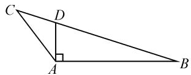

# 一道解三角形模拟试题的探究

# - 江苏省华罗庚中学 梁正玲

解三角形是新教材“平面向量及其应用”章节中的一个重要知识点，是平面向量的一个重要应用方向，成为联系初、高中数学基础知识的一个良好载体，同时也合理交汇并融合平面向量、三角函数以及函数与方程、不等式等相关知识，充分落实“在知识交汇点处命题”的高考命题指导思想，是高考命题的一个基本考点，备受各方关注.

# 1 试题呈现

试题 （2024 届江苏省苏锡常镇四市第一次联考模拟试卷）在 $\triangle ABC$ 中，角 A, B, C 的对边分别为 a, b, c，已知 c = 2, b = 1，且满足 $\overrightarrow{AB} \cdot \overrightarrow{AC} = -1$ .

(1) 求 $\sin\angle ABC$ ;

(2) 若 D 为 BC 上一点, 且 $\angle BAD = 90^{\circ}$ , 求 $\triangle ADC$ 的面积.

此题以一个三角形的两边以及两边对应的平面向量的数量积来创设问题场景,在确定的三角形背景下,第(1)小问直接确定另一个角的正弦值;第(2)小问再利用一个确定的小三角形的设置,进而求解相关三角形的面积.

此题以确定的几何图形为场景,综合运用解三角形的相关定理、公式,以及三角函数的相关公式等.笔者认为:仔细审题,妙用定理,借助公式,采用有效的策略,是合理化归与转化的关键.

# 2 真题破解

本题第(1)问有如下两种破解方法.

方法 1: 解三角形法 1.

由 $\overrightarrow{AB} \cdot \overrightarrow{AC} = bc\cos \angle BAC = 2\cos \angle BAC = -1$ 得 $\cos \angle BAC = -\frac{1}{2}$ , 解得 $\angle BAC = 120^{\circ}$ .

在 $\triangle ABC$ 中，由余弦定理可知 $BC^2 = a^2 = b^2 + c^2 - 2bc\cos \angle BAC = 1 + 4 - 4\times \left(-\frac{1}{2}\right) = 7$ ，则 $a = \sqrt{7}$

由正弦定理 $\frac{a}{\sin\angle BAC} = \frac{b}{\sin\angle ABC}$ ，可得 $\frac{\sqrt{7}}{\frac{\sqrt{3}}{2}} =$ $\frac{1}{\sin\angle ABC}$ ，解得 $\sin \angle ABC = \frac{\sqrt{21}}{14}.$

方法 2: 解三角形法 2.

同解法 1, 可得 $a=\sqrt{7}$ .

由余弦定理,可得

$$
\cos \angle A B C = \frac {a ^ {2} + c ^ {2} - b ^ {2}}{2 a c} = \frac {7 + 4 - 1}{2 \times \sqrt {7} \times 2} = \frac {5 \sqrt {7}}{1 4}.
$$

又依题知 $\angle ABC$ 为锐角,所以由平方关系可得

$$
\sin \angle A B C = \sqrt {1 - \cos^ {2} \angle A B C} = \frac {\sqrt {2 1}}{1 4}.
$$

解后反思:要求解确定的三角形内角的正弦值,可以直接利用正弦定理,借助边与角的关系求值;也可以利用三角函数中的平方关系,通过余弦定理求解.两种解法都是解决此类问题比较常见的思维方式.

第(2)问的破解也有如下两种方法.

方法 1: 面积公式法.

由(1)得 $\sin\angle ABC=\frac{\sqrt{21}}{14}$ ，又 $\angle ABC$ 为锐角，所以

$$
\cos \angle A B C = \sqrt {1 - \sin^ {2} \angle A B C} = \frac {5 \sqrt {7}}{1 4}.
$$

如图1，由 $\angle BAD = 90^{\circ}$ ，得 $\tan \angle ABC = \frac{AD}{AB} =$

text_image

Geometric diagram of triangle ABC with perpendicular from D to AB, labeled points C, D, A, B

图1

$\frac{\sin\angle ABC}{\cos\angle ABC}=\frac{\sqrt{3}}{5}$ ，解得

$$
A D = \frac {2 \sqrt {3}}{5}.
$$

而 $\angle DAC = \angle BAC - \angle BAD = 120^{\circ} - 90^{\circ} = 30^{\circ}$ 所以，可得 $\triangle ADC$ 的面积 $S_{\triangle ADC} = \frac{1}{2}\times AD\times AC\times$ $\sin \angle DAC = \frac{1}{2}\times \frac{2\sqrt{3}}{5}\times 1\times \frac{1}{2} = \frac{\sqrt{3}}{10}.$

方法 2: 比例性质法.

由 $\angle BAC = 120^{\circ},\angle BAD = 90^{\circ}$ ，得 $\angle DAC = 30^{\circ}.$

根据三角形的面积公式, 可以得到 $\frac{S_{\triangle ABD}}{S_{\triangle ACD}} = \frac{\frac{1}{2} \times AB \times AD \times \sin 90^{\circ}}{\frac{1}{2} \times AC \times AD \times \sin 30^{\circ}} = \frac{\frac{1}{2} \times 2 \times 1}{\frac{1}{2} \times 1 \times \frac{1}{2}} = 4.$

所以 $S_{\triangle ADC}=\frac{1}{5}S_{\triangle ABC}=\frac{1}{5}\times\frac{1}{2}\times AB\times AC\times$ $\sin\angle BAC=\frac{1}{5}\times\frac{1}{2}\times2\times1\times\frac{\sqrt{3}}{2}=\frac{\sqrt{3}}{10}.$

解后反思:根据题设中所要求解的三角形的面积,可以借助三角形的面积公式或基本性质来切入与应用. 利用三角形的面积公式求解时, 关键在于确定对应三角形的边与角; 而利用三角形的基本性质求解时, 关键在于确定对应三角形之间的面积比例关系, 合理构建关系式加以转化与应用.

# 3 变式拓展

在典型真题“一题多解”的基础上,合理发散思维,灵活变通,巧妙地“一题多变”,从不同层面加以合理变式与拓展,在原有基础上达到“一题多得”.

# 3.1 低阶变式

变式 1 在 $\triangle ABC$ 中，角 A, B, C 的对边分别为 a, b, c，已知 c = 2, b = 1，且满足 $\overrightarrow{AB} \cdot \overrightarrow{AC} = -1$ .

(1) 求 $\sin\angle ABC$ ;

(2) 若 D 为 BC 上一点, 且 $\angle BAD = 90^{\circ}$ , 求 AD 的长度.

解析: 同原题方法 1, 可得 $AD=\frac{2\sqrt{3}}{5}$ . (过程略.)

# 3.2 中阶变式

变式 2 在 $\triangle ABC$ 中，角 A, B, C 的对边分别为 a, b, c，已知 c = 2, b = 1，且满足 $\overrightarrow{AB} \cdot \overrightarrow{AC} = -1$ .

(1) 求 $\sin\angle ABC$ ;

(2) 若 D 为 BC 上一点, 且在 $\angle BAC$ 的角平分线上, 求 $\triangle ADC$ 的面积.

解析:(1)由 $\overrightarrow{AB}\cdot\overrightarrow{AC}=-1$ ,得 $bc\cos\angle BAC=2\cos\angle BAC=-1$ ,则 $\cos\angle BAC=-\frac{1}{2}$ ,所以可得 $\angle BAC=120^{\circ}$ .

在 $\triangle ABC$ 中，由余弦定理可知 $BC^2 = a^2 = b^2 + c^2 - 2bc\cos \angle BAC = 1 + 4 - 4\times (-\frac{1}{2}) = 7$ ，则 $a = \sqrt{7}$

由正弦定理 $\frac{a}{\sin\angle BAC} = \frac{b}{\sin\angle ABC}$ ，可得 $\frac{\sqrt{7}}{\frac{\sqrt{3}}{2}} =$ $\frac{1}{\sin\angle ABC}$ ，解得 $\sin \angle ABC = \frac{\sqrt{21}}{14}.$

(2)由于 BC 上一点 D 在 $\angle BAC$ 的角平分线上，因此利用角平分线定理，可得 $\frac{BD}{CD} = \frac{AB}{AC} = 2$ ，即 BD = 2CD，亦即 $CD = \frac{1}{3}BC$ .

所以， $\triangle ADC$ 的面积 $S = \frac{1}{3} S_{\triangle ABC} = \frac{1}{3} \times \frac{1}{2} \times AB \times AC \times \sin \angle BAC = \frac{\sqrt{3}}{6}$ .

# 3.3 高阶变式

变式 3 在 $\triangle ABC$ 中, 角 A, B, C 的对边分别为

a,b,c,已知 c=2,b=1,且满足 $\overrightarrow{AB} \cdot \overrightarrow{AC} = -1$ .

(1) 求 $\sin\angle ABC$ ;

(2) 若 D 为 BC 上一点, 且 $\angle BDA = 90^{\circ}$ , 求 $\triangle ADC$ 的面积.

解析:(1)同原试题的解法1,得 $\sin\angle ABC=\frac{\sqrt{21}}{14}$ .

(2)由(1)，得 $\sin\angle ABC=\frac{\sqrt{21}}{14}$ . 又 $\angle ABC$ 为锐角， $\angle BDA=90^{\circ}$ ，由三角函数的定义，有 $\sin\angle ABC=\frac{AD}{AB}=\frac{\sqrt{21}}{14}$ ，解得 $AD=\frac{\sqrt{21}}{7}$ .

利用平方关系,可得

$$
\cos \angle A B C = \sqrt {1 - \sin^ {2} \angle A B C} = \frac {5 \sqrt {7}}{1 4}.
$$

结合三角函数的定义,有 $\cos\angle ABC=\frac{BD}{AB}=\frac{5\sqrt{7}}{14}$ , 解得 $BD=\frac{5\sqrt{7}}{7}$ .

在 $\triangle ABC$ 中，由余弦定理可知 $BC^2 = a^2 = b^2 + c^2 - 2bc\cos \angle BAC = 1 + 4 - 4\times \left(-\frac{1}{2}\right) = 7$ ，则 $a = \sqrt{7}$

所以， $\triangle ADC$ 的面积

$$
S = \frac {1}{2} \times C D \times A D = \frac {1}{2} \times \left(\sqrt {7} - \frac {5 \sqrt {7}}{7}\right) \times \frac {\sqrt {2 1}}{7} = \frac {\sqrt {3}}{7}.
$$

# 4 教学启示

# 4.1 开拓数学思维

解决三角函数与解三角形综合问题的关键在于“变”:三角函数关系式的变角、变名、变式,解三角形中的边与角的互变等.

在解三角形中,合理利用三角形中边与角关系的互化,三角函数关系式的变角、变名、变式,在同一标准形式下,开拓数学思维,加以深入逻辑推理或数学运算,实现问题的分析与解决.

# 4.2 培养核心素养

在实际数学教学与复习备考时,要借助典型实例的应用,或教材例(习)题,或高考真题,合理开展“一题多解”,“串联”起不同的知识点,构建相应的数学知识网络,同时进一步加以变式拓展,结合“一题多变”,实现“一题多得”的效果.

特别要注意的是,不能片面注重“刷题”,只注重数量,这样往往会事倍功半;做题要注重质量,要少而精.只有这样,才能更加有效地掌握数学基础知识,提升数学思维能力,培养思维的灵活性,避免思维定式,做到举一反三.Z