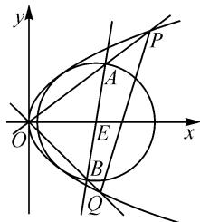

# 一道解析几何综合题的探究

# 江苏省曲塘高级中学 刘海

摘要: 涉及平面解析几何中的最值(或取值范围)问题是高考中的一个创新点与难点,考查形式变化多样,常考常新.结合一道解几背景下最值问题的求解,从不同思路展开,采用不同技巧方法解决,开拓数学思维,提升试题的宽度与厚度,有效指导数学教学与解题研究.

关键词: 抛物线; 圆; 三角形; 面积; 最值

平面解析几何中的最值(或取值范围)问题,往往以“压轴题”的形式出现在高考选择题、填空题或解答题中的对应位置,成为高考命题乃至自主招生、竞赛中的“常客”之一,更是各类模拟考试中常考的基本题型之一.此类问题,除了可以很好地考查平面解析几何的基本知识,还可以巧妙融合平面几何、函数与方程、三角函数、不等式、函数与导数等其他相关知识,契合“在知识交汇点处命题”的命题理念,同时又能很好考查学生基本的数学思想方法和核心素养等,创新新颖,花样翻新,难度较高,但其基本解题思路与技巧方法仍然有章可循,有法可依.

# 1 问题呈现

问题 （2023 届江西省重点中学协作体高三第二次联考数学试题 · 16）已知抛物线 C: $y^{2}=4x$ ，圆 E: $(x-4)^{2}+y^{2}=12$ ，设 O 为坐标原点，过圆心 E 的直线与圆 E 交于点 A, B，直线 OA, OB 分别交抛物线 C 于点 P, Q（点 P, Q 不与点 O 重合）。记 $\triangle OAB$ 的面积为 $S_{1}, \triangle OPQ$ 的面积为 $S_{2}$ ，则 $\frac{S_{1}}{S_{2}}$ 的最大值为 \_\_\_\_.

此题以抛物线、圆为综合问题载体,结合直线与抛线物、直线与圆的位置关系,以及坐标原点与交点所构成的三角形的面积,通过两个不同三角形的面积的比值创设,进而确定相应的最值问题.

本题解题的关键是构建两个不同三角形面积的表达式,合理引入参数是根本所在.可以通过设线法、设点法或参数方程法等多思维视角切入,利用三角形面积公式的不同形式来确定对应的面积表达式,为进一步确定面积比值的最值提供解题依据与基础.

# 2 问题破解

方法 1: 设线法.

解析:由题意可知,直线 AB 的斜率不为 0, 故设直线 AB 的方程为 $x=my+4$ .

如图 1 所示, 设 $A(x_{1}, y_{1})$ , $B(x_{2}, y_{2})$ , $P(x_{3}, y_{3})$ , $Q(x_{4}, y_{4})$ .

将直线 AB 的方程代入圆 E 的方程, 消去参数 x 并整理, 可得 $(m^{2}+1)y^{2}-12=0$ .

text_image

y
A
P
O
E
x
B
Q

图1

利用韦达定理,可得

$$
y _ {1} + y _ {2} = 0, y _ {1} y _ {2} = - \frac {1 2}{m ^ {2} + 1}.
$$

而直线 OA 的方程为 $y=\frac{y_{1}}{x_{1}}x$ ，代入抛物线 C 的方程，消去参数 x 并整理，可得 $y^{2}=\frac{4x_{1}}{y_{1}}y$ .

解得 y=0 或 $y=\frac{4x_{1}}{y_{1}}$ ，则知 $y_{3}=\frac{4x_{1}}{y_{1}}$ .

同理, 可得 $y_{4}=\frac{4x_{2}}{y_{2}}$ .

所以 $\frac{S_{1}}{S_{2}}=\frac{\frac{1}{2}\times|OA|\times|OB|\times\sin\angle AOB}{\frac{1}{2}\times|OP|\times|OQ|\times\sin\angle POQ}=$

$$
\frac {| O A | | O B |}{| O P | | O Q |} = \frac {| O A |}{| O P |} \times \frac {| O B |}{| O Q |} = \frac {| y _ {1} |}{| y _ {3} |} \times \frac {| y _ {2} |}{| y _ {4} |} = \frac {| y _ {1} |}{\left| \frac {4 x _ {1}}{y _ {1}} \right|} \times
$$

$$
\frac {\left| y _ {2} \right|}{\left| \frac {4 x _ {2}}{y _ {2}} \right|} = \frac {\left(y _ {1} y _ {2}\right) ^ {2}}{1 6 \left| x _ {1} x _ {2} \right|} = \frac {\left(y _ {1} y _ {2}\right) ^ {2}}{1 6 \left| (m y _ {1} + 4) (m y _ {2} + 4) \right|} =
$$

$$
\frac {\left(y _ {1} y _ {2}\right) ^ {2}}{1 6 \left| m ^ {2} y _ {1} y _ {2} + 4 m \left(y _ {1} + y _ {2}\right) + 1 6 \right|} = \frac {\left(y _ {1} y _ {2}\right) ^ {2}}{1 6 \left| m ^ {2} y _ {1} y _ {2} + 1 6 \right|} =
$$

$$
\frac {\left(- \frac {1 2}{m ^ {2} + 1}\right) ^ {2}}{1 6 \left| m ^ {2} \times \left(- \frac {1 2}{m ^ {2} + 1}\right) + 1 6 \right|} = \frac {9}{4 (m ^ {2} + 1) (m ^ {2} + 4)} =
$$

$$
\frac {9}{4 \left(m ^ {2} + \frac {5}{2}\right) ^ {2} - 9}.
$$

所以，当 m=0 时， $\frac{S_{1}}{S_{2}}$ 取得最大值为 $\frac{9}{16}$ .

故填答案: $\frac{9}{16}$ .

解后反思:设线法是处理直线与圆锥曲线位置关系问题中比较常用的一种“通性通法”,巧设直线方程,与圆锥曲线的方程联立,利用函数与方程思想,通过韦达定理构建相应交点的坐标关系式,为进一步分析与探究提供条件.设线法往往要结合直线的斜率是否存在、是否为零等信息加以创新设置,其目的是回避分类讨论,优化解题过程.

方法 2: 设点法.

解析: 设 $A(x_{1}, y_{1})$ , $B(x_{2}, y_{2})$ , 则 $y_{1}^{2} \leqslant 12$ .

以 AB 为直径的圆 E 的方程为

$$
(x - x _ {1}) (x - x _ {2}) + (y - y _ {1}) (y - y _ {2}) = 0.
$$

整理，可得 $x^{2}-(x_{1}+x_{2})x+x_{1}x_{2}+y^{2}-(y_{1}+y_{2})y+y_{1}y_{2}=0=x^{2}-8x+y^{2}+4.$

所以 $x_{1} + x_{2} = 8, y_{1} + y_{2} = 0, x_{1}x_{2} + y_{1}y_{2} = 4.$

而直线 OA 的方程为 $y=\frac{y_{1}}{x_{1}}x$ ，代入抛物线 C 的方程，消去参数 x 并整理，可得 $y^{2}=\frac{4x_{1}}{y_{1}}y$ .

解得 y=0 或 $y=\frac{4x_{1}}{y_{1}}$ ，则知 $y_{P}=\frac{4x_{1}}{y_{1}}$ .

同理, 可得 $y_{Q}=\frac{4x_{2}}{y_{2}}$ .

同方法 1, 可知 $\frac{S_{1}}{S_{2}} = \frac{(y_{1}y_{2})^{2}}{16|x_{1}x_{2}|}$ .

所以 $\frac{S_1}{S_2} = \frac{(y_1y_2)^2}{16|x_1x_2|} = \frac{(y_1y_2)^2}{16|4 - y_1y_2|} = \frac{y_1^4}{16(4 + y_1^2)} =$ $\frac{1}{16\left(\frac{4}{y_1^4} + \frac{1}{y_1^2}\right)} = \frac{1}{64\left(\frac{1}{y_1^2} + \frac{1}{8}\right)^2 - 1}.$

所以，当 $y_{1}^{2}=12$ 时， $\frac{S_{1}}{S_{2}}$ 取得最大值，最大值为 $\frac{1}{64\left(\frac{1}{12}+\frac{1}{8}\right)^{2}-1}=\frac{9}{16}$ . 故填答案： $\frac{9}{16}$ .

解后反思:设点法也是处理直线与圆锥曲线位置关系问题中比较常用的一种“通性通法”,借助点的坐标的设置,可以建立直线方程、构建坐标参数所满足的关系式等,结合题设条件可以合理“串联”起不同坐标之间的关系,以方便问题的进一步分析与解决.设点法往往抓住点所在的直线、圆锥曲线等加以合理设置,尽量减少参数的个数,以方便后继的数学运算与综合解题.

方法 3: 参数方程法.

解析:由题设条件设 $A(4+2\sqrt{3}\cos\theta,2\sqrt{3}\sin\theta)$ ， $B(4-2\sqrt{3}\cos\theta,-2\sqrt{3}\sin\theta)$ ，不失一般性，结合圆的对称性可令 $\theta\in(0,\pi)$ .

设 $P\left(\frac{y_{1}^{2}}{4},y_{1}\right),Q\left(\frac{y_{2}^{2}}{4},y_{2}\right).$

由 $O, A, P$ 三点共线，可得 $\frac{y_1}{\frac{y_1^2}{4}} = \frac{2\sqrt{3}\sin\theta}{4 + 2\sqrt{3}\cos\theta}$ .

整理, 可得 $y_{1}=\frac{8+4\sqrt{3}\cos\theta}{\sqrt{3}\sin\theta}$ .

同理，可得 $y_{2}=\frac{8-4\sqrt{3}\cos\theta}{-\sqrt{3}\sin\theta}$ .

易得 $S_{1}=\frac{1}{2}\times4\times2\sqrt{3}\sin\theta\times2=8\sqrt{3}\sin\theta,$

$S_{2} = \frac{1}{2}\mid x_{1}y_{2} - x_{2}y_{1}\mid = \frac{1}{8}\mid y_{1}^{2}y_{2} - y_{2}^{2}y_{1}\mid =$ $\frac{32(4 - 3\cos^2\theta)}{3\sqrt{3}\sin^3\theta}.$

所以 $\frac{S_1}{S_2} = \frac{8\sqrt{3}\sin\theta}{\frac{32(4 - 3\cos^2\theta)}{3\sqrt{3}\sin^3\theta}} = \frac{9\sin^4\theta}{4(4 - 3\cos^2\theta)} =$

$\frac{9\sin^4\theta}{4(1 + 3\sin^2\theta)} = \frac{(1 + 3\sin^2\theta)^2 - 2(1 + 3\sin^2\theta) + 1}{4(1 + 3\sin^2\theta)} = \frac{1}{4}\left[(1 + 3\sin^2\theta) + \frac{1}{1 + 3\sin^2\theta}\right] - \frac{1}{2}.$

令 $t = 1 + 3\sin^2\theta \in (1,4]$ ，对于函数 $f(t) = t + \frac{1}{t}$ $t\in (1,4]$ ，其在区间(1,4]上单调递增.

所以，当 $t=1+3\sin^{2}\theta=4$ ，即 $\theta=\frac{\pi}{2}$ 时， $\frac{S_{1}}{S_{2}}$ 取得最大值 $\frac{1}{4}\left(4+\frac{1}{4}\right)-\frac{1}{2}=\frac{9}{16}$ 。故填答案： $\frac{9}{16}$ 。

解后反思: 参数方程法是处理直线与圆锥曲线位置关系问题中比较常用的一种“巧技妙法”, 借助直线、圆、圆锥曲线等参数方程的设法, 对应直线或曲线上相应点的坐标, 通过参数的变化进一步分析与求解实际问题. 参数方程法的应用过程中, 要注意点参、线参、角参等取值范围的限制, 要合理挖掘题设条件, 正确加以确定, 这对后继的数学运算与解题起到至关重要的作用.

# 3 教学启示

# 3.1 归纳总结方法,养成解题习惯

求解平面解析几何中的最值(或取值范围)问题时,要抓住直线与圆锥曲线的位置关系等场景,巧妙选取合理的参数,如点参、线参、角参等,同时结合题设条件或隐含条件等确定对应参数的取值范围.

在设参的基础上,借助直线与圆锥曲线的位置关系等切入,巧妙建立关于相应参数的目标函数,进而利用圆锥曲线自身的几何性质,或借助二次函数、基本不等式、函数与导数等来分析与求解对应的最值(或取值范围)问题.

# 3.2 “一题多解”思维,深入研究拓展

解平面解析几何的最值(或取值范围)问题时,由于参数选择的形式多样,根据题设合理选择点参、线参、角参等,这就为解决此类问题提供了更加丰富多彩的思维视角,是实现多种方法解题的根本,可以很好实现“一题多解”的巧妙应用,同时对不同的技巧方法加以对比、分析,从中合理优化,提升能力.

基于此类问题的“一题多解”，可合理对问题条件、问题结论，以及问题的求解方法、求解过程等加以深入研究与分析，从而合理拓展与应用，达到“一题多思”“一题多变”“一题多得”等方面的良好效果，对于全面提升数学解题能力以及培养数学核心素养都有益处.Z