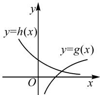
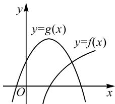
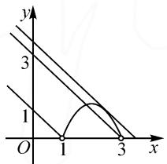
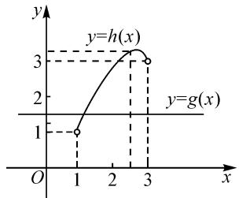

# 利用函数图象确定零点个数

# ● 江苏省南通市海门第一中学 曹兵

在高中必修课程体系中,判断函数零点的个数属于必学内容之一,函数零点个数的判断比较抽象,需要深入理解,与方程有关的根和函数的零点个数的内容主要包括两个理论以及由这两个理论推广出的一个理论.

理论 1: 函数 $y = f(x)$ 有零点 $\Leftrightarrow$ 方程 $f(x) = 0$ 有实数根 $\Leftrightarrow$ 函数 $y = f(x)$ 的图象与 x 轴有交点.

理论 2: 如果函数 $y = f(x)$ 在区间 $[a, b]$ 上的图象是一条连续不断的曲线，且有 $f(a)f(b) < 0$ ，那么，函数 $y = f(x)$ 在区间 $(a, b)$ 内至少有一个零点，即存在 $c \in (a, b)$ ，使得 $f(c) = 0$ ，这个 c 也就是方程 $f(x) = 0$ 的解.

理论 3: 函数 $y=f(x)$ 与 $y=g(x)$ 的图象有交点 $\Leftrightarrow$ 方程 $g(x)-f(x)=0$ 有解，即 $g(x)-f(x)=0$ 有实数根 $\Leftrightarrow$ 函数 $g(x)-f(x)=F(x)$ 有零点.

上面的分析以及相应的三个结论,如果从纯粹的数学知识的角度来看,属于高中数学知识体系当中的重要内容.学生掌握这些内容,一方面可以完善自己的认知体系,另一方面可以形成较强的问题分析与解决能力.但笔者以为仅有这样的认识是不够的,因为利用函数图象确定零点的个数,更是在一定程度上体现了数学学科的内在特点,同时也体现出了数学思想方法的应用 $^{[1]}$ .其中,最典型的思想就是数形结合思想.根据笔者的调查研究发现,尽管几乎所有学生在数学知识学习与运用的过程当中都能体会数形结合思想,但很多时候学生的这种体会并没有上升为数学意识,这也就导致很多学生在学习新的数学知识或在解题的时候,难以有意识地将数形结合作为思维突破的切入口.说得直白一点,就是学生的体验没有上升为理性认识,这显然无助于数学核心素养的发展.因此,基于上面的分析,接下来结合实例来分析、研究函数零点的相关问题,融合数形结合思想和函数思想,培养学生数形结合的思维方式,体会数形结合方法的典型性和优点.

例 1 已知方程 $\left(\frac{1}{2}\right)^{x}=\ln x$ ，则此方程的实根的个数为 \_\_\_\_.

方法 1: 这道题求的是方程根的个数, 根据理论 1可知,方程根的个数即是函数零点的个数,因此可以通过构造函数来求根的个数.先将方程左边移到方程右边,即 $\ln x - \left(\frac{1}{2}\right)^{x} = 0$ ,再令 $f(x) = \ln x - \left(\frac{1}{2}\right)^{x}$ ,通过观察发现,代入 1 和 e,那么就有 $f(1) = -\frac{1}{2} < 0$ , $f(e) = 1 - \frac{1}{2^{e}} > 0$ .符合有零点的条件,即在 $(1, e)$ 内 $f(x)$ 有零点.再根据在 $(0, +\infty)$ 内 $f(x)$ 是增函数,因此可得函数 $f(x)$ 在 $(0, +\infty)$ 内有且只有一个零点.故方程 $\left(\frac{1}{2}\right)^{x} = \ln x$ 有且只有一个实根.

方法 2: 这道题还可以结合函数的图象来求解. 假设 $h(x)=\left(\frac{1}{2}\right)^{x}$ ，且 $g(x)=\ln x$ . 在同一个直角坐标

系中作出函数 $h(x)=\left(\frac{1}{2}\right)^{x}$ 和 $g(x)=\ln x$ 的图象，如图 1 所示。观察图象可以发现，这两个函数图象有且只有一个交点，由此可以得到，方程 $\left(\frac{1}{2}\right)^{x}=\ln x$ 有且只有一个实数根。

text_image

y
y=h(x)
y=g(x)
O
x

图1

评析: 利用方法 1 求解的时候, 不仅需要求出 $f(1) < 0$ 和 $f(\mathrm{e}) > 0$ , 还要知道函数 $f(x) = \ln x - \left(\frac{1}{2}\right)^x$ 在定义域内是单调的 (不同函数单调情况也不相同), 把这两个条件结合起来才能说明方程有且只有一个实数根.

例 2 方程 $\log_{2}x=-(x-1)^{2}+2$ 实数根的个数为 \_\_\_\_.

这道题也可以采用图象法. 设 $g(x) = -(x - 1)^{2} + 2$ , $f(x) = \log_{2} x$ 在同一直角坐标系中作出这两个函数的图象, 如图2所示. 根据图象分析可以得到, 两个函数图象有且只有一个交点,因此方程 $\log_{2}x=-(x-1)^{2}+2$ 有且只有一个实

text_image

y
y=g(x)
y=f(x)
O
x

图 2

数根.

评析:求方程实根的个数通常有两条途径.(1)转化为两个函数图象交点的个数,结合函数图象求解;(2)转化为一个函数零点的个数,结合零点存在定理求解.相较于利用零点存在定理,明显结合函数图象的方法更简单明了.

例 3 求方程 $\lg(x-1)+\lg(3-x)=\lg(a-x)$ (a 是常数) 的实数根个数.

方法1:首先求出 x 的范围,分析原方程可以知道 x 的限制条件是 $\left\{\begin{aligned}x-1&>0,\\ 3-x&>0,\end{aligned}\right.$ 即 $\left\{\begin{aligned}1&<x<3,\\ x&<a.\end{aligned}\right.$ 那么,将原方程等价变换,可以得到

$$
\lg [ (x - 1) (3 - x) ] = \lg (a - x),
$$

即 $a-x=(x-1)(3-x)$ .

令 $f(x)=(x-1)(3-x)$ (其中 1<x<3)， $g(x)=a-x(x<a)$ ，在同一直角坐标系中作出这两个函数图象，如图 3 所示.

由方程 $(x - 1)(3 - x) = a - x$ 的 $\Delta = 0$ ，求出 $a = \frac{13}{4}$ ，此时方程 $\lg (x - 1) + \lg (3 - x) = \lg (a - x)$ 有

text_image

y
3
1
O 1 3 x

图3

结合图象可以发现,方程没有实数根时, $a\leqslant1$ 或者 $a>\frac{13}{4}$ ;方程有一个实根时, $1<a\leqslant3$ 或 $a=\frac{13}{4}$ ;当方程有两个实根时, $3<a<\frac{13}{4}$ .

方法 2: 根据题意分析可知, 原方程等价于

$$
\left\{ \begin{array}{l} (3 - x) (x - 1) = a - x, \\ x - 1 > 0, \\ 3 - x > 0, \end{array} \right.
$$

即 $\left\{\begin{aligned}-3+5x-x^{2}&=a,\\1&<x<3.\end{aligned}\right.$

在同一个直角坐标系中,作出函数 $h(x) = -3 + 5x - x^{2} (1 < x < 3)$ , $g(x) = a$ 的图象,如图4所示.

line

| x | y=h(x) | y=g(x) |
|---|--------|--------|
| 1 | 1      | 1      |
| 2.5 | 3      | 3      |
| 3 | 3      | 3      |

图4

根据图象,可以观察函数 $y=h(x)$ 和 $y=g(x)$ 图象交点的个数情况(略).

评析:结合函数图象求解与函数零点个数相关的问题,不仅可以省去较为复杂的运算,而且通过图象可以快速得出正确的答案.

掌握确定函数零点个数的方法对于学生来说十分重要,结合图象确定零点个数是目前最常用、最简便的方法之一,它要求学生有良好的计算能力和基本的作图能力,对学生的逻辑思维有一定的要求,要求学生能全面分析问题,还要注意限制条件,作图要尽量准确.学好零点个数求解,可以有效提升数学素养 $^{[2]}$ .

对上述教学过程进行概括与反思,笔者以为在高中数学教学中,最直接的抓手当然是数学知识的建构与运用,这是由当前的考核评价机制决定的,教师的教学必须努力服务于学生思维能力的发展与解题能力的提升.与此同时,教师也必须关注学生数学学科核心素养的发展和学生对数学思想方法的领悟.无论是核心素养的发展还是数学思想方法的领悟,其实都不影响学生解题能力的提升,同时还能够为学生的可持续发展奠定基础.比如上面所强调的数形结合,是数学学科特征的直接体现,更是高中数学教学最不能忽视的思想方法之一.对于数形结合,不仅要让学生有实际的体验,还要让学生有真切的收获.这种收获对于学生来说应当是显性的,只有当学生明确认识到数形结合能够反映数学学科的特征时,才能够有意识地在数学知识学习与运用的过程当中自动激活数形结合思想,从而让数形结合真正成为学生数学解题的利器 $^{[3]}$ .

在这篇文章当中,函数图象与零点个数的研究是一个突破口,只是一条明线,数形结合思想是背后的暗线,是学生领悟的重点,这才是笔者想重点强调的.

# 参考文献：

[1] 李志中. 直击高考真题, 掌握函数零点 [J]. 中学数学, 2019(23): 67-68.  
[2]孔欣怡.例谈高考对零点问题的考查[J].中学数学,2017(1):58-61.  
[3]潘良铭.浅析复合函数零点的个数问题[J].中学数学,2020(21):51-52.Z