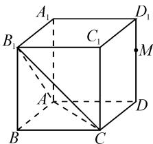
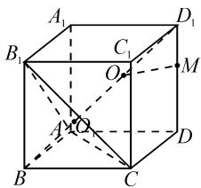
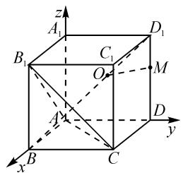

# 动点变化巧创设,半径最值妙转化

——一道外接球半径最值的探究

江苏省南京田家炳高级中学 徐玥

摘要: 涉及空间立体几何中的动点变化问题以及空间几何体的外接球问题, 是空间几何中最为热点的两类问题. 结合一道高考模拟题, 将这两个热点问题加以交汇融合, 探求动点变化条件下三棱锥外接球半径的最值, 从几何与代数两个思维视角切入, 利用不同的技巧方法来处理, 有效指导数学教学与复习备考.

关键词: 正方体; 动点; 外接球; 半径; 最值

立体几何中的动点问题,是创新情境背景下的一类特殊问题,主要通过空间动点的运动变化,结合一些特殊条件的限制,进而研究与之相关的空间几何体的一些最值或取值范围问题.其中空间几何体的外接球问题,是此类问题中的一类热点与难点问题.解决问题的关键就是合理审题,借助一些“动”与“不动”的要素,认真分析动点变化特点,寻找静态因素与动态因素之间的关系,从静态因素中寻找解决问题的突破口,以“静”制“动”,以“静”带“动”,“动”中寻“静”,“动”“静”结合,巧妙处理.

# 1 问题呈现

问题〔2023年浙江省杭州高级中学高考数学模拟试卷(5月份)〕如图1,在棱长为3的正方体 $ABCD-A_{1}B_{1}C_{1}D_{1}$ 中,M是棱 $DD_{1}$ 上的动点(不含端点),则三棱锥 $M-AB_{1}C$ 的外接球的半径最小值为().

text_image

A₁
B₁
C₁
D₁
M
A
B
C
D

图1

A. $\sqrt{6}$

B. $\frac{3\sqrt{2}}{2}$

$$
\mathrm{C.} 6 - 3 \sqrt {2}
$$

D. $6(\sqrt{2}-1)$

此题以正方体为背景,结合“定底面变顶点”的三棱锥 $M-AB_{1}C$ 的创设,以“动”态形式给出场景,通过对应三棱锥 $M-AB_{1}C$ 的外接球半径的“变化”来确定其最小值问题.问题动静结合,解题时,可以从两个视角切入:

(1) 几何法, 这是解决此类问题的常规思路, 首先找到外接球的球心, 然后建立与外接球半径有关的方程, 解方程即可;  
(2)代数法,对大部分学生而言,解决空间立体几何问题的通法仍然是建立空间直角坐标系,找出与半径有关的数量关系,建立目标函数,求得最值即可.

# 2 问题破解

# 2.1 几何思维

方法 1: 几何法.

解析:如图2,在正方体中易得 $BD_{1}\perp$ 平面 $AB_{1}C$ ,且 $BD_{1}$ 过正三角形 $AB_{1}C$ 的外心 $O_{1}$ ,同时 $O_{1}$ 是线段 $BD_{1}$ 的三等分点,则三棱锥 $M-AB_{1}C$ 的外接球的球心O在线段 $BD_{1}$ 上.

text_image

A₁
B₁
C₁
O
M
A
O
B
C
D

图 2

又 M 是棱 $DD_{1}$ 上的动点
(不含端点)，则当三棱锥 $M-AB_{1}C$ 的外接球的半径最小时有 $OM \perp DD_{1}$ ，此时外接球的半径 r = OM.

设 $D_{1}M=t$ ，其中 $t\in(0,3)$ .

由比例性质，得 $\frac{t}{3} = \frac{OM}{BD} = \frac{D_1O}{D_1B} = \frac{r}{3\sqrt{2}}$ ，解得 $r = \sqrt{2} t.$ 又 $D_{1}B = 3\sqrt{3}$ ，则 $D_{1}O = \sqrt{3} t.$

在 Rt△AOO $_{1}$ 中，r = OA = $\sqrt{OO_{1}^{2} + AO_{1}^{2}}$ = $\sqrt{\left(3\sqrt{3}\times\frac{2}{3}-\sqrt{3}t\right)^{2}+\left(\frac{3\sqrt{2}}{2}\times\sqrt{3}\times\frac{2}{3}\right)^{2}}$ = $\sqrt{2}$ t.

整理有 $t^{2}-12t+18=0$ . 解得 $t=6-3\sqrt{2}$ 或 $t=6+3\sqrt{2}$ （舍去）.

所以 $r=\sqrt{2}t=\sqrt{2}(6-3\sqrt{2})=6(\sqrt{2}-1)$ .

故选择答案:D.

解后反思: 利用几何法解决空间几何体的外接球问题, 关键在于确定外接球的球心, 合理构建几何体底面截面圆的小圆与外接球直径所在的大圆之间的位置关系, 为进一步的分析与求解提供条件.

# 2.2 代数思维

方法 2: 坐标法 1.

解析: 易知三棱锥 $M-AB_{1}C$ 的外接球的球心 O 在线段 $BD_{1}$ 上.

以 A 为坐标原点，AB， $AD, AA_{1}$ 所在直线分别为 x 轴、y 轴、z 轴建立空间直角坐标系，如图 3 所示，则 A(0,0,0)， $B(3,0,0)$ ， $D_{1}(0,3,3)$ ，可得 $\overrightarrow{BD_{1}}=(-3,3,3)$ .

text_image

z
A₁
B₁
C₁
O
M
D₁
A′
B
C
D
y
x

图3

设 $\overrightarrow{BO} = \lambda \overrightarrow{BD_1}$ ，则 $\overrightarrow{BO} =$ 图3 $(-3\lambda ,3\lambda ,3\lambda)$ ，其中 $\lambda \in (0,1)$ ，可知 $O(3 - 3\lambda ,3\lambda ,3\lambda)$

设 $M(0,3,t)$ ，其中 $t\in(0,3)$ .

设三棱锥 $M-AB_{1}C$ 的外接球的半径为 r，则有 OA=OM=r，即 $OA^{2}=OM^{2}$ ，可得

$$
\begin{array}{c} (3 - 3 \lambda) ^ {2} + (3 \lambda) ^ {2} + (3 \lambda) ^ {2} = (3 - 3 \lambda) ^ {2} + (3 \lambda - 3) ^ {2} + \\ (3 \lambda - t) ^ {2}. \end{array}
$$

整理, 可得 $6\lambda=\frac{t^{2}+9}{t+3}, t\in(0,3)$ .

下面从两个方向来分析与求解.

方向(1): 基本不等式法.

故 $6\lambda = \frac{t^2 + 9}{t + 3} = \frac{(t + 3)^2 - 6(t + 3) + 18}{t + 3} = (t + 3) + \frac{18}{t + 3} - 6 \geqslant 2\sqrt{(t + 3) \times \frac{18}{t + 3}} - 6 = 6\sqrt{2} - 6$ ，当且仅当 $t + 3 = \frac{18}{t + 3}$ ，即 $t = 3\sqrt{2} - 3$ 时，等号成立.

解得 $\lambda \geqslant \sqrt{2} - 1 > \frac{1}{3}$ , 满足 $\lambda \in (0,1)$ .

又 $r^2 = OA^2 = (3 - 3\lambda)^2 + (3\lambda)^2 + (3\lambda)^2 = 27\left(\lambda - \frac{1}{3}\right)^2 + 6$ ，所以当 $\lambda = \sqrt{2} - 1$ 时， $r^2$ 取得最小值 $108 - 72\sqrt{2}$ ，即 $r$ 取得最小值 $6(\sqrt{2} - 1)$ .

方向(2): 函数与导数法.

设 $x=t+3\in(3,6)$ ，则 t=x-3。构建函数 $f(x)=\frac{(x-3)^{2}+9}{x}=x+\frac{18}{x}-6,x\in(3,6)$ ，则 $f'(x)=1-\frac{18}{x^{2}}$ 。令 $f'(x)=0$ ，解得 $x=3\sqrt{2}$ 。

易知 $f(x)_{\min} = f(3\sqrt{2}) = 6\sqrt{2} - 6$ ，而 $f(3) = f(6) = 3$ ，则 $f(x) \in [6\sqrt{2} - 6, 3)$ ，得 $\lambda \in \left[\sqrt{2} - 1, \frac{1}{2}\right)$ .

又 $r^{2}=OA^{2}=27(\lambda-\frac{1}{3})^{2}+6$ ，下同方向(1).

方法 3: 坐标法 2.

解析: 易知三棱锥 $M-AB_{1}C$ 的外接球的球心 O 在线段 $BD_{1}$ 上. 以 A 为坐标原点, AB, AD, $AA_{1}$ 所在直线分别为 x 轴、y 轴、z 轴建立空间直角坐标系, 则 $A(0,0,0)$ , $B(3,0,0)$ , $D_{1}(0,3,3)$ , 可得 $\overrightarrow{BD_{1}}=(-3,3,3)$ .

设 $\overrightarrow{BO} = \lambda \overrightarrow{BD_1} = (-3\lambda, 3\lambda, 3\lambda)$ ，其中 $\lambda \in (0,1)$ ，则 $O(3 - 3\lambda, 3\lambda, 3\lambda)$ ，可得 $\overrightarrow{D_1O} = (3 - 3\lambda, 3\lambda - 3, 3\lambda - 3)$ .

又 M 是棱 $DD_{1}$ 上的动点（不含端点），则当三棱锥 $M-AB_{1}C$ 的外接球的半径最小时有 $OM \perp DD_{1}$ ，此时外接球的半径为 r = OM.

由比例性质, 可得 $r = OM = \sqrt{2} D_{1} M = \frac{\sqrt{2}}{\sqrt{3}} D_{1} O.$

所以 $r^{2}=\frac{2}{3}D_{1}O^{2}=OA^{2}$ ，则

$$
\frac {2}{3} \times 3 \times (3 - 3 \lambda) ^ {2} = (3 - 3 \lambda) ^ {2} + (3 \lambda) ^ {2} + (3 \lambda) ^ {2}.
$$

整理可得 $\lambda^{2}+2\lambda-1=0$ ，解得 $\lambda=-1+\sqrt{2}$ 或 $\lambda=-1-\sqrt{2}$ （舍去）.

所以 $r^{2}=2(3-3\lambda)^{2}=108-72\sqrt{2}$ ，即 r 取得最小值 $6(\sqrt{2}-1)$ 。故选择答案：D.

解后反思:根据坐标法解决立体几何问题,就是合理构建空间直角坐标系,利用坐标运算代替一些逻辑推理便于分析与求解.如果能利用几何法知道动点M的位置的话,利用坐标法会比较快捷;反之,若不知道动点M的位置,也可利用函数思想建立目标函数,借助函数的性质或不等式思想等来求解,这对于空间感比较薄弱的学生比较友善.

# 3 教学启示

# 3.1 剖析动点变化,挖掘解题模型

立体几何中的动点变化问题,往往隐藏于该动点所处的空间几何模型中,抓住动点的运动规律,挖掘对应的空间几何模型是制胜法宝.

在解题的过程中,关注空间想象以及逻辑推理的应用,做到“胸有图形”,“动”中寻“宝”,构建正确的空间图形.具体解答时,或借助逻辑推理利用几何法定性分析,或引入参数利用代数法定量计算等,不同思维视角与应用都可以很好地实现“动”与“静”的和谐统一与转化.

# 3.2 空间最值问题,解题技巧策略

涉及立体几何中的动点最值或取值范围问题,正确剖析题目条件,把握问题的内涵与实质,解题的常见基本技巧与策略有:

(1)“动中觅静”思维.结合动点变化过程中的不变性,抓住“动”的过程中的一个瞬间——“动”中取“静”,此时是运动的一种特殊形式,化一般情形为特殊情形,问题迎刃而解.  
(2)降维思维.化“三维”为“二维”,将空间动点变化问题转化到同一个平面上对应元素的运动与变化,巧妙降维处理,利用平面几何的知识来分析与应用.  
(3)坐标思维.合理构建空间直角坐标系,结合动点坐标的设置与应用,利用空间知识来分析与处理,利用函数与导数、不等式等相关知识来分析与应用.Z