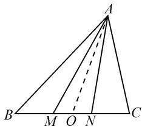
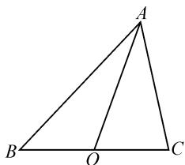
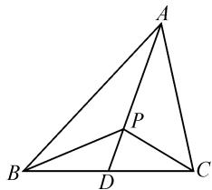
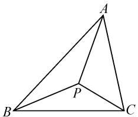
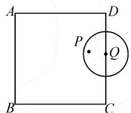
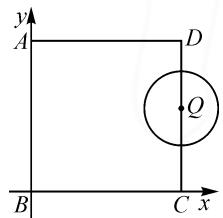
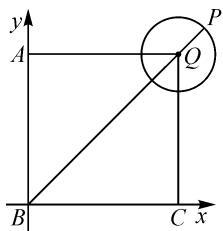
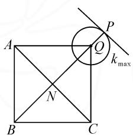
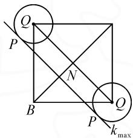

# 巧解平面向量的几种技巧

# ● 哈尔滨师范大学教师教育学院 田子健

摘要:平面向量是高中数学研究数与形的一种重要工具.平面向量问题具有较强的灵活性,大多学生在解题过程中往往“费力不讨好”,而选择合适的方法可以“事半功倍”.因此,本文中提供了解决平面向量问题的三种技巧,即极化恒等式、奔驰定理与等和线定理,以帮助学生发散思维,节省时间,提高解题效率.

关键词: 平面向量; 极化恒等式; 奔驰定理; 等和线定理

“平面向量”作为高考必考内容,往往会结合其他知识以选择题、填空题的形式进行考查,选择合适的方法会使向量运算更为简便.本文中主要介绍平面向量中的三种解题技巧,供大家学习参考.

例 1 在 $\triangle ABC$ ，已知 $\overrightarrow{AB} \cdot \overrightarrow{AC} = 4, |\overrightarrow{BC}| = 3$ ，M, N 分别是 BC 边上的三等分点，则 $\overrightarrow{AM} \cdot \overrightarrow{AN}$ 的值是 \_\_\_\_.

分析:本题考查了平面向量的数量积运算与向量加法法则的应用,体现了数学转化的思想方法.

解法 1:(常规解法)如图 1, 设 BC 的中点为 O.

$$
\begin{array}{r l} & {\text {因为} \overrightarrow {A B} \cdot \overrightarrow {A C} = 4, \text {所以}} \\ & {(\overrightarrow {A O} + \overrightarrow {O B}) \cdot (\overrightarrow {A O} + \overrightarrow {O C}) =} \\ & {(\overrightarrow {A O} + \overrightarrow {O B}) \cdot (\overrightarrow {A O} - \overrightarrow {O B}) =} \\ & {| \overrightarrow {A O} | ^ {2} - | \overrightarrow {O B} | ^ {2} = 4} \end{array}
$$

text_image

A
B M O N C

图 1

因为 $|\overrightarrow{BC}|=3$ ，所以

$$
| \overrightarrow {O B} | = \frac {3}{2}, | A O | ^ {2} = 4 + | O B | ^ {2} = \frac {2 5}{4}.
$$

又易知 $\overrightarrow{ON} = -\overrightarrow{OM}, |MB| = 1$

$$
\mid O M \mid = \mid O B \mid - \mid M B \mid = \frac {1}{2}.
$$

$$
\begin{array}{r l} & {\text {所以} \overrightarrow {A M} \bullet \overrightarrow {A N} = (\overrightarrow {A O} + \overrightarrow {O M}) \bullet (\overrightarrow {A O} + \overrightarrow {O N}) =} \\ & {(\overrightarrow {A O} + \overrightarrow {O M}) \bullet (\overrightarrow {A O} - \overrightarrow {O M}) = | \overrightarrow {A O} | ^ {2} - | \overrightarrow {O M} | ^ {2} =} \\ & {\frac {2 5}{4} - \frac {1}{4} = 6.} \end{array}
$$

若应用极化恒等式,通过数形结合来确定数量积的值,也可实现问题的直观转化与巧妙应用 $^{[1]}$ .

解法 2: (极化恒等式) 如图 2 所示, 已知 O 为 BC 的中点, 则 $\overrightarrow{AB} \cdot \overrightarrow{AC} = |\overrightarrow{AO}|^{2} - |\overrightarrow{BO}|^{2}$ .

text_image

A
B O C

图 2

由 $\overrightarrow{AB} \cdot \overrightarrow{AC} = |\overrightarrow{AO}|^2 - |\overrightarrow{BO}|^2, |\overrightarrow{BO}| = \frac{1}{2} |\overrightarrow{BC}|$ , $\overrightarrow{AB} \cdot \overrightarrow{AC} = 4, |\overrightarrow{BC}| = 3$ , 可得

$$
\left| \overrightarrow {A O} \right| ^ {2} = 4 + \left| \overrightarrow {O B} \right| ^ {2} = \frac {2 5}{4}, \left| \overrightarrow {O M} \right| ^ {2} = \frac {1}{4}.
$$

又因为 $\overrightarrow{AM} \cdot \overrightarrow{AN} = |\overrightarrow{AO}|^2 - |\overrightarrow{OM}|^2$ ，所以

$$
\overrightarrow {A M} \cdot \overrightarrow {A N} = 6.
$$

例 2 设 P 为 $\triangle ABC$ 所在平面内的一点且 $\overrightarrow{AP} = \frac{1}{4}\overrightarrow{AB} + \frac{1}{2}\overrightarrow{AC}$ ，则 $\triangle BPC$ 与 $\triangle ABC$ 的面积之比为 \_\_\_\_.

分析:本题主要将平面向量与三角形面积相结合进行考查,注重学生对知识的综合运用.

解法 1:(常规解法)如图 3, 延长 AP 交 BC 于点 D, 因为 A, D, P 三点共线, 所以存在实数 m, n, 使得 $\overrightarrow{CP} = m \overrightarrow{CA} + n \overrightarrow{CD} (m + n = 1)$ .

text_image

Geometric diagram of triangle ABC with internal point P and segment AD drawn

图3

设 $\overrightarrow{CD}=k\overrightarrow{CB}$ ，则 $\overrightarrow{CP}=$ 图3 $m\overrightarrow{CA}+nk\overrightarrow{CB}$ ，即 $\overrightarrow{AP}-\overrightarrow{AC}=-m\overrightarrow{AC}+nk(\overrightarrow{AB}-\overrightarrow{AC})$ .

整理，得 $\overrightarrow{AP} = (1 - m - nk)\overrightarrow{AC} + nk\overrightarrow{AB}.$

又因为 $\overrightarrow{AP} = \frac{1}{4}\overrightarrow{AB} +\frac{1}{2}\overrightarrow{AC}$ ，所以

$$
n k = \frac {1}{4}, 1 - m - n k = \frac {1}{2}.
$$

结合 $m+n=1$ ，解得 $m=\frac{1}{4}$ ， $n=\frac{3}{4}$ .

所以 $\overrightarrow{CP}=\frac{1}{4}\overrightarrow{CA}+\frac{3}{4}\overrightarrow{CD}$ ，可得 $\overrightarrow{AD}=4\overrightarrow{PD}$ .

因为 $\triangle BPC$ 与 $\triangle ABC$ 有相同的底边,所以

$$
\frac {S _ {\triangle B P C}}{S _ {\triangle A B C}} = \frac {| \overrightarrow {D P} |}{| \overrightarrow {A D} |} = \frac {1}{4}.
$$

另外,奔驰定理提供了平面向量与三角形面积之间的一个独特结论,因此本题由奔驰定理可直接妙解.
此定理方便记忆.针对性强,可以快速得出结果.

解法 2: (奔驰定理) 如图 4, P 是 $\triangle ABC$ 内的一点, 若 $x \overrightarrow{PA} + y \overrightarrow{PB} + z \overrightarrow{PC} = 0$ , 则

$$
\begin{array}{r l} S _ {\triangle B P C}: S _ {\triangle C P A}: S _ {\triangle A P B} = \\ x: y: z. \end{array}
$$

natural_image

Geometric diagram of a tetrahedron with vertices labeled A, B, C and an interior point P (no text or symbols beyond labels)

图4

由 $\overrightarrow{AP} = \frac{1}{4}\overrightarrow{AB} +\frac{1}{2}\overrightarrow{AC}$ ，得

$$
\overrightarrow {A P} = \frac {1}{4} (\overrightarrow {P B} - \overrightarrow {P A}) + \frac {1}{2} (\overrightarrow {P C} - \overrightarrow {P A}).
$$

整理, 得 $\overrightarrow{PA} + \overrightarrow{PB} + 2\overrightarrow{PC} = 0$ .

所以 $S_{\triangle BPC}:S_{\triangle CPA}:S_{\triangle APB}=1:1:2.$

故 $S_{\triangle BPC}:S_{\triangle ABC}=1:4.$

例 3 如图 5, 边长为 4 的正方形 ABCD 中, 半径为 1 的动圆 Q 的圆心在边 CD 和 DA 上移动 (包含端点 A, C, D), P 是圆 Q 上及其内部的动点, 设 $\overrightarrow{BP} = m \overrightarrow{BC} + n \overrightarrow{BA} (m, n \in \mathbb{R})$ , 则 $m + n$ 的取值范围是 \_\_\_\_.

text_image

A
P
Q
B
C
D

图5

分析:平面向量中求取值范围的问题难度较大,不仅会考查平面向量的基本运算法则、公式、定义、基本定理,还会考查函数的性质、平面几何图形的性质、不等式的性质等.所以,针对最值问题,要多角度思考.

解法 1: 如图 6, 以点 B 为原点, BC, BA 所在的直线分别为 x 轴、y 轴, 建立平面直角坐标系, 则 $\overrightarrow{BA} = (0, 4)$ , $\overrightarrow{BC} = (4, 0)$ .

因为 $\overrightarrow{BP}=m\overrightarrow{BC}+n\overrightarrow{BA}$ $(m,n\in\mathbf{R})$ ，所以 $\overrightarrow{BP}=(4m,4n)$ .

当动圆 Q 的圆心移动至端点 D 时, 如图 7 所示, 取点 P 坐标为 $\left(4+\frac{\sqrt{2}}{2}, 4+\frac{\sqrt{2}}{2}\right)$ .

由 $\overrightarrow{BP} = (4m, 4n)$ , 得

$$
4 m + 4 n = 8 + \sqrt {2}.
$$

此时 $m+n$ 取得最大值, 且最大值为 $2+\frac{\sqrt{2}}{4}$ .

text_image

y
A
D
Q
B
C x

图 6

text_image

y
A
P
Q
B
C x

图 7

当动圆 Q 的圆心移动至端点 C 时，

$$
\overrightarrow {B P} = (4 + \cos \theta , \sin \theta).
$$

所以 $4m+4n=4+\cos\theta+\sin\theta.$

整理，得 $4m+4n=4+\sqrt{2}\sin\left(\theta+\frac{\pi}{4}\right)$ .

当动圆 Q 的圆心移至端点 A 时, 同理可得 $4m + 4n = 4 + \sqrt{2} \sin\left(\theta + \frac{\pi}{4}\right)$ . 所以 $m + n$ 取得最小值, 最小值为 $1 - \frac{\sqrt{2}}{4}$ .

故 $m + n$ 的取值范围为 $\left[1 - \frac{\sqrt{2}}{4}, 2 + \frac{\sqrt{2}}{4}\right]$ .

本题若运用等和线定理,则可以出奇制胜,达到事半功倍的效果.但是技巧性较强,需要大量练习才能掌握 $^{[2]}$ .

等和线定理: 若 $\overrightarrow{OP} = \lambda \overrightarrow{OA} + \mu \overrightarrow{OB} (\lambda, \mu$ 都为常数), 则点 P 在直线 AB 以及与 AB 平行的直线上的充要条件为 $\lambda + \mu = k (k$ 为定值).

解法 2: 因为 $\overrightarrow{BP}=m\overrightarrow{BC}+n\overrightarrow{BA}$ ，所以可设 $m+n=k$ ，如图 8, $k=\frac{|BP|}{|BN|}$ .

text_image

A
P
Q
kmax
N
B
C

图8

text_image

Q
P
N
B
P
Q
kmax

图9

因为 $|BP|_{\max}=4\sqrt{2}+1,|BN|=2\sqrt{2}$ ，所以

$$
k _ {\max} = \frac {| B P |}{| B N |} = 2 + \frac {\sqrt {2}}{4}.
$$

如图 9, $\left|BP\right|_{\min}=2\sqrt{2}-1,\left|BN\right|=2\sqrt{2}$ ，所以

$$
k _ {\min} = \frac {| B P |}{| B N |} = 1 - \frac {\sqrt {2}}{4}.
$$

故 $m + n$ 的取值范围为 $\left[1 - \frac{\sqrt{2}}{4}, 2 + \frac{\sqrt{2}}{4}\right]$ .

向量作为高中数学知识的重要组成部分,同时又是研究数与形的重要工具,在应用空间向量解题的过程中,如果恰当灵活使用本文中提到的解题技巧,可以更加直观,有效提升解题效率和质量.

# 参考文献：

[1] 黄水华. 巧思维切入, 妙视角拓展——一道向量题的深入学习 [J]. 数学之友, 2022, 36(16): 41-43.   
[2]孙传平.平面向量中的解题技巧[J].中学数学研究(华南师范大学版),2013(1):31-33.Z