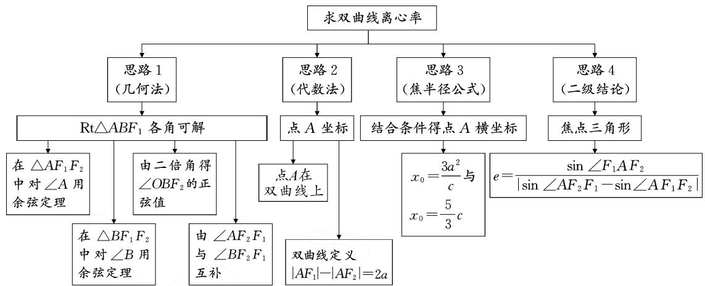
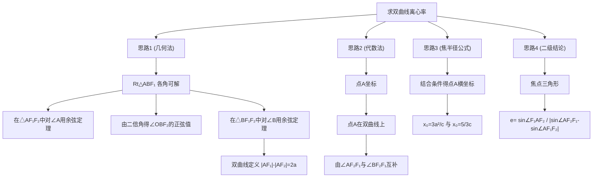
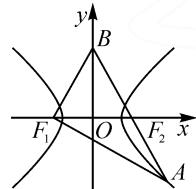

# 2023年讲题比赛获奖论文之四：

# 赏析 2023 年高考数学新课标I卷第 16 题

# ● 江苏省沭阳高级中学 孙梦丽 王杉

# 1 试题内容

(2023年新课标Ⅰ卷)已知双曲线 $C:\frac{x^{2}}{a^{2}}-\frac{y^{2}}{b^{2}}=1$ $(a>0,b>0)$ 的左、右焦点分别为 $F_{1},F_{2}$ . 点 A 在 C 上，点 B 在 y 轴上， $\overrightarrow{F_{1}A}\perp\overrightarrow{F_{1}B},\overrightarrow{F_{2}A}=-\frac{2}{3}\overrightarrow{F_{2}B}$ ，则 C 的离心率为 \_\_\_\_.

# 2 解法分析

以双曲线为背景求离心率是常见题型,可选择的切入点有:

(1)结合平面几何知识,借助双曲线定义、正余弦定理构建方程来求解;   
(2)建立平面直角坐标系,设点或设线,将题设条件转化为坐标关系得到方程,从而求解.

本题思维导图如图 1 所示.

flowchart

图1

# 3 试题解答

思路 1: 以向量模长关系为切入点.

解法 1: 用余弦定理构建 a 与 c 的关系式.

由条件 $\overrightarrow{F_{2}A} = -\frac{2}{3}\overrightarrow{F_{2}B}$ ，可知点 $F_{2}$ 在线段 AB 上（如图 2），且 $\left|F_{2}A\right| : \left|F_{2}B\right| = 2 : 3$ .

设 $|AF_{2}| = 2m$ ，则 $|BF_{2}| = 3m = |BF_{1}|, |AF_{1}| = 2a + 2m, |AB| = 5m.$

  
图 2

在 $\mathrm{Rt}\triangle ABF_{1}$ 中，有 $9m^{2} + (2a + 2m)^{2} = 25m^{2}$ 则 $(a + 3m)\cdot (a - m) = 0$ ，故 $a = m$ 或 $a = -3m$ （舍去）.

所以 $|AF_{1}| = 4a, |AF_{2}| = 2a, |BF_{2}| = |BF_{1}| = 3a, |AB| = 5a$ . 故 $\cos \angle F_{1}AF_{2} = \frac{|AF_{1}|}{|AB|} = \frac{4a}{5a} = \frac{4}{5}$ .

在 $\triangle AF_{1}F_{2}$ 中，由 $\cos \angle F_{1}AF_{2} = \frac{16a^{2} + 4a^{2} - 4c^{2}}{2\times 4a\times 2a} = \frac{4}{5},$

整理得 $5c^{2} = 9a^{2}$ . 故 $e = \frac{c}{a} = \frac{3\sqrt{5}}{5}$ .

解法 2: 借助二倍角公式在直角三角形中构建 a 与 c 的关系式.

由 $\overrightarrow{F_{2}A}=-\frac{2}{3}\overrightarrow{F_{2}B}$ ，同解法1可知 $|AF_{1}|=4a$ ， $|AF_{2}|=2a,|BF_{2}|=|BF_{1}|=3a$ ，则 $|AB|=5a$ .

故 $\cos\angle F_{1}BF_{2}=\frac{|BF_{1}|}{|AB|}=\frac{3a}{5a}=\frac{3}{5}.$

又 $\cos \angle F_{1}BF_{2} = 1 - 2\sin^{2}\angle OBF_{2}$ ，所以可得

$$
\sin \angle O B F _ {2} = \frac {\sqrt {5}}{5}.
$$

又 $\sin \angle OBF_{2} = \frac{|OF_{2}|}{|BF_{2}|} = \frac{c}{3a}$ ，所以 $\frac{c}{3a} = \frac{\sqrt{5}}{5}$ .

故 $e = \frac{c}{a} = \frac{3\sqrt{5}}{5}$

解法 3: 由一对互补角的余弦值之和为零来构建 a 与 c 的关系式.

由条件 $\overrightarrow{F_2A} = -\frac{2}{3}\overrightarrow{F_2B}$ ，同解法1可知 $|AF_{1}| = 4a$ ， $|AF_{2}| = 2a, |BF_{2}| = |BF_{1}| = 3a$ ，则 $|AB| = 5a.$

由 $\cos\angle BF_{2}F_{1}+\cos\angle AF_{2}F_{1}=0$ , 得

$$
\frac {9 a ^ {2} + 4 c ^ {2} - 9 a ^ {2}}{2 \times 3 a \times 2 c} + \frac {4 a ^ {2} + 4 c ^ {2} - 1 6 a ^ {2}}{2 \times 2 a \times 2 c} = 0.
$$

整理得 $5c^{2}=9a^{2}$ . 故 $e=\frac{c}{a}=\frac{3\sqrt{5}}{5}$ .

思路 2: 以向量坐标关系为切入点.

解法 4: 由点 A 在双曲线上构建 a 与 c 的关系式.

依题意, 得 $F_{1}(-c,0)$ , $F_{2}(c,0)$ .

令 $A(x_{0},y_{0}), B(0,t)$ .

由 $\overrightarrow{F_2A} = -\frac{2}{3}\overrightarrow{F_2B}$ ，得 $(x_0 - c,y_0) = -\frac{2}{3} (-c,t)$

所以 $x_{0}=\frac{5}{3}c, y_{0}=-\frac{2}{3}t.$

又 $\overrightarrow{F_1A} \perp \overrightarrow{F_1B}$ , 则 $\overrightarrow{F_1A} \cdot \overrightarrow{F_1B} = 0$ , 即

$$
\left(\frac {8}{3} c, - \frac {2}{3} t\right) \cdot (c, t) = \frac {8}{3} c ^ {2} - \frac {2}{3} t ^ {2} = 0.
$$

化简得 $t^{2}=4c^{2}$ .

不失一般性，令 $A\left(\frac{5}{3} c, - \frac{4}{3} c\right)$

又点 A 在 C 上，则 $\frac{25c^{2}}{9a^{2}} - \frac{16c^{2}}{9b^{2}} = 1$ .

所以 $25c^{2}b^{2} - 16c^{2}a^{2} = 9a^{2}b^{2}$ ，即

$$
2 5 c ^ {2} \left(c ^ {2} - a ^ {2}\right) - 1 6 a ^ {2} c ^ {2} = 9 a ^ {2} \left(c ^ {2} - a ^ {2}\right).
$$

整理得 $25c^{4} - 50a^{2}c^{2} + 9a^{4} = 0$ ，则 $(5c^{2} - 9a^{2})\cdot (5c^{2} - a^{2}) = 0$ ，解得 $5c^{2} = 9a^{2}$ 或 $5c^{2} = a^{2}$

又 $e > 1$ ，所以 $e = \frac{3\sqrt{5}}{5}$

解法 5: 由双曲线的定义来构建 a 与 c 的关系式.

同解法4，令 $A\left(\frac{5}{3} c, - \frac{4}{3} c\right)$ ，则 $\mid AF_1\mid = \frac{4\sqrt{5}}{3} c,$ $\mid AF_2\mid = \frac{2\sqrt{5}}{3} c.$

由双曲线的定义,知 $\left|AF_{1}\right|-\left|AF_{2}\right|=2a$ ,即

$$
\frac {4 \sqrt {5}}{3} c - \frac {2 \sqrt {5}}{3} c = 2 a.
$$

故 $e = \frac{c}{a} = \frac{3\sqrt{5}}{5}$

思路 3: 以焦半径公式为切入点.

解法 6: 由焦半径公式结合条件得 a 与 c 的关系式.

同解法 4, 得 $x_{0}=\frac{5}{3}c$ .

由焦半径公式 $|AF_{1}| = a + ex_{0}$ , $|AF_{2}| = ex_{0} - a$ , 结合 $\overrightarrow{F_{2}A} = -\frac{2}{3}\overrightarrow{F_{2}B}$ , 得 $|BF_{2}| = \frac{3}{2}|AF_{2}| = \frac{3}{2}(ex_{0} - a) = |BF_{1}|, |AB| = \frac{5}{2}(ex_{0} - a)$ .

又 $\overrightarrow{F_1A} \perp \overrightarrow{F_1B}$ , 所以在 Rt $\triangle ABF_1$ 中,

$$
(a + e x _ {0}) ^ {2} + \frac {9}{4} (e x _ {0} - a) ^ {2} = \frac {2 5}{4} (e x _ {0} - a) ^ {2}.
$$

整理得 $x_{0}=\frac{3a^{2}}{c}$ 或 $x_{0}=\frac{a^{2}}{3c}$ (舍).

所以 $x_0 = \frac{3a^2}{c} = \frac{5}{3} c.$ 故 $e = \frac{c}{a} = \frac{3\sqrt{5}}{5}.$

思路 4: 利用焦点三角形中离心率的二级结论.

解法 7: 由焦点三角形中离心率的二级结论, 结合条件得 a 与 c 的关系式.

同解法 1 可知，在 Rt△ABF₁ 中， $\sin\angle F_{1}AF_{2}=\frac{3}{5}$ ，且 $AF_{1}=4a, AF_{2}=3a$ .

同解法4令 $A\left(\frac{5}{3} c, - \frac{4}{3} c\right)$ ，则 $\sin \angle AF_2F_1 = \frac{2c}{3a}$ $\sin \angle AF_1F_2 = \frac{c}{3a}.$

根据 $e = \frac{\sin\angle F_1AF_2}{|\sin\angle AF_2F_1 - \sin\angle AF_1F_2|}$ ，得 $e = \frac{3\sqrt{5}}{5}.$

# 4 追本溯源

历年高考真题题源探究：

例 1 （2016 年全国卷Ⅱ理科第 11 题）已知 $F_{1}, F_{2}$ 是双曲线 $E: \frac{x^{2}}{a^{2}} - \frac{y^{2}}{b^{2}} = 1 (a > 0, b > 0)$ 的左、右焦点，点 M 在 E 上， $MF_{2}$ 与 x 轴垂直， $\sin \angle MF_{1}F_{2} = \frac{1}{3}$ ，则 E 的离心率为（）.

A. $\sqrt{2}$

B. $\frac{3}{2}$

C.3

D.2

本题同样是求解双曲线的离心率,背景是双曲线中的焦点三角形,且焦点三角形中有一个角已知,解决方法仍旧为几何法或坐标法.

解法 1: 几何法. 设 $\left|MF_{2}\right|=m$ ，则 $\left|MF_{1}\right|=3m$ . 又 $\left|MF_{1}\right|-\left|MF_{2}\right|=2a$ ，所以 m=a.

因为 $MF_{2}$ 与 $x$ 轴垂直，所以在 $\mathrm{Rt}\triangle MF_1F_2$ 中， $|F_1F_2| = 2\sqrt{2} a$ ，则 $2c = 2\sqrt{2} a$ ，即 $e = \sqrt{2}$ .故选：A.

解法 2: 坐标法. 设 $M(c, y_{0})$ , $F_{1}(-c, 0)$ , $F_{2}(c, 0)$ .

因为 $\sin\angle MF_{1}F_{2}=\frac{1}{3}$ ，所以 $\frac{|MF_{2}|}{|MF_{1}|}=\frac{1}{3}$ .

代入坐标得 $\frac{y_0^2}{4c^2 + y_0^2} = \frac{1}{9}$ , 解得 $y_0 = \pm \frac{\sqrt{2}}{2} c$ , 所以 $M(c, \pm \frac{\sqrt{2}c}{2})$ .

由双曲线定义，得 $\left|MF_{1}\right|-\left|MF_{2}\right|=2a$ ，则 $\frac{3\sqrt{2}c}{2}-\frac{\sqrt{2}c}{2}=2a$ ，即 $2c=2\sqrt{2}a$ ，所以 $e=\sqrt{2}$ 。故选：A.

(下转第6页)

(1)请直接写出 $P(0)$ 和 $P(B)$ 的值；  
(2) 证明 $\{P(n)\}$ 是等差数列，并写出公差 d.

2023年杭州二模在更高的视角下，介绍了马尔可夫过程等高等概率论的内容，赌徒模型是一个两端带有吸收壁的一维随机游走模型，联系高中概率论知识和具体情境，得出 $P(M) = P(N)P(M|N) + P(\overline{N})\cdot$ $P(M|\overline{N})$ ，即可得出递推式 $P(n) = \frac{1}{2} P(n - 1) +$ $\frac{1}{2} P(n + 1)$ ，从而解决问题.模型虽与2023年新高考概率大题存在差异，但都是结合全概率公式等知识得出递推式，从而解决问题.

# 5 解题感悟,引导教学

近年来的新高考中,许多概率统计类题目考查学生分析问题和解决问题的能力,以及创新应用能力.随着大数据时代的到来,概率与统计在应用方面体现出独特的价值.如近年来考查的马尔可夫链实际上是人工智能与机器学习的前沿内容.笔者通过挖掘本题的求解过程及研究近几年新高考概率统计类题目,得出如下两点教学启示.

(1)本题源于教材,高于教材,因此在复习中应该引导学生重视教材中知识点的掌握及教材课后习题的挖掘.高考题中概率统计类选择题、填空题多数为学生常见的经典试题,因此,我们在复习中应回归课标、教材,唤醒核心知识.  
(2)马尔可夫链是概率论和统计学的重要模型，在实际生活中应用广泛，如天气预测、股票市场分析、自然语言处理等.在高考中多次出现此类问题并不意味着学生要去学习大学统计模型，而是要让学生体会统计与生活的密切联系，教师在教学中应渗透统计思想，激发学生对概率统计的学习兴趣.通过对这类题目深入浅出的讲解，适当拓宽学生的视野，促进学生对统计思想的理解和掌握；也可适当利用计算机进行编程实现问题求解，培养高中生的计算机编程能力.Z

# (上接第2页)

解法 3: 二级结论. 由条件, 知 $\sin\angle MF_{1}F_{2}=\frac{1}{3}$ , $\sin\angle MF_{2}F_{1}=1$ , $\sin\angle F_{1}MF_{2}=\frac{2\sqrt{2}}{3}$ , 代入二级结论, 得

$$
e = \frac {\sin \angle F _ {1} M F _ {2}}{| \sin \angle M F _ {2} F _ {1} - \sin \angle M F _ {1} F _ {2} |} = \sqrt {2}.
$$

例 2 （2009 年全国卷Ⅱ理科第 11 题）已知双曲线 $C: \frac{x^{2}}{a^{2}} - \frac{y^{2}}{b^{2}} = 1 (a > 0, b > 0)$ 的右焦点 F，过点 F 且斜率为 $\sqrt{3}$ 的直线交 C 于 A, B 两点，若 $\overrightarrow{AF} = 4\overrightarrow{FB}$ ，则 C 的离心率为（）.

A. $\frac{6}{5}$

B. $\frac{7}{5}$

C. $\frac{8}{5}$

D. $\frac{9}{5}$

本题求解双曲线的离心率,背景是双曲线中的焦点三角形,与2023年新高考Ⅰ卷16题一样以向量给出线段的比值关系,解决方法亦为几何法或坐标法.

解法 1: 几何法.(略)

解法 2: 坐标法.(略)

解法 3: 二级结论.

由双曲线焦比定理 $|e\cos \theta| = \left|\frac{\lambda - 1}{\lambda + 1}\right|$ ，得 $\left|\frac{1}{2} e\right| = \left|\frac{4 - 1}{4 + 1}\right|$ ，即 $e = \frac{6}{5}$ . 所以选：A.

由此可见，2023年新高考Ⅰ卷第16题是例1与例2的延伸，将点B放在y轴上，构成等腰三角形.三道试题均对考生的作图能力、逻辑推理能力、计算能力作了考查.

2023年新高考I卷第16题是常见的圆锥曲线求离心率问题，结合了向量、解三角形等知识，深入考查逻辑推理能力、运算求解能力以及数形结合思想。需要学生能够正确构图、识图、用图，熟练借助向量语言“定位”点，窥见特殊点背后的特殊数量关系，构建合适的等量关系，还要有扎实细致的计算功底。在教学时，教师要注重学生分析问题能力的培养，从而使其做到以不变应万变，游刃有余地解决离心率类问题。Z