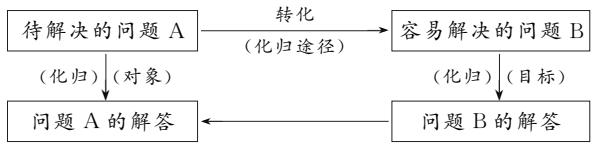

# 高中数学问题解决中的化归思想

# ● 西华师范大学数学与信息学院 王明月

摘要:化归思想是高中数学中一种重要的解题方法,通过将复杂的问题转化为简单的形式,可以更好地理解和解决数学问题.本文中介绍了化归思想的基本原理和六种常用方法,以及它在高中数学问题解决中的应用示例.

关键词:问题解决;化归思想;高中数学

# 1 数学问题解决

“问题解决”已经成为了教育领域中的一个热门话题，同时它也是学生获得新知识的一个主要方式，因此，国内外的心理学者和教育工作者都对“问题解决”进行了广泛的研究。在教育心理学领域，更是提出了“试误论”“顿悟说”“最近发展区”“五阶段论”“六阶段论”和问题解决的IDEAL模式等理论学说。在我国的数学课程标准中，问题解决也被列入了总目标中的一项明确的要求。这表明，问题解决已经成为了教师教学和学生学习中必须重视的一个方面。

从最初对问题解决的初探,到目前的深入研究,已经经历了三个时期:第一个时期的首要目的是掌握知识,学习方法;第二个时期是“双基论”时期,侧重于对学生的基础理论的掌握和基本功的训练;第三个时期是“三维目标”时期,重点是从具体问题的解决向思维方式的转化.如今,问题解决能力的培养在数学课程中已经占有了很大的比重.

# 2 化归思想

数学作为人类的精神财富,具有丰富的思想方法.数学思维方法的渗透是以数学知识为基础的 $^{[1]}$ .中小学生的年龄特征,决定了一些数学思想难以被接受,将过多的数学思想渗透给学生是不现实的.因此,我们要有选择地渗透一些重要的数学思想,整合容易被接受的思想和方法,促进学生数学能力的提高.笔者认为,高中数学应重视的是思维的转变.

化归思想的实质是通过将一个复杂的问题分解成一系列简单的子问题来解决.具体而言,利用化归思想解决问题通常包括以下几个步骤:(1)确定问题的基本要素.首先,需要明确问题中的基本要素,例如已知条件、未知量等.(2)分析问题的特点.对于复杂的问题,需要仔细分析它的特点,找出其中的规律和关系.(3)逐步化简问题.通过逐步化简,将复杂的问题转化为简单的形式,使得问题更易于理解和解决.(4)归纳总结.在解决简化后的问题之后,需要进行归纳总结,找出问题的一般性解法或规律.

化归思想解决问题的一般模式 $^{[2]}$ 见图1.



<details>
<summary>flowchart</summary>

```mermaid
graph TD
    A["待解决的问题 A"] -->|转化 (化归途径)| B["容易解决的问题 B"]
    A -->|(化归) (对象)| C["问题 A 的解答"]
    B -->|(化归) (目标)| D["问题 B 的解答"]
    C <--> D
```
</details>

图 1 化归思想解决问题的直观表示

# 3 化归思想六种方法及应用案例分析

数学问题的解决需要学生的逻辑思维、分析和推理能力.化归法这种思维方式可以培养学生的思维敏锐性和逻辑思维能力,能够帮助他们更好地理解和解决其他学科和现实生活中的各种问题.

化归法是解题的重要方法,它能够帮助我们解决问题.化归能力与问题解决的成败直接相关.在化归的过程中,需要建立知识之间的联系,优化认知结构.这样可以丰富问题解决的策略,实现知识的转移.所以,化归法对于学生来说非常重要.在学习的过程中,学生要学会运用化归方法来解决问题,从而实现问题解决能力的提升.

化归思想是解题的重要途径和方法.文[3]中介绍了化归思想解题的六个特征,笔者从中总结出常见的化归方法,并进行举例分析.

# 3.1 改变表达方式

从化归思维的角度,采用“数形”结合的方法,对函数的“数”和“形”进行转换,与之相关的问题就有多种表达形式.例如,函数的表示有解析法、图象法和列表法,所以在处理函数问题时,可以将一种表达形式转化为另一种形式.再如,指数式和对数式也是对同一内容的不同表达方式.

# 3.2 改变思考方向

从化归思想的角度将“正向思维”转化为“逆向思维”，运用了逆向思维法，“分析法”和“反证法”即为该原理.当题中的已知条件不足以支撑所求结论时,可以考虑从结论入手去匹配已知条件,即“正难则反”.

案例 1 设 $a_{1}, a_{2}, a_{3}, a_{4}$ 各项均大于 0，且是公差为 $d (d \neq 0)$ 的等差数列。是否存在 $a_{1}, d$ ，使得 $a_{1}, a_{2}^{2}, a_{3}^{3}, a_{4}^{4}$ 依次构成等比数列？并说明理由。

分析:学生阅读题目后,会下意识地先解方程组 $\left\{\begin{aligned}(a_{1}+d)^{4}&=a_{1}(a_{1}+2d)^{3},\\ (a_{1}+2d)^{6}&=(a_{1}+d)^{2}(a_{1}+3d)^{4},\end{aligned}\right.$ 试图通过确定 $a_{1}$ 与d的值进行解答.但学生缺乏处理高次方程的技巧与经验,解题也就戛然而止了.如果只从正面考虑,学生会陷入定势思维,纠结于方程组的求解.此时,不妨从反面考虑,先确定一个结论,与题目的已知条件进行匹配,也就是采用反证法,在此过程中可以通过整体思想化归为低次方程,这样该问题就简化了.

# 3.3 改变语言表达方式

数学问题的表述方式多种多样,有自然语言、符号语言,还有图形语言.于学生而言,相较于符号语言,自然语言更易理解.所以,在学生学习和解决数学问题时,一定要强化多种语言形式的相互转化,尤其是当遇到不懂的题目时,可尝试用另外一种语言来表达.

案例 2 已知集合 $A=\{x\mid-1 \leqslant x \leqslant 0\}$ ，集合 $B=\{x \mid ax+b \cdot 2^{x}-1<0,0 \leqslant a \leqslant 2,1 \leqslant b \leqslant 3\}$ 。若 $a, b \in N$ ，求 $A \cap B \neq \varnothing$ 的概率。

分析:本题采用符号语言表述题干,但对学生来说,审题时可能感觉比较抽象,不能很好挖掘问题的核心,导致在问题解决的过程中遇到阻碍.本题的关键在于将“A∩B≠∅”转化为“不等式 $ax+b\cdot2^{x}-1<0$ 在区间 $[-1,0]$ 上有解”即 $f(x)=ax+b\cdot2^{x}-1$ 在 $[-1,0]$ 上最小值小于0.一旦学生完成了该转换,接下来问题就迎刃而解了.

# 3.4 改变式子搭配方式

数学式子的表达形式是多样的,有时题中给出的式子不能够帮助学生快速发现问题的核心,这就需要学生能够灵活变通,不断改变式子结构,找到关键点.

案例3 设函数 $f(x) = \frac{m}{x} + nx (m \in \mathbf{R})$ ，若对任意 $b > a > 0, \frac{f(b) - f(a)}{b - a} < 1$ 恒成立，求 $m$ 的取值范围.

分析:学生在最开始入手时,容易将解题重心放在将问题转化为 $f'(x)<1$ 恒成立,得 $m>\frac{1}{4}$ ,但这并不是本题的正确答案.需注意到,首先利用 b>a>0 将已知条件可以转化为 $f(b)-f(a)<b-a$ ,即 $f(b)-b<f(a)-a$ 恒成立,然后根据函数 $g(x)=f(x)-x=nx+\frac{m}{x}-x$ 在 $(0,+\infty)$ 上单调递减,即可

正确求出 m 的取值范围.

# 3.5 改变思考角度

在遇到问题时,当很难将其作为一个整体来看待,或者“当一个问题包含了很多可能的情况或结果时,我们通常会将每一个方面或情况的复杂问题分解成更简单、更一般的问题 $^{[4]}$ ,”即分类讨论.分类讨论是一种化归策略,我们可以用它把问题进行分解,然后逐一解决.

案例 4 设函数 $f(x)=\mathrm{e}^{x}-1-x-ax^{2}$ ，若当 $x \geqslant 0$ 时， $f(x) \geqslant 0$ ，求 a 的取值范围.

分析:本题可采取分离变量或分类讨论两种方式解决.但是,前者需要多次求导,且需要应用到高等数学中的知识,超过了学生的知识范畴;后者则需要正确分类,此时就要求学生能注意到题目中的隐含条件,即 $f(0)=0$ ,而本题的重点其实就是求 $f(x)\geqslant0$ 对 $x\geqslant0$ 均成立的充分必要条件.因此可以从侧面入手,由 $f(x)$ 在 $(0,+\infty)$ 单调递增即充分条件,求出a的取值范围,再验证其必要性即可得解.

# 3.6 改变研究对象

从化归思想的角度使“陌生的研究对象”向“熟悉的研究对象”进行转化,运用的换元法归属于化归方法,学生在函数问题中运用换元法的解题能力亦称作构造能力.

案例 5 设 $a=0.1\ e^{0.1}, b=\frac{1}{9}, c=-\ln0.9$ ，试比较 a, b, c 的大小.

分析:题干中的 a 是指数形式, b 是分数形式, c 是对数形式, 三个字母所代表的数值形式不统一, 可以利用化归思想通过构造函数来统一. 此时, 可以构造函数 $f(x)=x+\ln(1-x)$ 且 $x\in(0,0.1]$ 来判断 a 与 b 的大小关系, 构造函数 $g(x)=x\mathrm{e}^{x}+\ln(1-x)$ 且 $x\in(0,0.1]$ , 来判断 a 与 c 的大小关系. 本题通过构造与原问题密切相关的数学模型, 从而把问题转化为比较简单或易于求解的新问题, 使得问题在该模型的作用下实现转化, 迅速获解.

# 参考文献：

[1] 吴正, 练红琴. 化归思想及其在问题解决探索过程中的应用 [J]. 中学教研, 2005(8): 29-31.  
[2]陈建花.高中数学解题教学中化归思想的培养[D].武汉：华中师范大学，2005.  
[3]袁守义.换“位”思考——化归的有效手段[J].数学通报，2015,54(11):48-51.   
[4] 王震. 结构化视域下高中数学问题解决与创新能力培养 [J]. 数学通报, 2023, 62(5): 7-11, 41. Z