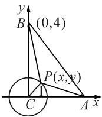
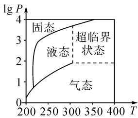

试卷评析比赛特等奖获奖论文之四：

# 2022 年北京高考数学试卷评价

# 北京市怀柔区第一中学 于海龙 杨美林 付冬雪 于 邋

摘要:2022年北京高考数学命题秉承北京卷基础、综合、灵活的特色,稳中求进,突出对基础知识、基本技能、基本活动经验、基本思想方法和数学学科素养的考查.文中基于试题以及解题思路、解题方法的分析,明确2022年北京高考数学试题的考查特点,并提出了2023年北京数学学科高考备考建议.

关键词:试题考查特点;试题分析;备考建议

2022 年高考数学北京卷在秉承以往稳定的基础上,题型出现了适当变化,比较有挑战性,也增加了难度.试卷与往年相比,重视考查基本知识与基本方法,重点考查主干知识与核心概念的同时在创新上下足功夫,设置了很多创新和思维深刻的问题,考查学生的创新能力以及解决问题的能力.

# 1 2022 年北京高考试卷特点

# (1)试题结构总体稳定,有适当调整

相对 2021 年,试题结构保持整体稳定,知识点的覆盖与 2021 年基本一致,各章节所占的分数比也与 2021 年基本相同.在稳定的基础上北京试题也做了一定的调整:第一,试题起步相对 2021 年略显提高,涉及的知识点增多.如第 1 题,打破了以往直接求交集、并集的形式,增加了求补集的环节;第 2 题在解复数方程的基础上增加了求复数模的环节,对基础差的学生有一定影响.第二,立体几何难度略有增加.由于 2022 年没有考查三视图(2021 年的第 4 题),因而在第 9 题考查了立体几何的综合题,难度增加较大;同时立体几何解答题虽然和 2021 年相同,依旧作为第二个解答题,但是以劣构形式出现,载体也从正方体转变为三棱柱,学生有些不适应.第三,导数解答题相对以往的函数零点问题、最值问题转变为双变量的不等式证明问题,题目有一定的创新,有利于对学生能力素养的考查.

# (2)注重基本知识与基本方法的考查

2022 年北京高考数学试题,突出对主干知识的重点考查,基础题占比 70% 左右,考查学生基础知识与基本方法的掌握情况,以及学生的理性思维能力.本套试题选择题的前六道题依次考查了集合的运算、复数的运算、直线与圆、函数性质与运算、三角函数的单调性,以及以数列为背景的充要条件问题;填空题的前三道题依次考查了函数的定义域、双曲线的性质、三角函数的零点与函数值；解答题依次考查了解三角形、立体几何、概率统计、直线与椭圆、导数、数列的综合应用。试题体现了数学知识考查的全面性、基础性和综合性，注重了“四基”（数学的基础知识、基本技能、基本思想、基本活动经验）的考查。

# (3)关注数学本质,考查核心素养

试题以能力立意,强调方法与数学本质的考查,出题方式灵活,突出数学学科素养.第6题、第15题、第20题重点考查了学生解决问题的能力,对学生分析问题以及知识的应用能力要求相对较高,充分发挥了甄别学生能力的作用.

题 1 （北京卷,6）设 $\{a_{n}\}$ 是公差不为 0 的无穷等差数列，则“ $\{a_{n}\}$ 为递增数列”是“存在正整数 $N_{0}$ ，当 $n > N_{0}$ 时， $a_{n} > 0$ ”的（）.

A. 充分而不必要条件  
B. 必要而不充分条件  
C. 充分必要条件  
D.既不充分也不必要条件

本题是一道以数列为背景的充要条件问题，属于中档题，考查学生对递增数列定义的理解。当等差数列 $\{a_{n}\}$ 为递增数列，则有公差d>0，通项公式为单调递增的一次函数类型，必存在正整数 $N_{0}$ ，当 $n>N_{0}$ 时， $a_{n}>0$ ，满足“充分性”；反过来，存在正整数 $N_{0}$ ，当 $n>N_{0}$ 时， $a_{n}>0$ ，若d<0，则会出现从某项开始以后各项均为负数不符合题目条件的情况，故d>0，即数列 $\{a_{n}\}$ 为递增数列，满足“必要性”。因此选择：C.

题 2 （北京卷,15）已知数列 $\{a_{n}\}$ 的各项均为正数, 其前 n 项和 $S_{n}$ 满足 $a_{n} \cdot S_{n} = 9 (n = 1, 2, \cdots)$ 给出下列四个结论:

① $\{a_{n}\}$ 的第2项小于3；② $\{a_{n}\}$ 为等比数列；

③ $\{a_{n}\}$ 为递减数列；④ $\{a_{n}\}$ 中存在小于 $\frac{1}{100}$ 的项。其中所有正确结论的序号是 \_\_\_\_。

本题基于 $a_{n}$ 与 $S_{n}$ 的关系，设置了一个无穷正项数列，考查数列的增减性、估计数列项的范围、判断数列是否为等比数列，是关于数列问题的综合题，属于难题。解决此问题需要考生抓住本质，利用放缩思想、递减数列的定义、数列的下界、反证思想等去推证。对于①，关注对 $a_{n} \cdot S_{n} = 9 (n \in \mathbf{N}^{+})$ 的理解，赋值即可解决。令 $n = 1$ ，有 $a_{1}^{2} = 9$ ，又各项均为正，可得 $a_{1} = 3$ ；令 $n = 2$ ，有 $a_{2}(a_{2} + 3) = 9$ ，可得 $a_{2} = \frac{3(\sqrt{5} - 1)}{2} < 3$ ，故结论①正确。对于②，则是关注等比数列的定义及等比数列的证明，先将 $a_{n} \cdot S_{n} = 9$ 整理为等比数列定义的形式再进行判断。由 $S_{n} = \frac{9}{a_{n}}$ ，得 $S_{n-1} = \frac{9}{a_{n-1}} (n \geqslant 2)$ ，于是可得 $a_{n} = S_{n} - S_{n-1} = \frac{9}{a_{n}} - \frac{9}{a_{n-1}}$ ，即 $\frac{a_{n}}{a_{n-1}} = \frac{9 - a_{n}^{2}}{9}$ ，可以直观判断也可以代值验证结论②不成立；③考查递减数列的判断，可以通过作差或作商的方式解决。由 $a_{n} \cdot S_{n} = 9 (n \in \mathbf{N}^{*})$ ，得 $a_{n} \cdot S_{n} = a_{n+1} \cdot S_{n+1}$ ，于是 $\frac{a_{n+1}}{a_{n}} = \frac{S_{n}}{S_{n+1}} < 1$ ，所以 $a_{n+1} < a_{n}$ ，从而得到 $\{a_{n}\}$ 为递减数列。④可以利用极限思想去考虑，因为 $\{a_{n}\}$ 为递减正项数列，即 $a_{n}$ 随着 $n$ 的增大而减小，当 $n \to +\infty$ 时， $a_{n} \to 0^{+}$ ，所以必存在小于 $\frac{1}{100}$ 的项。综上可知，正确的序号是①③④。

以上两个数列问题,考查学生对知识的理解和迁移,关注数列的相关概念,并以概念为核心进行整理、分析、构造,从而最终解决问题,强化了对“四基”的考查.

(4)注重基本思想,突出对数学思想方法的考查

北京卷基于数学课标,有效检测学生对数学基础知识和基本思想方法的掌握情况.

题3（北京卷，10）在 $\triangle ABC$ 中， $AC = 3,BC = 4,\angle C = 90^{\circ},P$ 为 $\triangle ABC$ 所在平面内的动点，且 $PC = 1$ ，则 $\overrightarrow{PA}\cdot \overrightarrow{PB}$ 的取值范围是（ ）.

A. $[-5,3]$

B. $[-3,5]$

C. $[-6,4]$

D. $[-4,6]$

本题考查向量数量积的最值问题,出现在填空题的压轴位置,属于难题.该题体现的是化归与转化思想,从平面几何切入,研究向量的数量积问题.学生可以用坐标法、向量数量积的几何意义来解决.考查学生对通法的应用和对数学本质的理解.

①坐标法：

如图 1, 以点 C 为坐标原点, 以 CA, CB 分别为 x 轴、y 轴建立平面直角坐标系, 可知 $C(0,0)$ , $A(3,0)$ , $B(0,4)$ .

由 $|PC|=1$ ，可设 $P(\cos\theta,\sin\theta),\theta\in[0,2\pi)$ ，则 $\overrightarrow{PA}\cdot\overrightarrow{PB}=(3-\cos\theta,-\sin\theta)\cdot(-\cos\theta,4-\sin\theta)=-3\cos\theta-4\sin\theta+\cos^{2}\theta+\sin^{2}\theta=1-5\sin(\theta+\varphi)$ .

这样,将问题转化为三角函数的值域问题,从而得到 $\overrightarrow{PA}\cdot\overrightarrow{PB}$ 的范围是 $[-4,6]$ .

  
图 1

②应用数量积的几何意义：

$\overrightarrow{PA} \cdot \overrightarrow{PB} = (\overrightarrow{PC} + \overrightarrow{CA}) \cdot (\overrightarrow{PC} + \overrightarrow{CB}) = \overrightarrow{PC} \cdot \overrightarrow{PC} + \overrightarrow{PC} \cdot \overrightarrow{CA} + \overrightarrow{PC} \cdot \overrightarrow{CB} + \overrightarrow{CA} \cdot \overrightarrow{CB} = 1 + \overrightarrow{PC} \cdot (\overrightarrow{CA} + \overrightarrow{CB}).$

令 $\overrightarrow{CA}+\overrightarrow{CB}=\overrightarrow{CD}$ ，则有 $|\overrightarrow{CD}|=5$ 。由 $|\overrightarrow{PC}|=1$ ，结合数量积定义，可得 $\overrightarrow{PC}\cdot\overrightarrow{CD}=|\overrightarrow{PC}|\cdot|\overrightarrow{CD}|\cdot\cos\langle\overrightarrow{PC},\overrightarrow{CD}\rangle=5\cos\langle\overrightarrow{PC},\overrightarrow{PD}\rangle\in[-5,5]$ 。

所以 $\overrightarrow{PA}\cdot\overrightarrow{PB}$ 的取值范围是 $[-4,6]$ .故选:D.

以上两种方法都是解决向量问题的基本方法.坐标法,避免复杂的逻辑推理,借助坐标运算简化问题,降低思维的难度.几何法,通过向量的线性运算、数量积的几何意义来解决问题.这两种方法也体现了向量概念的本质,集数与形于一身,既有大小又有方向,既有代数的抽象性又有几何的直观性,实现代数问题与几何问题的相互转化.

(5)联系生活,突出考查运用数学知识解决问题的能力

题 4 （北京卷,7)在北京冬奥会上,国家速滑馆“冰丝带”使用高效环保的二氧化碳跨临界直冷制冰技术,为实现绿色冬奥作出了贡献.图 2 描述了一定条件下二氧化碳所处的状态与 T 和 lg P 的关系,其中

line

| T    | 固态 | 液态 | 超临界状态 | 气态 |
|------|------|------|------------|------|
| 200  | 0    | 0    | 0          | 0    |
| 250  | 3    | 1    | 3          | 1    |
| 300  | 4    | 2    | 4          | 2    |
| 350  | 4    | 3    | 4          | 3    |
| 400  | 4    | 4    | 4          | 4    |

图2

T 表示温度, 单位是 K; P 表示压强, 单位是 bar. 下列结论中正确的是().

A. 当 T=220, P=1026 时, 二氧化碳处于液态

B. 当 T=270, P=128 时, 二氧化碳处于气态

C. 当 T=300, P=9 987 时, 二氧化碳处于超临界状态

D. 当 T=360, P=729 时, 二氧化碳处于超临界状态

本题的背景是“冰丝带”国家速滑馆，场馆采用二氧化碳跨临界直冷制冰技术，碳排放趋近于零，试题取材源于社会，源于真实情境，考查学生运用数学知识解决实际问题的能力.

(6)突出综合与创新,注重关键能力的培养

北京高考导数解答题常常创新问题情境,题目灵活多变,特色鲜明,对学生的创新思维能力有较高的要求.

题 5 （北京卷第 20 题第Ⅲ问）已知函数 $f(x)=\mathrm{e}^{x}\ln(1+x)$ . 证明：对任意的 $s,t\in(0,+\infty)$ ，有 $f(s+t)>f(s)+f(t)$ .

本题属于导数的综合问题,证明双变量的不等式恒成立,综合性较强,考查了学生的综合能力,要求较高.可从以下几点切入.

切入点一:代数维度.

通法处理.通过移项构造新函数,转化为求该函数的最值问题.考虑到本题的不等式中有两个变量,两侧均有相同的变量,故需要选择其中一个为主元,令 $m(s)=f(s+t)-f(s)-f(t)$ ,通过导数证明 $m(s)$ 在 $[0,+\infty)$ 上单调递增,再由s>0,得 $m(s)>m(0)$ ,即 $f(s+t)-f(s)-f(t)>f(0+t)-f(0)-f(t)=-f(0)=0$ ,完成证明.

切入点二:几何维度.

关注函数本身蕴含的结构上的特征(纵坐标之差)，通过调整结构进行等价转化，进而构造函数.将证原不等式转化为证明不等式 $f(s+t)-f(s)>f(t)-f(0)$ ，构造函数 $F(x)=f(x+t)-f(x)$ ，则只需证明 $F(s)>F(0)$ 即可.

切入点三: 数形结合维度.

类比不等式 $f(s+t)>f(s)+f(t)$ 与过原点的一次函数模型 $f(x+y)=f(x)+f(y)$ 相似的特征，结合函数凹凸性，构造函数 $h(x)=\frac{f(x)}{x}(x>0)$ . 利用导数证明 $h(x)$ 为增函数，由此得到 $h(s+t)>h(s)$ ， $h(s+t)>h(t)$ ，即 $\frac{f(s+t)}{s+t}>\frac{f(s)}{s}$ ， $\frac{f(s+t)}{s+t}>\frac{f(t)}{t}$ ，整理为 $\frac{sf(s+t)}{s+t}>f(s)$ ， $\frac{tf(s+t)}{s+t}>f(t)$ ，最后通过不等式相加完成证明.

第 20 题第Ⅲ问突出综合能力的考查.近年来对于函数与导数高考题的命制,我们发现北京卷导数题题干简洁、大气,问题设计巧妙;各小问之间往往呈现关联性,由浅入深,由易到难;重点考查导数的基础知识和基本思想,突出考查导数的本质.在研究导数问题的过程中,要注意关注问题的连贯性,要会借助上一问的结论解决下一问,分析条件和结论的内在联系,寻求解题思路,合理构造函数,利用导数解决问题.

# 2 2023 年北京数学学科高考备考建议

通过以上 2022 年北京试卷特点的分析, 笔者对 2023 年的高考备考有以下想法:

(1)突出教材与课标地位,依纲据本,落实“四基”

北京高考题始终坚持注重基础、突出考查高中数学主干知识的优良传统，数学核心素养与基础知识和主干知识密不可分。对比2022年与2021年北京高考试卷，发现它们在知识点的分布、章节知识的占比上高度一致。因此，在教学中应突出“四基”，对重点内容与方法进行不断强化。

(2)关注知识的生成,重视通性通法的教学

北京卷中的一些常规题,如2022年的第1题集合的交集、第2题复数运算、第3题直线与圆位置关系、第5题三角函数单调性、第8题二项式定理、第11题函数的定义域、第12题双曲线的渐近线、第13题三角函数的零点,以及前三个解答题中的解三角形、立体几何证明与计算、概率统计等题,方法相对单一,基本依靠通法可以解决.从题目来看,关注知识的生成,重视通性通法的教学,对学生拿到基础分数意义重大.

(3)重视数学思想的培养,提升学科素养

北京卷中的试题相对灵活,立意新,数形结合、等价转化等思想方法应用较多,考查学生综合应用知识的能力.新课程中,学生学习基础知识的过程中获得的数学思想方法是形成能力与核心素养的基础和关键,教学中只有不断渗透,让学生感受结论与方法的形成过程,才能使学生逐步体会、理解并应用数学思想方法解决问题.

(4)注重学生综合能力的培养

对数学综合能力的考查,强调探究性、综合性、应用性.2022年北京高考题中有些题突出能力立意,坚持素质导向.如,选择题第9题的立体几何问题,转化为平面几何问题;第10题需要将向量数量积的最值问题转化为三角函数的最值问题或向量数量积的几何意义问题;第20题的第Ⅲ问,需要将不等式的证明问题转化为函数的最值问题,或构造函数应用函数单调性、不等式性质等解决问题.试卷中,部分试题还涉及到数学建模思想,对试题考查内容的背景及本质要求较高.因此,在对学生综合能力的培养上,不要局限于知识本身的综合,更重要的是知识与方法之间的综合,将综合能力的提升贯穿于整个教学过程,形成系统方法.Z