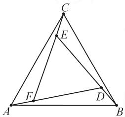
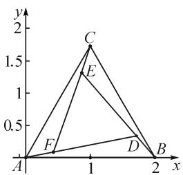
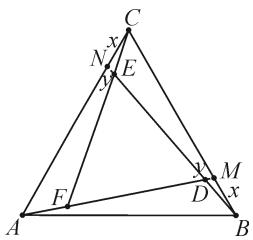
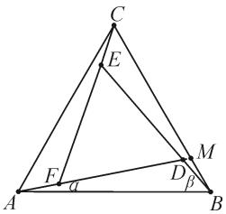

# 一道向量题的探究

# ● 江苏省南通市通州区教师发展中心 王惠清

平面向量问题一直是每年模拟、高考、竞赛等考试中的热点与重点问题之一，其借助平面几何的背景，创新性、新颖性皆很强，且变化多端，常考常新，同时也是数学知识交汇与融合的理想场所之一，是考试中能力齐全、思维各异、方法多样的一个主战场。破解平面向量问题，主要是抓住平面向量与平面几何的图形特征，借助基底思维、坐标思维、解三角形思维等方式切入，结合平面向量的相关运算，得以研究相关的几何元素之间的关系问题。

# 1 问题呈现

问题（2020届湖北省武汉市武昌区高三年级4月调研测试数学理科试卷·10）如图1所示，在由3个全等的三角形与中间的一个小等边三角形拼成的一个大等边三角形中，设 $DF = 3FA$ ，则（ ）.

$$
\begin{array}{l} \overrightarrow {A D} = \frac {1 2}{2 1} \overrightarrow {A B} + \frac {8}{2 1} \overrightarrow {A C} \\ \overrightarrow {A D} = \frac {1 2}{2 1} \overrightarrow {A B} + \frac {4}{2 1} \overrightarrow {A C} \\ \mathrm{C.} \overrightarrow {A D} = \frac {1 6}{2 1} \overrightarrow {A B} + \frac {8}{2 1} \overrightarrow {A C} \\ \overrightarrow {A D} = \frac {1 6}{2 1} \overrightarrow {A B} + \frac {4}{2 1} \overrightarrow {A C} \\ \end{array}
$$

text_image

Geometric diagram of triangle ABC with internal points D, E, F and connecting line segments

图1

此题设计新颖别致,题意简洁明了,目标明确,立意深刻,通过平面几何图形的拼接与组合,以两个具有特殊关系的等边三角形为问题背景,结合其中线段之间的比例关系来确定平面向量的线性关系式.问题以平面几何图形为背景,使得命题条件独具特色,并增加了思维难度,充分体现了新课标高考的“多考思维,少考计算”的命题新理念,意在考查学生的观察、归纳、猜想和逻辑推理以及数学运算能力.

# 2 问题破解

# 思维视角一:基底思维

方法 1: 基底法——线性运算法.

解析:根据题目条件可知 $\triangle ABD\cong\triangle BCE\cong\triangle CAF.$

由 DF=3FA，可得 ED=3DB, FE=3EC.

$$
\begin{array}{l} \frac {1}{4} (\overrightarrow {B C} + \overrightarrow {C E}) = \overrightarrow {A B} + \frac {1}{4} \overrightarrow {B C} + \frac {1}{4} \overrightarrow {C E} = \overrightarrow {A B} + \frac {1}{4} \overrightarrow {B C} + \\ \frac {1}{1 6} \overrightarrow {C F} = \overrightarrow {A B} + \frac {1}{4} \overrightarrow {B C} + \frac {1}{1 6} (\overrightarrow {A F} - \overrightarrow {A C}) = \overrightarrow {A B} + \frac {1}{4} (\overrightarrow {A C} - \\ \overrightarrow {A B}) + \frac {1}{1 6} \overrightarrow {A F} - \frac {1}{1 6} \overrightarrow {A C} = \frac {3}{4} \overrightarrow {A B} + \frac {3}{1 6} \overrightarrow {A C} + \frac {1}{6 4} \overrightarrow {A D}. \\ \end{array}
$$

那么 $\overrightarrow{AD} = \overrightarrow{AB} + \overrightarrow{BD} = \overrightarrow{AB} + \frac{1}{4} \overrightarrow{BE} = \overrightarrow{AB} +$

所以 $\frac{63}{64}\overrightarrow{AD}=\frac{3}{4}\overrightarrow{AB}+\frac{3}{16}\overrightarrow{AC}$ ，整理有 $\overrightarrow{AD}=\frac{16}{21}\overrightarrow{AB}+\frac{4}{21}\overrightarrow{AC}$ 。故选择答案：D.

点评:根据平面图形的形象直观性,数形结合,利用三角形法则,结合平面向量的线性运算加以转化,“一条路到底”,再结合基底法的应用来确定平面向量的线性关系式,从而正确求解.

方法 2: 基底法——待定系数法.

解析: 设 $\overrightarrow{AD}=x\overrightarrow{AB}+y\overrightarrow{AC}.$

根据对称性, 可知 $\overrightarrow{CF}=x\overrightarrow{CA}+y\overrightarrow{CB}=-x\overrightarrow{AC}+y(\overrightarrow{AB}-\overrightarrow{AC})=y\overrightarrow{AB}-(x+y)\overrightarrow{AC}.$

所以 $\overrightarrow{AF}=\overrightarrow{AC}+\overrightarrow{CF}=y\overrightarrow{AB}+(1-x-y)\overrightarrow{AC}.$

结合 DF=3FA，可得 $\overrightarrow{AD}=4\overrightarrow{AF}$ .

因此 $\left\{\begin{aligned}x=4y,\\ y=4(1-x-y),\end{aligned}\right.$ 解得 $\left\{\begin{aligned}x=\frac{16}{21},\\ y=\frac{4}{21}.\end{aligned}\right.$

所以 $\overrightarrow{AD}=\frac{16}{21}\overrightarrow{AB}+\frac{4}{21}\overrightarrow{AC}$ .故选择答案:D.

点评:根据平面向量的线性关系,引入参数,通过待定系数法设出 $\overrightarrow{AD}$ ,结合平面向量的线性运算,利用基底法转化 $\overrightarrow{AF}$ ,进而通过比较两平面向量之间的关系,建立方程组,求解相应的参数值,从而正确求解.

# 思维视角二:坐标思维

方法 3: 坐标法.

解析:以 A 为坐标原点,AB 所在直线为 x 轴建立平面直角坐标系,如图 2 所示.

不妨设 $B(2,0)$ ，则 $C(1,\sqrt{3})$ .

设 $F(x,y)$ ，结合 $\overrightarrow{DF}=3\overrightarrow{FA}$ ，可得 $D(4x,4y)$ .

由 $\overrightarrow{BE} = 4\overrightarrow{BD}$ ，可得 $E(16x - 6,16y)$

因为 $\overrightarrow{CF}=4\overrightarrow{CE}$ ，所以

$$
\left\{ \begin{array}{l} 1 - x = 4 [ 1 - (1 6 x - 6) ], \\ \sqrt {3} - y = 4 (\sqrt {3} - 1 6 y). \end{array} \right.
$$

解得 $\left\{\begin{aligned}x&=\frac{3}{7},\\ y&=\frac{\sqrt{3}}{21}.\end{aligned}\right.$ 故 $D\left(\frac{12}{7},\frac{4\sqrt{3}}{21}\right).$

text_image

y
2
C
1.5
E
1
F
0.5
D
B
x
A
1
2

图 2

设 $\overrightarrow{AD}=m\overrightarrow{AB}+n\overrightarrow{AC}$ ，则有 $\left\{\begin{aligned}\frac{12}{7}&=2m+n,\\ \frac{4\sqrt{3}}{21}&=\sqrt{3}n.\end{aligned}\right.$

解得 $\left\{\begin{aligned}m&=\frac{16}{21},\\ n&=\frac{4}{21}.\end{aligned}\right.$

所以 $\overrightarrow{AD}=\frac{16}{21}\overrightarrow{AB}+\frac{4}{21}\overrightarrow{AC}$ .故选择答案:D.

点评:根据条件建立平面直角坐标系,设出点 B 的坐标,从而确定点 C 的坐标.设 $F(x,y)$ , 利用条件中线段长度的关系分别表示出点 D, E 的坐标.结合 CF=4CE 建立相关参数的方程组,进而确定点 D 的坐标.利用平面向量的基本原理及其坐标运算建立关系式,结合待定系数法来求解相应的参数值,从而正确求解.

# 思维视角三: 解三角形思维

方法 4:余弦定理法.

解析: 如图 3 所示, 延长 AD 交 BC 于点 M, 延长 BE 交 CA 于点 N.

结合 DF=3FA，根据对称性，可设 AF=BD=CE=1, DF=ED=FE=3, BM=CN=x, DM=EN=y.

text_image

Geometric diagram of triangle ABC with internal points D, E, F, M, N and labeled segments x and y

图3

在 $\triangle BCE$ 中,由余弦定理,得

$$
B C = \sqrt {C E ^ {2} + B E ^ {2} - 2 C E \cdot B E \cdot \cos \angle C E B} = \sqrt {2 1}.
$$

易知 $\triangle DBM \sim \triangle CBN$ ，则有 $\frac{x}{4 + y} = \frac{y}{x} = \frac{1}{\sqrt{21}}$ 解得 $x = \frac{\sqrt{21}}{5}, y = \frac{1}{5}$ .

所以 $\overrightarrow{AD} = \frac{4}{4 + \frac{1}{5}} \overrightarrow{AM} = \frac{20}{21} \left( \frac{4}{5} \overrightarrow{AB} + \frac{1}{5} \overrightarrow{AC} \right) = \frac{16}{21} \overrightarrow{AB} + \frac{4}{21} \overrightarrow{AC}$ . 故选择答案: D.

点评:根据条件构造相应的辅助线,通过设出相应的线段长度,并结合余弦定理的应用确定 BC 的长度.通过相似三角形的判定与性质建立相应的关系式,得以确定相应的参数值,再结合平面向量的平行关系、共线性质以及线性运算进行分解,从而正确求解.

方法 5: 正弦定理法.

解析:如图 4 所示,延长 AD 交 BC 于点 M.

结合 DF=3FA，根据对称性，可设 AF=BD=CE=1，DF=ED=FE=3。记 $\angle DAB=\alpha,\angle DBA=\beta.$

在 $\triangle ABD$ 中,根据正弦定理可得 $\frac{\sin\alpha}{\sin\beta}=\frac{BD}{AD}=\frac{1}{4}.$

text_image

Geometric diagram of triangle ABC with internal points D, E, F, M and labeled segments α, β

图4

在 $\triangle ABC$ 中，有 $\frac{S_{\triangle AMB}}{S_{\triangle AMC}}=\frac{\sin\alpha}{\sin\beta}=\frac{1}{4}=\frac{BM}{CM}$ .

所以 $BM=\frac{1}{5}BC$ ，且 $\overrightarrow{AM}=\frac{4}{5}\overrightarrow{AB}+\frac{1}{5}\overrightarrow{AC}$ .

于是在 $\triangle ABM$ 中， $\frac{S_{\triangle ABD}}{S_{\triangle MBD}} = \frac{AB\sin\beta}{BM\sin\alpha} = 5 \times 4 = 20 = \frac{AD}{MD}$ .

所以 $\overrightarrow{AD} = \frac{20}{21}\overrightarrow{AM} = \frac{20}{21} \left( \frac{4}{5}\overrightarrow{AB} + \frac{1}{5}\overrightarrow{AC} \right) = \frac{16}{21}\overrightarrow{AB} + \frac{4}{21}\overrightarrow{AC}$ . 故选择答案: D.

点评:根据条件构造相应的辅助线,通过设出相应的线段长度,并结合正弦定理的应用确定线段之间的关系,再结合三角形面积之间的关系加以转化与应用,进而确定线段之间的比例关系,最后结合平面向量的平行关系、共线性质以及线性运算进行分解,从而正确求解.

# 3 变式拓展

探究 1: 保留题目条件, 根据大、小等边三角形之间的比例关系, 通过面积关系来设置几何概型问题, 利用概率的求解来进行合理变式.

(下转第67页)

设 $g(x)=\ln x-x+1$ ，则可知 $g(x)_{\max}=g(1)=0$ 。所以 $2\ln a\geqslant0$ ，解得 $a\geqslant1$ 。

故 a 的取值范围为 $[1, +\infty)$ .

点评: 解法 1 在不等式 $e^{\ln a+x-1}+\ln a-1\geqslant\ln x$ 的两边同时加“x”，使左边出现与指数幂相同的“自变量团”，右边变形成 $e^{\ln a+x-1}+\ln a+x-1\geqslant e^{\ln x}+\ln x$ ，运用的是“指对”同构。解法 2 在不等式 $e^{\ln a+x-1}-\ln x+\ln a-1\geqslant0$ 中运用朗博同构，更直接迅速。

# 4 差一同构

指数幂和对数的真数相差 1 时, 可用“差一同构”. 下面仍以例 6 为例, 利用“差一同构”进行分析.

构造函数 $g(x)=\mathrm{e}^{x}-x-1$ . 由切线不等式, 可知 $e^{x}\geqslant x+1$ (当且仅当 x=0 时, 等号成立). 所以, $g(x-1)=\mathrm{e}^{x-1}-x\geqslant0$ , $g(\ln x)=x-\ln x-1\geqslant0$ (当且仅当 x=1 时, 等号成立), 两式相加, 得 $e^{x-1}-\ln x-1\geqslant0$ (当且仅当 x=1 时, 等号成立).

当 $a \geqslant 1$ 时， $\ln a \geqslant 0$ . 所以 $a \mathrm{e}^{x - 1} - \ln x + \ln a \geqslant$ $e^{x-1}-\ln x\geqslant1$ 恒成立.

当 0 < a < 1 时， $f(1) = a + \ln a < 1$ ，不符合题意。

综上, 可知 $f(x) \geqslant 1$ 时, $a \geqslant 1$ .

以上由母函数 $g(x) = \mathrm{e}^{x} - x - 1$ 同构出函数 $g(x - 1)$ 和 $g(\ln x)$ ，结合切线不等式得到两个取等号条件一样的不等式，从而轻松破解该题。同样地，由 $g(x) = \mathrm{e}^{x} - x - 1 \geqslant 0$ ，也可以构造 $g[\ln (x + 1)] = x - \ln (x + 1) \geqslant 0$ ，两式相加，得 $\mathrm{e}^x - \ln (x + 1) - 1 \geqslant 0$ （以上三个不等式都是当且仅当 $x = 0$ 时，等号成立）。因此，取等号条件是差一同构的关键。

总之，通过上述多种同构方法的归类剖析可知，处理此类问题切入点虽有不同，但目标一致，关键在于灵活运用恒等式 $x\mathrm{e}^{x} = \mathrm{e}^{x + \ln x}$ 等，对题设的等式或不等式进行适当的变形，使之左右两边结构相同，进而寻找母函数.该类问题又常与切线不等式综合运用，解法多样，变形难度较大.因此，要学会利用同构变形，在掌握思想与方法的过程中不断形成知识体系，提升数学品质，提高思维能力.Z

# (上接第64页)

变式 1 如图 1 所示, 在由 3 个全等的三角形与中间的一个小等边三角形拼成的一个大等边三角形中, 设 DF = 3FA, 若在大等边三角形中随机取一点, 则该点取自小等边三角形内的概率是 \_\_\_\_.

解析:根据原问题方法4的求解过程,可知DF=3, $BC=\sqrt{21}$ .

由面积型几何概型的概率计算公式, 可得“该点取自小等边三角形内”的概率 $P=\frac{S_{\triangle DEF}}{S_{\triangle ABC}}=\frac{9}{21}=\frac{3}{7}$ .

故填答案: $\frac{3}{7}$ .

探究 2: 保留原问题的部分条件, 把具体的线段比例关系进行一般化处理, 将原问题变式拓展, 从而得到相应的一般性结论.

结论1 如图1所示，在由3个全等的三角形与中间的一个小等边三角形拼成的一个大等边三角形中，设 $DF = \lambda FA(\lambda >0)$ ，则 $\overrightarrow{AD} = \frac{(\lambda + 1)^2}{(\lambda + 1)(\lambda + 2) + 1}\cdot$ $\overrightarrow{AB} +\frac{\lambda + 1}{(\lambda + 1)(\lambda + 2) + 1}\overrightarrow{AC}.$

具体证明过程可以参照原问题方法 5 的求解过程.其实, 当 $\lambda = 3$ 时, 代入以上结论, 即可得 $\overrightarrow{AD} = \frac{16}{21}\overrightarrow{AB} + \frac{4}{21}\overrightarrow{AC}$ , 从而确定特殊值条件下的平面向量的线性关系式,即为原来问题的答案.而随着特殊值 $\lambda$ 的变化,相应的平面向量的线性关系式也随着变化,可以变换出其他一些相应的变式,方便计算.

结论 2 如图 1 所示, 在由 3 个全等的三角形与中间的一个小等边三角形拼成的一个大等边三角形中, 设 $DF = \lambda FA (\lambda > 0)$ , 则小等边三角形与大等边三角形的边长的比值为 $\lambda : \sqrt{(\lambda + 1)(\lambda + 2) + 1}$ .

该结论的具体证明过程可参照原问题中方法4的求解过程.利用该结论,可以确定小等边三角形与大等边三角形边长的关系、面积的关系以及与之相关的其他问题,包括变式1中的几何概型问题等.

# 4 解后反思

破解平面向量问题最常见的“三思维”: 基底思维、坐标思维、解三角形思维. 在实际解答过程中, 利用平面向量的线性运算或坐标运算来分析与处理, 具体破解与切入方式又有不同的形式. 其实, 在解决平面向量问题时, 要充分利用平面向量的特征, 提高识“图”与用“图”能力, 提升用“数”与解“数”思维, 进而从“形”的角度或“数”的角度切入, 结合不同的思维方式来分析, 达到多角度思维, 多方法处理, 多层面拓展. Z