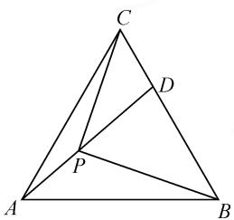
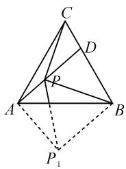
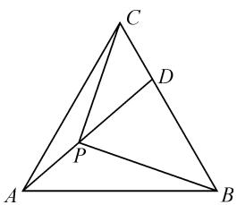

# 一道解三角形题的探究\*

# ●福建省福安市第一中学 徐志刚

摘要:借助一道解三角形问题来呈现对应线段长度比值关系问题破解的通技通法,进一步探究问题破解的巧技妙法,总结规律,尝试为数学问题的解题研究提供一个基本的学习模板,开拓思维,探究拓展,提升能力.

关键词: 解三角形; 正弦定理; 面积; 平面几何; 旋转

解三角形问题是高考数学、高中数学联赛中比较常见的一类综合性应用问题，能很好交汇与融合平面几何与平面解析几何、函数与方程、三角函数、不等式以及解三角形等相应的数学基本知识，情境创设多变，思维视角多向，技巧策略多样，思想方法丰富，具有相对规律性的思维方式与破解技巧，可以从代数视角或几何视角等来切入与分析，倍受各方关注.

# 1 问题呈现

问题（“皖南八校”2022届高三第一次联考理科·16)如图1，正三角形ABC内有一点 $P,\angle BPC=\frac{\pi}{2},\angle APC=\frac{5\pi}{6}$ ，连接AP并延长交BC于点D，则 $\frac{|CD|}{|CB|}=$ \_\_\_\_.

text_image

Geometric diagram of triangle ABC with internal points D and P, showing connected segments forming smaller triangles.

图1

# 2 问题剖析

此题以“布洛卡点”为问题

背景,借助平面几何中的“布洛卡点”加以拓展与情境创新,在正三角形中通过确定点的位置,进而研究相关线段长度的比值问题.

此题合理把平面几何与解三角形问题加以融合与交汇，借助平面几何的直观想象来创设，很好考查数学基础知识、数学思想方法和数学能力等，以及逻辑推理、数学运算等核心素养。此类问题可以给考生提供更多的展示机会与空间，充分展现各自的能力水平，具有较好的选拔性与区分度。

# 3 通技通法

掌握破解相应的解三角形问题的通技通法,借助对应的三角形来构建边与角之间的关系,同时借助正弦定理、余弦定理、三角形的面积公式等相关知识,有时还需要根据题目条件引入边或角的参数值,为进一步构建关系提供条件.

方法 1: 解三角形转化法.

解析:设正三角形 ABC 的边长为 2, $\left|CD\right|=2\lambda$ , $\angle CDP=\theta$ .

在 $\triangle CAD$ 中， $\angle CAD = \frac{2\pi}{3} - \theta$ ，结合正弦定理有 $\frac{|CD|}{\sin\left(\frac{2\pi}{3} - \theta\right)} = \frac{|CA|}{\sin\theta}$ ，可得 $\frac{2\lambda}{\sin\left(\frac{2\pi}{3} - \theta\right)} = \frac{2}{\sin\theta}$ ，即

$$
\lambda = \frac {\sin \left(\frac {2 \pi}{3} - \theta\right)}{\sin \theta}.
$$

在 Rt△CPB 中, 可知 $\left|CP\right| = \left|CB\right| \cos \angle BCP = 2 \cos \left(\frac{5\pi}{6} - \theta\right)$ . 在 △CDP 中, 由正弦定理有 $\frac{\left|CD\right|}{\sin \frac{\pi}{6}} =$

$$
\frac {| C P |}{\sin \theta}, \text {可得} \frac {2 \lambda}{\sin \frac {\pi}{6}} = \frac {2 \cos \left(\frac {5 \pi}{6} - \theta\right)}{\sin \theta}, \text {即} \lambda = \frac {\cos \left(\frac {5 \pi}{6} - \theta\right)}{2 \sin \theta}.
$$

所以 $\lambda = \frac{\sin\left(\frac{2\pi}{3}-\theta\right)}{\sin\theta} = \frac{\cos\left(\frac{5\pi}{6}-\theta\right)}{2\sin\theta}$ ，即 $2\sin\left(\frac{2\pi}{3}-\theta\right)=\cos\left(\frac{5\pi}{6}-\theta\right).$

展开并整理,可得 $\tan\theta=-3\sqrt{3}$ .

于是 $\lambda = \frac{\sin\left(\frac{2\pi}{3} - \theta\right)}{\sin\theta} = \frac{\sin\frac{2\pi}{3}\cos\theta - \cos\frac{2\pi}{3}\sin\theta}{\sin\theta} =$ $\frac{\frac{\sqrt{3}}{2}\cos\theta + \frac{1}{2}\sin\theta}{\sin\theta} = \frac{\frac{\sqrt{3}}{2}}{\tan\theta} + \frac{1}{2} = -\frac{1}{6} + \frac{1}{2} = \frac{1}{3}.$

所以 $\frac{|CD|}{|CB|}=\frac{2\lambda}{2}=\lambda=\frac{1}{3}$ . 故填答案: $\frac{1}{3}$ .

解后反思: 解三角形问题的关键就是构建边与角之间的关系, 合理引入边与角的参数, 在不同三角形内借助正弦定理或余弦定理构建含参关系式. 代数关系式的合理恒等变形与转化, 以及三角恒等变换的应用, 是破解此类问题的基本思维方式. 这里以其中的一个同角所对应的不同三角形来构建对应的正弦关系是破解问题的切入点, 也是解决此类问题的通技通法.

# 4 巧技妙法

在实际教学、学习与解题应用过程中，既要掌握破解数学问题的“通技通法”——构建参数思维，结合对应的三角形来分析与求解。同时还要结合问题或事物自身的特殊性或本质属性，开拓思维，寻求破解问题更为简捷的方法，优化思维，从解三角形思维或平面几何思维等视角，合理借助巧技妙法来处理该问题，揭开对应问题的“面纱”，探寻数学的奥妙所在。

# 思维视角一: 解三角形思维

方法 2: 面积转化法.

解析: 设 $\angle CBP = \theta$ ，则有 $\angle ABP = \frac{\pi}{3} - \theta$ 。而 $\angle APB = 2\pi - \frac{5\pi}{6} - \frac{\pi}{2} = \frac{2\pi}{3}$ ，则知 $\angle PAB = \theta$ 。

在 Rt△BPC 中， $|PB| = |BC|\cos\theta, |PC| = |BC|\sin\theta.$

在 $\triangle APB$ 中,结合正弦定理有 $\frac{|PB|}{\sin\theta}=\frac{|AB|}{\sin\frac{2\pi}{3}}$ ,从而可得 $|PB|=\frac{2\sqrt{3}}{3}|AB|\sin\theta=|BC|\cos\theta$ ,又 $|AB|=|BC|$ ,所以 $\tan\theta=\frac{\sqrt{3}}{2}$ .

所以 $\frac{|CD|}{|DB|}=\frac{S_{\triangle PCD}}{S_{\triangle PDB}}=\frac{\frac{1}{2}|PC||PD|\sin\frac{\pi}{6}}{\frac{1}{2}|PD||PB|\sin\frac{\pi}{3}}=$

$$
\frac {\mid P C \mid \sin \frac {\pi}{6}}{\mid P B \mid \sin \frac {\pi}{3}} = \frac {\frac {1}{2} \mid B C \mid \sin \theta}{\frac {\sqrt {3}}{2} \mid B C \mid \cos \theta} = \frac {\tan \theta}{\sqrt {3}} = \frac {1}{2}.
$$

因此 $\frac{|CD|}{|CB|}=\frac{1}{3}$ .故填答案: $\frac{1}{3}$ .

方法 3: 正弦定理转化法.

解析: 同方法 2 的部分, 可得 $\tan\theta=\frac{\sqrt{3}}{2}$ .

在 $\triangle ABD$ 中,结合正弦定理有

$$
\frac {| B D |}{\sin \theta} = \frac {| A B |}{\sin \left(\frac {2 \pi}{3} - \theta\right)}.
$$

由上式整理, 可得 $\left|BD\right| = \left|AB\right| \frac{\sin \theta}{\sin\left(\frac{2\pi}{3} - \theta\right)} =$

$$
\mid A B \mid \frac {\sin \theta}{\frac {\sqrt {3}}{2} \cos \theta + \frac {1}{2} \sin \theta} = \mid A B \mid \frac {\tan \theta}{\frac {\sqrt {3}}{2} + \frac {1}{2} \tan \theta} =
$$

$$
\mid A B \mid \frac {\frac {\sqrt {3}}{2}}{\frac {\sqrt {3}}{2} + \frac {1}{2} \times \frac {\sqrt {3}}{2}} = \frac {2}{3} \mid A B \mid = \frac {2}{3} \mid B C \mid .
$$

所以 $\left|CD\right|=\frac{1}{3}\left|BC\right|$ ，即 $\frac{\left|CD\right|}{\left|CB\right|}=\frac{1}{3}$ .

故填答案: $\frac{1}{3}$ .

解后反思: 解三角形问题中构建三角形的边与角的参数, 经常还可以在特殊三角形(例如直角三角形、等腰三角形或等边三角形等)中加以合理构建, 这样更加方便构建相应的边与角之间的关系, 为目标的破解提供更为有效的手段. 方法3就是通过直角三角形中相应锐角引入参数, 结合解直角三角形来化归与转化, 从三角形的面积公式或正弦定理的应用等思维角度来进一步处理, 更加巧妙快捷.

# 思维视角二:平面几何思维

方法 4: 平面几何旋转法.

解析:如图2所示,以点B为中心,将 $\triangle CPB$ 旋转至 $\triangle AP_{1}B$ ,连接 $PP_{1}$ .

设 $|PB| = m$ ，则 $|P_1B| = |PB| = m, \angle PBP_1 = \frac{\pi}{3}$ ，所以 $\triangle PBP_1$ 为正三角形，从而 $|PP_1| = m$ .

text_image

Geometric diagram of a tetrahedron with labeled vertices and internal points, including dashed lines indicating hidden edges.

图2

又因为 $\angle PAB = \pi -\angle APB - \angle ABP = \pi -(2\pi -$ $\frac{5\pi}{6} -\frac{\pi}{2}) - (\frac{\pi}{3} -\angle CBP) = \angle CBP = \angle ABP_{1}$ ，所以 $AD / / P_1B.$

$$
\begin{array}{l} \angle A P _ {1} P = \frac {\pi}{2} - \frac {\pi}{3} = \frac {\pi}{6}, \angle D P B = \pi - \frac {\pi}{3} - \frac {\pi}{3} = \frac {\pi}{3}, \\ \angle D P C = \frac {\pi}{2} - \frac {\pi}{3} = \frac {\pi}{6}. \\ \end{array}
$$

因此 $\angle PAP_{1} = \angle AP_{1}B = \angle CPB = \frac{\pi}{2}$ ，且

在 Rt△PAP $_{1}$ 中，

由 $\left|AP_{1}\right|=\left|PP_{1}\right|\cdot\cos\angle AP_{1}P=\frac{\sqrt{3}}{2}m$

可得 $|PC| = |AP_1| = \frac{\sqrt{3}}{2} m$ .

所以 $\frac{|CD|}{|DB|}=\frac{S_{\triangle PCD}}{S_{\triangle PDB}}=\frac{\frac{1}{2}|PC||PD|\sin\frac{\pi}{6}}{\frac{1}{2}|PD||PB|\sin\frac{\pi}{3}}=$

$$
\frac {\mid P C \mid \sin \frac {\pi}{6}}{\mid P B \mid \sin \frac {\pi}{3}} = \frac {\frac {1}{2} \times \frac {\sqrt {3}}{2} m}{\frac {\sqrt {3}}{2} m} = \frac {1}{2}, \text {从而} \frac {\mid C D \mid}{\mid C B \mid} = \frac {1}{3}.
$$

故填答案: $\frac{1}{3}$ .

解后反思: 涉及解三角形的问题, 经常可以回归平面几何本质, 通过平面几何图形的合理旋转、辅助线的构建等, 结合平面几何的逻辑推理与直观想象, 探究线段长度、相关角度等的关系以及三角形的几何性质, 从平面几何视角来分析与处理, 从而达到解三角形问题的目的. 利用平面几何思维解决一些解三角形的问题时, 要充分利用图形的直观性与几何性质来分析与破解.

# 5 变式拓展

挖掘问题实质,探究解析过程,从问题本质上进行“一题多变”“一题多拓”等研究,巩固知识,发散思维,提升能力,真正掌握解决问题的技巧方法.

探究 1: 保留原题目条件, 结合问题的解析过程, 从另一个角度来确定其他边长的比值问题, 从而得到以下对应的变式问题. 相较于原题, 考查知识点基本相当, 试题难度有所降低.

变式 1 如图 3, 正三角形 ABC 内有一点 P, $\angle BPC = \frac{\pi}{2}$ , $\angle APC = \frac{5\pi}{6}$ , 连接 AP 并延长交 BC 于 D, 则 $\frac{|PC|}{|PB|} =$ \_\_\_\_.

解析: 设 $\angle CBP = \theta$ ，则同原问题方法 2 的部分，可得 $\tan \theta = \frac{\sqrt{3}}{2}$ .

所以 $\frac{|PC|}{|PB|} = \frac{|BC|\sin\theta}{|BC|\cos\theta} =$

$\tan\theta=\frac{\sqrt{3}}{2}$ . 故填答案: $\frac{\sqrt{3}}{2}$ .

text_image

Geometric diagram of triangle ABC with internal points D and P, showing connected segments forming smaller triangles.

图3

探究 2: 根据平面几何图形的对称性, 变换原来问题中三角形的顶点 B 与 C 的位置(两者进行调换), 其实就是改变其中一个角的度数, 吻合平面几何的对称性, 可得以下对应的变式问题.

变式 2 如图 3, 正三角形 ABC 内有一点 P, 且 $\angle BPC = \frac{\pi}{2}$ , $\angle APC = \frac{2\pi}{3}$ , 连接 AP 并延长交 BC 于点 D, 则 $\frac{|CD|}{|CB|} =$ \_\_\_\_.

答案: $\frac{2}{3}$ .(具体的求解过程可以参照原来问题的解析过程,这里不多加以叙述.)

# 6 教学启示

破解相关的解三角形问题,关键是合理借助解三角形中的平面几何性质或正弦定理、余弦定理等来化归与转化对应的三角形边与角的关系.破解时常见思维视角主要有以下两种:

# (1)代数角度进行代数运算

利用正弦定理、余弦定理以及三角形的面积公式等，合理“化边为角”或“化角为边”，寻找关于三角形中的角或者边等元素之间的关系进行合理化简与转化；或利用平面直角坐标系的构建，借助点、直线、角等的坐标形式来寻找三角形的角或者边等相关元素之间的关系，合理代数运算，巧妙化归与转化。从代数角度，综合解三角形、三角函数、不等式、平面解析几何等相关知识来分析与处理。

# (2) 几何角度进行数形结合

利用平面几何的直观模型，以及题目条件中涉及的点、线、角的位置关系，数形结合，直观想象；通过平面几何图形的旋转、折叠、对称、变形以及辅助线等的构建，合理寻找平面几何图形中蕴藏的点、边或者角等元素之间的几何关系与数据信息；利用直角三角形（或其他特殊的三角形等）以及平面解析几何知识等加以逻辑推理、数形结合以及数学运算等综合分析与求解. Z