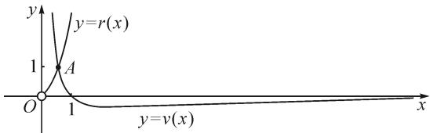
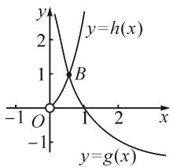

# 例谈证明函数零点唯一性问题的有效策略\*

# ●安徽省合肥市第四中学 管良梁

# 1 例题呈现

已知函数 $f(x)=x\mathrm{e}^{x}+\frac{\ln x}{x}$ ，求证：函数 $f(x)$ 有唯一零点.

# 2 解题策略探究

# 2.1 分区间研究法

所谓分区间研究法就是将函数的定义域分成几个区间,在不同的区间里对函数进行研究.

证法1: 因为 $f(x)=xe^{x}+\frac{\ln x}{x}(x>0)$ ，所以 $f'(x)=\mathrm{e}^{x}+xe^{x}+\frac{1-\ln x}{x^{2}}=\mathrm{e}^{x}(x+1)+\frac{1-\ln x}{x^{2}}.$

当 $x \in (0,1)$ 时， $\mathrm{e}^{x}(x + 1) > 0, \frac{1 - \ln x}{x^2} > 0$ ，所以 $f'(x) > 0$ ，故 $y = f(x)$ 在 $(0,1)$ 上单调递增.

因为 $f\left(\frac{1}{\mathrm{e}}\right) = \frac{\mathrm{e}^{\mathrm{e}^{-1}} - \mathrm{e}^2}{\mathrm{e}} < 0, f(1) = \mathrm{e} > 0$ ，所以 $f\left(\frac{1}{\mathrm{e}}\right) \cdot f(1) < 0$ ，则 $x \in (0,1)$ 时，函数 $y = f(x)$ 存在唯一零点.

因为 $x \in [1, +\infty)$ 时， $x \mathrm{e}^{x} > 0, \frac{\ln x}{x} \geqslant 0$ ，所以 $f(x) = x \mathrm{e}^{x} + \frac{\ln x}{x} > 0$ ，故 $x \in [1, +\infty)$ 时，函数 $f(x) = x \mathrm{e}^{x} + \frac{\ln x}{x}$ 不存在零点.

综上，函数 $f(x) = x\mathrm{e}^{x} + \frac{\ln x}{x}$ 有唯一零点.

点评: 因为函数 $f(x)=xe^{x}+\frac{\ln x}{x}(x>0)$ ，当 $x\in[1,+\infty)$ 时， $f(x)=xe^{x}+\frac{\ln x}{x}>0$ ，不存在零点，所以只需证明 $x\in(0,1)$ 时函数 $f(x)$ 有唯一零点即可。分区间研究法要求我们对函数在定义域的不同区间内的性质要充分了解，做到合理地分割定义域。

# 2.2 构造辅助函数法

所谓构造辅助函数法就是根据题干构造一个新的函数.借助对新构造函数的研究,解决原函数所涉及的问题.

证法 2: 要证函数 $f(x)=xe^{x}+\frac{\ln x}{x}(x>0)$ 有唯一零点，即证函数 $g(x)=x\cdot f(x)=x^{2}\mathrm{e}^{x}+\ln x(x>0)$ 有唯一零点.

因为 $g(x)=x^{2}\mathrm{e}^{x}+\ln x(x>0)$ ，所以 $g'(x)=2x\mathrm{e}^{x}+x^{2}\mathrm{e}^{x}+\frac{1}{x}$ .

由 $x > 0$ ，得 $g^{\prime}(x) = 2x\mathrm{e}^{x} + x^{2}\mathrm{e}^{x} + \frac{1}{x} >0$ ，所以函数 $y = g(x)$ 在 $(0, + \infty)$ 上单调递增.

因为 $g\left(\frac{1}{\mathrm{e}}\right) = \mathrm{e}^{\mathrm{e}^{-1} - 2} - 1 < 0, g(1) = \mathrm{e} > 0$ ，所以 $g\left(\frac{1}{\mathrm{e}}\right) \cdot g(1) < 0$ ，于是 $x \in (0, +\infty)$ 时，函数 $y = g(x)$ 有唯一零点.

故函数 $f(x)=xe^{x}+\frac{\ln x}{x}$ 有唯一零点.

证法3:要证函数 $f(x)=xe^{x}+\frac{\ln x}{x}(x>0)$ 有唯一零点，即证函数 $f(x)=\frac{x^{2}e^{x}+\ln x}{x}(x>0)$ 有唯一零点，即证 $h(x)=x^{2}e^{x}+\ln x(x>0)$ 有唯一零点.

因为 $h(x)=x^{2}\mathrm{e}^{x}+\ln x(x>0)$ ，所以 $h'(x)=2x\mathrm{e}^{x}+x^{2}\mathrm{e}^{x}+\frac{1}{x}$ .

由 x>0，得 $h'(x)=2xe^{x}+x^{2}e^{x}+\frac{1}{x}>0$ ，所以函数 $y=h(x)$ 在 $(0,+\infty)$ 上单调递增.

因为 $h\left(\frac{1}{\mathrm{e}}\right)=\mathrm{e}^{\mathrm{e}^{-1}-2}-1<0, h(1)=\mathrm{e}>0$ ，所以 $h\left(\frac{1}{\mathrm{e}}\right)\cdot g(1)<0$ ，于是 $x\in(0,+\infty)$ 时，函数 $y=h(x)$ 有唯一零点，

故函数 $f(x)=xe^{x}+\frac{\ln x}{x}$ 有唯一零点.

点评:构造辅助函数法需要我们思考——如何构造?怎么构造?构造出来的辅助函数能否帮助我们解决问题?证法2构造函数 $g(x)=x\cdot f(x)$ ，由x>0，得 $g'(x)>0$ ，所以函数 $y=g(x)$ 在 $(0,+\infty)$ 上单调递增.又因为 $g\left(\frac{1}{e}\right)\cdot g(1)<0$ ，所以函数 $y=g(x)$ 有唯一零点，所以函数 $f(x)=xe^{x}+\frac{\ln x}{x}$ 有唯一零点.证法3中的函数 $f(x)$ 通分后与证法2原理一致.如果构造的辅助函数不能帮助我们解决问题，那么就需要结合条件重新构造.

# 2.3 数形结合法

数形结合是一种数学思想.所谓数形结合法,就是将代数问题与几何图形结合起来,代数问题和几何问题相互转化,把复杂问题简单化.

证法 4: 要证函数 $f(x)=x\mathrm{e}^{x}+\frac{\ln x}{x}$ 有唯一零点，只需证方程 $x\mathrm{e}^{x}=-\frac{\ln x}{x}(x>0)$ 有唯一解.

即证函数 $r(x) = x\mathrm{e}^{x}(x > 0)$ 的图象和函数 $v(x) = -\frac{\ln x}{x}$ 的图象有唯一交点.

因为 $r(x)=x\mathrm{e}^{x}(x>0)$ ，所以 $r'(x)=\mathrm{e}^{x}+x\mathrm{e}^{x}=\mathrm{e}^{x}(x+1)$ .

因为 $x \in (0, +\infty)$ ，所以 $r'(x) = \mathrm{e}^{x}(x + 1) > 0$ .

故函数 $r(x)=xe^{x}$ 在 $(0,+\infty)$ 上单调递增.

因为 $x \to 0$ 时， $r(x) \to 0$ ，且 $x \to +\infty$ 时， $r(x) \to +\infty$ ，所以函数 $r(x) = x \mathrm{e}^{x} (x > 0)$ 的图象如图1中所示.

text_image

y
y=r(x)
1
A
O
1
y=v(x)
x

图 1

由 $v(x)=-\frac{\ln x}{x}(x>0)$ ，得 $v'(x)=\frac{\ln x-1}{x^{2}}$ .

当 $x \in (0, e)$ 时， $v'(x) < 0, v(x)$ 在 $(0, e)$ 上单调递减；当 $x \in (\mathrm{e}, +\infty)$ 时， $v'(x) > 0, v(x)$ 在 $(\mathrm{e}, +\infty)$ 上单调递增。故 $v(x)_{\min} = v(\mathrm{e}) = -\frac{1}{\mathrm{e}}$ 。

因为 $x \to 0^{+}$ 时， $v(x) \to +\infty, x \to +\infty$ 时， $v(x) \to 0$ ，所以函数 $v(x) = -\frac{\ln x}{x} (x > 0)$ 的图象如图1中所示.

由图1可知，函数 $r(x) = x\mathrm{e}^{x}(x > 0)$ 的图象和函数 $v(x) = -\frac{\ln x}{x}$ 的图象有唯一交点 $A$ ，所以方程

$x\mathrm{e}^{x}=-\frac{\ln x}{x}(x>0)$ 有唯一解，从而函数 $f(x)=x\mathrm{e}^{x}+\frac{\ln x}{x}$ 有唯一零点.

证法 5: 要证函数 $f(x)=x\mathrm{e}^{x}+\frac{\ln x}{x}$ 有唯一零点，只需证方程 $x^{2}\mathrm{e}^{x}=-\ln x(x>0)$ 有唯一解.

即证函数 $h(x)=x^{2}\mathrm{e}^{x}(x>0)$ 的图象和函数 $g(x)=-\ln x$ 的图象有唯一交点.

line

| x | y = h(x) | y = g(x) |
|---|---|---|
| -1 | 0 | 0 |
| 0 | 0 | 0 |
| 1 | 1 | 0 |
| 2 | 0 | 0 |

图 2

因为 $h(x)=x^{2}\mathrm{e}^{x}(x>0)$ ，所以 $h'(x)=2xe^{x}+x^{2}\mathrm{e}^{x}=xe^{x}(x+2)$ .

由 $x \in (0, +\infty)$ ，得 $h'(x) = x \mathrm{e}^{x}(x + 2) > 0$ .

所以函数 $h(x)=x^{2}\mathrm{e}^{x}$ 在 $(0,+\infty)$ 上单调递增.

因为 $x \to 0$ 时， $h(x) \to 0$ ，且 $x \to +\infty$ 时， $h(x) \to +\infty$ ，所以函数 $h(x) = x^{2} e^{x} (x > 0)$ 的图象如图 2 中所示.

易知, 函数 $g(x) = -\ln x$ 的图象, 如图 2 所示.

由图2可知，函数 $h(x) = x^{2}\mathrm{e}^{x}(x > 0)$ 的图象和函数 $g(x) = -\ln x$ 的图象有唯一交点 $B$ ，所以方程 $x^{2}\mathrm{e}^{x} = -\ln x(x > 0)$ 有唯一解.

故函数 $f(x)=xe^{x}+\frac{\ln x}{x}$ 有唯一零点.

点评:证法4和证法5都是先将函数的零点问题转化成方程的求解问题,再将方程的求解问题转化成求两个函数图象交点的问题.在转化的过程中为了简化计算和作图,可以将原式或方程适当变形.证法4中将函数 $f(x)=xe^{x}+\frac{\ln x}{x}$ 进行变形,把问题转化成证明“函数 $r(x)=xe^{x}(x>0)$ 的图象和函数 $v(x)=-\frac{\ln x}{x}$ 的图象有唯一交点”.证法5中将函数 $f(x)=xe^{x}+\frac{\ln x}{x}$ 进行变形,把问题转化成证明“函数 $h(x)=x^{2}e^{x}(x>0)$ 的图象和函数 $g(x)=-\ln x$ 的图象有唯一交点”.两种转化都能达到证明的目的,两种证法相比较,显然证法5比较简单.因为证法5转化之后的两个函数我们比较熟悉或研究起来比较方便,因此解答中需要进行适当变形,优化解答过程.

函数的零点等价于对应方程的解,也等价于对应函数图象与 x 轴交点的横坐标.不同的问题采取不同的方法,使得复杂问题简单化,转化为我们熟悉的函数或方程加以解答.

# 参考文献：

[1]林建森.在深度学习中突破数学思维的瓶颈——以“函数零点问题”为例[J].中学数学,2020(3):3-4,7.Z