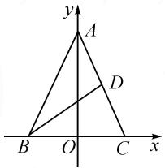
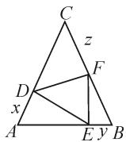
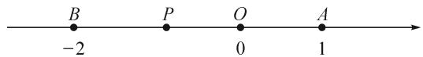

# 借助数形结合促升解题能力

# ●甘肃省张掖市实验中学 郑淑平

数与形是数学的两大核心内容,二者表面看相互独立,实则紧密联系,往往是数中有形,形中有数.解题时将数与形相互转化可以使问题变得简单、直观,进而方便学生结合已有认知找到解题的切入点,从而高效、高质解决问题.然在现实教学中发现,部分学生数形结合意识淡薄,考试时很少应用数形结合思想解决问题,应用也仅限于将简单的代数问题转化为几何图形,究其原因是学生对数形结合的重要性认识不足,难以发现代数问题中的几何意义,也不能将几何中的数量关系转化为代数问题进行求解.为此,在教学中,教师要重视渗透和启发,引导学生巧借数形转化提升解题效率.

# 1 数形结合的重要性

数形结合有利于夯实学生基础,培养思维的深度;也能提升解题效率.数与形看似独立,却密不可分,只有将它们有机地结合在一起,才能使数学更加精彩.例如,在求函数值域时若直接从代数角度求解不仅过程复杂,而且计算量大,而将其转化为几何问题,解题思路也更加直观、清晰,求解更方便.只有二者有机结合,才能把握住数学的本质和精髓,才能使数形结合成为解决数学问题的有力武器.

# 2 数形结合的运用原则

虽然数形结合在提高学生解题效率、发展思维方面发挥着不可估量的作用，但并非所有的问题都适合运用数形结合。众所周知，图形虽然直观，但有时并不一定可以完整地刻画出所有的数量关系，若转化时忽略了等价性，可能使解题出现漏洞；其次，在应用数形结合时要将直观的分析和抽象的探索有机结合起来，即关注双向性。最后，将问题向简单化转化，其目的是为了高效解决问题，而并非为了追求新奇而刻意使用。

# 3 数形结合的应用

数形结合在高中数学中有着广泛的应用,如,在解决三角函数、向量、不等式、方程等问题时应用数形结合可以达到简化解题过程、优化解题策略的目的.下面笔者借助几个典型案例展示数形结合的魅力.

# 3.1 应用于解方程问题

在解决一些含参的对数、指数或根式方程时，若通过代入、开方等常规的解题思路求解，虽然思路简单但难以计算，故需要巧借数形结合将问题向简单化转化，从而使求解更加简洁明快.

例 1 已知 a, b 是实数, 1 和 -1 是函数 $f(x) = x^{3} + ax^{2} + bx$ 的两个极值点.

(1) 求 a 和 b 的值；  
(2)设函数 $g(x)$ 的导数 $g'(x)=f(x)+2$ ，求 $g(x)$ 的极值点；  
(3) 设 $h(x)=f(f(x))-c$ ，其中 $c\in[-2,2]$ ，求函数 $y=h(x)$ 的零点个数.

第(1)问求得 a=0, b=-3; 第(2)问得出 x=-2 是 $g(x)$ 的极值点. 这两个问题的求解过程在此就不详细讲解了, 本题重点分析如何利用数形结合求解第(3)问.

问题(3)求函数 $y=h(x)$ 的零点个数即为 $h(x)=0$ 的根的个数.

解析:(3)令 $h(x)=0$ ，则 $f(f(x))=c$ ，令 $f(x)=t$ ，则 $c=f(t)$ .

当 $c = 2$ 时，设 $c = f(t)$ 的两个根为 $t_1, t_2$ ，则 $t_1 = -1, t_2 = 2$ . 由图象知方程 $f(x) = -1$ 的根有3个，方程 $f(x) = 2$ 的根有2个，且这5个根不相等. 故 $c = 2$ 时， $f(f(x)) = c$ 的根有5个，即 $y = h(x)$ 的零点个数为5个.

同理， $c = -2$ 时， $y = h(x)$ 的零点个数也为5个。当 $-2 < c < 2$ 时，设方程 $c = f(t)$ 的三根分别为 $t_3, t_4, t_5$ ，由 $y = f(t)$ 与 $y = c$ 的图象可知，方程 $f(x) = t_1, f(x) = t_2, f(x) = t_3$ 各有3个不等实根，且这9个根都不相等。故 $-2 < c < 2$ 时， $f(f(x)) = c$ 的根有9个，即函数 $y = h(x)$ 的零点有9个。

综上，当 $|c| = 2$ 时，函数 $y = h(x)$ 有5个零点；当 $|c| < 2$ 时，函数 $y = h(x)$ 有9个零点.

点评:问题(3)中“函数 $y=h(x)$ 的零点个数”经过换元转化为“方程 $f(x)=t$ 的根的个数”，即将复杂的函数问题转化为学生熟悉的方程问题。虽然解方程问题学生较为熟练，但本题若直接求解很难实现，故通过数形结合再次转化为讨论 $y=f(x)$ 与 y=t 的图象交点问题,使问题向直观化转化,从而结合图象可以顺利求解问题.

# 3.2 应用于最值问题

应用数形结合求最值是较为常见的方法.应用数形结合往往要根据题目特点构造出使问题简单化和直观化的图形,从而搭建起“数”与“形”的高架桥,进而达到事半功倍的效果.

例 2 在 $\triangle ABC$ 中, AC 边上的中线为 BD, 若 BD=2, AB=AC, 当顶角 A 变化时, 求 $\triangle ABC$ 的面积的最大值.

解析:如图1,以BC所在直线为x轴,BC的中点为原点O建立平面直角坐标系.设OA=h(h>0),BC=2a(a>0),则A(0,h),B(-a,0),C(a,0),D $\left(\frac{a}{2},\frac{h}{2}\right)$ .

text_image

y
A
D
B O C x

图1

所以 $BD = \sqrt{\left(-a - \frac{a}{2}\right)^2 + \left(0 - \frac{h}{2}\right)^2} = 2$ ，即 $9a^2 + h^2 = 16$ ，则 $16 = 9a^2 + h^2 \geqslant 6ah$ ，当且仅当 $3a = h$ ，即 $a = \frac{2\sqrt{2}}{3}, h = 2\sqrt{2}$ 时等号成立.

故 $\triangle ABC$ 面积的最大值为 $\frac{8}{3}$ .

点评:本题求解时根据图形特点巧妙地以 BC 所在直线为 x 轴, BC 的中点为原点 O 建立平面直角坐标系, 进而将几何问题转化为代数问题, 利用基本不等式求得 $\triangle ABC$ 面积的最大值. 当然, 本题在求解时还可以以 BD 所在的直线为 x 轴, BD 中点为原点 O 建立平面直角坐标系, 由阿氏圆定义可确定点 A 的轨迹为圆, 进而结合图形求解 $\triangle ABC$ 的最大值. 虽然前者主要运用了代数思维, 后者为解析几何思维, 但求解过程中都需要经过图形的转化. 可见, 在求最值问题时应用数形结合往往可以收获惊喜.

# 3.3 应用于不等式问题

在解不等式问题时,若不等式两边不能转化为熟悉的方程或不等式组,或不等式恒成立等问题,直接求解不仅运算量过大,而且可能越解越复杂,容易使学生出现畏难情绪,故可以尝试借助不等式中蕴含的几何意义将问题向直观化转化.

例 3 已知 $x, y, z \in (0,1)$ ，求证： $x(1-y)+y \cdot (1-z)+z(1-x)<1$ .

证法 1: 如图 2 构造边长为 1 的正三角形 ABC.

设点 D, E, F 分别在边 AC, AB, BC 上， $|AD| = x$ ， $|BE| = y$ ， $|CF| = z$ .

由面积关系, 得 $S_{\triangle ADE} + S_{\triangle FEB} + S_{\triangle CDF} < S_{\triangle ABC}$ .

$$
\begin{array}{l} (1 - y) \sin 6 0 ^ {\circ} + \frac {1}{2} y (1 - z) \sin 6 0 ^ {\circ} <  \\ \frac {1}{2} \times 1 \times 1 \times \sin 6 0 ^ {\circ}, \text {即} x (1 - y) + \\ y (1 - z) + z (1 - x) <   1. \\ \end{array}
$$

所以 $\frac{1}{2} z(1 - x)\sin 60^{\circ} + \frac{1}{2} x$

  
图2

故 $x(1 - y) + y(1 - z) + z(1 - x) < 1$ 得证.

点评:本题在证明过程中充分利用代数式的几何意义构造正三角形 ABC, 将不等式问题转化为三角形的面积问题, 使抽象的代数问题更加直观化. 不等式问题是教学的重难点, 也是高考的重要考点, 因此, 在教学中要注意典型问题的推理和拓展, 以丰富学生的解题思路, 提升解题效率.

# 3.4 应用于函数值域问题

求函数值域虽然是比较熟悉的问题,然因其题型灵活多变,涉及的内容广,因此该类问题也是数学的一个重难点.若将函数与图形有机地结合,通过直观观察可以直接找到问题的突破口,使解题更加高效.

例 4 求函数 $y = |x - 1| + |x + 2|$ 的值域.

分析: 记实数 x, 1, -2 在数轴上对应的点分别为 P, A, B，则函数 $y = |x - 1| + |x + 2|$ 可以看成数轴上点 P 到定点 A, B 的距离的和.

解: 记实数 x, 1, -2 在数轴上对应的点分别为 P, A, B，则函数 $y = |x - 1| + |x + 2|$ 看作数轴上点 P 到定点 A, B 的距离的和。结合图 3 可知，当点 P 在线段 AB 上时， $y = |x - 1| + |x + 2| = |AB| = 3$ ；当点 P 在 AB 的延长线上或 BA 的延长线上时， $y = |x - 1| + |x + 2| > |AB| = 3$ 。所以 $y = |x - 1| + |x + 2|$ 的值域为 $[3, +\infty)$ 。

text_image

B
-2
P
O
0
A
1

图3

点评:本题虽然为求函数值域的问题,但通过数形结合可将其转化为距离问题,即数轴上的任意点到两定点的距离问题,转化后问题更具直观性.本题因点P的位置不确定,所以解题时应根据三种可能存在的位置进行分类讨论.各知识点交互交融,解题方法和数学思想又相互渗透,因此,在教学中要引导学生多进行解题方法和解题技巧的总结和探究,进而提升应变能力.

总之,数形结合作为高中数学的重要解题策略和数学思想,其在数学学习中的价值是不言而喻的.教师必须重视引导和渗透,从而通过转化揭示问题的本质,让学生具备将知识转化为技能的能力,进而提升解题效率,发展数学思维.Z