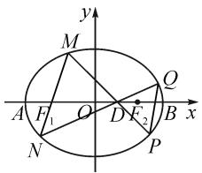
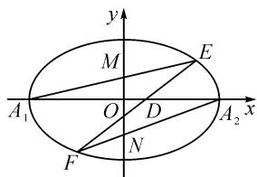

# 利用曲线系 巧解竞赛题

# ●江苏省大丰高级中学 梁文勇

摘要: 曲线系思想是把符合某种条件的一系列曲线用带有参数的方程统一表示出来, 再根据题目中的另外条件确定其中的参数或方程的特征, 以此为基础, 进一步解决问题. 本文中利曲线系思想解答两道竞赛题, 以说明曲线系思想在解题中的妙用.

关键词: 曲线系; 巧解题

解析几何题中常涉及大量的繁琐计算,但如果选取适当方法,就可以避繁就简,使问题迎刃而解.曲线系思想是把符合某种条件的一系列曲线用带有参数的方程统一表示出来,再根据题目中的另外条件确定其中的参数或方程的特征,以此为基础,进一步解决问题 $^{[1]}$ .本文中利用曲线系对2021年的两道数学竞赛题进行解答,希望与大家交流.

例 1 （2021 年全国高中数学联赛重庆预赛第 11 题）如图 1，在平面直角坐标系中，已知 $F_{1}, F_{2}$ 分别为椭圆 $C: \frac{x^{2}}{a^{2}} + \frac{y^{2}}{b^{2}} = 1 (a > b > 0)$ 的左、右焦点。设点 $D(1,0)$ 为线段 $OF_{2}$ 的中点，直线 MN（不与 x 轴重合）过点 $F_{1}$ 且与椭圆 C 交于 M, N 两点。延长 MD, ND 与椭圆 C 交于 P, Q 两点，设直线 MN, PQ 的斜率存在且分别为 $k_{1}, k_{2}$ 。请将 $\frac{k_{2}}{k_{1}}$ 表示成关于 a 的函数，即 $f(a) = \frac{k_{2}}{k_{1}}$ 。求 $f(a)$ 的值域。

原参考答案如下：

设点 $M(x_{1},y_{1}), N(x_{2},y_{2})$ , $P(x_{P},y_{P}), Q(x_{Q},y_{Q})$ ，则 $\frac{x_{1}^{2}}{a^{2}}+\frac{y_{1}^{2}}{b^{2}}=1,\frac{x_{2}^{2}}{a^{2}}+\frac{y_{2}^{2}}{b^{2}}=1.$

text_image

y
M
Q
A F₁ O D F₂ B x
N P

图1

由于 M, N, $F_{1}$ 三点共线，又 $F_{1}(-2,0)$ ，则 $\frac{y_{1}}{x_{1}+2}=\frac{y_{2}}{x_{2}+2}$ ，从而 $x_{1}y_{2}-x_{2}y_{1}=2(y_{1}-y_{2})$ .

直线 MD 的方程为 $y=\frac{y_{1}}{x_{1}-1}(x-1)$ ，联立椭圆 $C:\frac{x^{2}}{a^{2}}+\frac{y^{2}}{b^{2}}=1(a>b>0)$ ，可得 $\frac{x^{2}}{a^{2}}+\frac{y_{1}^{2}(x-1)^{2}}{b^{2}(x_{1}-1)^{2}}=1$ 化简得

$$
\begin{array}{c} \left(a ^ {2} + 1 - 2 x _ {1}\right) x ^ {2} - 2 \left(a ^ {2} - x _ {1} ^ {2}\right) x + 2 a ^ {2} x _ {1} - \left(a ^ {2} + 1\right) x _ {1} ^ {2} = 0. \end{array}
$$

由韦达定理，可知 $x_{1}x_{P} = \frac{2a^{2}x_{1} - (a^{2} + 1)x_{1}^{2}}{a^{2} + 1 - 2x_{1}}$ ，从而 $x_{P} = \frac{2a^{2} - (a^{2} + 1)x_{1}}{a^{2} + 1 - 2x_{1}}.$

进一步得

$$
y _ {P} = \frac {y _ {1}}{x _ {1} - 1} \left(\frac {2 a ^ {2} - (a ^ {2} + 1) x _ {1}}{a ^ {2} + 1 - 2 x _ {1}} - 1\right) = \frac {(1 - a ^ {2}) y _ {1}}{a ^ {2} + 1 - 2 x _ {1}}.
$$

同理 $x_{Q} = \frac{2a^{2} - (a^{2} + 1)x_{2}}{a^{2} + 1 - 2x_{2}},y_{Q} = \frac{(1 - a^{2})y_{2}}{a^{2} + 1 - 2x_{2}}.$

所以 $k_{2} = \frac{y_{p} - y_{Q}}{x_{p} - x_{Q}} =$

$$
\frac {y _ {1} \left(1 - a ^ {2}\right) \left(a ^ {2} + 1 - 2 x _ {2}\right) - y _ {2} \left(1 - a ^ {2}\right) \left(a ^ {2} + 1 - 2 x _ {1}\right)}{\left(a ^ {2} + 1 - 2 x _ {2}\right) \left[ 2 a ^ {2} - \left(a ^ {2} + 1\right) x _ {1} \right] - \left(a ^ {2} + 1 - 2 x _ {1}\right) \left[ 2 a ^ {2} - \left(a ^ {2} + 1\right) x _ {2} \right]} =
$$

$$
\frac {\left(a ^ {4} - 1\right) \left(y _ {2} - y _ {1}\right) - 2 \left(a ^ {2} - 1\right) \left(x _ {1} y _ {2} - x _ {2} y _ {1}\right)}{\left(a ^ {2} - 1\right) ^ {2} \left(x _ {2} - x _ {1}\right)} =
$$

$$
\frac {a ^ {2} + 5}{a ^ {2} - 1} \times \frac {y _ {2} - y _ {1}}{x _ {2} - x _ {1}} = \frac {a ^ {2} + 5}{a ^ {2} - 1} k _ {1},
$$

从而 $f(a) = \frac{k_2}{k_1} = \frac{a^2 + 5}{a^2 - 1}$ .

因为 $a^2 \in (4, +\infty)$ , 所以 $f(a) \in (1, 3)$ .

综上可知 $f(a)=\frac{a^{2}+5}{a^{2}-1}$ ，且其值域为(1,3).

参考答案通过联立直线和椭圆的方程, 解出 P, Q 点的坐标, 再求出 PQ 的斜率 $k_{2}$ , 最终求出 $\frac{k_{2}}{k_{1}}$ 关于 a 的函数 $f(a)$ . 这种解法思路自然, 入题容易, 但无论是直线方程代入椭圆方程的过程, 还是求 $k_{2}$ 的过程, 运算量都较大, 容易出错. 注意到直线 MD, ND 过直线 MN, PQ 与椭圆的交点, 因此尝试用曲线系求解.

解:由题意,设 MN 的方程为 $y=k_{1}(x+2)$ , 即 $y-k_{1}x-2k_{1}=0$ ; 设 PQ 的方程为 $y=k_{2}(x-m)$ , 即$y - k_{2}x + k_{2}m = 0.$ 因为直线 $MP,NQ$ 过 $M,N,P,Q$ 四点，所以设 $MP,NQ$ 两直线的统一方程为

$$
\left(\frac {x ^ {2}}{a ^ {2}} + \frac {y ^ {2}}{b ^ {2}} - 1\right) + \lambda \left(y - k _ {1} x - 2 k _ {1}\right) \left(y - k _ {2} x + k _ {2} m\right) = 0. \tag {①}
$$

又因为直线 MP, NQ 过点 $D(1,0)$ ，所以 $\left(\frac{1}{a^{2}}-1\right)+\lambda(-k_{1}-2k_{1})(-k_{2}+k_{2}m)=0$ ，即

$$
3 \lambda k _ {1} k _ {2} (m - 1) = \frac {1}{a ^ {2}} - 1. \tag {②}
$$

又直线 $MP, NQ$ 都过点 $D(1,0)$ ，设其方程分别为 $x = t_1y + 1, x = t_2y + 1$ ，则 $MP, NQ$ 的方程可统一为 $(x - t_1y - 1)(x - t_2y - 1) = 0$ ，展开为 $x^2 - (t_1 + t_2)xy + t_1t_2y^2 - 2x + (t_1 + t_2)y + 1 = 0$ ，其 $x^2$ 的系数与常数项相等， $xy$ 的系数与 $y$ 的系数互为相反数，因此①式展开也有 $x^2$ 的系数与常数项相等， $xy$ 的系数与 $y$ 的系数互为相反数，则有

$$
\left\{ \begin{array}{l} \frac {1}{a ^ {2}} + \lambda k _ {1} k _ {2} = - 1 - 2 \lambda m k _ {1} k _ {2}, \\ - \lambda k _ {1} - \lambda k _ {2} = - (- 2 \lambda k _ {1} + \lambda m k _ {2}). \end{array} \right.
$$

即 $\left\{ \begin{array}{l} -\lambda k_{1}k_{2}(2m + 1) = \frac{1}{a^{2}} +1,\\ \frac{k_{2}}{k_{1}} = \frac{3}{m - 1}. \end{array} \right.$ ③④

②÷③，得 $\frac{3(m-1)}{-(2m+1)}=\frac{1-a^{2}}{1+a^{2}}$ ，故 $f(a)=\frac{k_{2}}{k_{1}}=\frac{3}{m-1}=\frac{a^{2}+5}{a^{2}-1}=\frac{6}{a^{2}-1}+1.$

因为 $a^{2}\in(4,+\infty)$ ，所以 $f(a)\in(1,3)$ .

综上可知 $f(a)=\frac{a^{2}+5}{a^{2}-1}$ ，且其值域为(1,3).

利用 MP, NQ 都过点 $D(1,0)$ ，及其统一方程的系数特征，得到 $k_{1}, k_{2}, a, m$ 之间的关系式②③④，消去 m 得 $\frac{k_{2}}{k_{1}}$ 关于 a 的函数 $f(a)$ 。另外由②÷③得 $\frac{3(m-1)}{-(2m+1)} = \frac{1-a^{2}}{1+a^{2}}$ ，解得 $m = \frac{4a^{2} + 2}{a^{2} + 5}$ ，这表明椭圆长半轴给定后，直线 PQ 也恒过定点 $\left(\frac{4a^{2} + 2}{a^{2} + 5}, 0\right)$ 。

例 2 （2021 年全国高中数学联赛福建预赛第 12 题）如图 2，已知椭圆 $C: \frac{x^{2}}{a^{2}} + \frac{y^{2}}{b^{2}} = 1 (a > b > 0)$ 的离心率为 $\frac{2}{3}$ ， $A_{1}$ ， $A_{2}$ 分别为椭圆 C 的左、右顶点，B 为椭圆 C 的上顶点， $F_{1}$ 为椭圆 C 的左焦点，且 $\triangle A_{1}F_{1}B$ 的面积为 $\frac{\sqrt{5}}{2}$ .

(1)求椭圆 C 的方程;  
(2)设过点 $D(1,0)$ 的动直线 l 交椭圆 C 于 E, F 两点（点 E 在 x 轴上方），M, N 分别为直线 $A_{1}E$ ， $A_{2}F$ 与 y 轴的交点，求 $\frac{|OM|}{|ON|}$ 的值.

对于例 2, 易求得第 (1) 问椭圆 C 的方程为 $\frac{x^{2}}{9} + \frac{y^{2}}{5} = 1$ . 第 (2) 问原解答将直线方程与椭圆方程联立求解, 不再赘述. 现用曲线系方法解答如下:

text_image

y
M
E
A₁ O D A₂ x
F N

图2

解:(2)设 $A_{1}M, A_{2}N$ 的方程分别为 $\frac{x}{-3} + \frac{y}{m} = 1$ , $\frac{x}{3} + \frac{y}{n} = 1$ . 因为直线 $A_{1}A_{2}, EF$ 过 $A_{1}, A_{2}, E, F$ 四点, 所以设 $A_{1}A_{2}, EF$ 两直线的统一方程为

$$
\left(\frac {x ^ {2}}{9} + \frac {y ^ {2}}{5} - 1\right) + \lambda \left(\frac {x}{- 3} + \frac {y}{m} - 1\right) \left(\frac {x}{3} + \frac {y}{n} - 1\right) = 0. \tag {⑤}
$$

设直线 EF 的方程为 $x=ty+1$ ，即 x-ty-1=0。又因为直线 $A_{1}A_{2}$ 的方程为 y=0，所以 $A_{1}A_{2}$ ，EF 的方程可统一为 $y(x-ty-1)=0$ ，即 $xy-ty^{2}-y=0$ 。可见 $A_{1}A_{2}$ ，EF 的统一方程中 xy 的系数与 y 的系数互为相反数。因此，由⑤式可得 $\lambda\left(\frac{1}{-3n}+\frac{1}{3m}\right)=-\lambda\left(-\frac{1}{m}-\frac{1}{n}\right)$ ，即得 $\frac{m}{n}=-\frac{1}{2}$ ，从而 $\frac{|OM|}{|ON|}=\frac{1}{2}$ 。

这里也是通过 $A_{1}A_{2}$ ，EF 的统一方程的系数特征，直接找到 m, n 之间的关系，避免了繁琐运算.

通过两道竞赛题的解析,我们看到曲线系方法应用特征明显,结构精巧,过程简捷明快,常可减少运算,是训练数学思维、培养数学素养的好方法,在解题实践中可有意识地加以运用.

作为练习,最后留一道题:

已知椭圆 $\frac{x^{2}}{4}+y^{2}=1$ 的右顶点为A，上顶点为B.一条直线与AB平行，且与椭圆交于C，D两点.设AD，BC的斜率分别为 $k_{1},k_{2}$ ，求证： $k_{1}k_{2}=\frac{1}{4}$ .

# 参考文献：

[1]陈清华.巧用曲线系方程妙解题[J].数学通讯,2019(19):20-23,25.Z