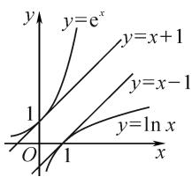
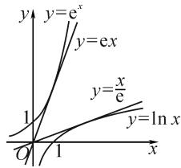

# 同构在函数问题中的应用\*

# ●福建省德化第一中学 福建教育学院数学教育研究所 徐建新

摘要: 含有指数与对数的导数综合试题是近几年高中各类数学考试的热点, 也是难点, 尤其是“指对”混合的不等式在求解参数的取值范围时, 若直接对参数分离, 不仅过程复杂, 有时甚至无法分离. 对这类问题, 可以实施一系列的同构变换, 再借助函数的单调性, 将复杂问题等价转化成容易解决的问题.

关键词: 同构; “指对” 混合不等式; 切线不等式

在解决函数问题时,通过同构变形可将不等式(或等式)两边构造成具有相同结构的代数式,找出母函数并确定母函数的单调性,然后利用函数单调性求解不等式(或等式),这就是同构思想.

基本思路为: 将原不等式等价变形为 $f(g(x)) < f(h(x))$ ，构造函数 $y = f(x)$ .

类型 1: 根据 $y = f(x)$ 的单调性, 将 $f(g(x)) < f(h(x))$ 转化为 $g(x)$ 与 $h(x)$ 的大小关系;

类型 2: 根据 $g(x)$ 与 $h(x)$ 的大小关系, 得到 $y = f(x)$ 的单调性.

本文中结合具体案例,介绍几类在函数问题中常见的同构方法.

# 1 双变量同构

含有地位相同的两个变量的不等式(或等式)通过变形后,不等式(或等式)两边结构具有一致性,可以构造函数.

例 1 （2020 · 新课标 I 卷理数 · 12）若 $2^{a} + \log_{2}a = 4^{b} + 2 \log_{4}b$ ，则（）.

A.a>2b

B.a<2b

C. $a > b^{2}$

D. $a < b^{2}$

解：由 $2^{2b} + \log_2b = 2^{2b} + \log_2(2b) - 1$ ，得 $2^{a} + \log_{2}a < 2^{2b} + \log_{2}(2b)$ .构造函数 $f(x) = 2^{x} + \log_{2}x$ ，则原不等式等价于 $f(a) < f(2b)$ .又函数 $f(x)$ 在 $(0, + \infty)$ 上单调递增，所以 $a < 2b$ .故选：B.

例 2 若对任意的 $x_{1}, x_{2} \in [-2, 0) (x_{1} \neq x_{2})$ ， $\frac{x_{2} e^{x_{1}} - x_{1} e^{x_{2}}}{x_{1} - x_{2}} < a$ 恒成立，则 a 的最小值为（）.

A. $-\frac{3}{e^{2}}$

B. $-\frac{2}{e^{2}}$

C. $-\frac{1}{e^{2}}$

D. $-\frac{1}{e}$

解:不妨设 $x_{1}<x_{2}$ ，则原不等式可化为 $x_{2}e^{x_{1}}-x_{1}e^{x_{2}}>ax_{1}-ax_{2}$ 。移项，得 $x_{2}e^{x_{1}}+ax_{2}>x_{1}e^{x_{2}}+ax_{1}$ 。两边同时除以 $x_{1}x_{2}(x_{1}x_{2}>0)$ ，得 $\frac{e^{x_{1}}+a}{x_{1}}>\frac{e^{x_{2}}+a}{x_{2}}$ 。构造函数 $f(x)=\frac{e^{x}+a}{x}$ ，则不等式即为 $f(x_{1})>f(x_{2})$ 。

由 $x_{1} < x_{2}$ ，可知 $f(x)$ 在 $[-2,0)$ 上单调递减，则 $f^{\prime}(x) = \frac{\mathrm{e}^{x}(x - 1) - a}{x^{2}}\leqslant 0$ ，即 $a\geqslant \mathrm{e}^{x}(x - 1)$ 在 $[-2,0)$ 上恒成立.令 $g(x) = \mathrm{e}^{x}(x - 1),x\in [-2,0)$ ，得 $g^{\prime}(x) = x\mathrm{e}^{x} < 0.$ 所以 $g(x)$ 在 $[-2,0)$ 上单调递减，则 $g(x)_{\max} = g(-2) = -\frac{3}{\mathrm{e}^2}$ .所以 $a\geqslant -\frac{3}{\mathrm{e}^2}$ .故选：A.

点评: 当条件中出现两个变量时, 可以通过移项、两边同时除以某个式子等变形手段, 将相同的自变量放在同一边, 使不等式的两边具有相同的结构, 从而找到母函数.

# 2 “指对”同构

在解决同时涉及 $e^{x}$ 与 $\ln x$ 的相关“指对”混合等式或不等式问题时，可以灵活运用恒等式 $a=\mathrm{e}^{\ln a}(a>0)$ ， $a=\ln e^{a}$ 进行同构，常有如下两种方法：

(1) 指对“分家”: 将指数形式和对数形式分开, 再利用同构变形寻找母函数.  
(2) 内部同构: 以指数函数的指数位置, 以及对数函数的真数位置为内函数, 再利用复合函数的单调性求解.

同构时, 寻找母函数是难点. 常见的母函数有: $f(x)=xe^{x},f(x)=x\ln x,f(x)=\frac{x}{e^{x}},f(x)=e^{x}-x-1,f(x)=x+e^{x}$ ，等等.

例 3 （2022 届泉州市第二次质量检测第 8 题）已知函数 $f(x)=ax-e^{x}, \forall x\in(1,+\infty), f(x)<a\ln x+a-ex$ ，则实数 a 的取值范围是（）.

A. $(-∞,1)$

B. $(-∞,1]$

C. $(-∞,e)$

D. $(-∞,e]$

分析: 利用 $x = e^{\ln x}$ ，得 $ex = e \cdot e^{\ln x} = e^{\ln x + 1}$ ，将不等式的右边变成含有指数式的式子；也可以利用 $x = \ln e^{x}$ ，得 $ax = a \ln e^{x}$ ，将不等式的左边变成含有对数式的式子.

解法 1: 因为 $a \ln x + a - \mathrm{e}x = a (\ln x + 1) - \mathrm{e}^{\ln x + 1}$ ，所以 $f(x) < a \ln x + a - \mathrm{e}x$ 等价于 $f(x) < f (\ln x + 1)$ .

由切线不等式 $x - 1 \geqslant \ln x$ ，得 $1 < \ln x + 1 < x$ 对 $\forall x \in (1, +\infty)$ 恒成立，则 $f(x)$ 在 $(1, +\infty)$ 上单调递减。所以 $f'(x) = a - e^x < 0$ ，即 $a < e^x$ 在 $(1, +\infty)$ 上恒成立，从而 $a \leqslant e$ 。故选：D.

解法 2: 将不等式 $ax - e^{x} < a (\ln x + 1) - ex$ 化为

$$
a \ln \mathrm{e} ^ {x} - \mathrm{e} ^ {x} <   a \ln (\mathrm{ex}) - \mathrm{ex}. \tag {①}
$$

构造 $g(t)=a\ln t-t$ ，则①式为 $g(\mathrm{e}^{x})<g(\mathrm{e}x)$ 。由 x>1，得 t>e。又对 $\forall x\in(1,+\infty),\mathrm{e}^{x}>\mathrm{e}x$ 恒成立。所以 $g(t)$ 在 $(\mathrm{e},+\infty)$ 上单调递减。由 $g'(t)=\frac{a}{t}-1<0$ ，得 a<t 对 $\forall t\in(\mathrm{e},+\infty)$ 恒成立。所以， $a\leqslant e$ 。

故选：D.

例 4 （2022 届 T8 联考第 8 题）设 a, b 都为正数，e 为自然对数的底数，若 $a e^{a+1} + b < b \ln b$ ，则（）.

A. $ab > \mathrm{e}$

B. $b>\mathrm{e}^{a+1}$

C.ab<e

D. $b<\mathrm{e}^{a+1}$

解法 1: 原不等式等价于 $ae^{a+1}<e^{\ln b}(\ln b-1)$ .

两边同时除以 e, 得

$$
a \mathrm{e} ^ {a} <   \mathrm{e} ^ {\ln b - 1} (\ln b - 1). \tag {②}
$$

构造 $f(x)=xe^{x}$ ，则②式转化为

$$
f (a) <   f (\ln b - 1). \tag {③}
$$

由 $f'(x)=(x+1)\mathrm{e}^{x}$ ，得 $f(x)$ 在 $(0,+\infty)$ 上单调递增。又 $a\mathrm{e}^{a+1}<b(\ln b-1)$ 中，a,b>0，得 $\ln b-1>0$ 。所以③式化为 $a<\ln b-1$ ，从而 $b>\mathrm{e}^{a+1}$ 。故选：B.

解法 2: 原不等式等价于

$$
(a + 1) \mathrm{e} ^ {a + 1} - \mathrm{e} ^ {a + 1} <   \mathrm{e} ^ {\ln b} \ln b - \mathrm{e} ^ {\ln b}. \tag {④}
$$

构造函数 $f(x)=xe^{x}-e^{x}$ ，则④式转化为

$$
f (a + 1) <   f (\ln b). \tag {⑤}
$$

又 $a + 1 > 1, \ln b > 1$ ，且 $f'(x) = x \cdot \mathrm{e}^x$ ，则 $f(x)$ 在 $(1, +\infty)$ 上单调递增，于是⑤式等价于 $a + 1 < \ln b$ ，从而 $b > \mathrm{e}^{a + 1}$ . 故选：B.

点评：“指对”混合时，参变分离的难度比较大，而运用“指对”同构可以化难为易，但该方法对式子等价变形能力的要求较高。变形时，内部同构（相同的自变

量或“自变量团”放在同一边），外部同构（母函数）自然而然显现。“指对”同构常与切线不等式综合运用，因此要熟记几个常见的切线不等式及其变形式.

以下是四个常用的切线不等式(如图1, 图2):

(1) $e^{x}\geqslant x+1$ （当且仅当x=0时等号成立）；  
(2) $\ln x\leqslant x-1$ (当且仅当x=1时等号成立);   
(3) $e^{x}\geqslant ex$ （当且仅当x=1时等号成立）；  
(4) $\ln x\leqslant\frac{x}{e}$ (当且仅当x=e时等号成立).

line

| x | y=e^x | y=x+1 | y=x-1 | y=ln x |
|---|---|---|---|---|
| 0 | 0 | 0 | 0 | 0 |
| 1 | 1 | 1 | 1 | 1 |
| 2 | 2 | 2 | 2 | 2 |
| 3 | 3 | 3 | 3 | 3 |
| 4 | 4 | 4 | 4 | 4 |
| 5 | 5 | 5 | 5 | 5 |
| 6 | 6 | 6 | 6 | 6 |
| 7 | 7 | 7 | 7 | 7 |
| 8 | 8 | 8 | 8 | 8 |
| 9 | 9 | 9 | 9 | 9 |
| 10 | 10 | 10 | 10 | 10 |
| 11 | 11 | 11 | 11 | 11 |
| 12 | 12 | 12 | 12 | 12 |
| 13 | 13 | 13 | 13 | 13 |
| 14 | 14 | 14 | 14 | 14 |
| 15 | 15 | 15 | 15 | 15 |
| 16 | 16 | 16 | 16 | 16 |
| 17 | 17 | 17 | 17 | 17 |
| 18 | 18 | 18 | 18 | 18 |
| 19 | 19 | 19 | 19 | 19 |
| 20 | 20 | 20 | 20 | 20 |
| 21 | 21 | 21 | 21 | 21 |
| 22 | 22 | 22 | 22 | 22 |
| 23 | 23 | 23 | 23 | 23 |
| 24 | 24 | 24 | 24 | 24 |
| 25 | 25 | 25 | 25 | 25 |
| 26 | 26 | 26 | 26 | 26 |
| 27 | 27 | 27 | 27 | 27 |
| 28 | 28 | 28 | 28 | 28 |
| 29 | 29 | 29 | 29 | 29 |
| 30 | 30 | 30 | 30 | 30 |
| Note: The y-axis is labeled as 'e^x' (equation of exponential function) and the x-axis is labeled as 'ln x' (linear product). The labels for the curves are 'y = e^x', 'y = x + 1', 'y = x - 1', and 'y = ln x'.

图 1

line

| Point | y = e^x | y = ex |
|---|---|---|
| 1 | 0 | 0 |
| 2 | 1 | 1 |
| 3 | 2 | 2 |
| 4 | 3 | 3 |
| 5 | 4 | 4 |
| 6 | 5 | 5 |
| 7 | 6 | 6 |
| 8 | 7 | 7 |
| 9 | 8 | 8 |
| 10 | 9 | 9 |
| 11 | 10 | 10 |
| 12 | 11 | 11 |
| 13 | 12 | 12 |
| 14 | 13 | 13 |
| 15 | 14 | 14 |
| 16 | 15 | 15 |
| 17 | 16 | 16 |
| 18 | 17 | 17 |
| 19 | 18 | 18 |
| 20 | 19 | 19 |
| 21 | 20 | 20 |
| 22 | 21 | 21 |
| 23 | 22 | 22 |
| 24 | 23 | 23 |
| 25 | 24 | 24 |
| 26 | 25 | 25 |
| 27 | 26 | 26 |
| 28 | 27 | 27 |
| 29 | 28 | 28 |
| 30 | 29 | 29 |
| 31 | 30 | 30 |
| 32 | 31 | 31 |
| 33 | 32 | 32 |
| 34 | 33 | 33 |
| 35 | 34 | 34 |
| 36 | 35 | 35 |
| 37 | 36 | 36 |
| 38 | 37 | 37 |
| 39 | 38 | 38 |
| 40 | 39 | 39 |
| 41 | 40 | 40 |
| 42 | 41 | 41 |
| 43 | 42 | 42 |
| 44 | 43 | 43 |
| 45 | 44 | 44 |
| 46 | 45 | 45 |
| 47 | 46 | 46 |
| 48 | 47 | 47 |
| 49 | 48 | 48 |
| 50 | 49 | 49 |
| Note: The x-axis is labeled as 'x', and the y-axis is labeled as 'y'. The chart displays a line graph with three distinct lines representing different functions of y. The labels above the lines are 'y=e^x' and 'y=ex'.

图2

# 3 朗博同构

由切线不等式 $\mathrm{e}^x\geqslant x + 1$ （当且仅当 $x = 0$ 时等号成立），得 $x\mathrm{e}^{x} = \mathrm{e}^{\ln x + x}\geqslant x + \ln x + 1$ （当且仅当 $\ln x+$ $x = 0$ 时等号成立），即 $x\mathrm{e}^x\geqslant x + \ln x + 1.$

类似地,还有 $\frac{x}{e^{x}}\geqslant\ln x-x+1$ 等.

例 5 若函数 $f(x)=x\left(\mathrm{e}^{2x}-a\right)-\ln x-1$ 无零点，则整数 a 的最大值是（）.

A.3

B.2

C.1

D.0

解:由切线不等式,得 $f(x)=\mathrm{e}^{\ln x+2x}-ax-\ln x-1\geqslant(\ln x+2x+1)-ax-\ln x-1=(2-a)x.$

因此， $f(x)$ 无零点时整数a的最大值是1.故选：C.

例 6 （2020 年新高考 I 卷第 21 题节选）已知函数 $f(x)=a\mathrm{e}^{x-1}-\ln x+\ln a$ . 若 $f(x)\geqslant1$ , 求 a 的取值范围.

解法 1: 不等式 $ae^{x-1}-\ln x+\ln a\geqslant1$ ，等价于 $e^{\ln a+x-1}-\ln x+\ln a-1\geqslant0$ .

移项，得 $e^{\ln a+x-1}+\ln a-1\geqslant\ln x.$

两边同时加 $x$ ，得

$$
\mathrm{e} ^ {\ln a + x - 1} + \ln a + x - 1 \geqslant x + \ln x = \mathrm{e} ^ {\ln x} + \ln x. \tag {6}
$$

构造 $g(t)=\mathrm{e}^{t}+t$ ，则 $g(t)$ 在 R 上是增函数，且⑥式转化为 $g(\ln a+x-1)\geqslant g(\ln x)$ 。所以 $\ln a+x-1\geqslant\ln x$ ，即 $\ln a\geqslant\ln x-x+1$ 在 $(0,+\infty)$ 上恒成立。

设 $h(x)=\ln x-x+1$ ，则由 $\ln x\leqslant x-1$ ，得 $h(x)$ 的最大值为 0，从而 $\ln a\geqslant0$ ，解得 $a\geqslant1$ 。

故 a 的取值范围为 $[1, +\infty)$ .

解法 2: 不等式 $ae^{x-1}-\ln x+\ln a\geqslant1$ ，等价于 $e^{\ln a+x-1}-\ln x+\ln a-1\geqslant0$ .

又 $\mathrm{e}^{\ln a+x-1}\geqslant\ln a+x$ ，所以要使 $f(x)\geqslant1$ 恒成立，则 $2\ln a\geqslant(\ln x-x+1)_{\max}$

设 $g(x)=\ln x-x+1$ ，则可知 $g(x)_{\max}=g(1)=0$ 。所以 $2\ln a\geqslant0$ ，解得 $a\geqslant1$ 。

故 a 的取值范围为 $[1, +\infty)$ .

点评: 解法 1 在不等式 $e^{\ln a+x-1}+\ln a-1\geqslant\ln x$ 的两边同时加“x”，使左边出现与指数幂相同的“自变量团”，右边变形成 $e^{\ln a+x-1}+\ln a+x-1\geqslant e^{\ln x}+\ln x$ ，运用的是“指对”同构。解法 2 在不等式 $e^{\ln a+x-1}-\ln x+\ln a-1\geqslant0$ 中运用朗博同构，更直接迅速。

# 4 差一同构

指数幂和对数的真数相差 1 时, 可用“差一同构”. 下面仍以例 6 为例, 利用“差一同构”进行分析.

构造函数 $g(x)=\mathrm{e}^{x}-x-1$ . 由切线不等式, 可知 $e^{x}\geqslant x+1$ (当且仅当 x=0 时, 等号成立). 所以, $g(x-1)=\mathrm{e}^{x-1}-x\geqslant0$ , $g(\ln x)=x-\ln x-1\geqslant0$ (当且仅当 x=1 时, 等号成立), 两式相加, 得 $e^{x-1}-\ln x-1\geqslant0$ (当且仅当 x=1 时, 等号成立).

当 $a \geqslant 1$ 时， $\ln a \geqslant 0$ . 所以 $a \mathrm{e}^{x - 1} - \ln x + \ln a \geqslant$ $e^{x-1}-\ln x\geqslant1$ 恒成立.

当 0 < a < 1 时， $f(1) = a + \ln a < 1$ ，不符合题意。

综上, 可知 $f(x) \geqslant 1$ 时, $a \geqslant 1$ .

以上由母函数 $g(x) = \mathrm{e}^{x} - x - 1$ 同构出函数 $g(x - 1)$ 和 $g(\ln x)$ ，结合切线不等式得到两个取等号条件一样的不等式，从而轻松破解该题。同样地，由 $g(x) = \mathrm{e}^{x} - x - 1 \geqslant 0$ ，也可以构造 $g[\ln (x + 1)] = x - \ln (x + 1) \geqslant 0$ ，两式相加，得 $\mathrm{e}^x - \ln (x + 1) - 1 \geqslant 0$ （以上三个不等式都是当且仅当 $x = 0$ 时，等号成立）。因此，取等号条件是差一同构的关键。

总之，通过上述多种同构方法的归类剖析可知，处理此类问题切入点虽有不同，但目标一致，关键在于灵活运用恒等式 $x\mathrm{e}^{x} = \mathrm{e}^{x + \ln x}$ 等，对题设的等式或不等式进行适当的变形，使之左右两边结构相同，进而寻找母函数.该类问题又常与切线不等式综合运用，解法多样，变形难度较大.因此，要学会利用同构变形，在掌握思想与方法的过程中不断形成知识体系，提升数学品质，提高思维能力.Z

# (上接第64页)

变式 1 如图 1 所示, 在由 3 个全等的三角形与中间的一个小等边三角形拼成的一个大等边三角形中, 设 DF = 3FA, 若在大等边三角形中随机取一点, 则该点取自小等边三角形内的概率是 \_\_\_\_.

解析:根据原问题方法4的求解过程,可知DF=3, $BC=\sqrt{21}$ .

由面积型几何概型的概率计算公式, 可得“该点取自小等边三角形内”的概率 $P=\frac{S_{\triangle DEF}}{S_{\triangle ABC}}=\frac{9}{21}=\frac{3}{7}$ .

故填答案: $\frac{3}{7}$ .

探究 2: 保留原问题的部分条件, 把具体的线段比例关系进行一般化处理, 将原问题变式拓展, 从而得到相应的一般性结论.

结论1 如图1所示，在由3个全等的三角形与中间的一个小等边三角形拼成的一个大等边三角形中，设 $DF = \lambda FA(\lambda >0)$ ，则 $\overrightarrow{AD} = \frac{(\lambda + 1)^2}{(\lambda + 1)(\lambda + 2) + 1}\cdot$ $\overrightarrow{AB} +\frac{\lambda + 1}{(\lambda + 1)(\lambda + 2) + 1}\overrightarrow{AC}.$

具体证明过程可以参照原问题方法 5 的求解过程.其实, 当 $\lambda = 3$ 时, 代入以上结论, 即可得 $\overrightarrow{AD} = \frac{16}{21}\overrightarrow{AB} + \frac{4}{21}\overrightarrow{AC}$ , 从而确定特殊值条件下的平面向量的线性关系式,即为原来问题的答案.而随着特殊值 $\lambda$ 的变化,相应的平面向量的线性关系式也随着变化,可以变换出其他一些相应的变式,方便计算.

结论 2 如图 1 所示, 在由 3 个全等的三角形与中间的一个小等边三角形拼成的一个大等边三角形中, 设 $DF = \lambda FA (\lambda > 0)$ , 则小等边三角形与大等边三角形的边长的比值为 $\lambda : \sqrt{(\lambda + 1)(\lambda + 2) + 1}$ .

该结论的具体证明过程可参照原问题中方法4的求解过程.利用该结论,可以确定小等边三角形与大等边三角形边长的关系、面积的关系以及与之相关的其他问题,包括变式1中的几何概型问题等.

# 4 解后反思

破解平面向量问题最常见的“三思维”: 基底思维、坐标思维、解三角形思维. 在实际解答过程中, 利用平面向量的线性运算或坐标运算来分析与处理, 具体破解与切入方式又有不同的形式. 其实, 在解决平面向量问题时, 要充分利用平面向量的特征, 提高识“图”与用“图”能力, 提升用“数”与解“数”思维, 进而从“形”的角度或“数”的角度切入, 结合不同的思维方式来分析, 达到多角度思维, 多方法处理, 多层面拓展. Z