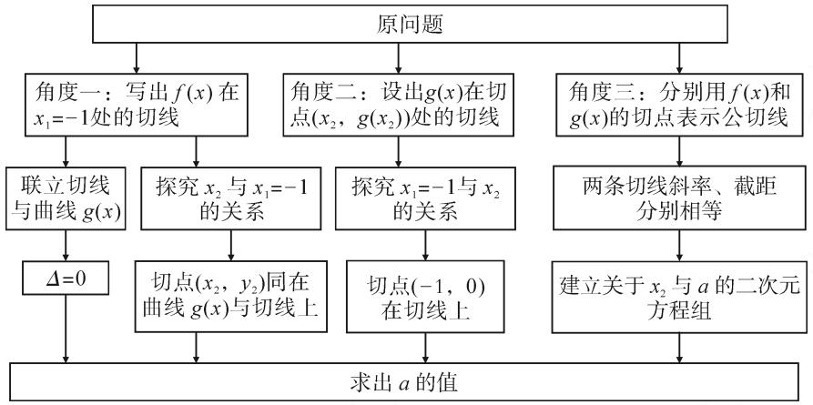
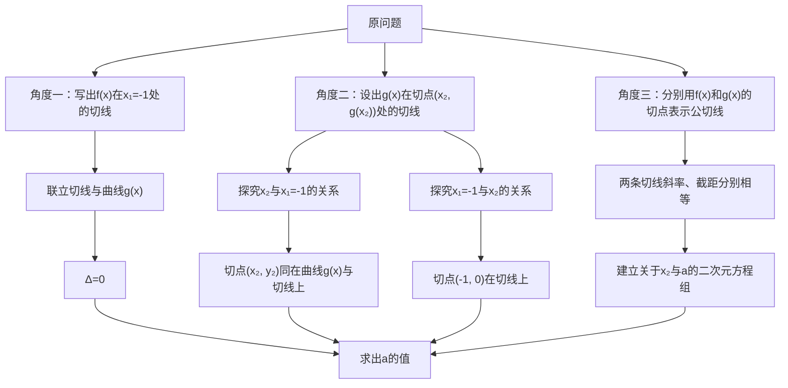
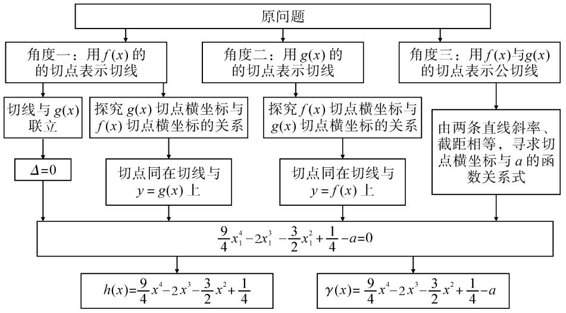
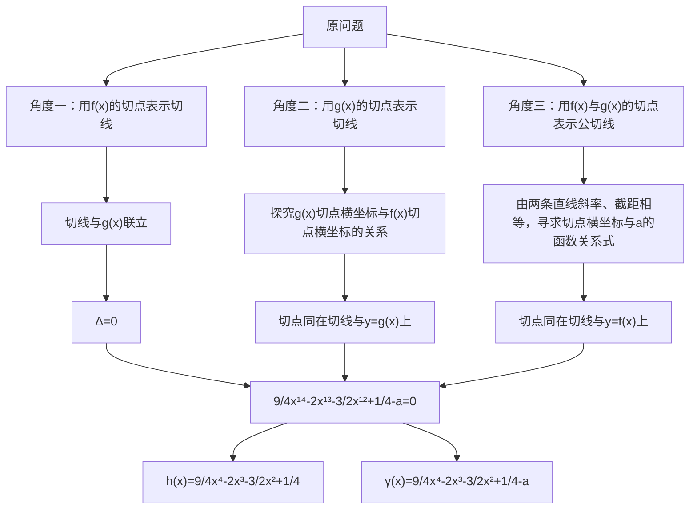
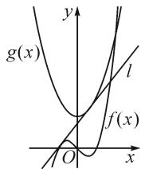
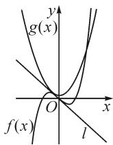
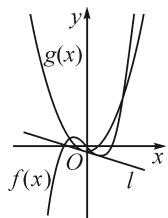
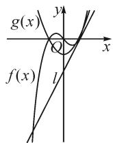
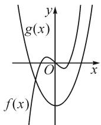

讲题比赛一等奖获奖论文之十五：

# 基于思维导图的高考试题解法研究

——2022 全国甲卷文科数学第 20 题的探究

●云南师范大学附属世纪金源学校 代锦春  
●昆明市官渡区第六中学代红军  
●西南大学数学与统计学院 朱俊霖

# 1 题目呈现

(2022 全国甲卷文科数学第 20 题) 已知函数 $f(x)=x^{3}-x$ , $g(x)=x^{2}+a$ ，曲线 $y=f(x)$ 在点 $(x_{1},f(x_{1}))$ 处的切线也是曲线 $y=g(x)$ 的切线.

(1) 若 $x_{1} = -1$ ，求 a；  
(2) 求 a 的取值范围.

# 2 解析

本题第(1)(2)问分析及解答过程如下.

对于第(1)问,已知函数 $f(x)$ 与函数 $g(x)$ 的公切线与 $f(x)$ 切点的横坐标为 $x_{1} = -1$ ，可以从以下三个角度求参数 $a$ 的值. 角度一，写出 $f(x)$ 在 $x_{1} = -1$ 处的切线，可以选择联立切线方程与 $y = g(x)$ ，借助 $\Delta = 0$ 求 $a$ ；也可以借助两函数在两切点处的导函数值相等，建立 $x_{1} = -1$ 与 $x_{2}$ 的关系式，再由切点 $(x_{2}, y_{2})$ 同在切线与函数 $g(x)$ 上，建立 $a$ 的方程求 $a$ . 角度二，设出 $g(x)$ 在点 $(x_{2}, y_{2})$ 处的切线，先探究 $x_{1} = -1$ 与 $x_{2}$ 的关系，再由切点 $(-1, 0)$ 在切线上，建立关于 $a$ 的方程求 $a$ . 角度三，分别用 $f(x)$ 与 $g(x)$ 的切点表示公切线，根据两切线斜率相等、截距相等构建关于 $x_{2}$ 与 $a$ 的二元方程组，从而解出 $a$ 的值. 相应的思维导图如图1所示.

flowchart

图 1

角度一:写出 $f(x)$ 在 $x_{1}=-1$ 处的切线.

解法1:由 $f'(x)=3x^{2}-1$ ，得 $f'(-1)=2$ ，所以 $f(x)$ 在 $x_{1}=-1$ 处切线 l 的方程为 $y=2(x+1)$ 。联立 $\left\{\begin{aligned}y&=2(x+1),\\ y&=x^{2}+a,\end{aligned}\right.$ 得 $x^{2}-2x+a-2=0$ 。由 l 与 y=g(x) 相切，可得 $\Delta=12-4a=0$ ，即 a=3。

解法 2-1: 由 $f'(-1)=2$ ，可知 $f(x)$ 在 $x_{1}=-1$ 处切线 l 的方程为 $y=2(x+1)$ .

因为切线 l 与曲线 $y=g(x)$ 相切于点 $(x_{2},y_{2})$ ，所以 $g'(x_{2})=f'(-1)$ ，即 $2x_{2}=2$ ，得 $x_{2}=1$ 。

由于点 $(x_{2},y_{2})$ 同在切线l与曲线 $y=g(x)$ 上，故将点 $(x_{2},y_{2})$ 代入l的方程，得 $y_{2}=2(x_{2}+1)=4$ .

因此 $g(x)$ 与 l 相切于点 $(1,4)$ ，代入 $y=g(x)$ ，得 $4=1^{2}+a$ ，解得 a=3。

解法 2-2: 同解法 2-1, 由于点 $(x_{2}, y_{2})$ 同在切线 l 与曲线 $g(x)$ 上, 将点 $(x_{2}, y_{2})$ 代入 $y = g(x)$ , 得 $y_{2} = x_{2}^{2} + a = 1 + a$ , 因此 $g(x)$ 与 l 相切于点 $(1, 1 + a)$ , 代入切线 l, 得 $1 + a = 2(1 + 1)$ , 解得 a = 3.

角度二:设出 $g(x)$ 在切点 $(x_{2}, y_{2})$ 处的切线.

解法3: 设 $g(x)$ 在点 $(x_{2}, g(x_{2}))$ 处的切线 l 的方

程为 $y-(x_{2}^{2}+a)=2x_{2}(x-x_{2})$ .

由切线 l 与曲线 $y=f(x)$ 相切于点 $(-1,0)$ ，得 $f'(-1)=g'(x_{2})$ ，即 $2=2x_{2}$ ，则 $x_{2}=1$ ，从而 $l:y-(1+a)=2(x-1)$ 。再由点 $(-1,0)$ 在切线 l 上，将点 $(-1,0)$ 代入直线 l，解得 a=3。

角度三: 分别用 $f(x)$ 和 $g(x)$ 的切点表示公切线.

解法 4: $f(x)$ 在 $x_{1} = -1$ 处的切线 l 方程为

$$
y = 2 (x + 1). \tag {①}
$$

设切线 $l$ 与曲线 $g(x)$ 相切于点 $(x_{2}, g(x_{2}))$ ，则 $l$ 的方程为 $y - (x_{2}^{2} + a) = 2x_{2}(x - x_{2})$ ，即

$$
y = 2 x _ {2} x - x _ {2} ^ {2} + a. \tag {②}
$$

由①②，可得 $\left\{\begin{aligned}2&=2x_{2},\\ 2&=-x_{2}^{2}+a,\end{aligned}\right.$ 解得a=3.

点评: 解法 1 中利用 $\Delta=0$ 来构建关于 a 的方程求 a, 仅适用于 $g(x)$ 为二次函数, 具有一定的特殊性. 在处理公切线问题时, 常常借助两函数在各自切点处的导函数值即为公切线的斜率, 从而得到两切点横坐

标的关系;再由切点同在切线与函数图象上,建立方程组进行求解.

对于第(2)问,在此问中, $f(x)$ 的切点由定点变为了动点,类比第(1)问的探究方法,可以从以下三个角度去求参数a的范围.角度一,用 $f(x)$ 的切点表示公切线,将切线与 $y=g(x)$ 联立,借助 $\Delta=0$ 得出a与 $x_{1}$ 的关系,进而去求a的范围;还可以先探究两切点横坐标之间的关系,由 $g(x)$ 的切点同在切线与 $y=g(x)$ 上,构建关于a与 $x_{1}$ 的等式,进而求a的范围.角度二,用 $g(x)$ 的切点表示公切线方程,先探究两切点横坐标之间的关系,由 $f(x)$ 的切点同在切线与 $y=f(x)$ 上,构建关于a与 $x_{1}$ 的等式,进而求a的范围.角度三,用 $f(x)$ 与 $g(x)$ 各自的切点坐标表示公切线,借助公切线的两种表达形式的斜率、截距相等得出关于a与 $x_{1}$ 的等式,进而求a的范围.相应的思维导图如图2所示.

flowchart

图2

角度一:用 $f(x)$ 的切点表示切线.

解法 1-1: $f(x)$ 在点 $(x_{1}, f(x_{1}))$ 处的切线 l 方程为 $y = (3x_{1}^{2} - 1)x - 2x_{1}^{3}$ .

联立 $\left\{\begin{aligned}y&=(3x_{1}^{2}-1)x-2x_{1}^{3},\\ y&=x^{2}+a,\end{aligned}\right.$ 得

$$
x ^ {2} - \left(3 x _ {1} ^ {2} - 1\right) x + 2 x _ {1} ^ {3} + a = 0.
$$

由直线 l 与曲线 $y = g(x)$ 相切，得 $\Delta = 0$ ，即 $(3x_{1}^{2} - 1)^{2} - 4(2x_{1}^{3} + a) = 0$ ，化简得

$$
a = \frac {9}{4} x _ {1} ^ {4} - 2 x _ {1} ^ {3} - \frac {3}{2} x _ {1} ^ {2} + \frac {1}{4}.
$$

令 $h(x) = \frac{9}{4} x^4 - 2x^3 - \frac{3}{2} x^2 + \frac{1}{4}$ , 则 $\Delta = 0$ 等价于直线 $y = a$ 与曲线 $y = h(x)$ 有交点, 即 $a \in \{h(x) | x \in \mathbf{R}\}$ .

由 $h'(x)=9x\left(x+\frac{1}{3}\right)(x-1)=0$ , 得 $x=-\frac{1}{3}$ 或

$$
x = 0 \text {或} x = 1.
$$

当 x 变化时, $h'(x)$ , $h(x)$ 的变化情况如表 1 所示.

表 1

<table><tr><td> $x$ </td><td> $\left( {-\infty , - \frac{1}{3}}\right)$ </td><td> $- \frac{1}{3}$ </td><td> $\left( {-\frac{1}{3},0}\right)$ </td><td>0</td><td>(0,1)</td><td>1</td><td> $(1, + \infty )$ </td></tr><tr><td> $h'(x)$ </td><td>-</td><td>0</td><td>+</td><td>0</td><td>-</td><td>0</td><td>+</td></tr><tr><td> $h(x)$ </td><td>单调递减</td><td>极小值</td><td>单调递增</td><td>极大值</td><td>单调递减</td><td>极小值</td><td>单调递增</td></tr></table>

因为 $h(1)=-1, h\left(-\frac{1}{3}\right)=\frac{5}{27}$ ，所以 $h(x)_{\min}=\min\left\{h\left(-\frac{1}{3}\right), h(1)\right\}=-1$ ，又 $\lim_{x\to+\infty}h(x)\to+\infty$ ，故 $h(x)\in[-1,+\infty)$ .

所以 $a \in [-1, +\infty)$ .

解法 1-2: 上同解法 1-1, 下证 $\frac{9}{4}x_{1}^{4}-2x_{1}^{3}-\frac{3}{2}x_{1}^{2}+\frac{1}{4}-a=0$ 成立.

令 $r(x) = \frac{9}{4} x^4 - 2x^3 - \frac{3}{2} x^2 + \frac{1}{4} - a$ ，则 $\Delta = 0$ 等价于函数 $\gamma(x)$ 存在零点.

同解法 1-1, 得 $r(x)_{\min} = \min\left\{r\left(-\frac{1}{3}\right), r(1)\right\} = -1 - a.$

又 $\lim_{x\to +\infty}r(x)\to +\infty$ ，所以 $r(x)\in [-1 - a, + \infty)$

要使 $r(x)$ 存在零点，即曲线 $y = \gamma (x)$ 与 $x$ 轴有交点，则 $r(x)_{\min} \leqslant 0$ ，即 $-1 - a \leqslant 0$ ，所以 $a \in [-1, +\infty)$ .

解法 2: $f(x)$ 在点 $(x_{1}, f(x_{1}))$ 处切线 l 的方程为 $y = (3x_{1}^{2} - 1)x - 2x_{1}^{3}$ .

因为切线 l 与曲线 $y = g(x)$ 相切于点 $(x_{2}, y_{2})$ ，所以 $g'(x_{2}) = f'(x_{1})$ ，即 $2x_{2} = 3x_{1}^{2} - 1$ .

由于点 $(x_{2},y_{2})$ 同在切线 $l$ 与 $y = g(x)$ 上，将点 $(x_{2},y_{2})$ 代入直线 $l$ 的方程，得 $y_{2} = (3x_{1}^{2} - 1)x_{2} - 2x_{1}^{3}$

因此 $y=g(x)$ 与 l 相切于点 $(x_{2},(3x_{1}^{2}-1)x_{2}-2x_{1}^{3})$ ，代入 $y=g(x)$ ，得 $(3x_{1}^{2}-1)x_{2}-2x_{1}^{3}=x_{2}^{2}+a$ 。

由 $x_{2}=\frac{3x_{1}^{2}-1}{2}$ ，结合上式消去 $x_{2}$ ，得

$$
\frac {9}{4} x _ {1} ^ {4} - 2 x _ {1} ^ {3} - \frac {3}{2} x _ {1} ^ {2} + \frac {1}{4} - a = 0.
$$

下同解法 1-1 或解法 1-2.

角度二:用 $g(x)$ 的切点表示公切线方程.

解法3: 设 $g(x)$ 在点 $(x_{2}, g(x_{2}))$ 处切线 l 的方程为 $y - (x_{2}^{2} + a) = 2x_{2}(x - x_{2})$ ，即 $y = 2x_{2}x - x_{2}^{2} + a$ 。因为切线 l 与曲线 $f(x)$ 相切于点 $(x_{1}, y_{1})$ ，所以 $f'(x_{1}) = g'(x_{2})$ ，即 $3x_{1}^{2} - 1 = 2x_{2}$ 。由于点 $(x_{1}, y_{1})$ 同在切线 l 与曲线 $y = f(x)$ 上，将点 $(x_{1}, y_{1})$ 代入直线 l 方程，得 $y_{1} = 2x_{2}x_{1} - x_{2}^{2} + a$ ，因此曲线 $f(x)$ 与 l 相切于点 $(x_{1}, 2x_{2}x_{1} - x_{2}^{2} + a)$ ，代入 $y = f(x)$ ，得 $2x_{2}x_{1} - x_{2}^{2} + a = x_{1}^{3} - x_{1}$ 。

由 $x_{2}=\frac{3x_{1}^{2}-1}{2}$ ，结合上式消去 $x_{2}$ ，得

$$
\frac {9}{4} x _ {1} ^ {4} - 2 x _ {1} ^ {3} - \frac {3}{2} x _ {1} ^ {2} + \frac {1}{4} - a = 0.
$$

下同解法 1-1 或解法 1-2.

角度三:用 $f(x)$ 与 $g(x)$ 的切点表示公切线.

解法 4: 曲线 $y=f(x)$ 在点 $(x_{1}, f(x_{1}))$ 处的切线 l 的方程为

$$
y - (x _ {1} ^ {3} - x _ {1}) = (3 x _ {1} ^ {2} - 1) (x - x _ {1}). \tag {③}
$$

设直线 l 与曲线 $y=g(x)$ 相切于 $(x_{2}, g(x_{2}))$ ，切线 l 的方程为

$$
y - (x _ {2} ^ {2} + a) = 2 x _ {2} (x - x _ {2}). \tag {④}
$$

由 ③ ④，得 $\left\{ \begin{array}{l} -2x_1^3 = -x_2^2 + a, \\ 3x_1^2 - 1 = 2x_2, \end{array} \right.$ 则 $a = \frac{9}{4} x_1^4 - 2x_1^3 - \frac{3}{2} x_1^2 + \frac{1}{4}$ .

以下同解法 1-1 或解法 1-2.

点评:从第(1)问中函数 $f(x)$ 切点确定求参数 a 的值,到第(2)问中函数 $f(x)$ 切点变化求参数 a 的范围,是从特殊到一般的过程,渗透了逻辑推理的核心素养,由参数求值问题过渡到参数求范围问题渗透了函数与方程的数学思想.本题第(1)问中处理两曲线公切线问题的思考角度在第(2)问中仍然适用.此外,在处理求参数范围的问题时,需先构建含有参数的等式,再转化为两曲线存在交点或函数存在零点的问题去求参数范围.

# 3 变型题

已知函数 $f(x)=x^{3}-x$ , $g(x)=x^{2}+a$ ，曲线 $y=f(x)$ 在点 $(x_{1},f(x_{1}))$ 处的切线也是曲线 $y=g(x)$ 的切线，则 a 的取值范围为 \_\_\_\_.

秒杀法: 图象法.

函数 $f(x)=x^{3}-x$ 的图象固定，函数 $g(x)=x^{2}+a$ 的图象随 a 的变化而沿着 y 轴方向变化，曲线 $y=g(x)$ 与曲线 $y=f(x)$ 的几类位置关系如图 3～7.

text_image

g(x)
y
l
f(x)
O
x

图3

  
图 4

  
图 5

  
图 6

  
图 7

直观观察两函数图象公切线的存在情况,可以发现,当 $f(x)$ 与 $g(x)$ 的相对位置属于前四种情况(图3\~6)时,两函数图象均能找到公切线.当 $f(x)$ 与 $g(x)$ 的相对位置属于图7所表示的情况时,在两函数图象交点左侧, $f(x)$ 的导函数值恒为正值,而 $g(x)$ 的导函数值恒为负值,不可能存在公切线;在两函数交点的右侧,由于 $g(x)$ 图象恒在 $f(x)$ 图象下方,所以也不可能存在公切线.综上,当 $f(x)$ 与 $g(x)$ 的位置关系属于图7所表示的情况时,两函数不存在公切线.

当函数 $f(x)$ 与函数 $g(x)$ 的图象在 y 轴右侧有共同切点的公切线时，设参数 a 的值为 $a_{0}$ ，当 $a \geqslant a_{0}$ 时， $f(x)$ 与 $g(x)$ 均存在公切线；当 $a < a_{0}$ 时， $f(x)$ 与 $g(x)$ 不存在公切线。因此，要求 $f(x)$ 与 $g(x)$ 存在公切线的 a 的取值范围，只需找到 $f(x)$ 与 $g(x)$ 在 y 轴右侧相切时的临界值 $a_{0}$ 。

妙解: 设函数 $f(x)$ 与函数 $g(x)$ 在 y 轴右侧公切线的共同切点为 $(x_{0}, y_{0})$ （其中 $x_{0} > 0$ ），则 $f'(x_{0}) = g'(x_{0})$ ，即 $3x_{0}^{2} - 1 = 2x_{0}$ ，解得 $x_{0} = 1$ 。

由点 $(1,y_{0})$ 同在 $y=f(x)$ 与 $y=g(x)$ 上，得 $f(1)=g(1)$ ，即 $0=1+a_{0}$ ，解得 $a_{0}=-1$ .

由图象可知，当 $a \geqslant a_{0} = -1$ 时， $f(x)$ 与 $g(x)$ 存在公切线；当 a < -1 时， $f(x)$ 与 $g(x)$ 不存在公切线.

综上， $a \in [-1, +\infty)$ .

点评:在求解参数范围问题时,通常可以使用图象法寻找临界值进行求解,虽然在解答题中不够严谨而存在瑕疵,但在客观题求解中是常见方法.

链接 1 若直线 $y=kx+b$ 是曲线 $y=\ln x$ 的切线，也是曲线 $y=e^{x-2}$ 的切线，则 k= \_\_\_\_.

分析: 分别设出直线与两曲线的切点坐标, 求出导数值, 得到两切线方程, 再由两切线重合得斜率和截距相等, 从而求得切线方程.

解析略,参考答案:k=1 或 $\frac{1}{e}$ .

链接 2 （2018 年天津卷理科第 20 题）已知函数 $f(x)=a^{x}, g(x)=\log_{a}x$ .

证明: 当 $a \geqslant e^{\frac{1}{e}}$ 时, 存在直线 l, 使 l 是曲线 $y = f(x)$ 的切线, 也是曲线 $y = g(x)$ 的切线.

分析:两个函数的公切线问题可转化为二元方程组解的问题,通过消元,将方程组化为方程.而方程是否有解的问题可归结为连续函数的零点存在问题,即只要在区间上存在两个自变量,其函数值异号即可.

证明: 曲线 $y = f(x)$ 在点 $(x_{1}, a^{x_{1}})$ 处的切线 $l_{1}$ 的方程为 $y - a^{x_{1}} = (x - x_{1})a^{x_{1}} \ln a$ .

曲线 $y=g(x)$ 在点 $(x_{2},\log_{a}x_{2})$ 处的切线 $l_{2}$ 的方程为 $y-\log_{a}x_{2}=\frac{1}{x_{2}\ln a}(x-x_{2})$ .

要证明当 $a \geqslant \mathrm{e}^{\frac{1}{\mathrm{e}}}$ 时，存在直线 $l$ ，使 $l$ 是曲线 $y = f(x)$ 的切线，也是曲线 $y = g(x)$ 的切线，只需证明当 $a \geqslant \mathrm{e}^{\frac{1}{\mathrm{e}}}$ 时，存在 $x_1 \in (-\infty, +\infty), x_2 \in (0, +\infty)$ ，使 $l_1$ 和 $l_2$ 重合。即只需证明当 $a \geqslant \mathrm{e}^{\frac{1}{\mathrm{e}}}$ 时，方程组

$$
\left\{ \begin{array}{l} a ^ {x _ {1}} \ln a = \frac {1}{x _ {2} \ln a}, \\ a ^ {x _ {1}} - x _ {1} a ^ {x _ {1}} \ln a = \log_ {a} x _ {2} - \frac {1}{\ln a} \end{array} \right. \tag {⑤}
$$

有解.

由⑤得 $a^{x_1} = \frac{1}{x_2\ln^2a}$ ，代入⑥，得

$$
1 - x _ {1} \ln a = x _ {2} \ln a (\ln x _ {2} - 1).
$$

再由⑤得 $x_{1}\ln a+\ln x_{2}=-2\ln(\ln a)$ ，故有

$$
1 + 2 \ln (\ln a) + \ln x _ {2} = x _ {2} \ln a (\ln x _ {2} - 1). \tag {⑦}
$$

下证方程⑦有正实数解.

令 $r(x) = x\ln a(\ln x - 1) - \ln x - 2\ln (\ln a) - 1$ 则 $r(\mathrm{e}) = -2\ln (\ln a) - 2\leqslant 0.$ 那么由零点存在定理可知，只要找到一个 $x_0 > 0$ ，使 $r(x_0)\geqslant 0$ 即可.

又 $r(x) = x\ln a\ln x\left(1 - \frac{1}{\ln x} -\frac{1}{x\ln a} -\right.$ $\frac{1 + 2\ln(\ln a)}{x\ln a\ln x}\Bigg),$ 而当 $a\geqslant \mathrm{e}^{\frac{1}{c}}$ 时，易得 $\ln a > 0$

当 $1 + 2\ln (\ln a) > 0$ 时，容易得到若 $x \to +\infty$ ， $y = \frac{1}{\ln x} + \frac{1}{x\ln a} + \frac{1 + 2\ln(\ln a)}{x\ln a\ln x} \to 0$ ，则只要控制 $y = \frac{1}{\ln x} + \frac{1}{x\ln a} + \frac{1 + 2\ln(\ln a)}{x\ln a\ln x}$ 的大小，使其值小于1即可.

不妨通过控制 $\frac{1}{\ln x}, \frac{1}{x \ln a}, \frac{1 + 2 \ln (\ln a)}{x \ln a \ln x}$ 这三部分的值，达到使其和小于1的效果.

如果把步子迈得大一点，令 $0 < \frac{1}{\ln x} < \frac{1}{6}$ ，解得 $x > \mathrm{e}^{6}$ ；令 $0 < \frac{1}{x \ln a} < \frac{1}{6}$ ，解得 $x > \frac{6}{\ln a}$ . 但是解 $0 < \frac{1 + 2 \ln (\ln a)}{x \ln a \ln x} < \frac{1}{6}$ 却不那么容易. 不妨借助于 $0 < \frac{1}{\ln x} < \frac{1}{6}$ 与 $0 < \frac{1}{x \ln a} < \frac{1}{6}$ ，在满足这两个不等式的前提下，只要 $\frac{1 + 2 \ln (\ln a)}{\ln x} < 1$ 即可，即 $x > \mathrm{e}^{1 + 2 \ln (\ln a)}$ . 故若

$$
x > \max \left\{\mathrm{e} ^ {6}, \frac {6}{\ln a}, \mathrm{e} ^ {1 + 2 \ln (\ln a)} \right\}, \tag {8}
$$

此时 $1 - \frac{1}{\ln x} - \frac{1}{x\ln a} - \frac{1 + 2\ln(\ln a)}{x\ln a\ln x} > 1 - \frac{3}{6} > 0$ ，且 $x\ln a\ln x > 0$ ，所以对满足⑧的 $x$ 都有 $r(x) > 0$ ，故方程 $r(x) = 0$ 在 $(e, +\infty)$ 上必有根.

当 $1 + 2\ln (\ln a)\leqslant 0$ 时，则 $-\frac{1 + 2\ln(\ln a)}{x\ln a\ln x}\geqslant 0$ ，前述证明仍然成立.

所以，当 $a \geqslant \mathrm{e}^{\frac{1}{\mathrm{e}}}$ 时，存在 $x_{2} > 0$ ，使 $r(x_{2}) = 0$

因此，当 $a \geqslant \mathrm{e}^{\frac{1}{\mathrm{e}}}$ 时，存在直线 $l$ ，使 $l$ 是曲线 $y = f(x)$ 的切线，也是曲线 $y = g(x)$ 的切线. Z