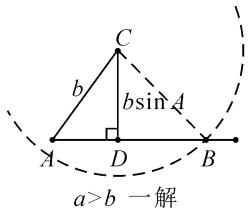
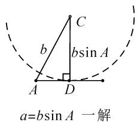
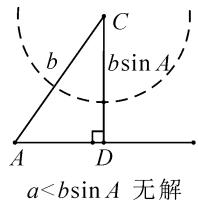
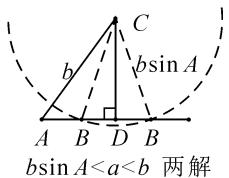
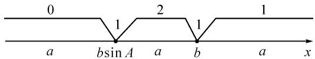
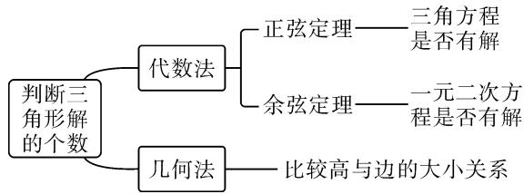
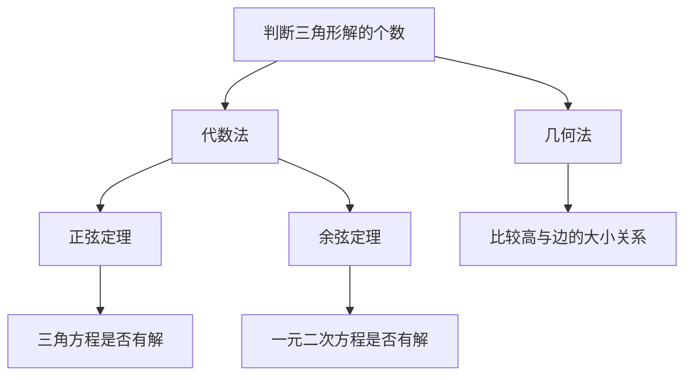
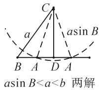

# 基于深度学习的高中数学解题策略探究\*

——判断三角形解的个数问题

●重庆市永川北山中学校高辉  
●重庆市永川区教育科学研究所 黄基云

摘要: 深度学习是指向主动性、对话性、协作性相统一的学习. 换言之, 深度学习首先要引发深度思考, 才能促进深度学习. 只有这样才能增强学生对知识的深度理解, 才能夯实基础、增强应用能力, 才能发展学生的核心素养, 才能实现“立德树人、服务选材、引导教学”的任务.

关键词: 深度学习核心素养; 解三角形

《普通高中数学课程标准（2017年版2020年修订）》对正、余弦定理要求是：“借助向量的运算，探索边长与角度的关系，掌握正弦定理、余弦定理；能用正、余弦定理解决简单的实际问题。”[1]于是新教材（2019人教A版)在内容设置上，“两边及其夹角”表示的面积公式未做介绍[2]，也没有了对三角形解的个数的探究.那么是不是就意味着这样的题型就没有研究的必要了呢？答案是否定的.解三角形一直以来就是高考的重点内容、高频考点，而要更好地理解并掌握正、余弦定理，就要探究三角形解的个数，才能有效引导学生深度理解，深度思考，由低阶思维到高阶思维，由浅层学习到深度学习.

# 1 问题呈现,触发思考

问题 已知下列各三角形中的两边及其一边所对的角,判断三角形是否有解;如果有解,请给出解答.

(1) $a = 10, b = 20, A = 60^{\circ}$ ;   
(2) $a=2\sqrt{3},b=6,A=30^{\circ}.$

本题的条件背景简单,在学习了正、余弦定理之后,学生都知道这是解三角形的基础题型(SSA),用正弦定理和余弦定理都可以,属于固定套路,固定模型,是低阶思维,浅层学习.但是此题先要确定是否有解,具备一定的开放性.那么怎样判断三角形是否有解呢?对于多数学生而言,肯定都是尝试着用正弦定理或者余弦定理去解答.

# 2 多解剖析,深度理解

方法 1: 用正弦定理计算出角 B 的正弦值, 如果它的值在区间 $(0,1]$ 上, 三角形就至少有一解; 如果它的值不在区间 $(0,1]$ 上, 三角形无解. 对于有解的情况, 可以根据三角形的性质(三角形的内角和为 $180^{\circ}$ 、大边对大角等)判断解的个数.

解析:(1)由正弦定理知, $\frac{a}{\sin A}=\frac{b}{\sin B}$ .

将 a=10, b=20, $A=60^{\circ}$ 代入，得 $\sin B=\sqrt{3}$ .

又 $B \in (0, \pi)$ , 则 $\sin B \in (0, 1]$ .

于是 $\sin B=\sqrt{3}$ 不成立，故此三角形无解.

(2) 同 (1) 可得, $\sin B = \frac{\sqrt{3}}{2}$ .

因为 $B \in (0, \pi)$ ，所以 $B = 60^{\circ}$ 或 $120^{\circ}$ .

当 $B=60^{\circ}$ 时，由 $A=30^{\circ}, A+B+C=180^{\circ}$ ，得 $C=90^{\circ}$ . 从而得 $c=2a=4\sqrt{3}$ .

当 $B=120^{\circ}$ 时，同理可得 $C=30^{\circ}, c=a=2\sqrt{3}$ .

故此三角形有两解.

点评:通过正弦定理的有效应用,发现此情境下导致三角形解的个数变化的根源是正弦函数,从而揭示数学本质,并找到知识间的联系,有效促进学生对正弦定理的深度理解,让学生的思维得到升华.在有效促进深度学习的同时,培养和提升学生的数学运算、直观想象等核心素养.

方法 2: 用余弦定理可以得到关于边 c 的一个一元二次方程, 通过判断方程有无正实数根来判断三角形是否有解.判断解的个数,也可以根据三角形的性质(两边之和大于第三边等)来检验是一解还是两解.

解析:(1)由余弦定理知, $a^{2}=b^{2}+c^{2}-2bc\cos A$ ,将a=10,b=20,A= $60^{\circ}$ 代入,并整理得

$$
c ^ {2} - 2 0 c + 3 0 0 = 0.
$$

因为 $\Delta=400-1\ 200=-800<0$ ，所以方程 $c^{2}-20c+300=0$ 无实数解。故三角形无解。

(2) 同 (1) 可得 $c^{2}-6\sqrt{3}c+24=0$ .

即 $(c - 2\sqrt{3})(c - 4\sqrt{3}) = 0.$ 所以 $c = 2\sqrt{3}$ 或 $4\sqrt{3}$ .

当 $c=2\sqrt{3}$ 时，有 $C=A=30^{\circ}$ ，则 $B=120^{\circ}$ .

当 $c = 4\sqrt{3}$ 时， $c^2 = a^2 + b^2$ ，则 $C = 90^\circ$ ，从而 $B = 30^\circ$ .

故三角形有两解.

点评:通过余弦定理的有效应用,发现此情境下导致三角形解的个数变化的根源是一元二次方程,在夯实余弦定理的同时,引发了深度理解,深度思考,有效促进了深度学习,培养学生数学运算、直观想象等核心素养.

以上两种方法实质上就是代数法,可以增强学生对正、余弦定理的理解,进一步积累两个定理应用的基本活动经验,培养和发展数学运算核心素养.同时也夯实了三角形的基本性质,对其应用有了更加深入的思考.著名数学家华罗庚先生曾有诗云:“几何与代数是统一体,永远联系,切莫分离!”那么用几何法能解决此题吗?答案是肯定的.下面我们用几何法作答.

方法 3: 已知三角形的两边 a, b 及其一边所对的角 A, 那么就可以先作出角 A 和确定角的一边 b, 三角形的第三个顶点 B 就自然在角的另一边上, 然后画出已知角所对边的最小值 (过点 C 作角的另一边的垂线段, D 为垂足), 比较已知边与此值 (或另一条已知边) 的大小关系来判断解的个数, 即以点 C 为圆心, a 为半径画圆, 圆与射线 AD 的交点 (非 A 点) 个数就是三角形解的个数, 如图 1. 然后再解三角形.

text_image

C
b
bsin A
A D B
a>b 一解

text_image

a=bsin A 一解

text_image

a<bsin A 无解

text_image

b sin A
A B D B
C
b
b sin A
b sin A < a < b 两解

图1

解析:(1)由 a=10, b=20, $A=60^{\circ}$ , 可得

$$
b \sin A = 1 0 \sqrt {3} > 1 0.
$$

所以 $a < b \sin A$ ，三角形无解。

(2) 由 $a = 2\sqrt{3}, b = 6, A = 30^{\circ}$ , 得 $b \sin A = 3$ .

所以 $b \sin A < a < b$ .

因此三角形有两解,如图1所示.

由勾股定理知, $BD=\sqrt{3}$ .

由 $AD=b\cos A=3\sqrt{3}$ ，得 $AB=c=2\sqrt{3}$ 或 $4\sqrt{3}$ .

当 $c=2\sqrt{3}$ 时， $C=A=30^{\circ}$ ，则 $B=120^{\circ}$ .

当 $c = 4\sqrt{3}$ 时， $c^2 = a^2 + b^2$ ，则 $C = 90^\circ$ ，故 $B = 30^\circ$ .

故三角形有两解.

为了更好地理解和记忆,引导学生联想实数的几何意义,可以利用“数轴”分解的优势,归纳此情境下三角形解的情况:以 a 为判断对象,以 $b \sin A$ , b 为数轴上的分界点,把数轴分成五个区域,于是解的个数对应于这些区域,简记为“01211” $^{[3]}$ .如图2所示.

text_image

0
1 2 1
a b sin A a b a x

图 2

进一步, 角 A 为直角或钝角时, 三角形解的个数该如何判断呢? 显然当 $a \leqslant b$ 时, 无解; 当 a > b 时, 有一解. 当然, 也可直接通过三角形的基本性质进行判断. 通过对几何法的解析, 渗透了数形结合思想, 培养和发展了学生的直观想象、数学抽象等核心素养.

点评:此类解三角形问题,代数法和几何法均可以解决,但关键在于已知的元素是两边及其一边所对的角,即 SSA.其解题模式是固定的,如图 3 所示.

flowchart

图3

# 3 拓展探究,深度思考

探究 1 抓住此类问题的关键,已知条件是 SSA 型,下面的变式就可以迎刃而解了.

变式 1 把前面的问题条件改为:

(1) $a=10,c=20,A=60^{\circ};$   
(2) $a=2\sqrt{3},c=6,A=30^{\circ}.$

探究 2 如果把其中一边设为变量, 即知道三角形的一边一角和解的个数, 能求出它的范围吗?

变式 2 在 $\triangle ABC$ 中, 角 A, B, C 所对的边分别为 a, b, c. 当 a = x, b = 2, $B = \frac{\pi}{4}$ 时, 三角形有两解, 求 x 的取值范围.

方法1:(用正弦定理)由 $\frac{a}{\sin A}=\frac{b}{\sin B}$ ，结合a=x,b=2,B= $\frac{\pi}{4}$ ，可得 $x=2\sqrt{2}\sin A,A\in\left(0,\frac{3\pi}{4}\right)$ .

设函数 $y = 2\sqrt{2}\sin A, A \in \left(0, \frac{3\pi}{4}\right)$ 和常函数 $y = x$ ，则三角形解的个数问题就转化为这两个函数图象的交点个数问题，易知当 $2 < x < 2\sqrt{2}$ 时，三角形有两解.

方法 2: (用余弦定理) 由 $b^{2}=a^{2}+c^{2}-2ac\cos B$ ，结合 a=x, b=2, $B=45^{\circ}$ ，可得 $c^{2}-\sqrt{2}xc+x^{2}-4=0$ .

把此方程看作是关于 c 的一元二次方程, 因此三角形解的个数问题就转化为一个一元二次方程正实数根的个数问题. 易知三角形要有两解, 此方程就要有两个正实数根.

所以 $\left\{\begin{aligned}x&>0,\\ x^{2}-4&>0,\end{aligned}\right.\Leftrightarrow\left\{\begin{aligned}x&>0,\\ x^{2}&>4,\end{aligned}\right.\Leftrightarrow2<x<2\sqrt{2}.$ $\Delta>0.$ $x^{2}<8.$

点评: 方法 1 可以结合几何法, 缩小角 A 的范围, 转化为求函数 $y = 2\sqrt{2} \sin A$ 在 $A \in \left(\frac{\pi}{4}, \frac{\pi}{2}\right) \cup \left(\frac{\pi}{2}, \frac{3\pi}{4}\right)$ 上的值域. 用代数法解决三角形解的个数问题, 可以渗透函数与方程思想、转化与化归思想, 积累学生数学基本活动经验, 培养和发展学生的数学抽象、数学运算等核心素养.

方法 3: (几何法) 结合图 4 知, 有两解的条件为 $a \sin B < b < a$ ,

因为 $a = x, b = 2, B = 45^{\circ}$ , 所以 $\frac{\sqrt{2}}{2} x < 2 < x$ , 即 $2 < x < 2\sqrt{2}$ .

  
图4

点评: 几何法在解决此类题型

上显然具有优越性.但是在实际操作过程中,几何法对于多数学生而言是比较困难的.故在教学中,一定要引导学生画图思考,通过直观观察,得出不等式,从而解决问题.

探究 3 如果已知三角形的一边一角,还能确定三角形哪些量的范围呢?

变式 3 在 $\triangle ABC$ 中, 设 A, B, C 的对边分别为 a, b, c, 已知 $C = \frac{2}{3}\pi, c = \sqrt{3}$ , 求 $\triangle ABC$ 周长的取值范围.

解析:由正弦定理,得 $\frac{a}{\sin A}=\frac{b}{\sin B}=\frac{c}{\sin C}=2.$

即 $a=2\sin A, b=2\sin B.$

所以， $\triangle ABC$ 的周长 $L = a + b + c = 2 (\sin A + \sin B) + \sqrt{3}$ . 又 $A + B + C = \pi, C = \frac{2}{3} \pi$ ，则

$$
L = 2 \left[ \sin A + \sin \left(\frac {\pi}{3} - A\right) \right] + \sqrt {3}.
$$

所以 $L=2\left(\sin A+\frac{\sqrt{3}}{2}\cos A-\frac{1}{2}\sin A\right)+\sqrt{3}=$ $2\left(\frac{1}{2}\sin A+\frac{\sqrt{3}}{2}\cos A\right)+\sqrt{3}=2\sin\left(A+\frac{\pi}{3}\right)+\sqrt{3}.$

由 $0 < B = \frac{\pi}{3} - A < \frac{\pi}{3}$ , 得 $0 < A < \frac{\pi}{3}$ , 则 $\frac{\pi}{3} < A + \frac{\pi}{3} < \frac{2\pi}{3}$ , 从而 $\sin \left(A + \frac{\pi}{3}\right) \in \left(\frac{\sqrt{3}}{2}, 1\right]$ .

故 $\triangle ABC$ 周长的取值范围是 $(2\sqrt{3},2+\sqrt{3}]$ .

点评:本题除了以上方法外,也可以用余弦定理结合基本不等式及三角形的性质求得,在这里不再赘述.不难发现,将解三角形的问题转化为求三角函数的值域或者基本不等式求最值问题,既体现了试题的基础性,又体现试题的综合性,符合高考命题的评价体系.此外还可以引导学生思考是否能求三角形面积的范围.再如,为什么已知的边和角是相对应的?其原因是如果边与角不对应缺乏研究的必要性.

# 4 题后反思,深度学习

数学是自然的,教师要营造一个善于思考的课堂文化氛围,让思维自然流淌,自然生长,才能激发学生的学习兴趣,体验数学学习的快乐.在新时代的教育背景下,题海战术要逐渐远离舞台,因为这不是新课程标准所倡导的,它是学生苦不堪言的源头.有效脱离题海战术,实现定“量”提“质”、减“量”提“质”就成了亟待解决的问题.一题多解,一题多变,常态化地对问题进行深度理解、深度思考,有效促进学生的深度学习就显得尤为重要.

# 参考文献：

[1]中华人民共和国教育部.普通高中数学课程标准(2017年版2020年修订)[S].北京:人民教育出版社,2020:26.

[2]章建跃,李增沪.普通高中教科书教师教学用书[M].北京:人民教育出版社,2019:47.

[3]魏立强,杨子林.三角形解的个数问题[J].高中数理化,2019(6):13.Z