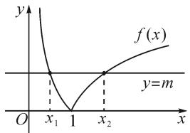
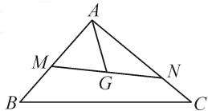
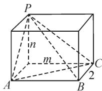

# 基本不等式与其他知识的交汇融合

# ● 江苏省西亭高级中学 丁建兵

本文中归纳总结了基本不等式与其他知识交汇融合的6种常见题型，并结合具体实例进行分析求解，以引导学生通过总结归纳强化和提升对相关知识、方法的综合运用能力.

# 1 常见题型一:基本不等式与函数的交汇

求解有关代数式的范围或最值时,往往需要适当构造函数,在数形结合的基础上,利用基本不等式或者基本不等式的变形结论加以灵活求解.

例 1 若方程 $\left|\ln x\right|=m$ 有两个不等的实根 $x_{1}$ 和 $x_{2}$ ，则 $x_{1}^{2}+x_{2}^{2}$ 的取值范围是（）.

A. $(1,+\infty)$

B. $(\sqrt{2},+\infty)$

C. $(2,+\infty)$

D. $(0,1)$

解析: 如图 1, 在同一坐标系中分别画出函数 $f(x)=\left|\ln x\right|$ 的图象与直线 y=m. 根据题意可知函数 $y=\left|\ln x\right|$ 的图象与直线 y=m 有两个不同的交点, 且交点的横坐标分别为 $x_{1}$ 和 $x_{2}$ , 不妨设 $x_{1} < x_{2}$ , 则必有 $0 < x_{1} < 1, x_{2} > 1$ .

text_image

y
f(x)
y=m
O x₁ 1 x₂ x

图 1

由 $m = |\ln x_1| = |\ln x_2|$ ，可得 $-\ln x_1 = \ln x_2$ ，所以 $\ln x_1 + \ln x_2 = 0$ ，即 $\ln (x_1x_2) = 0$ ，则 $x_{1}x_{2} = 1$ ，于是 $x_{2} = \frac{1}{x_{1}}$ 。

所以 $x_{1}^{2} + x_{2}^{2} = x_{1}^{2} + \frac{1}{x_{1}^{2}}\geqslant 2\sqrt{x_{1}^{2}\cdot\frac{1}{x_{1}^{2}}} = 2$ ，当且仅当 $x_{1}^{2} = \frac{1}{x_{1}^{2}}$ ，即 $x_{1} = 1$ 时不等式取等号.又 $0 <   x_{1} <   1$ 所以该不等式中的等号取不到，故可得 $x_{1}^{2} + x_{2}^{2} > 2.$

故选：C.

评注:本题求解的关键有三点.一是活用数形结合思想转化题设已知条件;二是根据方程的根,获得 $x_{1}x_{2}=1$ ;三是借助基本不等式,准确求解目标式的取值范围.

# 2 常见题型二:基本不等式与数列的交汇

以数列知识为背景而设置的求解最值问题,需要先根据等差数列、等比数列知识进行具体分析,以便适当转化目标式(写成一元代数式),再灵活运用基本不等式即可顺利获解.

例 2 已知递增等差数列 $\{a_{n}\}$ 中, $a_{1}a_{2} = -2$ , 则 $a_{3}$ 的().

A. 最大值为 -4

B. 最小值为 4

C. 最小值为 -4

D. 最大值为 4 或 -4

解析:设等差数列 $\{a_{n}\}$ 的公差为d，则由 $a_{1}a_{2}=-2$ 可得 $a_{1}(a_{1}+d)=-2$ ，变形得 $d=-a_{1}-\frac{2}{a_{1}}$ 。又由等差数列 $\{a_{n}\}$ 为递增数列，得d>0，即 $-a_{1}-\frac{2}{a_{1}}>0$ ，所以 $a_{1}<0$ 。

于是， $a_3 = a_1 + 2d = a_1 + 2\left(-a_1 - \frac{2}{a_1}\right) = (-a_1) +$ $(- \frac{4}{a_1})\geqslant 2\sqrt{(-a_1)\cdot\left(-\frac{4}{a_1}\right)} = 4$ ，当且仅当 $-a_{1} =$ $-\frac{4}{a_1}$ 且 $a_1 <   0$ ，即 $a_1 = -2$ 时不等式取等号，所以 $a_3$ 的最小值为4.

故选：B.

评注:本题看似简单,但实则考查了等差数列的通项公式、单调性与基本不等式在求解最值问题中的综合运用,且求最值时极易出错(没有关注基本不等式成立的前提条件).

# 3 常见题型三: 基本不等式与向量的交汇

处理平面向量中的有关最值问题时,往往需要在数形结合的基础上,先根据平面向量知识分析获得一个具体的结论,再利用该结论以及基本不等式灵活求解目标式的最值问题.

例 3 如图 2 所示, 已知点 G 是 $\triangle ABC$ 的重心, 过点 G 作直线分别交 AB, AC 两边于 M, N 两点, 且 $\overrightarrow{AM} = x\overrightarrow{AB}, \overrightarrow{AN} = y\overrightarrow{AC}$ , 则 $3x + y$ 的最小值为 \_\_\_\_.

  
图2

解析:根据重心的性质有 $\overrightarrow{AG}=\frac{1}{3}\overrightarrow{AB}+\frac{1}{3}\overrightarrow{AC}$ ，又由 $\overrightarrow{AM}=x\overrightarrow{AB},\overrightarrow{AN}=y\overrightarrow{AC}$ ，可知 $\overrightarrow{AB}=\frac{1}{x}\overrightarrow{AM},\overrightarrow{AC}=\frac{1}{y}\overrightarrow{AN}$ ，所以 $\overrightarrow{AG}=\frac{1}{3x}\overrightarrow{AM}+\frac{1}{3y}\overrightarrow{AN}(x>0,y>0)$ .

于是，根据 M, G, N 三点共线，可得 $\frac{1}{3y} + \frac{1}{3x} = 1$ ，从而 $3x + y = (3x + y)\left(\frac{1}{3y} + \frac{1}{3x}\right) = \frac{4}{3} + \frac{x}{y} + \frac{y}{3x} \geqslant \frac{4}{3} + 2\sqrt{\frac{x}{y} \cdot \frac{y}{3x}} = \frac{4 + 2\sqrt{3}}{3}$ ，当且仅当 $\frac{x}{y} = \frac{y}{3x}$ ，且 $\frac{1}{3y} + \frac{1}{3x} = 1$ ，即 $x = \frac{3 + \sqrt{3}}{9}$ ， $y = \frac{3 + 3\sqrt{3}}{9}$ 时，不等式取等号。故 $3x + y$ 的最小值为 $\frac{4 + 2\sqrt{3}}{3}$ 。

评注:本题主要考查了基底向量与向量的共线定理、性质在解题中的综合运用,同时也考查了利用基本不等式巧求目标代数式的最小值(需要借助“1”的特性灵活变形).

# 4 常见题型四: 基本不等式与直线和圆的交汇

处理直线和圆中的有关取值范围问题时,需要先根据直线与圆的位置关系进行分析获得一个具体的结论,再借助基本不等式或者基本不等式的推广性结论加以灵活求解.

例 4 设 $m, n \in R$ ，若直线 $(m+1)x + (n+1)y - 2 = 0$ 与圆 $(x-1)^{2} + (y-1)^{2} = 1$ 相切，则 $m+n$ 的取值范围是（）.

A. $\left[1-\sqrt{3},1+\sqrt{3}\right]$   
B. $(-∞,1-√3]∪[1+√3,+∞)$   
C. $\left[2-2\sqrt{2},2+2\sqrt{2}\right]$   
D. $(-∞,2-2\sqrt{2}]\cup[2+2\sqrt{2},+\infty)$

解析:由直线 $(m+1)x+(n+1)y-2=0$ 与圆 $(x-1)^{2}+(y-1)^{2}=1$ 相切,可得圆心 $(1,1)$ 到直线的距离 $d=\frac{|(m+1)+(n+1)-2|}{\sqrt{(m+1)^{2}+(n+1)^{2}}}=1$ ,化简得 $m+n+1=mn$ .又注意到 $mn\leqslant\left(\frac{m+n}{2}\right)^{2}$ ,所以可得

$$
m + n + 1 \leqslant \left(\frac {m + n}{2}\right) ^ {2}.
$$

解得 $m + n \leqslant 2 - 2\sqrt{2}$ , 或 $m + n \geqslant 2 + 2\sqrt{2}$ .

故选:D.

评注:本题根据直线与圆相切的充要条件得到等式 $m+n+1=mn$ 之后,灵活运用了基本不等式的推广性结论“一般地,对任意 $a,b\in R$ ,都有 $ab\leqslant\left(\frac{a+b}{2}\right)^{2}$ ”.

# 5 常见题型五: 基本不等式与立体几何的交汇

以立体几何为背景而设置的最值求解问题,需要先根据空间图形以及立体几何相关知识进行具体分析,进而灵活运用基本不等式即可顺利获解.

例 5 如图 3, 三棱锥 P-ABC 的四个顶点恰是长、宽、高分别是 m, 2, n 的长方体的顶点，若此三棱锥的体积为 2，则该三棱锥外接球体积的最小值为 \_\_\_\_.

解析:由长方体的结构特征可知三棱锥 P-ABC 的高为 n, 所以 $\frac{1}{3} \times \left( \frac{1}{2} \times 2m \right) \times n = 2$ , 所以 mn =

  
图3

6. 设三棱锥外接球的半径为 R，则根据外接球的直径是长方体的对角线可得 $2R = \sqrt{m^{2} + n^{2} + 4}$ ，所以 $2R \geqslant \sqrt{2mn + 4} = \sqrt{12 + 4} = 4$ ，即 $R \geqslant 2$ ，当且仅当 $m = n = \sqrt{6}$ 时不等式取等号。于是，该三棱锥外接球体积 $V = \frac{4}{3}\pi R^{3} \geqslant \frac{4}{3}\pi \times 2^{3} = \frac{32\pi}{3}$ 。故所求最小值为 $\frac{32\pi}{3}$ 。

评注:本题主要考查了三棱锥的体积公式、球的体积公式以及基本不等式在解题中的综合运用,有利于较好地培养学生的空间想象能力以及数形结合能力.

# 6 常见题型六: 基本不等式与解三角形的交汇

处理解三角形中的有关最值问题时,往往需要先根据正弦定理、余弦定理、面积公式以及相关三角函数知识进行综合分析,再灵活运用基本不等式即可顺利获解.

例 6 在 $\triangle ABC$ 中，内角 A, B, C 的对边分别是 a, b, c，已知 $2 \sin^{2}A + \sin^{2}B + \sqrt{2} \sin A \sin B = 3 \sin^{2}C$ ，则 $\sin C$ 的最大值为 \_\_\_\_.

分析: 由 $2 \sin^{2} A + \sin^{2} B + \sqrt{2} \sin A \sin B = 3 \sin^{2} C$ 及正弦定理, 可得 $2a^{2} + b^{2} + \sqrt{2} ab = 3c^{2}$ . 根据余弦定理可得 $\cos C = \frac{3a^{2} + 3b^{2} - 3c^{2}}{6ab}$ .

于是，得 $\cos C = \frac{3a^2 + 3b^2 - (2a^2 + b^2 + \sqrt{2}ab)}{6ab} = \frac{a^2 + 2b^2 - \sqrt{2}ab}{6ab} \geqslant \frac{2\sqrt{2}ab - \sqrt{2}ab}{6ab} = \frac{\sqrt{2}}{6}$ ，所以 $\cos C \geqslant \frac{\sqrt{2}}{6}$ ，当且仅当 $a = \sqrt{2}b$ 时不等式取等号。

因此 $\sin C = \sqrt{1 - \cos^2C} \leqslant \sqrt{1 - \left(\frac{\sqrt{2}}{6}\right)^2} = \frac{\sqrt{34}}{6}$ .

故 $\sin C$ 的最大值为 $\frac{\sqrt{34}}{6}$ .

评注:本题主要考查了正弦定理、余弦定理以及基本不等式在解题中的综合运用,有利于较好地培养学生数学运算、逻辑推理等核心素养.

总之,在处理有关范围或最值问题时,应适时创造有利条件,以便灵活运用基本不等式获得巧思妙解,进而提高解题的技能技巧,且学且悟且提升! Z