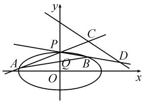

# 多题一解,培养运算素养

——齐次化在 2022 年高考圆锥曲线题中的应用

湖北省宜昌市葛洲坝中学 崔征  
湖北省宜昌市夷陵中学 夏咏芳

摘要: 圆锥曲线是高中解析几何的重要内容,这部分内容主要是用代数方法来研究几何图形的性质,对提高学生的数学抽象、逻辑推理、直观想象、数学运算等核心素养有很大帮助.值得注意的是在数学运算方面,不能仅仅停留在进行正确、有据、合理、简洁的运算上,还要力求做到运算技能和逻辑思维等的有机整合.在解决问题的过程中,要学会分析运算条件,选择运算方法.

关键词:高中数学核心素养;圆锥曲线;齐次化;数学运算

圆锥曲线的相关问题是高考数学考查的一个热点,这类问题的特点是计算量较大,平时的复习备考不仅要掌握常规方法和基本技能技巧,还要注意归纳总结,对于特定的问题,还要学习一些特定的方法.如果题目中出现两直线斜率之和或者之积的条件时,常常可以利用齐次化的方法大大降低计算量.接下来我们一起看看2022年的几道高考题是如何用齐次化的方法简化计算的.

例 1 （2022 年全国新高考Ⅰ卷第 21 题）已知点 A(2,1) 在双曲线 $C: \frac{x^{2}}{a^{2}} - \frac{y^{2}}{a^{2} - 1} = 1 (a > 1)$ 上，直线 l 交 C 于 P, Q 两点，直线 AP, AQ 的斜率之和为 0，求 l 的斜率.

分析:大家知道,解析几何问题求解中一般要把直线 l 和圆锥曲线的方程进行联立,联立消元后得到关于 x(或者 y) 的二次方程,这个二次方程的根就是直线和曲线的交点 P,Q 对应的横坐标(或者纵坐标).基于这个想法,我们如果适当整理圆锥曲线和直线方程的形式,使二者联立后得到一个关于 $\frac{y-1}{x-2}$ 的二次方程,那么这个二次方程的根 $\frac{y_{1}-1}{x_{1}-2}$ 和 $\frac{y_{2}-1}{x_{2}-2}$ 就可以认为是点 P,Q 分别与 A(2,1) 形成的直线 AP,AQ 的斜率了.

设 $P(x_{1},y_{1}),Q(x_{2},y_{2})$ ，则 $k_{1} = \frac{y_{1} - 1}{x_{1} - 2},k_{2} = \frac{y_{2} - 1}{x_{2} - 2}$ .由于预先知道了斜率的形式，所以可以把求出来的双曲线方程 $x^{2} - 2y^{2} = 2$ 的形式整理为

$$
[ (x - 2) + 2 ] ^ {2} - 2 [ (y - 1) + 1 ] ^ {2} = 2.
$$

经过分析,我们知道直线 l 不会经过 A(2,1),所以直线 l 的方程可以设为 $m(x-2)+n(y-1)=1$ . 直线的形式有点怪异,是有原因的. 其一是我们需要一个$\frac{y-1}{x-2}$ 的形式, 直线方程里才会有 y-1 和 x-2; 其二是直线 l 不经过 $A(2,1)$ , $m(x-2)+n(y-1)=1$ 的形式可以表示不过 $A(2,1)$ 的直线系.

解: 易得双曲线的方程为 $\frac{x^{2}}{2}-y^{2}=1$ . 设直线 l 的方程为 $m(x-2)+n(y-1)=1$ .

整理双曲线方程,得

$$
[ (x - 2) + 2 ] ^ {2} - 2 [ (y - 1) + 1 ] ^ {2} = 2,
$$

即 $(x-2)^{2}+4(x-2)-2(y-1)^{2}-4(y-1)=0.$

将双曲线与直线方程联立,构造齐次式得

$$
(x - 2) ^ {2} + 4 (x - 2) [ m (x - 2) + n (y - 1) ] - 2 \times
$$

$$
(y - 1) ^ {2} - 4 (y - 1) [ m (x - 2) + n (y - 1) ] = 0,
$$

两边同时除以 $(x - 2)^{2}$ ，可得

$$
(- 2 - 4 n) \left(\frac {y - 1}{x - 2}\right) ^ {2} + (4 n - 4 m) \frac {y - 1}{x - 2} + 1 + 4 m = 0.
$$

因为 $\frac{y-1}{x-2}$ 表示直线l和双曲线的交点与A(2,1)连线的斜率，不妨令 $k=\frac{y-1}{x-2}$ ，所以上式即为关于k的二次方程

$$
(- 2 - 4 n) k ^ {2} + (4 n - 4 m) k + 1 + 4 m = 0.
$$

根据韦达定理, 得 $k_{1} + k_{2} = \frac{4n - 4m}{2 + 4n}$ .

由题意 $k_{1}+k_{2}=0$ ，则 $\frac{4n-4m}{2+4n}=0$ 。

解得 n=m，代入直线 l，可得 l 的斜率为 -1。

点评:之所以称这种方法为为齐次化,就是联立方程的时候并没有像以往一样进行消元,而是在圆锥曲线方程的展开式中将一次项乘1,也就是乘 $m(x-2)+n(y-1)$ ,这样整个式子就构成了关于 $(y-1)$ 和 $(x-2)$ 的二次式,是后面两边同时除以 $(x-2)^{2}$ ,将式子化成关于斜率 $\frac{y-1}{x-2}$ 的二次式的必备步骤.

例 2 （2022 年北京卷第 19 题）已知椭圆 $E: \frac{x^{2}}{a^{2}} + \frac{y^{2}}{b^{2}} = 1 (a > b > 0)$ 的一个顶点为 A(0,1)，焦距为 $2\sqrt{3}$ .

(1)求椭圆 E 的方程；

(2) 过点 $P(-2,1)$ 作斜率为 k 的直线与椭圆 E 交于不同的两点 B, C, 直线 AB, AC 分别与 x 轴交于 M, N, 当 $|MN|=2$ 时, 求 k 的值.

解:(1)易知椭圆 E 的方程为 $\frac{x^{2}}{4} + y^{2} = 1$ .

(2) 设 $B(x_{1}, y_{1})$ , $C(x_{2}, y_{2})$ ，则直线 AB, AC 的斜率可以分别表示成 $t_{1} = \frac{y_{1} - 1}{x_{1}}$ , $t_{2} = \frac{y_{2} - 1}{x_{2}}$ .

设直线 BC 的方程为 $mx + n(y - 1) = 1$ ，又此直线过 $P(-2, 1)$ ，代入方程可得 $m = -\frac{1}{2}$ .

所以直线 $BC$ 的方程为 $-\frac{1}{2} x + n(y - 1) = 1.$

椭圆方程可变形为 $x^{2} + 4[(y - 1) + 1]^{2} = 4$ ，展开得 $x^{2} + 4(y - 1)^{2} + 8(y - 1) = 0$ ，齐次化，可得

$x^{2} + 4(y - 1)^{2} + 8(y - 1)\left[-\frac{1}{2} x + n(y - 1)\right] = 0,$ 两边同时除以 $x^2$ ，得

$$
1 + 4 \frac {(y - 1) ^ {2}}{x ^ {2}} - 4 \frac {y - 1}{x} + 8 n \frac {(y - 1) ^ {2}}{x ^ {2}} = 0.
$$

记 $t=\frac{y-1}{x}$ ，则有 $(8n+4)t^{2}-4t+1=0$ ，关于 t 的二次方程的两个根 $t_{1}, t_{2}$ 为直线 AB, AC 的斜率，于是有 $t_{1}+t_{2}=\frac{1}{2n+1}, t_{1}t_{2}=\frac{1}{8n+4}$ .

由 $\Delta = -32n > 0$ ，得 n < 0。

直线 $l_{AB}$ 方程为 $y=t_{1}x+1$ ，直线 $l_{AC}$ 方程为 $y=t_{2}x+1$ ，则两直线与 x 轴的交点分别为

$$
M \left(- \frac {1}{t _ {1}}, 0\right), N \left(- \frac {1}{t _ {2}}, 0\right).
$$

所以由 $|MN| = \left|\frac{1}{t_1} -\frac{1}{t_2}\right| = \left|\frac{t_2 - t_1}{t_1t_2}\right| = 2$ ，可得 $n = -\frac{1}{8}.$

将 $n=-\frac{1}{8}$ 代入直线 $-\frac{1}{2}x+n(y-1)=1$ ，可得所求的直线斜率 k=-4。

点评:该题第(2)问的主要线索是 $|MN|=2$ ，我们可以把 $|MN|$ 的长度用AB，AC的斜率表示出来，但凡碰到有斜率之和或者斜率之积，或者斜率之差，都可以用这种齐次化的方式来简化计算.

例 3 （2022 年浙江卷第 21 题）如图 1，已知椭圆 $\frac{x^{2}}{12} + y^{2} = 1$ ，设 A, B 是椭圆上异于 $P(0,1)$ 的两点，且

点 $Q\left(0,\frac{1}{2}\right)$ 在线段 AB 上，
直线 PA, PB 分别交直线 $y=-\frac{1}{2}x+3$ 于 C, D 两点.

(1) 求点 P 到椭圆上点的距离的最大值；

(2) 求 $\left| CD \right|$ 的最小值.

text_image

y
P
C
A
Q
B
D
O
x

图1

解:(1)利用三角换元,设椭圆上任意一点M $(2\sqrt{3}\cos\alpha,\sin\alpha)$ ,则 $|PM|^{2}=-11\sin^{2}\alpha-2\sin\alpha+13.$

易知 $|PM|$ 的最大值为 $\frac{12\sqrt{11}}{11}$ ，即为所求.

(2)设直线 $AP:y = k_{1}x + 1$ ，直线 $BP:y = k_{2}x+$ 1，则直线 $AP$ 和 $BP$ 与直线 $y = -\frac{1}{2} x + 3$ 的交点横坐标分别为 $x_{c} = \frac{4}{2k_{1} + 1},x_{D} = \frac{4}{2k_{2} + 1}$ ，可得

$$
\left| C D \right| = \sqrt {1 + k ^ {2}} \left| x _ {C} - x _ {D} \right|
$$

$$
= 4 \sqrt {5} \left| \frac {k _ {2} - k _ {1}}{4 k _ {1} k _ {2} + 2 (k _ {1} + k _ {2}) + 1} \right|. \tag {①}
$$

设直线 $AB$ 的方程为 $mx + n(y - 1) = 1$ ，则将 $Q\left(0,\frac{1}{2}\right)$ 代入可知 $n = -2$

联立 $\left\{\begin{aligned}mx-2(y-1)=1,\\ x^{2}+12[(y-1)+1]^{2}=1,\end{aligned}\right.$ 将椭圆方程齐次化后，令 $k=\frac{y-1}{x}$ ，得 $36k^{2}-24mk-1=0$ 。

所以 $\Delta >0, k_{1} + k_{2} = \frac{2m}{3}, k_{1}k_{2} = -\frac{1}{36}.$

由式①可得 $|CD| = 3\sqrt{5}\frac{\sqrt{4m^2 + 1}}{2 + 3m}$ ，易求出 $|CD|$ 的最小值为 $\frac{6\sqrt{5}}{5}$ .

其实不仅在 2022 年的高考中,齐次化能发挥重大作用,在往年的高考中不少圆锥曲线问题都可以用齐次化大大地简化运算,比如 2020 年山东卷中解析几何大题也可以用齐次化法简化计算,读者朋友不妨尝试一下.关于齐次化,大家还需要注意一下几点:

(1)如果圆锥曲线的题目里出现斜率之和或者斜率之积,或者斜率之差等条件,那么就可以尝试用齐次化来解决.

(2)如果直线经过的点在曲线外,曲线与直线联立后往往不仅会剩下一次项,还会剩下常数项,这个时候也可以秉承齐次化的思想加以处理,将1平方就可以构造出二次项了.

(3)齐次化的方法不仅可以解决与椭圆有关的定点定值问题,同样也适用于双曲线和抛物线,在这里就不做过多的赘述了.Z