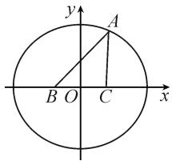
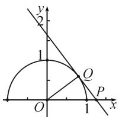

# 拓展思维方向,总结解题规律

——对一道三角形面积题的探究

●安徽省铜陵市第三中学 丁学智

三角形面积问题中经常同时兼备三角形的“边”与“角”这两类不同的要素，而涉及三角形面积的最值或取值范围问题，又进一步融合三角形中“动点”与“静点”之间的对比与变化，构建相应的定值与最值、取值范围等变量之间的关系，构成一幅优美的图片，倍受各方关注，一直是高考数学命题的一个热点题型.

# 1 问题呈现

问题（安徽省合肥市2022年高三年级第二次教学质量检测数学理科试卷第15题）已知 $\triangle ABC$ 的内角 $A, B, C$ 的对边分别为 $a, b, c$ ，若 $b + 2\cos B + b\cos A = 6, a = 2$ ，则 $\triangle ABC$ 面积的取值范围为 \_\_\_\_.

此题以简洁的条件给出三角形中对应边的长度，以及对应边与角之间的关系，进而求解三角形面积的取值范围。正确挖掘题目内涵，构建三角形中的定量、变量等要素间的关系，以及确定三角形的定点、动点等元素，合理推理分析，综合数学运算、直观想象等思维方式来分析、处理与应用。

# 2 问题破解

方法 1: 三角形面积公式 + 基本不等式法.

解析:由 $b+2\cos B+b\cos A=6, a=2$ ，结合余弦定理，可得 $b+a\times\frac{a^{2}+c^{2}-b^{2}}{2ac}+b\times\frac{b^{2}+c^{2}-a^{2}}{2bc}=6$ ，整理可得 $b+c=6$ 。

结合余弦定理，可得 $4 = b^{2} + c^{2} - 2bc\cos A = (b + c)^{2} - 2bc - 2bc\cos A = 36 - 2bc - 2bc\cos A.$

于是 $\cos A = \frac{16 - bc}{bc}$ , 从而 $\sin A = \sqrt{1 - \cos^2 A} = \sqrt{1 - \left(\frac{16 - bc}{bc}\right)^2} = \frac{\sqrt{32bc - 256}}{bc}$ .

所以， $\triangle ABC$ 的面积 $S = \frac{1}{2} bc \sin A = \frac{1}{2} bc \times$

$$
\frac {\sqrt {3 2 b c - 2 5 6}}{b c} = \frac {\sqrt {3 2 b c - 2 5 6}}{2} \leqslant \frac {\sqrt {3 2 \times \left(\frac {b + c}{2}\right) ^ {2} - 2 5 6}}{2} =
$$

$\frac{\sqrt{32\times3^{2}-256}}{2}=2\sqrt{2}$ ，当且仅当b=c=3时等号成立.

又因为 $\triangle ABC$ 的面积 $S$ 可无限接近于0，无最小值，所以 $\triangle ABC$ 面积的取值范围为 $(0,2\sqrt{2} ]$

故填答案： $(0,2\sqrt{2}]$ .

解后反思:根据题目条件进行边与角的相关转化,进而得以确定两边和的关系式,再利用余弦定理确定相关角的余弦值,并利用同角三角函数基本关系式确定对应角的正弦值,由此构建满足三角形面积公式的条件,在此基础上构建三角形面积的表达式,最后借助基本不等式来确定最值即可.综合解三角形、三角函数以及基本不等式等相关知识,是本题的创设本质,也是破解问题最基本的思维方法.

方法 2: 椭圆轨迹法.

解析:由 $b+2\cos B+b\cos A=6, a=2$ ，结合余弦定理，可得 $b+a\times\frac{a^{2}+c^{2}-b^{2}}{2ac}+b\times\frac{b^{2}+c^{2}-a^{2}}{2bc}=6$ ，整理可得 $b+c=6$ 。

由椭圆定义可知点 A 在以点 B, C 为焦点的椭圆（不包括三点共线的情况）上运动，如图 1 所示，且椭圆的焦距为 2，长轴长为 6，可得椭圆的短半轴长为 $2\sqrt{2}$ .

根据图形可知, 当点 A 为椭

text_image

y
A
B O C x

图1

圆短轴的端点时， $\triangle ABC$ 面积取得最大值 $\frac{1}{2} \times 2 \times 2\sqrt{2} = 2\sqrt{2}$ ，此时 $b = c = 3$ 。

又 $\triangle ABC$ 面积可无限接近于0,无最小值,所以 $\triangle ABC$ 面积的取值范围为 $(0,2\sqrt{2}]$ .

解后反思:根据题目条件借助余弦定理将三角形中的角化边,从而确定两边和为定值的条件,结合轨迹意识以及椭圆的定义进行数学建模,进而直观形象地确定三角形面积的变化情况,达到解决问题的目的.

借助椭圆定义加以数学建模,可以更加直观地解决此类与动点有关的轨迹问题.

方法 3: 海伦公式 + 二次函数法.

解析: 由 $b+2\cos B+b\cos A=6, a=2$ ，可得 $b+a\cos B+b\cos A=6$ .

结合射影定理 $a \cos B + b \cos A = c$ ，得 $b + c = 6$ 。

于是， $\triangle ABC$ 的半周长 $p = \frac{a + b + c}{2} = 4.$

结合三角形的性质, 可知 $c + a = c + 2 > b = 6 - c$ , c - a = c - 2 < b = 6 - c, 可得 2 < c < 4.

$$
\begin{array}{r l} & {\text {设} \triangle A B C \text {的面积为} S, \text {则根据海伦公式,可得} S =} \\ & {\sqrt {p (p - a) (p - b) (p - c)} = \sqrt {4 \times 2 (4 - b) (4 - c)} =} \\ & {\sqrt {8 (c - 2) (4 - c)} = \sqrt {8 [ - (c - 3) ^ {2} + 1 ]}.} \end{array}
$$

所以当 c=3 时， $S_{\max}=2\sqrt{2}$ ，且 $0<S\leqslant2\sqrt{2}$ .

所以 $\triangle ABC$ 面积的取值范围为 $(0,2\sqrt{2}]$ .

解后反思:根据题目条件进行常数代换,借助射影定理加以转化,确定两边和为定值的条件,利用三角形的基本性质确定相关边的取值范围,结合三角形面积的海伦公式构建对应的关系式,通过二次函数的图象与性质确定三角形面积的变化情况,达到解决问题的目的.利用海伦公式可以合理构建与三角形的边有关的三角形面积的表达式,将相应的应用问题转化为函数问题来处理.

# 3 变式拓展

探究 1: 保留解三角形问题的创新情境, 改变条件中边与角的关系式, 从另一个层面来构建相应的关系式, 拓展解题的技巧方法, 进而综合应用, 得到以下对应的变式问题.

变式 1 已知 $\triangle ABC$ 的内角 A, B, C 的对边分别为 a, b, c，若 $2b = 2\cos B + b\cos A, a = 2$ ，则 $\triangle ABC$ 面积的最大值为 \_\_\_\_.

解: 斜率的几何意义法.

由 $2b=2\cos B+b\cos A, a=2$ ，得

$$
2 b = a \cos B + b \cos A.
$$

结合射影定理 $a \cos B + b \cos A = c$ ，可得 c = 2b。

结合余弦定理, 可得 $4 = b^{2} + c^{2} - 2bc \cos A = 5b^{2} - 4b^{2} \cos A$ , 即 $b^{2} = \frac{4}{5 - 4 \cos A} = \frac{1}{\frac{5}{4} - \cos A}$ .

由三角形的面积公式, 可得 $S = \frac{1}{2} bc \sin A =$

$$
b ^ {2} \sin A = \frac {\sin A}{\frac {5}{4} - \cos A} = - \frac {\sin A - 0}{\cos A - \frac {5}{4}}.
$$

令 $m=\frac{\sin A-0}{\cos A-\frac{5}{4}}$ ，因为 $A\in(0,\pi)$ ，所以 m 可看作单位圆上半圆上的点 $Q(\cos A, \sin A)$ 与定点 $P\left(\frac{5}{4},0\right)$ 连线的斜率。结合图形直观可知对应的连线 PQ 与半圆相切时 m 取得最小值。

如图 2 所示, 根据勾股定理有 $\left|PQ\right|=\sqrt{\left(\frac{5}{4}\right)^{2}-1^{2}}=\frac{3}{4}$ ，此时 m 的最小值为 $-\frac{4}{3}$ . 而当 m 取得最小值时，对应的三角形面积 S 取得最大值，所以 $\triangle ABC$ 面积的最大值为 $\frac{4}{3}$ .

text_image

y
2
1
Q
O
1
x
P

图2

故填答案: $\frac{4}{3}$ .

解后反思:根据变式条件,同样也可以利用“三角形面积公式+基本不等式法”来处理(这里不加以展示,可以结合原问题的方法1加以分析),也可以通过“海伦公式+基本不等式法”来解决,而综合条件拓展出“斜率的几何意义法”,也是解决此类特殊结构特征最值问题的一种直观技巧.

# 4 教学启示

# 4.1 面积应用,最值综合

借助三角形面积这一基本要素,可以巧妙通过三角形面积的夹角公式、高线公式以及海伦公式等的应用,合理构建三角形中相关边、角等元素之间的关系,结合三角函数、二次函数、基本不等式等相关知识来综合与应用;也可以巧妙构建三角形中动顶点的轨迹,结合一些特殊的曲线等来化归与转化,直观想象,数形结合,从而实现最值或取值范围等的确定与求解.

# 4.2 一题多解,一题多得

借助问题的“一题多解”，正确归纳解决相关类型问题的基本思维方式，总结规律，形成知识体系与思维习惯。在此基础上，进行“一题多变”“多题一解”等方面的尝试，真正实现以“一题”带动“一片”，拓展思维应用，提升解题技能，全面提升能力，摆脱“题海战术”。Z