讲题比赛一等奖获奖论文之十四：

# 数形结合变视角 合理分类定乾坤

——2022年全国高考乙卷导数压轴题解法研究

●杭州师大附属阿克苏市高级中学 易明交 陈晓宁 刘香杰

# 1 试题呈现

(2022年全国高考乙卷第21题)已知函数 $f(x)=\ln(1+x)+axe^{-x}$ .

(1) 当 a=1 时, 求曲线 $y=f(x)$ 在点 $(0,f(0))$ 处的切线方程;  
(2) 若 $f(x)$ 在区间 $(-1,0)$ ， $(0,+\infty)$ 各恰有一个零点，求 a 的取值范围.

本题第(1)问考查函数在某点处的切线问题,利用导数的几何意义就可以解决.第(2)问考查的是函数在两个区间上的零点问题,解决函数零点问题的一种方法就是通过研究函数的单调性观察图象与x轴交点的个数,另一种是通过分离参数后探究两个函数图象交点的个数.

分析:(1)先求 $f'(x)$ , $f'(0)$ 即为曲线在点 $(0, f(0))$ 处切线的斜率, 进而求出切线方程.

(2) 求导, 对 a 进行分类讨论, 并对 $x \in (-1, 0)$ , $x \in (0, +\infty)$ 分别研究.

若 $f(x)$ 在区间 $(-1,0)$ ， $(0,+\infty)$ 各恰有一个零点，即分别研究 $f(x)$ 在 $(-1,0)$ 和 $(0,+\infty)$ 上零点的情况，合理地对参数 a 进行分类。因为 $f'(x)=\frac{\mathrm{e}^{x}+a(1-x^{2})}{(1+x)\mathrm{e}^{x}}$ 的分母大于 0，所以当 $x\in(-1,0)$ 时，a>0，分子就大于 0，导数就会大于 0。又因为 0 把定义域分成了两部分，在 x=0 时 $f'(0)=a+1$ ，所以要考虑 $a+1$ 的正负，于是分 $a>0,-1\leqslant a\leqslant0,a<-1$ 三种情况，分别对 $f(x)$ 在 $(-1,0)$ ， $(0,+\infty)$ 上的零点情况进行分析。证明零点存在有两个思路，一是利用零点存在定理，二是通过画出相关函数的图象，观察交点是否存在。函数 $f(x)=\ln(1+x)+ax\mathrm{e}^{-x}$ 在区间 $(-1,0)$ ， $(0,+\infty)$ 零点分布情况相应的思维导图如图 1 所示。

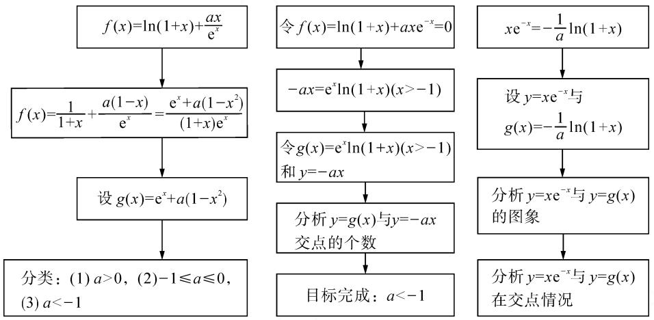

flowchart

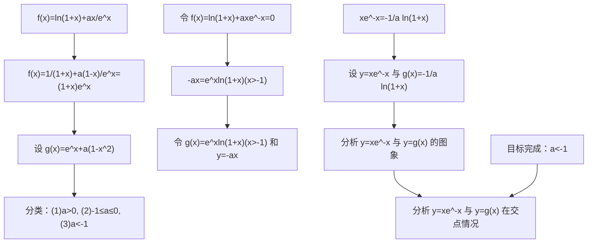

图1

# 2 试题解析

# 2.1 第(1)问详解

$f(x)$ 的定义域为 $(-1, +\infty)$ ，当 a = 1 时， $f(x) = \ln(1 + x) + \frac{x}{\mathrm{e}^{x}}$ ， $f(0) = 0$ ，则切点为 $(0, 0)$ 。由 $f'(x) = \frac{1}{1 + x} + \frac{1 - x}{\mathrm{e}^{x}}$ ，得 $f'(0) = 2$ ，从而切线斜率为 2，所以曲线 $y = f(x)$ 在点 $(0, f(0))$ 处的切线方程为 y = 2x。

# 2.2 第(2)问详解

思路一:对参数合理分类,分步研究函数的零点情况.

解法 1: 因为 $f(x)=\ln(1+x)+axe^{-x}$ ，所以

$$
f ^ {\prime} (x) = \frac {\mathrm{e} ^ {x} + a \left(1 - x ^ {2}\right)}{(1 + x) \mathrm{e} ^ {x}}.
$$

设 $g(x)=\mathrm{e}^{x}+a(1-x^{2})$ ，则 $g(0)=a+1$ .

①若 $a > 0$ ，当 $x \in (-1,0)$ 时， $g(x) = \mathrm{e}^x + a(1 - x^2) > 0$ ，即 $f'(x) > 0$ ，所以 $f(x)$ 在 $(-1,0)$ 上单调递增， $f(x) < f(0) = 0$ 。故 $f(x)$ 在 $(-1,0)$ 上没有零点，

与题意矛盾.

②若 $-1 \leqslant a \leqslant 0$ ，当 $x \in (0, +\infty)$ 时， $g'(x) = e^x - 2ax > 0$ ，则 $g(x)$ 在 $(0, +\infty)$ 上单调递增，从而 $g(x) > g(0) = a + 1 \geqslant 0$ ，即 $f'(x) > 0$ 。所以 $f(x)$ 在 $(0, +\infty)$ 上单调递增， $f(x) > f(0) = 0$ 。故 $f(x)$ 在 $(0, +\infty)$ 上没有零点，与题意矛盾。  
③若 $a < -1$ ，当 $x \in (0, +\infty), g'(x) = \mathrm{e}^x - 2ax > 0$ ，则 $g(x)$ 在 $(0, +\infty)$ 上单调递增；又因为 $g(0) = a + 1 < 0, g(1) = \mathrm{e} > 0$ ，所以存在 $x_0 \in (0, 1)$ ，使 $g(x_0) = 0$ ，即 $f'(x_0) = 0$ 。当 $x \in (0, x_0)$ 时， $f'(x) < 0$ 则 $f(x)$ 单调递减；当 $x \in (x_0, +\infty)$ 时， $f'(x) > 0$ ，则 $f(x)$ 单调递增。所以，当 $x \in (0, x_0)$ 时， $f(x) < f(0) = 0$ ，且 $f(x_0) < f(0) = 0$ ；当 $x \in (x_0, +\infty), \mathrm{e}^{-a} > 1 > x_0, f(\mathrm{e}^{-a}) = \ln(1 + \mathrm{e}^{-a}) + ae^{-a}\mathrm{e}^{-e^{-a}} > 0$ 。所以 $f(x)$ 在 $(x_0, +\infty)$ 上有唯一零点，在 $(0, x_0)$ 上没有零点，从而 $f(x)$ 在 $(0, +\infty)$ 上有唯一零点。

若 $a < -1$ ，当 $x \in (-1,0)$ 时， $g(x) = \mathrm{e}^x + a(1 - x^2), g'(x) = \mathrm{e}^x - 2ax.$

设 $h(x) = g'(x) = \mathrm{e}^x - 2ax$ ，则 $h'(x) = \mathrm{e}^x - 2a > 0$ ，所以 $g'(x)$ 在 $(-1,0)$ 单调递增。又因为 $g'(-1) = \frac{1}{\mathrm{e}} + 2a < 0, g'(0) = 1 > 0$ ，所以存在 $x_1 \in (-1,0)$ ，使 $g'(x_1) = 0$ 。当 $x \in (-1,x_1), g'(x) < 0, g(x)$ 单调递减； $x \in (x_1,0), g'(x) > 0, g(x)$ 单调递增。故 $g(x_1) < g(0) = 1 + a < 0$ ，又 $g(-1) = \mathrm{e}^{-1} > 0$ ，所以存在 $x_2 \in (-1,x_1)$ ，使 $g(x_2) = 0$ ，即 $f'(x_2) = 0$ 。当 $x \in (-1,x_2), f(x)$ 单调递增，当 $x \in (x_2,0), f(x)$ 单调递减，又因为 $f(0) = 0$ ，所以当 $x \in (x_2,0)$ 时， $f(x)>0, f(x_{2})>0$ ，从而 $f(x)$ 在 $(x_{2},0)$ 上无零点；当 $x\to-1$ 时， $\ln(1+x)\to-\infty$ ， $axe^{-x}\to-ae$ ，所以 $f(x)\to-\infty$ ，则 $f(x)$ 在 $(-1,x_{2})$ 上存在唯一的零点。所以， $f(x)$ 在 $(-1,0)$ 上存在唯一零点。如图2所示。

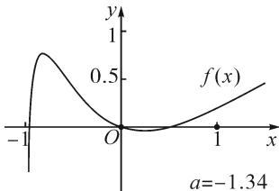

line

| x    | f(x)  |
| ---- | ----- |
| -1   | 0     |
| 0    | 0     |
| 1    | 0.5   |

图2

综上所述，a 的取值范围为 $(-∞, -1)$ .

思路二:利用参变半分离,研究图象的切线与直线之间的位置关系,确定零点个数.

解法 2: 由 $f(x)=\ln(1+x)+ax\mathrm{e}^{-x}=0$ ，得 $-ax=\mathrm{e}^{x}\ln(1+x)(x>-1)$ .

令 $g(x)=\mathrm{e}^{x}\ln(1+x)(x>-1)$ ，则 $g'(x)=\mathrm{e}^{x}\left[\ln(1+x)+\frac{1}{x+1}\right]$ .

令 $h(x)=\ln(1+x)+\frac{1}{x+1}(x>-1)$ ，则 $h'(x)=\frac{1}{1+x}-\frac{1}{(1+x)^{2}}=\frac{x}{(1+x)^{2}}$ .

令 $h'(x)=0$ ，得 x=0。当 $x\in(-1,0)$ 时， $h'(x)<0$ ；当 $x\in(0,+\infty)$ 时， $h'(x)>0$ 。

所以 $h(x)_{\min}=h(0)=1$ ，从而 $h(x)\geqslant1$ 在区间 $(-1,+\infty)$ 上恒成立.

于是 $g'(x)=\mathrm{e}^{x}\left[\ln(1+x)+\frac{1}{x+1}\right]>0$ 在区间 $(-1,+\infty)$ 上恒成立.

所以 $g(x)$ 在 $(-1, +\infty)$ 上单调递增. 又 $g(0) = 0$ , 且 $g'(0) = 1$ , 则 $g(x)$ 在 x = 0 处的切线方程为 y = x.

因为 $f(x)$ 在区间 $(-1,0)$ ， $(0,+\infty)$ 各恰有一个零点，也就是说 $g(x)$ 与 y=-ax 在区间 $(-1,0)$ ， $(0,+\infty)$ 各恰有一个交点，所以只需要 -a>1，即 a<-1。（如 a=-1 或 -2 时，如图 3,4 所示）.

所以，a 的取值范围为 $(-∞, -1)$ .

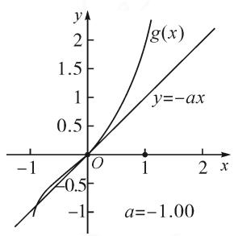

line

| x    | g(x)  | y=-ax |
| ---- | ----- | ----- |
| -1   | -1.00 | -1.00 |
| 0    | 0.00  | 0.00  |
| 1    | 1.50  | 1.50  |
| 2    | 3.00  | 3.00  |

图3

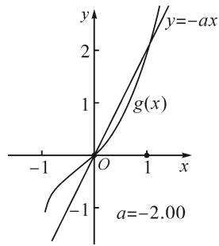

line

| x    | y=-ax | g(x) |
| ---- | ----- | ---- |
| -1   | -1    | 0    |
| 0    | 0     | 0    |
| 1    | 2     | 0    |

图 4

点评: 解法 2 的关键是分离参数构造出两个函数, 分析 $g(x)$ 的单调性, 找出 $g(x)$ 在点 $(0,0)$ 处的切线, 从而只需直线 y = -ax 的斜率大于 1 才能使直线与函数 $g(x)$ 图象有两个交点.

思路三: 利用参变全分离, 准确作出函数的图象, 然后上下移动直线, 观察直线与函数交点个数即可.

解法 3: 令 $f(x)=\ln(x+1)+ax\mathrm{e}^{-x}=0$ ，则 $a=\frac{-\mathrm{e}^{x}\ln(x+1)}{x}(x>-1$ 且 $x\neq0)$ .

令 $g(x) = \frac{-\mathrm{e}^x\ln(1 + x)}{x}$ , 则

$$
g ^ {\prime} (x) = - \frac {\mathrm{e} ^ {x}}{x ^ {2} (1 + x)} [ x + (x ^ {2} - 1) \ln (x + 1) ].
$$

令 $h(x)=(x^{2}-1)\ln(x+1)+x$ ，则 $h'(x)=x[2\ln(x+1)+1]$ .

当 x>0 时， $h'(x)>0$ ，则 $h(x)$ 在 $(0,+\infty)$ 单调递增，所以 $h(x)>h(0)=0$ ，从而 $g'(x)<0$ ，故 $g(x)$ 在 $(0,+\infty)$ 单调递减.

又 $\lim_{x\to 0}g(x) = \lim_{x\to 0}\left[-\left(\frac{\mathrm{e}^x}{x + 1} +\mathrm{e}^x\ln (x + 1)\right)\right] = -1.$

所以 a<-1 时，在 $(0,+\infty)$ 上 y=a 与 $y=g(x)$ 的图象只有一个交点，因此 $f(x)$ 在区间 $(0,+\infty)$ 恰有一个零点.

当-1<x<0时，令 $h'(x_0)=0$ ，则 $x_0=\frac{1-\sqrt{\mathrm{e}}}{\sqrt{\mathrm{e}}}$ 。于是，当-1<x<x\_0时， $h'(x)>0,h(x)$ 单调递增；当 $x_0<x<0$ 时， $h'(x)<0,h(x)$ 单调递减。

又因为 $h(0) = 0$ ，所以 $h(x_0) > 0.$ 而 $h(\frac{1}{\mathrm{e}} -1) < 0$ ，则在 $(-1,x_0)$ 上存在 $x_{1}$ ，使 $h(x_{1}) = 0.$ 所以当 $x\in (-1,x_1),h(x) < 0$ ，即 $g^{\prime}(x) > 0$ ；当 $x\in (x_1,0)$ $h(x) > 0$ ，即 $g^{\prime}(x) < 0.$

所以 $g(x)$ 在 $(-1, x_{1})$ 单调递增，在 $(x_{1}, 0)$ 单调递减，从而 $g(x)_{\max} = g(x_{1})$ .

又 $x \to -1$ 时， $g(x) \to -\infty$ ，且有

$$
\lim _ {x \rightarrow 0} g (x) = \lim _ {x \rightarrow 0} \left[ - \left(\frac {\mathrm{e} ^ {x}}{x + 1} + \mathrm{e} ^ {x} \ln (x + 1)\right)\right] = - 1.
$$

所以只有 a<-1 时，在 $(-1,0)$ 上 y=a 与 $y=g(x)$ 的图象只有一个交点，因此 $f(x)$ 在区间 $(-1,0)$ 恰有一个零点。（如 a=-1 或 -2 时，如图 5,6 所示）.

综上所述，a 的取值范围为 $(-∞, -1)$ .

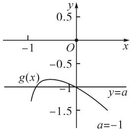

line

| x | y (a=-1) | y (y=a) |
|---|---|---|
| -1 | -1.5 | 0 |
| 0 | -0.5 | 0 |
| 1 | -1.5 | 0 |

图 5

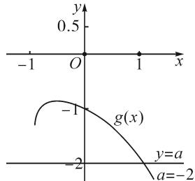

line

| x | y |
|---|---|
| -1 | 0.5 |
| 0 | 0 |
| 1 | 0 |
| -2 | -2 |
| 2 | -1 |

图6

思路四: 对函数解析式合理变形, 零点不发生变化.

解法 4: 对 $f(x)=\ln(1+x)+axe^{-x}$ 两边同乘 $e^{x}$ ，得 $\mathrm{e}^{x}f(x)=\mathrm{e}^{x}\ln(x+1)+ax$ 。令 $g(x)=\mathrm{e}^{x}f(x)$ ，即 $g(x)=\mathrm{e}^{x}\ln(x+1)+ax(x>-1)$ ，则 $g(0)=0$ ，且

$$
g ^ {\prime} (x) = \mathrm{e} ^ {x} \left[ \ln (x + 1) + \frac {1}{x + 1} \right] + a.
$$

设 $F(x) = \ln (x + 1) + \frac{1}{x + 1}$ ，则 $F'(x) = \frac{1}{x + 1} - \frac{1}{(x + 1)^2} = \frac{x}{(x + 1)^2}$ ，所以 $F(x)$ 在 $(0, +\infty)$ 单调递增.

若 $a \geqslant -1$ 时，则 $x \in (0, +\infty)$ 时， $g'(x) = \mathrm{e}^x \cdot \left[\ln(x + 1) + \frac{1}{x + 1}\right] + a \geqslant \mathrm{e}^x \left[\ln(x + 1) + \frac{1}{x + 1}\right] - 1 > \mathrm{e}^x - 1 > 0.$ 于是 $g(x)$ 在 $(0, +\infty)$ 单调递增， $g(x) > g(0) = 0$ ，这与 $g(x)$ 在 $(0, +\infty)$ 上有一个零点矛盾.

若 a<-1 时，令 $h(x)=\ln(x+1)+\frac{2}{x+1}-\frac{1}{(1+x)^{2}}$ ，则

$$
g ^ {\prime \prime} (x) = \mathrm{e} ^ {x} \left[ \ln (x + 1) + \frac {2}{x + 1} - \frac {1}{(1 + x) ^ {2}} \right] = \mathrm{e} ^ {x} h (x),
$$

$$
h ^ {\prime} (x) = \frac {1}{x + 1} - \frac {2}{(1 + x) ^ {2}} + \frac {2}{(1 + x) ^ {3}} = \frac {x ^ {2} + 1}{(1 + x) ^ {3}} > 0.
$$

于是 $h(x)$ 在 $(-1, +\infty)$ 上单调递增. 又 $h\left(-\frac{1}{2}\right) = -\ln 2 < 0, h(0) > 0$ ，所以存在 $x_0 \in (-\frac{1}{2}, 0)$ ，使得 $h(x_0) = 0$ . 当 $-1 < x < x_0$ 时， $h(x) < 0, g'(x)$ 单调递减；当 $x > x_0$ 时， $h(x) > 0, g'(x)$ 单调递增. 于是有 $g'(x_0) < g'(0) = a + 1 < 0, g'(-a) > e^{-a} + a > 1 - a + a = 1 > 0$ .

又 $x \to -1$ 时， $g'(x) \to +\infty$ ，所以存在 $x_1 \in (-1, x_0), x_2 \in (0, -a)$ ，使 $g'(x_1) = g'(x_2) = 0$ ，且 $g(x)$ 在 $(-1, x_1)$ 上单调递增，在 $(x_1, x_2)$ 上单调递减，在 $(x_2, +\infty)$ 上单调递增。又因为 $g(0) = 0$ ，所以 $g(x_1) > 0, g(x_2) < 0$ ，于是存在 $x_3 \in (-1, 0), x_4 \in (0, +\infty)$ ，使 $g(x_3) = g(x_4) = 0$ 。

综上所述，a 的取值范围为 $(-∞, -1)$ .

解法 5: 设 $y = x e^{-x}$ ，则 $y' = e^{-x}(1 - x)$ 。所以，当 -1 < x < 1 时， $y = x e^{-x}$ 单调递增；当 x > 1 时， $y = x e^{-x}$ 单调递减。

当 $a \geqslant 0$ 时， $f(x)$ 在 $(-1, 1)$ 上单调递增，且$f(0)=0$ , 所以 $f(x)$ 在 $(-1,0)$ 上无零点, 这与题意矛盾.

当 a<0 时，令 $f(x)=\ln(x+1)+ax\mathrm{e}^{-x}=0$ ，则 $x\mathrm{e}^{-x}=-\frac{1}{a}\ln(1+x)$ ，且 x=0 时此方程成立.

令 $g(x) = -\frac{1}{a}\ln (1 + x)$ ，则由 $a < 0$ ，可知 $g(x)$ 在 $(-1, +\infty)$ 单调递增.

又 $y = x e^{-x}$ 在点 $(0,0)$ 处的切线方程为 y = x，且 $g(x)$ 的增长速度越来越慢，所以要使 $y = x e^{-x}$ 与 $g(x)$ 在 $(-1,0)$ ， $(0,+\infty)$ 各有一个交点，则 $g(x)$ 在点 $(0,0)$ 的导数 $g'(0) = -\frac{1}{a} < 1$ ，所以 a < -1。（如 $a = -\frac{1}{2}$ 或 $-\frac{3}{2}$ 时，如图 7，图 8 所示）.

故 a 的取值范围为 $(-∞, -1)$ .

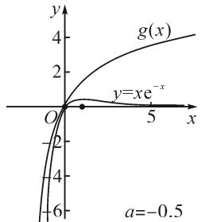

line

| x   | g(x) |
| --- | ---- |
| 0   | 0    |
| 5   | 4    |

图 7

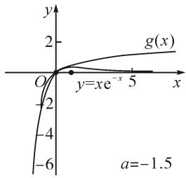

line

| x    | g(x) |
| ---- | ---- |
| 0    | 0    |
| 5    | 2    |

图8

解法 6: $f'(x)=\frac{1}{1+x}+\frac{a(1-x)}{\mathrm{e}^{x}}=\frac{\mathrm{e}^{x}+a(1-x^{2})}{(1+x)\mathrm{e}^{x}}$ .

当 $a \geqslant 0$ 时， $x \in (-1,1)$ 时， $f'(x) > 0$ ，则 $f(x)$ 在 $(-1,1)$ 上单调递增。又 $f(0) = 0$ ，则当 $x \in (-1,0)$ 时 $f(x) < 0$ ，所以 $f(x)$ 在 $(-1,0)$ 上不存在零点。

当 a<0 时，令 $f'(x)=0$ ，得 $\frac{1}{a}=\frac{x^{2}-1}{e^{x}}$ .

设 $g(x) = \frac{x^2 - 1}{\mathrm{e}^x} (x > -1)$ ，则

$$
g ^ {\prime} (x) = \frac {- x ^ {2} + 2 x + 1}{\mathrm{e} ^ {x}}.
$$

令 $g'(x)=0$ ，则 x=1- $\sqrt{2}$ 或 $1+\sqrt{2}$ .

当 $1-\sqrt{2}<x<1+\sqrt{2}$ 时， $g'(x)>0$ ；当 -1<x<1- $\sqrt{2}$ 或 x>1+ $\sqrt{2}$ 时， $g'(x)<0$ .

又 $g(-1)=0,$

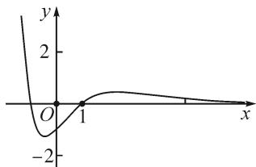

line

| x | y |
|---|---|
| 0 | -2 |
| 1 | 0 |

图9

$g(0)=-1, g(1+\sqrt{2})>0.$ 函数 $y=g(x)$ 的图象如图9所示.

若 $\frac{1}{a}\leqslant-1$ ，即 $-1\leqslant a<0$ ，当x>0时， $\frac{x^{2}-1}{e^{x}}>\frac{1}{a}$ ，则 $e^{x}+a(1-x^{2})>0$ ，从而 $f(x)$ 在 $(0,+\infty)$ 上单调递增，所以 $f(x)>f(0)=0$ 不满足题意.

若 $0 > \frac{1}{a} > -1$ ，即 $a < -1$ 时，则 $\frac{1}{a} = \frac{x^2 - 1}{\mathrm{e}^x}$ ，存在 $x_1 \in (-1, 0), x_2 \in (0, +\infty)$ 使方程成立.

(i) 当 $x \in (-1, x_{1})$ 时， $g(x) > \frac{1}{a}$ ，则 $f'(x) > 0$ ;

当 $x \in (x_1, 0)$ 时， $g(x) < \frac{1}{a}$ ，则 $f'(x) < 0$ 。于是 $f(x)$ 在 $(-1, x_1)$ 上单调递增，在 $(x_1, 0)$ 上单调递减，又 $f(0) = 0$ ，所以 $f(x_1) > 0$ 。而 $x \to -1$ 时， $f(x) \to -\infty$ ，所以 $f(x)$ 在区间 $(-1, 0)$ 恰有一个零点。

(ii) 当 $x \in (0, x_2)$ 时， $g(x) < \frac{1}{a}$ ，则 $f'(x) < 0$ ；当 $x \in (x_2, +\infty)$ 时， $g(x) > \frac{1}{a}$ ，则 $f'(x) > 0$ 。于是 $f(x)$ 在 $(0, x_2)$ 上单调递减，在 $(x_2, +\infty)$ 上单调递增，又 $f(0) = 0$ ，所以 $f(x_2) < 0$ 。而 $x \to +\infty$ 时， $f(x) \to +\infty$ ，所以若 $f(x)$ 在区间 $(0, +\infty)$ 恰有一个零点。

综上所述，a 的取值范围为 $(-∞, -1)$ .

# 3 链接高考

链接1（2022年浙江温岭中学模拟题）已知函数 $f(x) = a\ln x + \mathrm{e}^{-x}(x - 1)$ .

(1) 当 a=1 时, 求曲线 $y=f(x)$ 在点 $(1,f(1))$ 处的切线方程;

(2) 证明: 当 $a \geqslant 0$ 时, $f(x)$ 有且只有一个零点;

(3) 若 $f(x)$ 在区间 $(0,1)$ ， $(1,+\infty)$ 各恰有一个零点，求 a 的取值范围.

链接 2 （2018 年全国高考理科第 21 题）已知函数 $f(x)=\mathrm{e}^{x}-ax^{2}$ .

(1) 若 a=1，证明：当 $x \geqslant 0$ 时， $f(x) \geqslant 1$ ;

(2) 若 $f(x)$ 在 $(0, +\infty)$ 只有一个零点，求 a 的值.

2022年全国高考乙卷第21题在考查导数的基本运算法则、基本性质等知识点的同时，考查学生的运算求解、数学分析等关键能力以及转化与化归、数形结合等思想方法，较好地考查学生学科核心素养。题目的求解，需要学生有较强的逻辑思维转换能力与代数计算能力。不难发现，上述解法2和解法3的解答过程都围绕“分参”展开，归纳起来无外乎两类：一类是等式关系转化为参数与函数图象的交点问题；另一类就是函数的切线与函数图象的交点问题。通过对分离参数法的再思考，在解决可分参的问题时，指导学生抓住问题的本质，掌握通性、通法，让学生可以触类旁通、事半功倍，达成练一题、学一法、会一类、通一片的效果。在解题教学中，教师要有意识地引导学生探究问题的本质，注重解题过程，从繁杂的试题以及多变的解法中，追根溯源，探寻不变的本质，从而真正达到事半功倍的效果。

# 参考文献：

[1]陈志康,陈雨瑾.零点存在性定理中的“取点”问题[J].上

海中学数学,2022(4):25-27,37. Z

# (上接第6页)

解法 4: 设 $M(x_{0}, y_{0})$ ，则直线 PM 的方程为

$$
y = - \sqrt {3} (x - x _ {0}) + y _ {0}.
$$

联立 $\left\{\begin{aligned}y&=-\sqrt{3}(x-x_{0})+y_{0},\\ x^{2}-\frac{y^{2}}{3}&=1,\end{aligned}\right.$ 得

$$
2 \sqrt {3} x _ {1} = \frac {3}{\sqrt {3} x _ {0} + y _ {0}} + \sqrt {3} x _ {0} + y _ {0}.
$$

直线 $QM:y = \sqrt{3} (x - x_0) + y_0$

联立 $\left\{\begin{aligned}y&=\sqrt{3}(x-x_{0})+y_{0},\\ x^{2}-\frac{y^{2}}{3}&=1,\end{aligned}\right.$ 得

$$
2 \sqrt {3} x _ {2} = \frac {3}{\sqrt {3} x _ {0} - y _ {0}} + \sqrt {3} x _ {0} - y _ {0}.
$$

故 $x_{1} + x_{2} = \frac{3x_{0}}{3x_{0}^{2} - y_{0}^{2}} +x_{0},y_{1} + y_{2} = \frac{3y_{0}}{3x_{0}^{2} - y_{0}^{2}} +y_{0}.$

由 $\left\{\begin{aligned}x_{1}^{2}-\frac{y_{1}^{2}}{3}&=1,\\ x_{2}^{2}-\frac{y_{2}^{2}}{3}&=1,\end{aligned}\right.$ 得

$$
(x _ {1} - x _ {2}) (x _ {1} + x _ {2}) = \frac {(y _ {1} - y _ {2}) (y _ {1} + y _ {2})}{3}.
$$

即 $k_{PQ}=\frac{3(x_{1}+x_{2})}{y_{1}+y_{2}}=\frac{3x_{0}}{y_{0}}.$

选择①M 在直线 AB 上, 则设直线 AB 的参数方程为 $\left\{\begin{aligned} x &= x_{0} + t \cos \alpha, \\ y &= y_{0} + t \sin \alpha \end{aligned}\right.$ (t 为参数).

代入 $x^{2} - \frac{y^{2}}{3} = 1$ ，整理得 $(3\cos^2\alpha -\sin^2\alpha)t^2 +$ $(6x_0\cos \alpha -2y_0\sin \alpha)t + 3x_0^2 -y_0^2 -3 = 0.$

若选择② $PQ \parallel AB$ ，则 $k_{AB} = k_{PQ}$ 即 $\frac{\sin \alpha}{\cos \alpha} = \frac{3x_{0}}{y_{0}}$ .

于是 $t_1 + t_2 = -\frac{6x_0\cos\alpha - 2y_0\sin\alpha}{3\cos^2\alpha - \sin^2\alpha} = 0$ ，则根据参数 $t$ 的几何意义，可得 $\left|MA\right| = \left|MB\right|$

若选择 ③ $|MA| = |MB|$ ，则 $t_1 + t_2 = 0$ ，即 $\frac{6x_0\cos\alpha - 2y_0\sin\alpha}{3\cos^2\alpha - \sin^2\alpha} = 0$ ，整理得 $\frac{\sin\alpha}{\cos\alpha} = \frac{3x_0}{y_0}$ .

即 $k_{AB}=k_{PQ}$ ，所以 $PQ \parallel AB$ .

# 4 思考与延伸

思考:在上述试题解法中,并没有用到直线 AB 过双曲线的右焦点 F 这一条件,因此直线 AB 不经过双曲线的焦点 F,本题的结论依然成立.

延伸结论: 已知 A, B 是双曲线 $\frac{x^{2}}{a^{2}} - \frac{y^{2}}{b^{2}} = 1 (a > 0, b > 0)$ 上两点, M 为线段 AB 的中点, 过点 M 分别作两条与渐近线平行的直线, 与双曲线分别交于 P, Q 两点, 可得 $PQ \parallel AB$ .

链接:已知双曲线 $\Gamma:\frac{x^{2}}{a^{2}}-\frac{y^{2}}{b^{2}}=1(a>0,b>0)$ 过点 $(\sqrt{3},\sqrt{6})$ ，且 $\Gamma$ 的渐近线方程为 $y=\pm\sqrt{3}x$ .

(1) 求 $\Gamma$ 的方程；

(2)如图3,过原点O作相互垂直的直线 $l_{1},l_{2}$ 分别交双曲线于A, 图3B两点和C,D两点,A,D在x轴同侧.设直线AD与渐近线分别交于M,N两点,是否存在直线AD使M,N为线段AD的三等分点?若存在,求出直线AD的方程;若不存在,请说明理由.Z

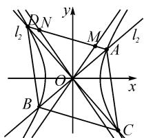

text_image

l₂
Q N
y
M
A
l₂
O
x
B
C

图3